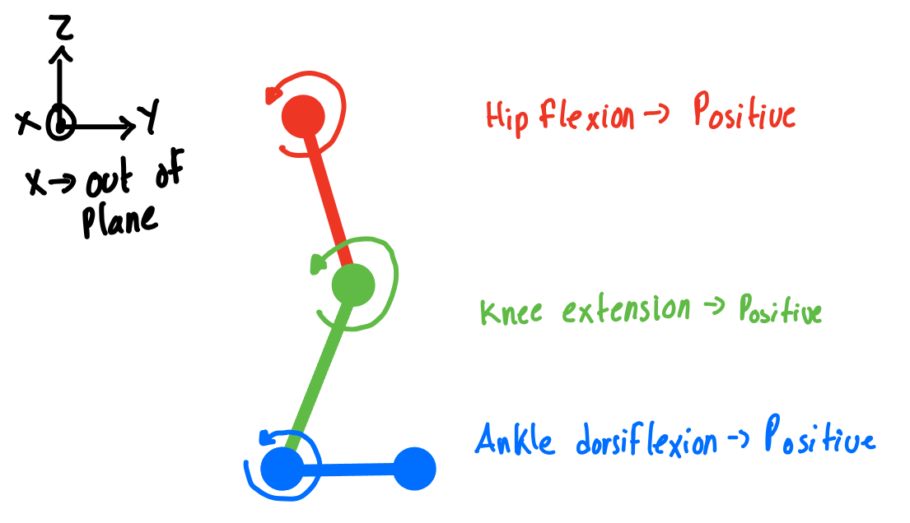

# locomotion-data-standardization
[Standarlized parquet files](https://www.dropbox.com/scl/fo/mhkiv4d3zvnbtdlujvgje/ACPxjnoj6XxL60QZCuK1WCw?rlkey=nm5a22pktlcemud4gzod3ow09&dl=0)
# Time indexing vs Phase indexing
Tabular formats will be provided for both time indexed data and phase indexed data. The time indexed dat is generaly better to train since it can include transition and non-cyclic task, while the phase indexed data can provide easy ways to plot and analyze performance along a given task. 

Each dataset will describe at which frequency (hz) the time indexed data is sampled at, and how many points per step in contained in the phase index data. 

# Limitations
For now, we only have a subset of what is commonly found in datasets as standardized. The list of currently supported data is
* Joint Angles
* Joint Kinetics
* Link Angles (Global Angles)

# Kinematics
The kinematics have indicator variables to give the joint in the different planes of the human and leg
* plane - s (sagittal), f (frontal), t (transversal)
* leg - r (right), l (left)

## Joint Angles
* hip_angle_{plane}_{leg}
* knee_angle_{plane}_{leg}
* ankle_angle_{plane}_{leg}

## Joint Velocities
* hip_vel_{plane}_{leg}
* knee_vel_{plane}_{leg}
* ankle_vel_{plane}_{leg}

## Link angles (Global Angles)
* thigh_angle_{plane}_{leg}
* shank_angle_{plane}_{leg}
* foot_angle_{plane}_{leg}

## Link Velocities (Global velocities)
* thigh_vel_{plane}_{leg}
* shank_vel_{plane}_{leg}
* foot_vel_{plane}_{leg}

# Kinetics
* hip_torque_{plane}_{leg}
* knee_torque_{plane}_{leg}
* ankle_torque_{plane}_{leg}

# Forces
Annotation regulations:
* axis - z (up+), x (left+), y (forward+)
* leg - r (right), l (left)
  
## Ground Reaction Force
* force_{axis}_{leg}
* COP_{axis}_{leg}
  

# Sagital plane conventions
* Ankle dorsiflexion -> Positive
* Knee Extension -> Positive
* Hip Extension -> Positive

# Task variables
* subject - subject name. Usually contains the filel forlder in it
* task - the current task being performed
* sub_task - additional task info
* time - the time for a given task

# Task naming
* level_walking -> level ground walking at varying velocities
* incline_walking -> walking at an upward sloped angle
* decline_walking -> walking at an downwards sloped angle
* up_stairs -> going up stairs
* down_stairs -> going down stairs
* run -> runing at level ground
* sit_to_stand
* stand_to_sit
* ball_toss_(l,m,r) -> tossing the ball at left, mid, right
* curb_down: Stepping down from a street curb
* curb_up: Stepping up onto a street curb
* cutting: Jog/Run into sharp turn

jump: Jumping trials
	_fb: forward and backward jumping
	_hop: hopping in place
	_vertical: jumping in place for max height
	_90-1: set 1 of 90 degree jumping (clockwise->counterclockwise->clockwise->counterclockwise->etc.)
	_90-2: set 2 of 90 degree jumping (clockwise->counterclockwise->clockwise->counterclockwise->etc.)
	_180: jump and turn 180 degrees (clockwise->counterclockwise->clockwise->counterclockwise->etc.)
	_lateral: jump side-to-side

lift_weight: lifting weighted/unweighted bag
	0lbs-l-c: lift 0lbs bag in front (center) of subject with left hand
	0lbs-l-l: lift 0lbs bag to left of subject with left hand
	0lbs-r-c: lift 0lbs bag in front (center) of subject with right hand
	0lbs-r-r: lift 0lbs bag to right of subject with right hand
	25lbs-l-c: lift 25lbs bag in front (center) of subject with left hand
	25lbs-l-l: lift 25lbs bag to left of subject with left hand
	25lbs-r-c: lift 25lbs bag in front (center) of subject with right hand
	25lbs-r-r: lift 25lbs bag to right of subject with right hand
	
lunges: lunging forward and backward with left and right legs
	_set1: left/right forward/backward lunging
	_set2: left/right forward/backward lunging
	_set3: left/right forward/backward lunging
	_set4: left/right forward/backward lunging
	_set5: left/right forward/backward lunging
	_left: lunge laterally to left
	_right: lunge laterally to right

meander: freeform, slow walking overground

normal_walk: ambulating at different speeds on a level treadmill
	_0-6: walking at 0.6 m/s
	_1-2: walking at 1.2 m/s
	_1-8: walking at 1.8 m/s
	_2-0: walking at 2.0 m/s
	_2-5: walking at 2.5 m/s
	_shuffle: walking at 0.4 m/s
	_skip: skipping at 1.2 m/s

obstacle_walk: walking while foam block is placed on treadmill to disturb normal walking at 1.0 m/s

poses: standing in static postures (normal standing, feet double shoulder width apart, left foot forward, right foot forward, squat, balance on left foot, balance on right foot, stand on toes, hips to left, hips to right, hips forward, hips backward, point toes in, point toes out, normal stand with 25 lbs weight held to left, normal stand with 25 lbs weight held to right, wide stance standing, wide stance standing w/ left foot forward, wide stance standing w/ right foot forward, normal standing but squeeze legs together)

push: experimenter pushes and pulls subject by torso/shoulders

side_shuffle: lateral shuffling to left and right

sit_to_stand: sit down and stand up from chair
	_short-arm: sit/stand using short chair w/ arm rests
	_short-noarm: sit/stand using short chair w/o arm rests
	_tall-noarm: sit/stand using tall chair w/o arm rests

squats: squatting w/ and w/o added weight
	_0lbs: bodyweight squats
	_25lbs: squats with 25 lbs weight

stairs: walking up and down stairs
	_1_up: stair ascent
	_2_down: stair descent
	_3_up: stair ascent
	_4_down: stair descent
	_5_up: stair ascent
	_6_down: stair descent
	_7_up: stair ascent
	_8_down: stair descent
	_9_up: stair ascent
	_10_down: stair descent

start_stop: starting and stopping walking on overground force plates

step_ups: stepping up onto tall object
	_left: step up using left leg
	_right: step up using right leg

tire_run: jogging on toes overground with high knees (as if running through tires)

tug_of_war: pushing and pulling broomstick between subject and experimenter

turn_and_step: from standing, turn to left or right and start walking
	_left-turn: turn to left
	_right-turn: turn to right

twister: experimenter calls out feet locations for subject to place feet

walk_backward: walking backward on treadmill
	_0-6: at 0.6 m/s
	_0-8: at 0.8 m/s
	_1-0: at 1.0 m/s

weighted_walk: walking on treadmill at 1.0 m/s with weight
	_25lbs: carrying 25 lbs weight

* transitions -> transitions between different tasks

# Joint angle representation

