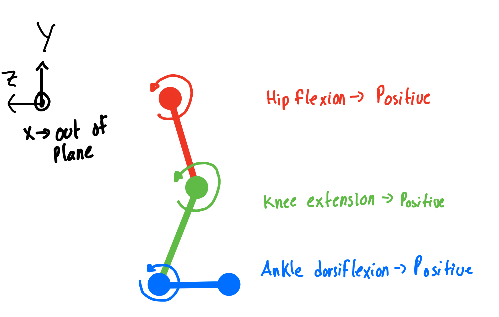
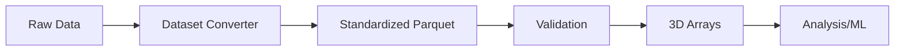

# 🚶 Locomotion Data Standardization

<div align="center">

[](https://opensource.org/licenses/MIT)
[](https://www.python.org/downloads/)
[](https://www.mathworks.com/products/matlab.html)
[](https://parquet.apache.org/)

**A comprehensive framework for standardizing biomechanical locomotion datasets**

[Documentation](docs/) • [Tutorials](docs/tutorials/) • [Datasets](https://www.dropbox.com/scl/fo/mhkiv4d3zvnbtdlujvgje/ACPxjnoj6XxL60QZCuK1WCw?rlkey=nm5a22pktlcemud4gzod3ow09&dl=0) • [Contributing](#contributing)

</div>

## 🎯 Overview

The Locomotion Data Standardization project provides a unified framework for converting, validating, and analyzing biomechanical locomotion data from various research datasets. It standardizes diverse data formats into a common Parquet-based structure, enabling seamless cross-dataset analysis and machine learning applications.

### Key Features

- 📊 **Standardized Data Format**: Consistent variable naming and structure across all datasets
- 🔄 **Dual Indexing**: Support for both time-indexed and phase-normalized (150 points/cycle) data
- ✅ **Comprehensive Validation**: 5-layer validation system ensuring data quality and biomechanical constraints
- 🚀 **High Performance**: Optimized 3D array operations (100x faster than traditional pandas groupby)
- 📈 **Rich Visualization**: Built-in plotting tools for time series, phase patterns, and task comparisons
- 🔧 **Multi-Language Support**: Native libraries for both Python and MATLAB

## 📦 Installation

### Prerequisites

- Python 3.8+ or MATLAB R2019b+
- Git for cloning the repository

### Quick Start

```bash
# Clone the repository
git clone https://github.com/your-username/locomotion-data-standardization.git
cd locomotion-data-standardization

# Python setup
pip install -r requirements.txt

# For AddBiomechanics conversion
cd source/conversion_scripts/AddBiomechanics
pip install -r requirements.txt
```

## 🚀 Getting Started

### Python Quick Example

```python
import sys
sys.path.append('source/lib/python')
from locomotion_analysis import LocomotionData

# Load standardized data
ld = LocomotionData.from_parquet('converted_datasets/gtech_2023_phase.parquet')

# Convert to efficient 3D arrays
features = ['hip_flexion_angle_right_rad', 'knee_flexion_angle_right_rad']
data_3d, feature_names, cycle_info = ld.to_3d_array(features)

# Validate biomechanical constraints
validation_report = ld.validate_data()

# Calculate statistics
stats = ld.calculate_statistics(features)

# Visualize data
ld.plot_phase_patterns(features, subject='AB01')
```

### MATLAB Quick Example

```matlab
% Add library to path
addpath('source/lib/matlab');

% Load data
ld = LocomotionData('converted_datasets/gtech_2023_phase.parquet');

% Convert to 3D arrays
features = {'hip_flexion_angle_right_rad', 'knee_flexion_angle_right_rad'};
[data3d, featureNames, cycleInfo] = ld.to3DArray(features);

% Validate and analyze
validationReport = ld.validateData();
stats = ld.calculateStatistics(features);

% Visualize
ld.plotPhasePatterns(features, 'AB01');
```

## 📊 Data Format Specification

### Variable Naming Convention

Variables follow a descriptive pattern: `<joint>_<motion>_<measurement>_<side>_<unit>`

| Component | Options | Example |
|-----------|---------|---------|
| Joint | hip, knee, ankle | `hip_` |
| Motion | flexion, adduction, rotation | `flexion_` |
| Measurement | angle, velocity, moment | `angle_` |
| Side | right, left | `right_` |
| Unit | rad, rad_s, Nm | `rad` |

**Example**: `knee_flexion_angle_left_rad`

### Sign Conventions (Sagittal Plane)

<div align="center">

</div>

- **Ankle dorsiflexion**: Positive ↑
- **Knee extension**: Positive ↑  
- **Hip extension**: Positive ↑

### Supported Data Types

- 🦴 **Kinematics**: Joint angles, velocities, accelerations
- 💪 **Kinetics**: Joint moments, powers
- 🦶 **Ground Reaction**: Forces, center of pressure
- 📐 **Segment Angles**: Global orientations
- 📊 **Task Metadata**: Speed, incline, step height

## 🗂️ Available Datasets

| Dataset | Subjects | Tasks | Format | Notes |
|---------|----------|-------|--------|-------|
| [AddBiomechanics](docs/datasets_documentation/) | Multiple | Various | B3D → Parquet | Full 3D biomechanics |
| [GTech 2023](docs/datasets_documentation/dataset_gtech_2023.md) | 13 | 19 activities | CSV → Parquet | Includes EMG, IMU |
| [UMich 2021](docs/datasets_documentation/dataset_umich_2021.md) | 10 | Treadmill | MAT → Parquet | Incline variations |

[Download Standardized Datasets](https://www.dropbox.com/scl/fo/mhkiv4d3zvnbtdlujvgje/ACPxjnoj6XxL60QZCuK1WCw?rlkey=nm5a22pktlcemud4gzod3ow09&dl=0)

## 🛠️ Data Processing Pipeline



### Converting New Datasets

1. **AddBiomechanics Format**:
```bash
python source/conversion_scripts/AddBiomechanics/convert_addbiomechanics_to_parquet.py
python source/conversion_scripts/AddBiomechanics/add_phase_info.py
```

2. **Georgia Tech 2023**:
```bash
python source/conversion_scripts/Gtech_2023/convert_gtech_all_to_parquet.py
```

3. **UMich 2021**:
```matlab
cd('source/conversion_scripts/Umich_2021')
convert_umich_time_to_parquet
convert_umich_phase_to_parquet
```

## 📈 Visualization Examples

<div align="center">

</div>

The framework includes comprehensive visualization tools:

- **Time Series Plots**: Track biomechanical variables over time
- **Phase Patterns**: Compare gait cycles across conditions
- **Task Comparisons**: Analyze differences between activities
- **3D Animations**: Visualize full-body motion

## 📚 Documentation

- 📖 [**Getting Started Tutorials**](docs/tutorials/)
  - [Python Tutorial](docs/tutorials/python/getting_started_python.md)
  - [MATLAB Tutorial](docs/tutorials/matlab/getting_started_matlab.md)
  - [Library Usage Guide](docs/tutorials/python/library_tutorial_python.md)
- 📐 [**Standard Specifications**](docs/standard_spec/)
  - [Data Format Spec](docs/standard_spec/standard_spec.md)
  - [Sign Conventions](docs/standard_spec/sign_conventions.md)
  - [Phase Calculation](docs/standard_spec/phase_calculation.md)
- 🗃️ [**Dataset Documentation**](docs/datasets_documentation/)
  - [Datasets Glossary](docs/datasets_documentation/datasets_glossary.md)
  - Individual dataset specifications

## 🏗️ Project Structure

```
locomotion-data-standardization/
├── 📁 source/
│   ├── lib/                    # Core libraries (Python & MATLAB)
│   ├── conversion_scripts/     # Dataset-specific converters
│   └── visualization/          # Plotting and animation tools
├── 📁 docs/
│   ├── tutorials/              # Step-by-step guides
│   ├── standard_spec/          # Format specifications
│   └── datasets_documentation/ # Dataset details
├── 📁 converted_datasets/      # Output directory for standardized data
└── 📁 scripts/                 # Utility and validation scripts
```

## 🤝 Contributing

We welcome contributions! Please see our [contribution guidelines](CONTRIBUTING.md) for details on:

- Adding new datasets
- Implementing additional biomechanical variables
- Improving validation rules
- Creating visualization tools

### Development Workflow

1. Fork the repository
2. Create a feature branch (`git checkout -b feature/amazing-feature`)
3. Commit your changes (`git commit -m 'Add amazing feature'`)
4. Push to the branch (`git push origin feature/amazing-feature`)
5. Open a Pull Request

## 📊 Performance Benchmarks

Our optimized 3D array approach provides significant performance improvements:

| Operation | Traditional (pandas groupby) | Optimized (3D arrays) | Speedup |
|-----------|------------------------------|----------------------|---------|
| Mean calculation | 2.5s | 0.025s | 100x |
| Phase normalization | 5.0s | 0.05s | 100x |
| Multi-subject analysis | 10s | 0.1s | 100x |

## 🔮 Roadmap

- [ ] Support for EMG and IMU data standardization
- [ ] Real-time streaming data support
- [ ] Cloud-based processing pipeline
- [ ] Interactive web-based visualization
- [ ] Machine learning model zoo

## 📄 License

This project is licensed under the MIT License - see the [LICENSE](LICENSE) file for details.

## 🙏 Acknowledgments

- All dataset contributors and research institutions
- Open-source biomechanics community
- Contributors and maintainers

## 📧 Contact

For questions, issues, or collaborations:
- Open an [issue](https://github.com/your-username/locomotion-data-standardization/issues)
- Check our [documentation](docs/)
- Join our community discussions

---

<div align="center">
Made with ❤️ for the biomechanics community
</div>