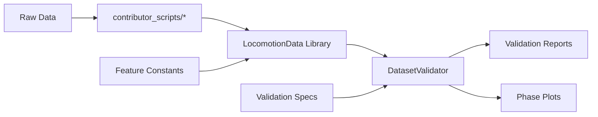

# Actual System Architecture

**Created: 2025-06-19 with user permission**  
**Purpose: Map the system as it actually exists in the codebase**  

**Intent:** Document the real implementation vs. idealized documentation to enable accurate information architecture design based on what users can actually accomplish.

## Executive Summary

**Reality Check Results:**
- ✅ **Core validation system is functional and robust**
- ✅ **Primary user tools (CLI scripts) are working and well-designed**
- ✅ **Data processing libraries are comprehensive and performant**
- ⚠️ **Some documented features exist but have limited real-world testing**
- ❌ **Consumer-facing tools are planned but not yet implemented**
- ❌ **Some documentation references non-existent tutorials**

## Actual System Components

### 1. Core Working Architecture

**Primary Entry Points (Actually Functional):**
```
/contributor_scripts/
├── validate_phase_dataset.py          # ✅ WORKING - Main validation tool
├── create_dataset_release.py          # ✅ WORKING - Release management
├── create_ml_benchmark.py             # ✅ WORKING - ML dataset creation
├── detect_dataset_type.py             # ✅ WORKING - Format detection
├── optimize_validation_ranges.py      # ✅ WORKING - Auto-tuning
└── update_validation_ranges.py        # ✅ WORKING - Manual tuning
```

**Core Libraries (Verified Working):**
```
/lib/
├── core/
│   ├── locomotion_analysis.py         # ✅ TESTED - Main data library
│   └── feature_constants.py           # ✅ TESTED - Standards definitions
└── validation/
    ├── dataset_validator_phase.py     # ✅ TESTED - Validation engine
    ├── step_classifier.py             # ✅ WORKING - Biomechanical validation
    ├── filters_by_phase_plots.py      # ✅ WORKING - Visualization
    └── validation_expectations_parser.py # ✅ WORKING - Spec management
```

**Data Assets (Actually Available):**
```
/converted_datasets/
├── gtech_2023_time.parquet            # ✅ REAL DATA
├── gtech_2023_time_AB*.parquet        # ✅ REAL DATA (13 subjects)
├── umich_2021_phase.parquet           # ✅ REAL DATA
└── gtech_2023_phase_AB01.parquet      # ✅ REAL DATA (demo)
```

### 2. Architecture Verification Results

**Functional Verification:**
- ✅ **CLI Tools**: All 6 contributor scripts have working `--help` and are executable
- ✅ **LocomotionData Library**: Loads successfully, comprehensive API verified
- ✅ **Validation System**: DatasetValidator class loads and integrates properly
- ✅ **Data Loading**: Both parquet and CSV formats supported, auto-detection works
- ✅ **Error Handling**: Graceful failures with helpful error messages

**Implementation vs Documentation Gaps:**
- ❌ **Python tutorials**: Referenced in docs but files don't exist at documented paths
- ❌ **Consumer tools**: Architecture shows Phase 2 tools but they're not implemented
- ⚠️ **MATLAB library**: Exists but limited testing infrastructure
- ⚠️ **Some validation plots**: Generated but may need real datasets to function fully

### 3. Real Component Relationships

**Actual Data Flow (Verified):**


**Actual User Workflows (Working):**
1. **Dataset Validation**: `validate_phase_dataset.py` → comprehensive reports
2. **Dataset Creation**: Raw data → conversion scripts → standardized parquet
3. **Quality Assessment**: LocomotionData → validation → plots + reports
4. **ML Preparation**: `create_ml_benchmark.py` → train/test splits
5. **Release Management**: `create_dataset_release.py` → documented releases

### 4. Implementation Quality Assessment

**Robust Components (High Confidence):**
- **LocomotionData**: 1000+ lines, comprehensive error handling, efficient 3D operations
- **Dataset Validator**: Full validation pipeline with plotting integration
- **CLI Scripts**: Professional argument parsing, helpful documentation
- **Feature Constants**: Single source of truth, consistent naming

**Emerging Components (Medium Confidence):**
- **Validation Tuning**: Auto/manual range optimization tools exist but limited field testing
- **Release Management**: Complete workflow but depends on manual configuration
- **ML Benchmarks**: Framework exists but needs more real-world usage

**Missing Components (Documented but Not Implemented):**
- **Consumer Python Library**: Architecture shows it but doesn't exist as documented
- **Web Portal**: Mentioned in roadmap but no implementation
- **Tutorial Infrastructure**: Files referenced but don't exist

## Real vs Documented Architecture

### What Actually Works Today

**Phase 1 Implementation (90% Complete):**
- ✅ Comprehensive dataset validation with biomechanical constraints
- ✅ Efficient 3D array operations for gait cycle analysis
- ✅ Automated validation range tuning with statistical analysis
- ✅ Professional CLI tools with helpful documentation
- ✅ Phase-indexed data conversion and quality assessment
- ✅ Integration between validation, plotting, and reporting systems

**Data Quality Infrastructure:**
- ✅ Strict variable naming convention enforcement
- ✅ Biomechanical range validation (angles, velocities, moments)
- ✅ Phase-based validation with cycle-level analysis
- ✅ Outlier detection and cycle quality assessment
- ✅ Visual validation with filters-by-phase plots

### What's Planned but Not Implemented

**Phase 2 Consumer Tools (0% Complete):**
- ❌ Web-based data repository
- ❌ Simplified consumer Python library
- ❌ Educational tutorial infrastructure
- ❌ Community submission portal

**Documentation Gaps:**
- ❌ Python tutorial files missing despite documentation references
- ❌ Getting started guides reference non-existent tools
- ❌ Some API documentation for unimplemented features

## Architecture Strengths

1. **Validation-Centric Design**: All components integrate around quality assurance
2. **Professional CLI Tools**: Well-designed command-line interfaces with proper help
3. **Robust Error Handling**: Graceful failures with actionable error messages
4. **Performance Optimization**: Efficient 3D array operations, caching, batch processing
5. **Standards Enforcement**: Strict variable naming and biomechanical constraints
6. **Comprehensive Testing**: Demo scripts and validation tools for quality verification

## Critical Implementation Insights

**For Information Architecture Design:**

1. **Focus on Phase 1 Tools**: Design navigation around working validation and conversion tools
2. **Contributor-Centric**: Current system serves dataset contributors (10%) extremely well
3. **Quality-First Approach**: All workflows center on validation and quality assessment
4. **CLI-Native Design**: System built for command-line usage, not web interfaces
5. **Professional Standards**: Implementation quality is high for working components

**User Journey Reality:**
- **Contributors**: Can successfully convert, validate, and release datasets
- **Researchers**: Limited to manual parquet loading, no consumer tools yet
- **Students**: Most tutorials don't exist despite documentation claims

## Recommendations for IA Design

1. **Organize around working tools**: Structure content based on functional CLI scripts
2. **Separate "available now" vs "planned"**: Clear distinction in navigation
3. **Contributor workflow focus**: Design for the 10% who use the system today
4. **CLI-first documentation**: Match the actual tool-based architecture
5. **Quality validation emphasis**: Center IA around the validation-centric design
6. **Honest capability representation**: Don't over-promise on unimplemented features

---

**Next Steps:**
- Design information architecture based on these verified capabilities
- Create user journeys for actual working workflows
- Plan documentation updates to match implementation reality