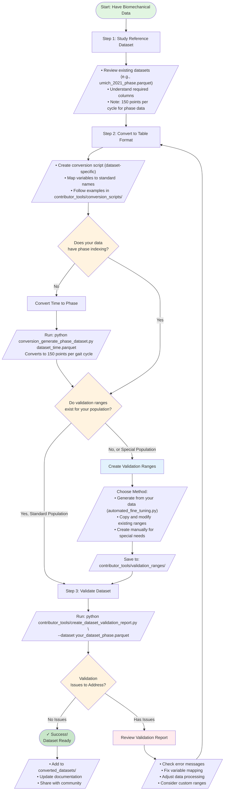

<div class="hero-section" markdown>

# :material-upload: For Contributors - Dataset Conversion

## Transform your lab's biomechanical data into standardized formats that accelerate reproducible research

**Join the standardization movement.** Convert your datasets to unlock validated analysis tools, increase research impact, and contribute to the growing ecosystem of interoperable biomechanical data.

<div class="hero-actions" markdown>

[**:material-rocket-launch: Start Converting**](#quick-start-guide){ .md-button .md-button--primary .hero-button }
[**:material-book-open-variant: View Examples**](examples/){ .md-button .hero-button }
[**:material-shield-check: Validation Guide**](validation_reference/){ .md-button .hero-button }

</div>

</div>

<div class="main-sections-grid" markdown>

<div class="dashboard-tile" markdown>

### :material-puzzle: **The Standardization Challenge**

**Every lab collects data differently.** This fragmentation prevents:

✓ Meta-analyses across studies  
✓ Validation across labs  
✓ Machine learning at scale  
✓ Clinical translation  

Your contribution helps solve this fundamental challenge in biomechanics research.

</div>

<div class="dashboard-tile" markdown>

### :material-chart-line: **Join the Data Ecosystem**

**When you standardize your dataset:**

✓ Join a growing validated collection  
✓ Enable direct reproducibility  
✓ Contribute to population norms  
✓ Build multi-study evidence  
✓ Future-proof your research  

Your data becomes part of something bigger.

</div>

<div class="dashboard-tile" markdown>

### :material-shield-check: **Quality Standards**

**What makes a good contribution:**

✓ Clear gait cycles identified  
✓ Consistent data collection  
✓ Documented protocols  
✓ Sufficient sample size  

**Validation philosophy:** Quality feedback, not pass/fail.

</div>

</div>

## Dataset Conversion Workflow

<div class="dashboard-tile" markdown>

**Transform your data step-by-step.** Most time goes to variable mapping and validation refinement. Each step provides clear feedback to ensure success.

Follow this flowchart to convert and validate your dataset:

</div>



## :material-rocket-launch: Quick Start Guide

<div class="main-sections-grid" markdown>

<div class="dashboard-tile" markdown>

### :material-numeric-1-circle: **Study Reference Dataset**

**Understand the expected structure:**

```python
import pandas as pd

# Load a reference dataset
reference = pd.read_parquet('converted_datasets/umich_2021_phase.parquet')

# Check structure
print(f"Shape: {reference.shape}")
print(f"Columns: {reference.columns.tolist()}")
print(f"Required: subject_id, task, phase_percent")
```

[**:material-download: Download Example Data**](https://www.dropbox.com/scl/fo/mhkiv4d3zvnbtdlujvgje/ACPxjnoj6XxL60QZCuK1WCw?rlkey=nm5a22pktlcemud4gzod3ow09&dl=0){ .md-button }

</div>

<div class="dashboard-tile" markdown>

### :material-numeric-2-circle: **Convert Your Data**

**Create a conversion script:**

✓ Standard variable names  
✓ Required columns: `subject_id`, `task`, `phase_percent`  
✓ Units: radians, Newtons, meters  

**Working examples:**

[**:material-language-python: Python Example**](examples/gtech_2023_example/){ .md-button }
[**MATLAB Example**](examples/umich_2021_example/){ .md-button }

</div>

<div class="dashboard-tile" markdown>

### :material-numeric-3-circle: **Handle Phase Indexing**

**Convert to 150 points per cycle:**

```bash
# Time to phase conversion tool
# Automatically detects gait cycles and resamples to 150 points
python conversion_generate_phase_dataset.py \
    your_dataset_time.parquet
```

✓ Creates phase-indexed output  
✓ Exactly 150 points per cycle  
✓ Phase values: 0-100%  

</div>

<div class="dashboard-tile" markdown>

### :material-numeric-4-circle: **Validate Your Dataset**

**Run automated validation:**

```bash
# Validation report generator
# Checks biomechanical ranges at key gait phases (0%, 25%, 50%, 75%)
python contributor_tools/create_dataset_validation_report.py \
    --dataset your_dataset_phase.parquet
```

✓ Biomechanical consistency check  
✓ Outlier identification  
✓ Visual validation plots  
✓ Improvement suggestions  

[**:material-book: Validation Guide**](validation_reference/){ .md-button }

</div>

</div>

## :material-wrench: Common Issues and Solutions

<div class="main-sections-grid" markdown>

<div class="dashboard-tile" markdown>

### **Variable Name Mismatch**

**Map to standard names:**

```python
variable_mapping = {
    'KneeAngle_L': 'knee_flexion_angle_ipsi_rad',
    'HipMoment_R': 'hip_moment_contra_Nm',
    # Add all your mappings
}
```

[**:material-format-list-bulleted: Standard Names Reference**](../reference/standard_spec/standard_spec/){ .md-button }

</div>

<div class="dashboard-tile" markdown>

### **Wrong Points Per Cycle**

**Use phase conversion:**

```bash
# Converts any time-indexed data to standard 150 points/cycle
python conversion_generate_phase_dataset.py \
    your_dataset_time.parquet
```

Automatically detects cycles and resamples. [Learn more →](tools_reference/#phase-conversion-tool)

</div>

<div class="dashboard-tile" markdown>

### **Validation Issues**

**Common problems:**

✓ Out-of-range values at phases  
✓ Missing required variables  
✓ Wrong units (degrees vs radians)  
✓ Special population differences  

Use the [interactive validation tuner](tools_reference/#interactive-validation-tuner) for custom ranges.

</div>

</div>

## :material-file-code: Working Examples

<div class="main-sections-grid" markdown>

<div class="dashboard-tile" markdown>

### **MATLAB Dataset (Umich_2021)**

**From .mat files to parquet:**

✓ Input: MATLAB `.mat` files  
✓ Converter: `convert_umich_phase_to_parquet.m`  
✓ Output: `umich_2021_phase.parquet`  

[**:material-arrow-right: View Full Example**](examples/umich_2021_example/){ .md-button .md-button--primary }

</div>

<div class="dashboard-tile" markdown>

### **Python Dataset (Gtech_2023)**

**From multiple files to parquet:**

✓ Input: Multiple subject files  
✓ Converter: `convert_gtech_all_to_parquet.py`  
✓ Output: `gtech_2023_phase.parquet`  

[**:material-arrow-right: View Full Example**](examples/gtech_2023_example/){ .md-button .md-button--primary }

</div>

</div>

## :material-bookshelf: Resources

<div class="dashboard-tile" markdown>

### **Documentation & Guides**

**Technical References**
- [Conversion Guide](conversion_guide/) - Step-by-step instructions
- [Validation Reference](validation_reference/) - Understanding checks
- [**Tools Reference**](tools_reference/) - Detailed tool documentation
- [Standard Specification](../reference/standard_spec/standard_spec/) - Data format spec
- [Variable Naming](../reference/biomechanical_standard/) - Names and units

**Tools & Scripts**
- [Conversion Scripts](https://github.com/your-repo/tree/main/contributor_tools/conversion_scripts)
- [Interactive Validation Tuner](tools_reference/#interactive-validation-tuner) - Visual range adjustment
- [Phase Converter](tools_reference/#phase-conversion-tool) - Time to phase conversion

</div>

## :material-help-circle: Getting Help

<div class="dashboard-tile" markdown>

### **Support Options**

**Self-Service**
1. Check existing examples in `contributor_tools/conversion_scripts/`
2. Review validation errors - they pinpoint exact issues
3. Use interactive tuner for visual feedback

**Community Support**
- [GitHub Issues](https://github.com/your-repo/issues) - Report problems
- [Discussions](https://github.com/your-repo/discussions) - Ask questions
- [Contact Maintainers](mailto:maintainers@example.com) - Dataset-specific help

</div>

## :material-flag-checkered: Next Steps

<div class="dashboard-tile" markdown>

### **After Validation Success**

**Complete your contribution:**

1. :material-file-document: **Document** - Add README with data source details
2. :material-test-tube: **Test** - Verify with `LocomotionData` analysis tools
3. :material-git: **Submit** - Create pull request with your dataset

<div class="hero-actions" markdown>

[**:material-github: Submit Dataset**](https://github.com/your-repo/pulls){ .md-button .md-button--primary }
[**:material-book: Documentation Template**](examples/dataset_readme_template/){ .md-button }

</div>

</div>