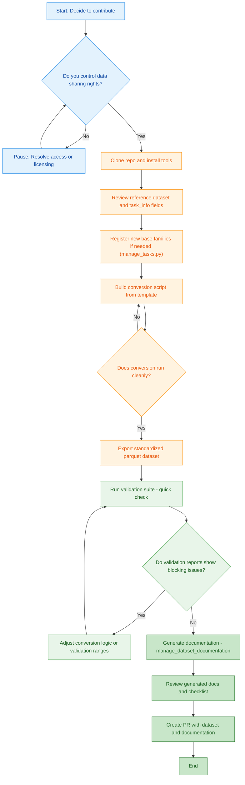
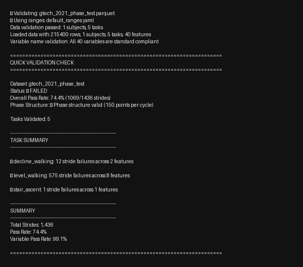
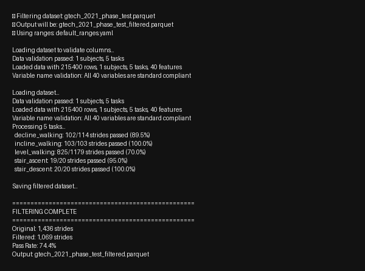
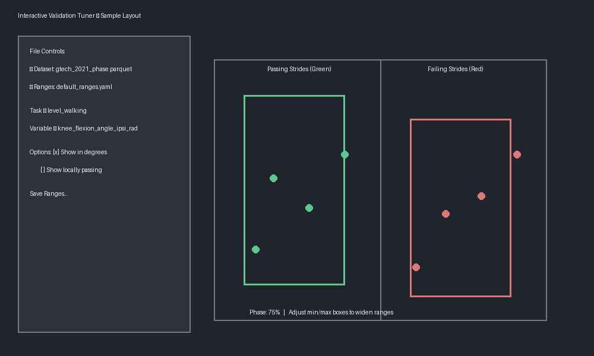
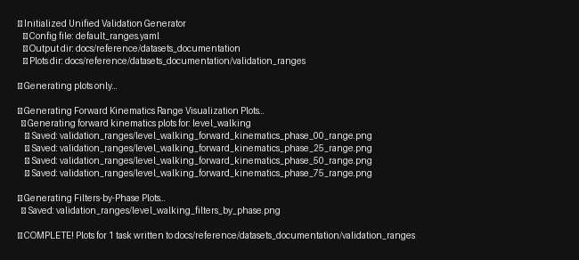

# Contribute Your Dataset

You already have great data—the goal here is to turn it into a shareable, validated resource without guessing what to do next. Use this guide to understand the few decisions that matter and jump straight to the tools that help you make them.

## High-Level Workflow


Think of the flow above as four conversations with the project: (1) confirm you can share the data, (2) turn it into the common table schema, (3) prove it passes validation, and (4) publish the package back to the community.

## Detailed Contribution Workflow {#contribution-workflow}

The expanded flow spells out the same journey with the actual buttons you will click. Follow it top to bottom, or just open the section that matches where you are stuck—the links mirror the headings further down this page.

<details>
<summary>Expand detailed workflow</summary>



</details>

### When the validator says “go”

Treat the report like a final pre-flight check:

- Stride pass rates should look believable for every task; if dirty → clean drops are huge, explain why.
- No blocking errors remain—missing columns, NaN bursts, or unit mismatches must be fixed or intentionally documented.
- Any data you intentionally exclude has matching validation ranges or a note in the checklist.

If something fails, back up one box in the workflow and address it before rerunning the tool.

---

## Quick Reference

**Need a fast answer?** Pick the scenario that matches your next move:

- 📁 [Folder full of CSV trials](#pattern-a-folder-based) → stitch tables into the schema
- 🗂️ [MATLAB structs](#pattern-b-hierarchical) → flatten from structs to rows
- ⏱️ [Time-series only](#pre-processing-if-time-indexed) → normalize to phase before exporting
- ✅ [Already have a parquet](#step-2-validate-pythoncli) → run validation + plots
- 🧭 [New task name](#manage-task-registry) → update the shared registry
- 📦 [Everything looks good](#ready-to-submit) → final checklist before opening a PR

---

## Step 1 — Convert to a Table

### Manage the task registry (manage_tasks.py) {#manage-task-registry}

- Use the helper when you need a brand-new base family (e.g., adding `lateral_walk`). Existing families and their pathology suffixes remain valid without registry edits.
- Pathology cohorts follow `task_family_<pathology>` (e.g., `level_walking_stroke`, `run_pd`). Keep suffixes lowercase snake_case and create explicit validation ranges for each cohort.
- Common commands:
  - `python contributor_tools/manage_tasks.py list --category phase`
  - `python contributor_tools/manage_tasks.py add lateral_walk --category phase --description "Side-step gait cycles" --example-id lateral --notes "Segment heel strikes using lateral contact."`
  - `python contributor_tools/manage_tasks.py delete demo_task`

The CLI rewrites `internal/config_management/task_registry.py` for you. For cohort suffixes, copy the base ranges in `interactive_validation_tuner.py` as a starting point and retune them—validators will not fall back to the able-bodied defaults.

Required columns (minimal schema):

- `subject`, `task`, `task_id`, `task_info`, `step`, `phase_ipsi`
- Biomech variables follow: `joint_motion_measurement_side_unit`
  - Examples: `knee_flexion_angle_ipsi_rad`, `hip_flexion_moment_ipsi_Nm_kg`

Constraints:

- 150 points/cycle; `phase_ipsi` in [0..100] (phase‑normalized)
- Angles in radians; joint moments mass‑normalized (Nm/kg); GRFs body‑weight normalized (BW)
- Sign conventions follow the [Reference](../reference/index.md) (e.g., flexion positive)
- Column names follow the standard naming: `joint_motion_measurement_side_unit`

Example dataset (CSV, 1000 rows): [Download](../tutorials/assets/locohub_example_data.csv)

Common conversion patterns

### Pattern A — Folder-based tables {#pattern-a-folder-based}

When your data is organized as per-trial CSVs in nested folders, use this pattern.

[↑ Back to workflow](#contribution-workflow)

=== "Pseudocode"
    ```text
    rows = []
    for trial_folder in walk(root_dir):
      tables = load_all_tables(trial_folder)              # kinematics.csv, kinetics.csv, events.csv, etc.
      tables = standardize_column_names(tables)           # map to joint_motion_measurement_side_unit
      merged = merge_tables_on_keys(tables, keys=[cycle_id, phase_ipsi])
      assert check_phase_index(merged, expected=0..100, n=150)

      meta = read_metadata(trial_folder)                  # subject, task, task_id, task_info (speed, incline)
      merged = attach_metadata(merged, meta)
      rows.append(merged)

    df = concat(rows)
    ensure_minimal_schema(df, required=[subject, task, task_id, task_info, step, phase_ipsi])
    save_parquet(df, 'your_dataset_phase.parquet')
    ```

=== "Python"
    ```python
    import os, glob
    import pandas as pd

    def standardize_cols(df: pd.DataFrame) -> pd.DataFrame:
        mapping = {
            'KneeFlexion_rad': 'knee_flexion_angle_ipsi_rad',
            'HipMoment_Nm_kg': 'hip_flexion_moment_ipsi_Nm_kg',
            # ... add your mappings here
        }
        return df.rename(columns=mapping)

    def build_task_info(speed, incline):
        return f"speed_m_s:{speed},incline_deg:{incline}"

    rows = []
    for trial_dir, dirs, files in os.walk('your_root'):
        kin = glob.glob(os.path.join(trial_dir, '*kinematics*.csv'))
        kin = pd.concat([standardize_cols(pd.read_csv(p)) for p in kin], ignore_index=True) if kin else None

        kinx = glob.glob(os.path.join(trial_dir, '*kinetics*.csv'))
        kinx = pd.concat([standardize_cols(pd.read_csv(p)) for p in kinx], ignore_index=True) if kinx else None

        if kin is None and kinx is None:
            continue

        # Merge on shared keys (adjust as needed)
        merged = kin
        if kinx is not None:
            keys = [c for c in ['cycle_id','phase_ipsi','step'] if c in kin.columns and c in kinx.columns]
            merged = pd.merge(kin, kinx, on=keys, how='outer')

        # If your raw tables do not expose a unique cycle identifier, merge on
        # ['phase_ipsi','step'] plus whatever per-cycle metadata your files provide.

        # Attach metadata (example: infer from folder names or a JSON file)
        subject = os.path.basename(os.path.dirname(trial_dir))
        task = os.path.basename(trial_dir)
        task_id = task
        task_info = build_task_info(speed=1.2, incline=0)

        merged['subject'] = subject
        merged['task'] = task
        merged['task_id'] = task_id
        merged['task_info'] = task_info

        rows.append(merged)

    df = pd.concat(rows, ignore_index=True)
    required = ['subject','task','task_id','task_info','step','phase_ipsi']
    missing = set(required) - set(df.columns)
    assert not missing, f"Missing required columns: {missing}"
    df.to_parquet('your_dataset_phase.parquet', index=False)
    ```

=== "MATLAB"
    ```matlab
    rows = table();
    rootDir = 'your_root';
    d = dir(rootDir);
    for i = 1:numel(d)
        if ~d(i).isdir || startsWith(d(i).name, '.'), continue; end
        trialDir = fullfile(rootDir, d(i).name);
        kinFiles = dir(fullfile(trialDir, '*kinematics*.csv'));
        kin = table();
        for k = 1:numel(kinFiles)
            T = readtable(fullfile(trialDir, kinFiles(k).name));
            % TODO: rename columns to standard names
            kin = [kin; T]; %#ok<AGROW>
        end
        kinxFiles = dir(fullfile(trialDir, '*kinetics*.csv'));
        kinx = table();
        for k = 1:numel(kinxFiles)
            T = readtable(fullfile(trialDir, kinxFiles(k).name));
            % TODO: rename columns to standard names
            kinx = [kinx; T]; %#ok<AGROW>
        end
        if isempty(kin) && isempty(kinx), continue; end
        if isempty(kinx)
            merged = kin;
        else
            keys = intersect(intersect({'cycle_id','phase_ipsi','step'}, kin.Properties.VariableNames), kinx.Properties.VariableNames);
            merged = outerjoin(kin, kinx, 'Keys', keys, 'MergeKeys', true);
        end
        % Attach metadata (example)
        merged.subject = repmat(string(d(i).name), height(merged), 1);
        merged.task = repmat(string(d(i).name), height(merged), 1);
        merged.task_id = merged.task;
        merged.task_info = repmat("speed_m_s:1.2,incline_deg:0", height(merged), 1);
        rows = [rows; merged]; %#ok<AGROW>
    end
    required = {'subject','task','task_id','task_info','step','phase_ipsi'};
    assert(all(ismember(required, rows.Properties.VariableNames)), 'Missing required columns');
    parquetwrite('your_dataset_phase.parquet', rows);
    ```

### Pattern B — Hierarchical structure {#pattern-b-hierarchical}

For MATLAB structs or other hierarchical data formats (subject → task → task_info → data).

[↑ Back to workflow](#contribution-workflow)

=== "Pseudocode"
    ```text
    rows = []
    S = load_structure(input)
    for subject in S:
      for task in subject.tasks:
        for variant in task.variants:             # task_id or condition
          data = variant.data                      # arrays with cycles × phase × variables or flat table
          meta = variant.meta                      # speed, incline, etc.
          T = to_table(data)                       # ensure columns use standard names
          T.subject = subject.id
          T.task = task.name
          T.task_id = variant.id
          T.task_info = format_task_info(meta)
          rows.append(T)
    df = concat(rows); save_parquet(df, 'your_dataset_phase.parquet')
    ```

=== "Python"
    ```python
    import pandas as pd
    from scipy.io import loadmat

    mat = loadmat('umich_like_struct.mat', squeeze_me=True, struct_as_record=False)
    S = mat['dataset']  # top-level struct
    rows = []

    def to_table(data_obj) -> pd.DataFrame:
        # Convert nested arrays/fields into a flat DataFrame
        # Map variable names to standard names here
        return pd.DataFrame(data_obj['table'])  # placeholder

    for subj in S.subjects:
        for task in subj.tasks:
            for var in task.variants:
                T = to_table(var.data)
                T['subject'] = subj.id
                T['task'] = task.name
                T['task_id'] = var.id
                meta = var.meta  # dict-like
                task_info = f"speed_m_s:{meta['speed']},incline_deg:{meta['incline']}"
                T['task_info'] = task_info
                rows.append(T)

    df = pd.concat(rows, ignore_index=True)
    required = ['subject','task','task_id','task_info','step','phase_ipsi']
    assert set(required).issubset(df.columns)
    df.to_parquet('your_dataset_phase.parquet', index=False)
    ```

=== "MATLAB"
    ```matlab
    S = load('umich_like_struct.mat');
    D = S.dataset; % top-level struct
    rows = table();

    % Helper that flattens a nested data object into a table with standard names
    toTable = @(dataObj) struct2table(dataObj.table); % placeholder

    for i = 1:numel(D.subjects)
        subj = D.subjects(i);
        for j = 1:numel(subj.tasks)
            task = subj.tasks(j);
            for k = 1:numel(task.variants)
                var = task.variants(k);
                T = toTable(var.data);
                T.subject = repmat(string(subj.id), height(T), 1);
                T.task    = repmat(string(task.name), height(T), 1);
                T.task_id = repmat(string(var.id), height(T), 1);
                meta = var.meta; % struct with speed, incline, etc.
                T.task_info = repmat("speed_m_s:" + string(meta.speed) + ",incline_deg:" + string(meta.incline), height(T), 1);
                rows = [rows; T]; %#ok<AGROW>
            end
        end
    end
    required = {'subject','task','task_id','task_info','step','phase_ipsi'};
    assert(all(ismember(required, rows.Properties.VariableNames)), 'Missing required columns');
    parquetwrite('your_dataset_phase.parquet', rows);
    ```

### Pre‑processing (if time‑indexed) {#pre-processing-if-time-indexed}

[↑ Back to workflow](#contribution-workflow)

If your data are time‑indexed (no `phase_ipsi`), add a phase‑normalization pass before building the final table.

=== "Pseudocode"
    ```text
    for trial in trials:
      sig = load_signals(trial)
      events = detect_events(sig)                     # heel strikes / toe offs
      cycles = segment_cycles(sig, events)
      for c in cycles:
        phase, resampled = resample_to_150(c)         # phase 0..100, 150 points
        write_rows(phase, resampled, metadata)
    ```

=== "Python"
    ```python
    import numpy as np

    def resample_to_150(y, t, hs_t, next_hs_t):
        mask = (t >= hs_t) & (t < next_hs_t)
        t_seg, y_seg = t[mask], y[mask]
        phase = np.linspace(0, 100, 150)
        t_norm = (t_seg - t_seg[0]) / (t_seg[-1] - t_seg[0]) * 100
        y150 = np.interp(phase, t_norm, y_seg)
        return phase, y150
    ```

=== "MATLAB"
    ```matlab
    function [phase, y150] = resampleTo150(t, y, hs_t, next_hs_t)
    mask = t >= hs_t & t < next_hs_t;
    t_seg = t(mask); y_seg = y(mask);
    phase = linspace(0,100,150);
    t_norm = (t_seg - t_seg(1)) / (t_seg(end) - t_seg(1)) * 100;
    y150 = interp1(t_norm, y_seg, phase, 'linear', 'extrap');
    end
    ```

#### OpenSim pipeline (typical)

- Model prep: Scale model; verify marker sets and segment frames.
- Inverse Kinematics (IK): compute joint angles; export kinematics (`.mot/.sto`).
- External Loads → Inverse Dynamics (ID): apply GRFs; compute joint moments; export kinetics (`.mot/.sto`).
- Filtering: apply consistent filters to kinematics/kinetics; record cutoffs.
- Naming/signs: map OpenSim column names to standard `joint_motion_measurement_side_unit`; enforce sign conventions.
- Events → Phase: if time-indexed, detect HS/TO (e.g., GRF threshold) and resample cycles to 150 points (`phase_ipsi` 0–100).
- Normalization: convert joint moments to `*_Nm_kg`; GRFs to `*_BW`.
- Table build: add required columns (`subject`, `task`, `task_id`, `task_info`, `step`, `phase_ipsi`) and save parquet.
- Validate: run quick validator; iterate on mapping/signs/phase until remaining failures are understood or justified.

Tips: pick a consistent HS detector (e.g., vertical GRF threshold crossing), de‑spike signals before event detection, and verify a few cycles visually.

---

## Step 2 — Validate (Python/CLI) {#step-2-validate-pythoncli}

[↑ Back to workflow](#contribution-workflow)

Quickly prove the dataset is well-formed before investing in docs.

Run the quick validator for pass/fail stats (optional plots):

```bash
python contributor_tools/quick_validation_check.py your_dataset_phase.parquet
python contributor_tools/quick_validation_check.py your_dataset_phase.parquet --plot
```

Optionally produce a filtered dataset of valid strides:

```bash
python contributor_tools/create_clean_dataset.py your_dataset_phase.parquet
```

Interpret results:

- Pass rates by task/feature; failures often indicate sign conventions, phase offsets, or unit issues.
- Fix at the source (sign flips, event alignment, unit conversions), regenerate parquet, and re-run validation.

---

## Step 3 — Generate Documentation {#step-3-generate-documentation}

[↑ Back to workflow](#contribution-workflow)

After your dataset passes validation, generate the complete submission package:

```bash
python contributor_tools/manage_dataset_documentation.py add-dataset \
    --dataset converted_datasets/your_dataset_phase.parquet
```

The generator runs interactively—press Enter to accept the suggested defaults
or pipe answers from a file/shell script if you want to automate the prompts.
If the tool cannot summarize validation on its own, paste the output from
`python contributor_tools/quick_validation_check.py …` into the generated
markdown before you submit.

Need a fully scripted run? Supply a metadata file (YAML/JSON) and skip the
prompts entirely:

```bash
python contributor_tools/manage_dataset_documentation.py add-dataset \
    --dataset converted_datasets/your_dataset_phase.parquet \
    --metadata-file docs/datasets/_metadata/your_dataset.yaml \
    --overwrite
```

Metadata files expect keys like `display_name`, `short_code`, `description`,
`year`, `institution`, `subjects`, `tasks`, and optionally `download_url`,
`citation`, `protocol`, `notes`, or `date_added`.

This tool will:

1. **Prompt for metadata** - Short code, description, institution, etc.
2. **Run validation** - Automatically validate and show results
3. **Generate documentation** - Create the dataset overview and validation report
4. **Create submission checklist** - List all files needed for your PR

Follow the interactive prompts to provide:
- Display name and short code (e.g., UM21)
- Dataset description and collection year
- Institution/lab information
- Number of subjects and tasks
- Optional: download URL and citation

The tool creates:
- `docs/datasets/your_dataset.md` - Dataset overview and metadata
- `docs/datasets/your_dataset_validation.md` - Validation report (ranges + summaries)
- `docs/datasets/validation_plots/your_dataset/` - Plot directory (latest pass/fail images)
- `submission_checklist_your_dataset.txt` - PR checklist

Need to tweak things later?
- Refresh metadata/overview: `python contributor_tools/manage_dataset_documentation.py update-documentation --short-code UM21`
- Re-run validation and plots: `python contributor_tools/manage_dataset_documentation.py update-validation --short-code UM21`
- Start clean: `python contributor_tools/manage_dataset_documentation.py remove-dataset --short-code UM21`

### Dataset Documentation Management Workflow

Once your dataset is listed, stick to these three commands:

- `update-documentation` — refresh the overview page and metadata; you’ll be prompted with existing values so you can press Enter to keep them.
- `update-validation` — rerun validation, regenerate plots, and snapshot the active ranges YAML after data tweaks.
- `remove-dataset` — wipe generated assets if you need to rebuild from scratch (re-run your converter before adding again).

Each command accepts `--dataset` to point at a new parquet (otherwise the tool uses the last path stored in metadata). Always preview with `mkdocs serve` before committing.

### Previewing Your Documentation

After generating or updating documentation, always preview it locally:

```bash
# Serve the documentation website locally
mkdocs serve

# Then open http://localhost:8000 in your browser
```

**What to check:**
- Your dataset page renders correctly at `http://localhost:8000/datasets/your_dataset/`
- Validation results display properly
- Metadata fields are filled in
- Mermaid flowcharts render without errors
- Navigation links work

If you see any issues, fix them before submitting your PR. Common fixes:
- Markdown formatting errors → Check for unclosed code blocks or tables
- Missing metadata → Re-run `manage_dataset_documentation.py add-dataset`
- Broken links → Use relative paths like `../reference/index.md`

## Ready to Submit {#ready-to-submit}

[↑ Back to workflow](#contribution-workflow)

### Pre-submission checklist

✅ **Data Quality**
- Phase-normalized to 150 points per cycle
- Correct units (radians, Nm/kg, BW)
- Proper sign conventions
- Validation report reviewed; pass-rate drops explained

✅ **Required Files**
- `converted_datasets/your_dataset_phase.parquet` - Dataset file
- `docs/datasets/your_dataset.md` - Generated documentation
- `docs/datasets/your_dataset_validation.md` - Validation report
- `contributor_tools/conversion_scripts/your_dataset/` - Your conversion script

✅ **Documentation Complete**
- All metadata fields filled
- Validation results included
- Citation information provided
- Collection notes documented

### Creating your Pull Request

1. **Create a new branch**:
   ```bash
   git checkout -b add-dataset-yourname
   ```

2. **Add all required files**:
   ```bash
   git add converted_datasets/your_dataset_phase.parquet
   git add docs/datasets/your_dataset.md
    git add docs/datasets/your_dataset_validation.md
    git add contributor_tools/conversion_scripts/your_dataset/
    ```

3. **Commit with clear message**:
   ```bash
   git commit -m "Add YourDataset 2024 phase-normalized dataset

   - N subjects, M tasks
   - Validation: pass rates + key findings
   - Includes level walking, stair tasks, etc."
   ```

4. **Push and create PR**:
   ```bash
   git push origin add-dataset-yourname
   ```

5. **In your PR description**, include:
   - Brief dataset summary
   - Validation results (copy from tool output)
   - Any special considerations
   - Tag maintainers for review

### What maintainers will check

- Documentation completeness
- Validation results narrative (pass rates + explanations)
- Data format compliance
- Conversion script reproducibility

## PR Review Process

After you submit your PR, here's what happens:

<details>
<summary>Expand PR review flow</summary>

```mermaid
graph TD
    A[You submit PR with dataset + docs] --> B{Maintainer reviews PR contents}
    B -->|Missing files| C[Maintainer requests: List missing items]
    C --> D[You add missing files]
    D --> B

    B -->|All files present| E{Validation check}
    E -->|Quality concerns (large violations)| F{Documented and acceptable?}
    F -->|Not yet| G[Maintainer requests: Fix validation issues]
    G --> H[You fix conversion or document reasons]
    H --> B
    F -->|Yes - documented| I{Metadata review}

    E -->|No major concerns| I
    I -->|Incomplete| J[Maintainer requests: Complete metadata]
    J --> K[You update docs]
    K --> B

    I -->|Complete| L[PR approved!]
    L --> M[Merged: Dataset published!]

    classDef contributor fill:#e3f2fd,stroke:#1e88e5,color:#0d47a1
    classDef maintainer fill:#fff3e0,stroke:#fb8c00,color:#e65100
    classDef success fill:#e8f5e9,stroke:#43a047,color:#1b5e20
    classDef final fill:#c8e6c9,stroke:#2e7d32,color:#1b5e20

    class A,D,H,K contributor
    class B,C,E,F,G,I,J maintainer
    class L success
    class M final
```

</details>

**Timeline**: Most reviews complete within 3-5 business days. The maintainers will tag you if changes are needed.

## Common Pitfalls

- Angles left in degrees (should be radians)
- Mixed `subject` vs `subject_id` (use `subject`)
- `phase_percent` used (should be `phase_ipsi` [0..100])
- Wrong ipsi/contra or sign conventions (angles/moments)
- Missing `task_info` (e.g., `speed_m_s`, `incline_deg`)
- Time-indexed data not normalized to phase (150 points)

## Contributor Tools Guide {#contributor-tools}

[↑ Back to workflow](#contribution-workflow)

This section walks through every helper tool available in `contributor_tools/`. Each tool serves a specific purpose in the contribution workflow.

Before you begin:
- Activate the repository's Python environment
- Keep your phase-normalized dataset in `converted_datasets/` (or provide an absolute path)
- Run commands from the repository root so relative paths resolve correctly

### Tool Overview

| Tool | Purpose | When to Use |
|------|---------|------------|
| **quick_validation_check.py** | Fast pass/fail validation statistics | First check after conversion |
| **create_clean_dataset.py** | Remove invalid strides from dataset | When you need clean data |
| **interactive_validation_tuner.py** | GUI for tuning validation ranges | For special populations |
| **manage_dataset_documentation.py** | Generate documentation and submission package | Ready to submit dataset |

### quick_validation_check.py — Fast Quality Scan {#quick-validation-check}

Use this first after you export a phase-normalized parquet file. It verifies naming conventions, basic structure, and stride-level validation statistics.

**Usage:**
```bash
python3 contributor_tools/quick_validation_check.py converted_datasets/your_dataset_phase.parquet

# With visual plots showing pass/fail distributions
python3 contributor_tools/quick_validation_check.py converted_datasets/your_dataset_phase.parquet --plot

# Check specific task and show plot
python3 contributor_tools/quick_validation_check.py converted_datasets/your_dataset_phase.parquet \
    --task level_walking --plot
```



**Tips:**
- Only one `--task` can be supplied, and it must be paired with `--plot`
- The script prints the variable naming audit up front—if it fails there, fix your column names
- Exit code is non-zero if any task fails validation

### create_clean_dataset.py — Keep Only Passing Strides {#create-clean-dataset}

After the quick check highlights problems, run the filter to drop the failing strides and produce a clean file for sharing.

**Usage:**
```bash
python3 contributor_tools/create_clean_dataset.py converted_datasets/your_dataset_phase.parquet

# Use custom validation ranges for special populations
python3 contributor_tools/create_clean_dataset.py converted_datasets/your_dataset_phase.parquet \
    --ranges contributor_tools/validation_ranges/elderly_ranges.yaml
```



**Tips:**
- The tool automatically saves to `*_clean.parquet` alongside the input
- It prompts before overwriting an existing file
- Use `--exclude-columns "col_a,col_b"` to ignore auxiliary signals

### manage_dataset_documentation.py — Generate Documentation & Submission Package {#prepare-submission}

When your dataset is ready to submit, use this tool to generate complete documentation.

**Usage:**
```bash
python3 contributor_tools/manage_dataset_documentation.py add-dataset \
    --dataset converted_datasets/your_dataset_phase.parquet
```

**Interactive Process:**
1. Tool prompts for metadata (name, short code, institution, etc.)
2. Automatically runs validation and shows results
3. Generates standardized documentation in `docs/datasets/`
4. Creates submission checklist with all required files
5. Saves checklist for your PR description

**What it creates:**
- `docs/datasets/your_dataset.md` - Complete documentation with validation results
- `docs/datasets/validation_plots/your_dataset/` - Directory for plots
- `submission_checklist_your_dataset.txt` - PR checklist and template

**Tips:**
- Have your dataset information ready (subjects, tasks, institution)
- Short codes are 2 letters + 2 digits (e.g., UM21, GT23)
- Tool checks for short code conflicts automatically
- Follow the generated checklist for your PR

#### Resetting Generated Docs

Need to start over? Use the `remove-dataset` helper:

```bash
python3 contributor_tools/manage_dataset_documentation.py remove-dataset \
    --short-code YOUR_CODE [--remove-parquet]
```

After the cleanup, rerun `add-dataset` (optionally with `--metadata-file`) to regenerate the overview, validation report, plots, and checklist.

### interactive_validation_tuner.py — Visual Range Editing {#interactive-tuner}

Launch this GUI to understand why a feature fails and to author new validation envelopes interactively.

**Usage:**
```bash
python3 contributor_tools/interactive_validation_tuner.py
```

The GUI will prompt for:
1. Dataset file selection
2. Validation ranges file selection
3. Task and variable to visualize



**Interface Features:**
- **Drag validation boxes**: Click and drag edges to adjust min/max ranges
- **Real-time feedback**: See pass/fail counts update immediately
- **Show Locally Passing**: Yellow highlights strides passing current variable only
- **Show in Degrees**: Convert radians to degrees for angular variables
- **Save Ranges**: Export tuned ranges to new timestamped YAML

**Tips:**
- For cohort suffixes (e.g., `level_walking_stroke`), load the able-bodied family as the initializer, save under a new filename, and retune—validators will only use the ranges you define for that suffix.
- Start with kinematics (joint angles are most intuitive)
- Use degree view for easier interpretation (e.g., 60° vs 1.047 rad)
- Check all phases—some populations differ more at specific phases
- Pair with validation report to iterate: tune → save → regenerate plots → repeat

### generate_validation_documentation.py — Refresh the Spec Package {#validation-docs}

This utility rebuilds the validation range reference pages and forward kinematics diagrams from a YAML config.

**Usage:**
```bash
# Preview plot generation for a single task
python3 contributor_tools/generate_validation_documentation.py \
    --plots-only --tasks level_walking

# Generate full documentation for custom ranges
python3 contributor_tools/generate_validation_documentation.py \
    --config contributor_tools/validation_ranges/elderly_ranges.yaml
```



**Tips:**
- Point `--config` at an alternate YAML to document population-specific envelopes
- All renders land in `docs/reference/datasets_documentation/validation_ranges/`

## Validation Reference {#validation-reference}

[↑ Back to workflow](#contribution-workflow)

### Understanding Validation

Validation ensures your dataset meets biomechanical expectations and follows the standard format. The system checks:

1. **Structure**: 150 points per cycle, required columns present
2. **Naming**: Variables follow `joint_motion_measurement_side_unit` convention
3. **Ranges**: Values fall within expected biomechanical limits at each phase
4. **Signs**: Flexion positive, extension negative, etc.

### Default vs Custom Ranges

**Default ranges** (`contributor_tools/validation_ranges/default_ranges.yaml`):
- Generated from healthy adult populations
- Cover standard locomotion tasks
- Work for most typical datasets

**Custom ranges needed for**:
- Special populations (elderly, children, clinical)
- Pathological gait (neurological conditions, amputees)
- Novel activities (sports, rehabilitation)
- Equipment constraints (exoskeletons, prosthetics)

### Creating Custom Validation Ranges

#### Method 1: Interactive Tuning (Recommended)

Use the visual tuner to adjust ranges based on your data:

```bash
python3 contributor_tools/interactive_validation_tuner.py
# Visually adjust ranges and save
```

#### Method 2: Statistical Generation

Generate ranges from your dataset's statistics:

```python
import pandas as pd
import numpy as np
import yaml

df = pd.read_parquet('your_dataset_phase.parquet')

# Identify biomechanical value columns (everything beyond the minimal schema).
schema_cols = {'subject', 'task', 'task_id', 'task_info', 'step', 'phase_ipsi'}
value_cols = [c for c in df.columns if c not in schema_cols]

# Create a convenience phase index that maps 0..100 → 0..149.
df = df.assign(phase_index=(df['phase_ipsi'] / 100 * 149).round().astype(int))

ranges = {}
for task, task_data in df.groupby('task'):
    ranges[task] = {'phases': {}}

    for phase in (0, 25, 50, 75):
        phase_idx = int(round(phase / 100 * 149))  # 0-149 index
        phase_slice = task_data[task_data['phase_index'] == phase_idx]
        if phase_slice.empty:
            continue

        for var in value_cols:
            if var not in phase_slice.columns:
                continue
            mean = phase_slice[var].mean()
            std = phase_slice[var].std()
            ranges[task]['phases'].setdefault(str(phase), {})[var] = {
                'min': float(mean - 2.5 * std),
                'max': float(mean + 2.5 * std),
            }

with open('custom_ranges.yaml', 'w') as f:
    yaml.dump(ranges, f)
```

### Common Validation Issues

| Issue | Likely Cause | Solution |
|-------|-------------|----------|
| Many strides failing | Wrong sign conventions | Check flexion/extension signs |
| Phase 0% failures | Phase offset | Check heel strike detection |
| Systematic high/low values | Unit conversion | Verify radians vs degrees |
| Single variable failing | Population difference | Use custom ranges |
| Random failures | Noisy data | Filter or clean dataset |

## References

- [Reference](../reference/index.md)
- Examples: [UMich (MATLAB)](examples/umich_2021_example.md), [GTech (Python)](examples/gtech_2023_example.md)
