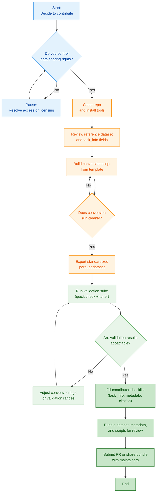

# Contribute Your Dataset

Transform your biomechanics data into a standardized, validated community resource. This visual guide walks you through each decision point in the contribution process.

## Contribution Workflow

The flowchart below shows your complete journey from raw data to published dataset. Click any box to jump directly to detailed instructions for that step.



---

## Quick Reference

**Need specific guidance?** Jump directly to your situation:

- 📁 [**I have folder-based CSVs**](#pattern-a-folder-based) → Pattern A conversion
- 🗂️ [**I have hierarchical MATLAB structs**](#pattern-b-hierarchical) → Pattern B conversion
- ⏱️ [**My data is time-indexed**](#pre-processing-if-time-indexed) → Phase normalization guide
- ✅ [**I'm ready to validate**](#step-2-validate-pythoncli) → Validation tools
- 📦 [**I'm ready to submit**](#ready-to-submit) → Submission checklist

---

## Step 1 — Convert to a Table

Required columns (minimal schema):

- `subject`, `task`, `task_id`, `task_info`, `step`, `phase_ipsi`
- Biomech variables follow: `joint_motion_measurement_side_unit`
  - Examples: `knee_flexion_angle_ipsi_rad`, `hip_flexion_moment_ipsi_Nm_kg`

Constraints:

- 150 points/cycle; `phase_ipsi` in [0..100] (phase‑normalized)
- Angles in radians; joint moments mass‑normalized (Nm/kg); GRFs body‑weight normalized (BW)
- Sign conventions follow the [Reference](../reference/index.md) (e.g., flexion positive)
- Column names follow the standard naming: `joint_motion_measurement_side_unit`

Example dataset (CSV, 1000 rows): [Download](../tutorials/assets/locohub_example_data.csv)

Common conversion patterns

### Pattern A — Folder-based tables {#pattern-a-folder-based}

When your data is organized as per-trial CSVs in nested folders, use this pattern.

[↑ Back to workflow](#contribution-workflow)

=== "Pseudocode"
    ```text
    rows = []
    for trial_folder in walk(root_dir):
      tables = load_all_tables(trial_folder)              # kinematics.csv, kinetics.csv, events.csv, etc.
      tables = standardize_column_names(tables)           # map to joint_motion_measurement_side_unit
      merged = merge_tables_on_keys(tables, keys=[cycle_id, phase_ipsi])
      assert check_phase_index(merged, expected=0..100, n=150)

      meta = read_metadata(trial_folder)                  # subject, task, task_id, task_info (speed, incline)
      merged = attach_metadata(merged, meta)
      rows.append(merged)

    df = concat(rows)
    ensure_minimal_schema(df, required=[subject, task, task_id, task_info, step, phase_ipsi])
    save_parquet(df, 'your_dataset_phase.parquet')
    ```

=== "Python"
    ```python
    import os, glob
    import pandas as pd

    def standardize_cols(df: pd.DataFrame) -> pd.DataFrame:
        mapping = {
            'KneeFlexion_rad': 'knee_flexion_angle_ipsi_rad',
            'HipMoment_Nm_kg': 'hip_flexion_moment_ipsi_Nm_kg',
            # ... add your mappings here
        }
        return df.rename(columns=mapping)

    def build_task_info(speed, incline):
        return f"speed_m_s:{speed},incline_deg:{incline}"

    rows = []
    for trial_dir, dirs, files in os.walk('your_root'):
        kin = glob.glob(os.path.join(trial_dir, '*kinematics*.csv'))
        kin = pd.concat([standardize_cols(pd.read_csv(p)) for p in kin], ignore_index=True) if kin else None

        kinx = glob.glob(os.path.join(trial_dir, '*kinetics*.csv'))
        kinx = pd.concat([standardize_cols(pd.read_csv(p)) for p in kinx], ignore_index=True) if kinx else None

        if kin is None and kinx is None:
            continue

        # Merge on shared keys (adjust as needed)
        merged = kin
        if kinx is not None:
            keys = [c for c in ['cycle_id','phase_ipsi','step'] if c in kin.columns and c in kinx.columns]
            merged = pd.merge(kin, kinx, on=keys, how='outer')

        # Attach metadata (example: infer from folder names or a JSON file)
        subject = os.path.basename(os.path.dirname(trial_dir))
        task = os.path.basename(trial_dir)
        task_id = task
        task_info = build_task_info(speed=1.2, incline=0)

        merged['subject'] = subject
        merged['task'] = task
        merged['task_id'] = task_id
        merged['task_info'] = task_info

        rows.append(merged)

    df = pd.concat(rows, ignore_index=True)
    required = ['subject','task','task_id','task_info','step','phase_ipsi']
    missing = set(required) - set(df.columns)
    assert not missing, f"Missing required columns: {missing}"
    df.to_parquet('your_dataset_phase.parquet', index=False)
    ```

=== "MATLAB"
    ```matlab
    rows = table();
    rootDir = 'your_root';
    d = dir(rootDir);
    for i = 1:numel(d)
        if ~d(i).isdir || startsWith(d(i).name, '.'), continue; end
        trialDir = fullfile(rootDir, d(i).name);
        kinFiles = dir(fullfile(trialDir, '*kinematics*.csv'));
        kin = table();
        for k = 1:numel(kinFiles)
            T = readtable(fullfile(trialDir, kinFiles(k).name));
            % TODO: rename columns to standard names
            kin = [kin; T]; %#ok<AGROW>
        end
        kinxFiles = dir(fullfile(trialDir, '*kinetics*.csv'));
        kinx = table();
        for k = 1:numel(kinxFiles)
            T = readtable(fullfile(trialDir, kinxFiles(k).name));
            % TODO: rename columns to standard names
            kinx = [kinx; T]; %#ok<AGROW>
        end
        if isempty(kin) && isempty(kinx), continue; end
        if isempty(kinx)
            merged = kin;
        else
            keys = intersect(intersect({'cycle_id','phase_ipsi','step'}, kin.Properties.VariableNames), kinx.Properties.VariableNames);
            merged = outerjoin(kin, kinx, 'Keys', keys, 'MergeKeys', true);
        end
        % Attach metadata (example)
        merged.subject = repmat(string(d(i).name), height(merged), 1);
        merged.task = repmat(string(d(i).name), height(merged), 1);
        merged.task_id = merged.task;
        merged.task_info = repmat("speed_m_s:1.2,incline_deg:0", height(merged), 1);
        rows = [rows; merged]; %#ok<AGROW>
    end
    required = {'subject','task','task_id','task_info','step','phase_ipsi'};
    assert(all(ismember(required, rows.Properties.VariableNames)), 'Missing required columns');
    parquetwrite('your_dataset_phase.parquet', rows);
    ```

### Pattern B — Hierarchical structure {#pattern-b-hierarchical}

For MATLAB structs or other hierarchical data formats (subject → task → task_info → data).

[↑ Back to workflow](#contribution-workflow)

=== "Pseudocode"
    ```text
    rows = []
    S = load_structure(input)
    for subject in S:
      for task in subject.tasks:
        for variant in task.variants:             # task_id or condition
          data = variant.data                      # arrays with cycles × phase × variables or flat table
          meta = variant.meta                      # speed, incline, etc.
          T = to_table(data)                       # ensure columns use standard names
          T.subject = subject.id
          T.task = task.name
          T.task_id = variant.id
          T.task_info = format_task_info(meta)
          rows.append(T)
    df = concat(rows); save_parquet(df, 'your_dataset_phase.parquet')
    ```

=== "Python"
    ```python
    import pandas as pd
    from scipy.io import loadmat

    mat = loadmat('umich_like_struct.mat', squeeze_me=True, struct_as_record=False)
    S = mat['dataset']  # top-level struct
    rows = []

    def to_table(data_obj) -> pd.DataFrame:
        # Convert nested arrays/fields into a flat DataFrame
        # Map variable names to standard names here
        return pd.DataFrame(data_obj['table'])  # placeholder

    for subj in S.subjects:
        for task in subj.tasks:
            for var in task.variants:
                T = to_table(var.data)
                T['subject'] = subj.id
                T['task'] = task.name
                T['task_id'] = var.id
                meta = var.meta  # dict-like
                task_info = f"speed_m_s:{meta['speed']},incline_deg:{meta['incline']}"
                T['task_info'] = task_info
                rows.append(T)

    df = pd.concat(rows, ignore_index=True)
    required = ['subject','task','task_id','task_info','step','phase_ipsi']
    assert set(required).issubset(df.columns)
    df.to_parquet('your_dataset_phase.parquet', index=False)
    ```

=== "MATLAB"
    ```matlab
    S = load('umich_like_struct.mat');
    D = S.dataset; % top-level struct
    rows = table();

    % Helper that flattens a nested data object into a table with standard names
    toTable = @(dataObj) struct2table(dataObj.table); % placeholder

    for i = 1:numel(D.subjects)
        subj = D.subjects(i);
        for j = 1:numel(subj.tasks)
            task = subj.tasks(j);
            for k = 1:numel(task.variants)
                var = task.variants(k);
                T = toTable(var.data);
                T.subject = repmat(string(subj.id), height(T), 1);
                T.task    = repmat(string(task.name), height(T), 1);
                T.task_id = repmat(string(var.id), height(T), 1);
                meta = var.meta; % struct with speed, incline, etc.
                T.task_info = repmat("speed_m_s:" + string(meta.speed) + ",incline_deg:" + string(meta.incline), height(T), 1);
                rows = [rows; T]; %#ok<AGROW>
            end
        end
    end
    required = {'subject','task','task_id','task_info','step','phase_ipsi'};
    assert(all(ismember(required, rows.Properties.VariableNames)), 'Missing required columns');
    parquetwrite('your_dataset_phase.parquet', rows);
    ```

### Pre‑processing (if time‑indexed) {#pre-processing-if-time-indexed}

[↑ Back to workflow](#contribution-workflow)

If your data are time‑indexed (no `phase_ipsi`), add a phase‑normalization pass before building the final table.

=== "Pseudocode"
    ```text
    for trial in trials:
      sig = load_signals(trial)
      events = detect_events(sig)                     # heel strikes / toe offs
      cycles = segment_cycles(sig, events)
      for c in cycles:
        phase, resampled = resample_to_150(c)         # phase 0..100, 150 points
        write_rows(phase, resampled, metadata)
    ```

=== "Python"
    ```python
    import numpy as np

    def resample_to_150(y, t, hs_t, next_hs_t):
        mask = (t >= hs_t) & (t < next_hs_t)
        t_seg, y_seg = t[mask], y[mask]
        phase = np.linspace(0, 100, 150)
        t_norm = (t_seg - t_seg[0]) / (t_seg[-1] - t_seg[0]) * 100
        y150 = np.interp(phase, t_norm, y_seg)
        return phase, y150
    ```

=== "MATLAB"
    ```matlab
    function [phase, y150] = resampleTo150(t, y, hs_t, next_hs_t)
    mask = t >= hs_t & t < next_hs_t;
    t_seg = t(mask); y_seg = y(mask);
    phase = linspace(0,100,150);
    t_norm = (t_seg - t_seg(1)) / (t_seg(end) - t_seg(1)) * 100;
    y150 = interp1(t_norm, y_seg, phase, 'linear', 'extrap');
    end
    ```

#### OpenSim pipeline (typical)

- Model prep: Scale model; verify marker sets and segment frames.
- Inverse Kinematics (IK): compute joint angles; export kinematics (`.mot/.sto`).
- External Loads → Inverse Dynamics (ID): apply GRFs; compute joint moments; export kinetics (`.mot/.sto`).
- Filtering: apply consistent filters to kinematics/kinetics; record cutoffs.
- Naming/signs: map OpenSim column names to standard `joint_motion_measurement_side_unit`; enforce sign conventions.
- Events → Phase: if time-indexed, detect HS/TO (e.g., GRF threshold) and resample cycles to 150 points (`phase_ipsi` 0–100).
- Normalization: convert joint moments to `*_Nm_kg`; GRFs to `*_BW`.
- Table build: add required columns (`subject`, `task`, `task_id`, `task_info`, `step`, `phase_ipsi`) and save parquet.
- Validate: run quick validator; iterate on mapping/signs/phase until pass rates are acceptable.

Tips: pick a consistent HS detector (e.g., vertical GRF threshold crossing), de‑spike signals before event detection, and verify a few cycles visually.

## Step 2 — Validate (Python/CLI) {#step-2-validate-pythoncli}

[↑ Back to workflow](#contribution-workflow)

Run the quick validator for pass/fail stats (optional plots):

```bash
python contributor_tools/quick_validation_check.py your_dataset_phase.parquet
python contributor_tools/quick_validation_check.py your_dataset_phase.parquet --plot
```

Optionally produce a filtered dataset of valid strides:

```bash
python contributor_tools/create_filtered_dataset.py your_dataset_phase.parquet
```

Interpret results:

- Pass rates by task/feature; failures often indicate sign conventions, phase offsets, or unit issues.
- Fix at the source (sign flips, event alignment, unit conversions), regenerate parquet, and re-run validation.

---

## Ready to Submit {#ready-to-submit}

[↑ Back to workflow](#contribution-workflow)

### Submission checklist

- `subject`, `task`, `task_id`, `task_info`, `step`, `phase_ipsi` columns exist and follow the canonical spelling.
- Every cycle is phase-normalized to 150 samples with `phase_ipsi` spanning 0–100.
- Joint angles are in radians, joint moments mass-normalized (Nm/kg), ground reaction forces in body-weight units.
- Sign conventions follow the [reference spec](../reference/index.md); ipsilateral/contralateral labels match the data.
- Validation results show ≥90% pass rate per major task, or you have written justification for lower values.
- `task_info` strings capture experimental context (e.g., `speed_m_s:1.25,incline_deg:5`).

### Package to share

- Include at minimum `datasetcode_year_phase.parquet`; attach `*_filtered.parquet` if you created a filtered version.
- Add a short README describing the collection protocol, sensors, subject demographics, and any deviations from the spec.
- Export the latest validation report bundle using `create_dataset_validation_report.py --no-plots` (for text) and with plots when available; include the generated Markdown and assets.
- List any custom validation range YAMLs or tooling modifications and check them into the pull request.

### Handoff to maintainers

- Compress scripts, README, validation outputs, and parquet files into a single archive (or reference a stable download link).
- Open an issue or pull request summarizing the dataset, validation status, and any assistance needed for publication.
- Stay available for quick follow-up about metadata, ranges, or packaging adjustments during review.

## Common Pitfalls

- Angles left in degrees (should be radians)
- Mixed `subject` vs `subject_id` (use `subject`)
- `phase_percent` used (should be `phase_ipsi` [0..100])
- Wrong ipsi/contra or sign conventions (angles/moments)
- Missing `task_info` (e.g., `speed_m_s`, `incline_deg`)
- Time-indexed data not normalized to phase (150 points)

## References

- [Reference](../reference/index.md)
- [Tools Reference](tools_reference.md)
- Examples: [UMich (MATLAB)](examples/umich_2021_example.md), [GTech (Python)](examples/gtech_2023_example.md)
