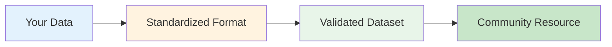

# Contributor Standard Operating Procedures

## High-Level Operation

The high-level view shows the four major stages of contribution. Each stage uses a distinct color palette: blue for intake, orange-cream for standardization, green for validation, and sage for community sharing.

## Detailed Workflow

The complete contributor workflow with all decision points and tool interactions is now featured prominently on the main [Contribution page](index.md#contribution-workflow). Head there to see the interactive flowchart that guides you through each step of the contribution process.
