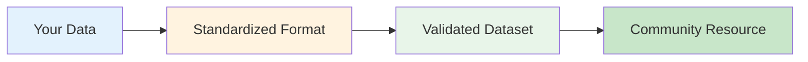
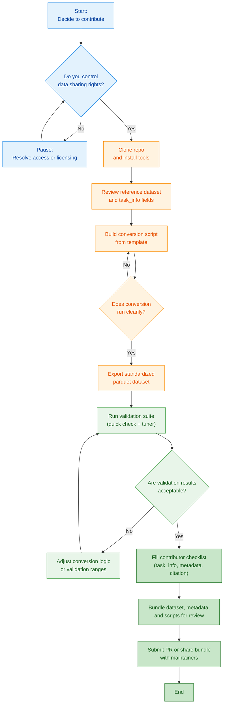

# Contributor Standard Operating Procedures

## High-Level Operation

The detailed procedure reuses the same palette: blue-tinted nodes for intake decisions, orange-cream for standardization tasks, green for validation, and sage for the handoff steps.

## Low-Level Operation

