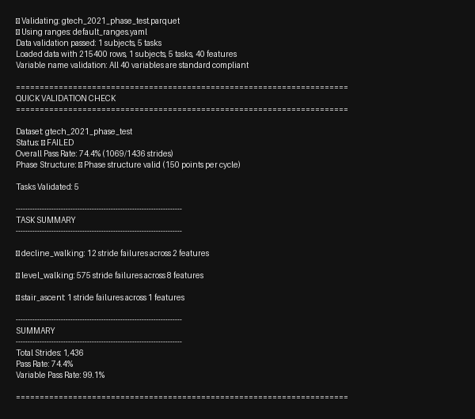
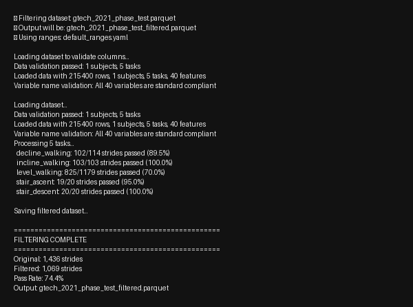
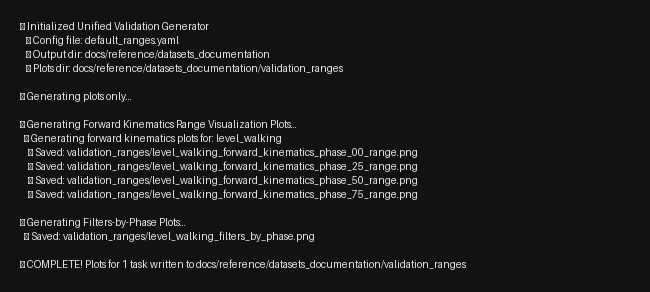
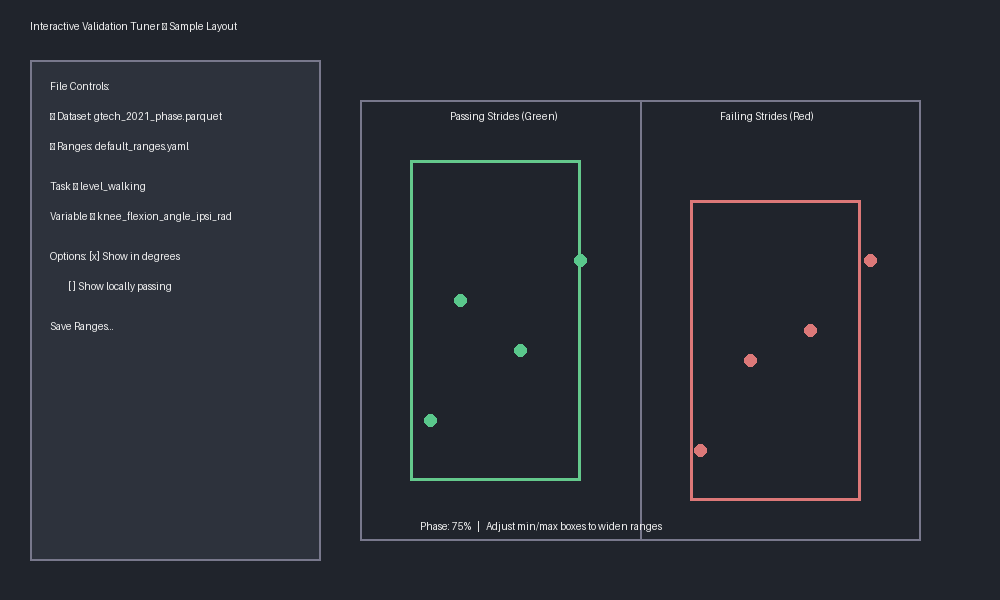

# Contributor Tool Tutorials

This guide walks through every helper available in `contributor_tools/`. Each section covers when to use the tool, the exact command to run, what to look for in the output, and a screenshot preview.

Before you begin:
- Activate the repository's Python environment (the commands below assume `python3`).
- Keep your phase-normalized dataset in `converted_datasets/` (or provide an absolute path).
- Run commands from the repository root so relative paths resolve correctly.

## quick_validation_check.py — Fast Quality Scan

Use this first after you export a phase-normalized parquet file. It verifies naming conventions, basic structure, and stride-level validation statistics.

1. Run the quick check:
   ```bash
   python3 contributor_tools/quick_validation_check.py converted_datasets/gtech_2021_phase_test.parquet
   ```
2. Review the pass rate by task. A non-zero exit code simply means at least one task failed validation.
3. Add `--ranges` to point at a custom YAML, or `--plot` to open scrollable validation plots.



**Tips**
- Only one `--task` can be supplied, and it must be paired with `--plot`.
- The script prints the variable naming audit up front—if it fails there, fix your column names before moving on.

## create_filtered_dataset.py — Keep Only Passing Strides

After the quick check highlights problems, run the filter to drop the failing strides and produce a clean file for sharing.

1. Launch the filter:
   ```bash
   python3 contributor_tools/create_filtered_dataset.py converted_datasets/gtech_2021_phase_test.parquet
   ```
   The tool automatically saves to `*_filtered.parquet` alongside the input. It prompts before overwriting an existing file.
2. Inspect the per-task pass rates in the console output to confirm that enough strides survived.
3. Rerun downstream analyses with the new filtered dataset.



**Tips**
- Use `--ranges` for alternate validation envelopes (e.g., prosthetic users).
- `--exclude-columns "col_a,col_b"` ignores auxiliary signals both during validation and in the filtered output.

## create_dataset_validation_report.py — Publication-Ready Reports

When you're ready to document results, generate the full Markdown report and plot bundle. By default the tool merges directly into the dataset docs; use `--no-merge` during iteration.

1. Run a standalone report while iterating:
   ```bash
   python3 contributor_tools/create_dataset_validation_report.py \
       --datasets converted_datasets/gtech_2021_phase_test.parquet \
       --no-merge --no-comparison
   ```
2. Inspect the console summary to confirm overall status and output paths. The report and PNGs are written to `docs/datasets/validation_reports/` and `docs/datasets/validation_plots/`.
3. When the dataset is final, drop the `--no-merge` flag so the documentation index updates automatically.


**Tips**
- Accepts multiple datasets or glob patterns (e.g., `--datasets converted_datasets/*_phase.parquet`).
- Use `--show-local-passing` while generating plots to highlight strides that only fail the current feature.
- Provide `--short-code` (e.g., `UM21`) the first time you merge a new dataset so the docs know how to reference it.

## generate_validation_documentation.py — Refresh the Spec Package

This utility rebuilds the validation range reference pages and forward kinematics diagrams from a YAML config. It is ideal after editing `default_ranges.yaml` or adding a custom spec.

1. Preview plot generation for a single task:
   ```bash
   python3 contributor_tools/generate_validation_documentation.py \
       --plots-only --tasks level_walking
   ```
2. Check the console log for the output directory. All renders land in `docs/reference/datasets_documentation/validation_ranges/`.
3. Re-run without `--plots-only` to produce the companion Markdown after you are satisfied with the plots.



**Tips**
- Point `--config` at an alternate YAML to document population-specific envelopes without touching the defaults.
- The script loads contralateral ranges automatically—no need to manually mirror ipsilateral values.

## interactive_validation_tuner.py — Visual Range Editing

Launch this GUI to understand why a feature fails and to author new validation envelopes interactively.

1. Start the application (Tkinter must be available on your platform):
   ```bash
   python3 contributor_tools/interactive_validation_tuner.py
   ```
2. Choose a dataset and validation YAML when prompted.
3. Use the task and variable dropdowns to focus on a specific signal, then drag the green/red boxes to widen or tighten the acceptable range. Toggle “Show in Degrees” when interpreting joint angles.
4. Save the tuned ranges; the tool writes a timestamped YAML you can pass to the other scripts.



**Tips**
- “Show Locally Passing” highlights strides that only fail other variables, helping isolate true outliers.
- Pair the tuner with `create_dataset_validation_report.py` to iterate: tune → save → regenerate plots → repeat.

---

Looking for full conversion guidance? Return to the [Contribute overview](index.md).
