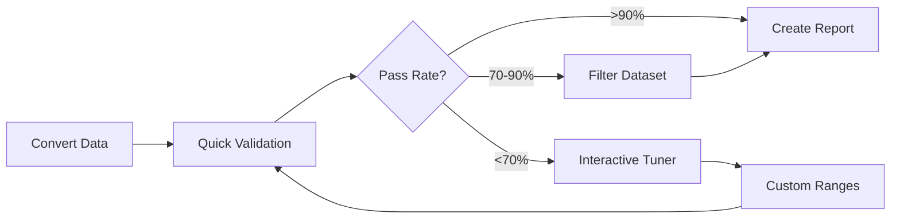

# Contributor Tools Reference

Complete documentation for all tools available to dataset contributors.

## Overview

The project provides specialized tools to help with different stages of dataset conversion and validation:

| Tool | Purpose | Status | Location |
|------|---------|--------|----------|
| **quick_validation_check.py** | Fast pass/fail validation statistics | ✅ Available | `contributor_tools/` |
| **create_filtered_dataset.py** | Remove invalid strides from dataset | ✅ Available | `contributor_tools/` |
| **interactive_validation_tuner.py** | GUI for tuning validation ranges | ✅ Available | `contributor_tools/` |
| **create_dataset_validation_report.py** | Full validation report with plots | ✅ Available | `contributor_tools/` |
| **conversion_generate_phase_dataset.py** | Auto convert time to phase | 🚧 Coming Soon | Root directory |

---

## Quick Validation Tools

### quick_validation_check.py

**Purpose**: Get immediate feedback on your dataset quality with pass/fail statistics.

**When to use**: 
- First validation after conversion
- Quick checks during development
- Monitoring data quality improvements

**Usage**:
```bash
# Basic validation check
python contributor_tools/quick_validation_check.py your_dataset_phase.parquet

# With visual plots showing pass/fail distributions
python contributor_tools/quick_validation_check.py your_dataset_phase.parquet --plot

# Check specific tasks only
python contributor_tools/quick_validation_check.py your_dataset_phase.parquet \
    --tasks level_walking incline_walking
```

**Parameters**:
- `dataset`: Path to phase-indexed parquet file
- `--plot`: Generate visual validation plots (optional)
- `--tasks`: Specific tasks to validate (optional, default: all)
- `--ranges-file`: Custom validation ranges YAML (optional)

**Output Example**:
```
Dataset: your_dataset_phase.parquet
Using validation ranges: default_ranges.yaml

Task Summary:
✓ level_walking: 95% pass (380/400 strides)
✓ incline_walking: 92% pass (368/400 strides)
⚠ stair_ascent: 73% pass (292/400 strides)
✗ stair_descent: 45% pass (180/400 strides)

Overall: 76.3% of strides pass validation

For detailed analysis, use:
python contributor_tools/create_dataset_validation_report.py --dataset your_dataset_phase.parquet
```

**Understanding Results**:
- ✓ (>90%): Task data looks good
- ⚠ (70-90%): Some issues, may need custom ranges
- ✗ (<70%): Significant issues, check conversion or use custom ranges

---

### create_filtered_dataset.py

**Purpose**: Create a clean dataset containing only biomechanically valid strides.

**When to use**:
- After validation shows some failures
- To create analysis-ready datasets
- To exclude outliers or bad trials

**Usage**:
```bash
# Basic filtering with default validation ranges
python contributor_tools/create_filtered_dataset.py your_dataset_phase.parquet

# Use custom validation ranges for special populations
python contributor_tools/create_filtered_dataset.py your_dataset_phase.parquet \
    --ranges-file contributor_tools/validation_ranges/elderly_ranges.yaml

# Exclude specific columns from validation (e.g., EMG signals)
python contributor_tools/create_filtered_dataset.py your_dataset_phase.parquet \
    --exclude-columns "emg_signal_1,emg_signal_2"

# Keep metadata about why strides were excluded
python contributor_tools/create_filtered_dataset.py your_dataset_phase.parquet \
    --keep-metadata
```

**Parameters**:
- `dataset`: Input phase-indexed parquet file
- `--output`: Output filename (default: adds `_filtered` suffix)
- `--ranges-file`: Custom validation ranges YAML
- `--exclude-columns`: Comma-separated columns to skip validation
- `--keep-metadata`: Add column indicating pass/fail reason
- `--min-pass-rate`: Minimum pass rate to include subject (default: 0.5)

**Output**:
```
Loading dataset...
Loaded 10 subjects, 5 tasks, 2000 total strides

Applying validation filters...
  level_walking: 380/400 strides passed (95.0%)
  incline_walking: 368/400 strides passed (92.0%)
  stair_ascent: 292/400 strides passed (73.0%)
  stair_descent: 180/400 strides passed (45.0%)

Overall: 1220/2000 strides passed (61.0%)
Filtered dataset saved to: your_dataset_phase_filtered.parquet
```

**Use Cases**:
1. **Clean dataset for analysis**: Remove outliers and bad trials
2. **Population-specific filtering**: Use appropriate ranges for your population
3. **Progressive filtering**: Start lenient, gradually tighten criteria

---

## Interactive Validation Tuner

### interactive_validation_tuner.py

**Purpose**: Visual GUI tool for understanding validation failures and tuning ranges for special populations.

**When to use**:
- Your population differs from healthy adults
- Many strides failing validation
- Need to understand why validation is failing
- Creating custom validation ranges

**Usage**:
```bash
# Launch the interactive GUI
python contributor_tools/interactive_validation_tuner.py

# The GUI will prompt for:
# 1. Dataset file selection
# 2. Validation ranges file selection
# 3. Task and variable to visualize
```

**Interface Features**:

1. **File Controls**:
   - Browse button for dataset selection
   - Browse button for validation ranges
   - Auto-loads last used files on startup

2. **Visualization Controls**:
   - Task dropdown: Select which task to analyze
   - Variable dropdown: Select which biomechanical variable
   - Phase selector: View different phases (0%, 25%, 50%, 75%)

3. **Display Options**:
   - `Show Locally Passing`: Highlight strides passing current variable only (yellow)
   - `Show in Degrees`: Convert radians to degrees for angles
   - Pass/Fail columns: Green = passing all, Red = failing current variable

4. **Interactive Adjustment**:
   - **Drag validation boxes**: Click and drag edges to adjust min/max
   - **Real-time feedback**: See pass/fail counts update immediately
   - **Phase-specific tuning**: Adjust ranges at each phase independently

5. **Saving**:
   - `Save Ranges`: Export tuned ranges to new YAML file
   - Preserves all unchanged variables
   - Creates timestamped backup

**Visual Guide**:
```
Left Panel (Passing)          Right Panel (Failing)
┌─────────────────┐           ┌─────────────────┐
│  Green dots     │           │  Red dots       │
│  ┌──────────┐   │           │                 │
│  │ Valid    │   │           │  ┌──────────┐   │
│  │ Range    │   │           │  │ Valid    │   │
│  └──────────┘   │           │  └──────────┘   │
│                 │           │                 │
└─────────────────┘           └─────────────────┘
     ↑                              ↑
  Drag edges                    See failures
```

**Tips for Effective Tuning**:

1. **Start with kinematics**: Joint angles are most intuitive
2. **Use degree view**: Easier to interpret (e.g., 60° vs 1.047 rad)
3. **Check all phases**: Some populations differ more at specific phases
4. **Look for patterns**: Systematic shifts may indicate population differences
5. **Document changes**: Note why you adjusted ranges in README

**Example Workflow**:
```
1. Load elderly population dataset
2. Start with level_walking task
3. Select knee_flexion_angle_ipsi_rad
4. Toggle "Show in Degrees" for easier interpretation
5. See many failures at 75% phase (peak flexion)
6. Drag max range from 80° to 70° (reduced ROM in elderly)
7. Save as elderly_ranges.yaml
8. Repeat for other variables showing failures
```

---

## Comprehensive Validation

### create_dataset_validation_report.py

**Purpose**: Generate detailed validation reports with plots and statistics for documentation.

**When to use**:
- Final validation before sharing dataset
- Creating documentation
- Debugging systematic validation issues
- Generating publication figures

**Usage**:
```bash
# Basic validation report
python contributor_tools/create_dataset_validation_report.py \
    --dataset your_dataset_phase.parquet

# Generate with plots (recommended)
python contributor_tools/create_dataset_validation_report.py \
    --dataset your_dataset_phase.parquet \
    --generate-plots

# Use custom validation ranges
python contributor_tools/create_dataset_validation_report.py \
    --dataset your_dataset_phase.parquet \
    --ranges-file contributor_tools/validation_ranges/prosthetic_ranges.yaml \
    --generate-plots

# Specify output directory
python contributor_tools/create_dataset_validation_report.py \
    --dataset your_dataset_phase.parquet \
    --generate-plots \
    --output-dir docs/validation_results/
```

**Parameters**:
- `--dataset`: Path to phase-indexed parquet file
- `--ranges-file`: Custom validation ranges YAML (default: `default_ranges.yaml`)
- `--generate-plots`: Create visual validation plots
- `--output-dir`: Directory for reports and plots (default: `validation_reports/`)
- `--tasks`: Specific tasks to validate (default: all)
- `--verbose`: Show detailed validation progress

**Output Files**:

1. **Markdown Report** (`dataset_validation_report.md`):
   ```markdown
   # Validation Report: your_dataset_phase
   
   ## Summary
   - Phase Structure: Valid (150 points per cycle)
   - Tasks Validated: 8/8
   - Overall Pass Rate: 91.2%
   
   ## Task-Specific Results
   
   ### level_walking
   - Pass rate: 95% (380/400 strides)
   - Minor violations at phase 75% for knee_flexion_angle_ipsi_rad
   - Likely cause: Peak flexion slightly exceeds normal range
   
   ### stair_ascent  
   - Pass rate: 73% (292/400 strides)
   - Systematic violations at phase 25% for hip_moment_ipsi_Nm
   - Consider: Custom ranges for stair tasks
   ```

2. **Validation Plots** (PNG files):
   - One plot per task showing all variables
   - Green background: Valid ranges
   - Red dots: Failing strides
   - Separate plots for kinematic, kinetic, and segment variables

**Understanding the Plots**:
```
Phase:    0%        25%        50%        75%
          ↓          ↓          ↓          ↓
    2.0 ┤                    ╔════════╗
        │          ╔════════╗║        ║╔════════╗
    1.0 ┤  ╔══════╗║        ║║        ║║        ║
        │  ║      ║║    •   ║║    •   ║║   •••  ║
    0.0 ┤  ║  ••• ║║   •••  ║║   •••  ║║  •••   ║
        │  ║      ║║        ║║        ║║        ║
   -1.0 ┤  ╚══════╝╚════════╝╚════════╝╚════════╝
        └──────────────────────────────────────────
        Green boxes = Valid ranges
        Black dots = Your data
        Red dots = Failing strides
```

---

## Phase Conversion (Coming Soon)

### conversion_generate_phase_dataset.py

!!! warning "Tool Under Development"
    This automatic phase conversion tool is currently being developed.
    For now, implement phase normalization in your conversion script.
    See the UMich_2021 example for a working implementation.

**Planned Features**:
- Automatic gait cycle detection
- Multiple detection methods (heel strike, peak detection, periodic)
- Handles irregular cycle lengths
- Preserves all biomechanical variables
- Generates exactly 150 points per cycle

**Planned Usage**:
```bash
# Basic conversion (when available)
python conversion_generate_phase_dataset.py your_dataset_time.parquet

# Expected to create: your_dataset_phase.parquet
```

---

## Workflow Integration

### Recommended Tool Sequence



1. **First Check**: Use `quick_validation_check.py` for immediate feedback
2. **If Issues**: Use `interactive_validation_tuner.py` to understand problems
3. **Clean Data**: Use `create_filtered_dataset.py` to remove bad strides
4. **Final Report**: Use `create_dataset_validation_report.py` for documentation

---

## Troubleshooting

### Common Issues and Solutions

**Issue**: "Variable not found in validation ranges"
```bash
# Solution: Check exact variable naming
python -c "import pandas as pd; print(pd.read_parquet('your_data.parquet').columns.tolist())"
# Ensure names match standard (e.g., knee_flexion_angle_ipsi_rad)
```

**Issue**: GUI not responding to mouse drags
```bash
# Solution: Click precisely on box edge, not inside
# Alternatively, restart the tool
# Check that dataset is loaded before adjusting
```

**Issue**: Validation passes but data looks wrong
```bash
# Solution: Validation ranges might be too lenient
# Use interactive tuner to tighten ranges
# Consider phase-specific issues
```

**Issue**: Memory error with large datasets
```bash
# Solution: Process in chunks or filter by task
python contributor_tools/quick_validation_check.py your_data.parquet \
    --tasks level_walking  # Process one task at a time
```

---

## Best Practices

1. **Always start with quick validation** - Get immediate feedback
2. **Use appropriate ranges** - Don't force clinical data into healthy ranges
3. **Document your choices** - Explain custom ranges in README
4. **Filter conservatively** - Better to keep questionable data than lose good data
5. **Visualize before validating** - Plot your data to understand it
6. **Save incrementally** - Keep versions as you refine

---

## Getting Help

- **Examples**: See `contributor_tools/conversion_scripts/` for working code
- **Quick questions**: GitHub Discussions
- **Bug reports**: GitHub Issues
- **Response time**: Usually within 24 hours

---

*These tools are designed to make dataset contribution straightforward while maintaining data quality.*