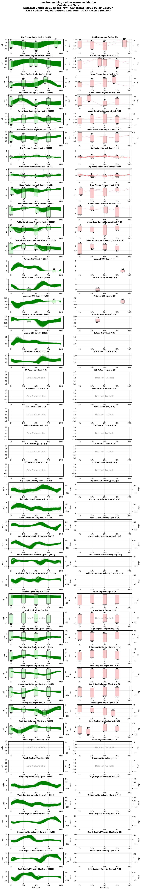
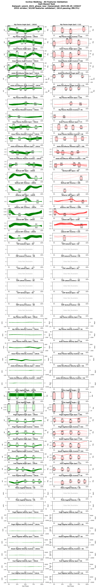
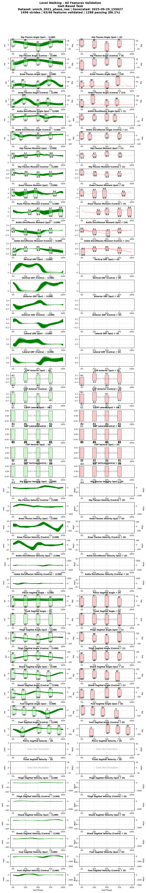
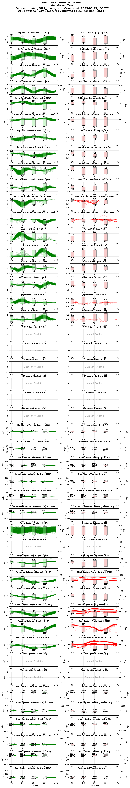
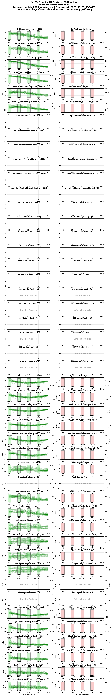
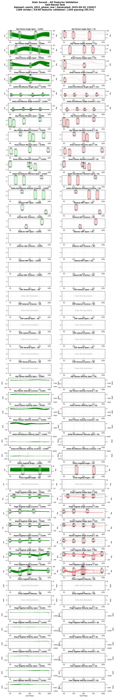
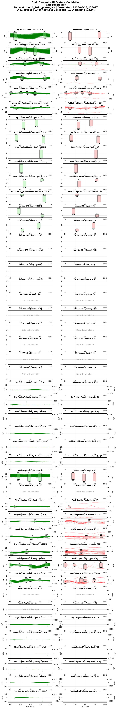
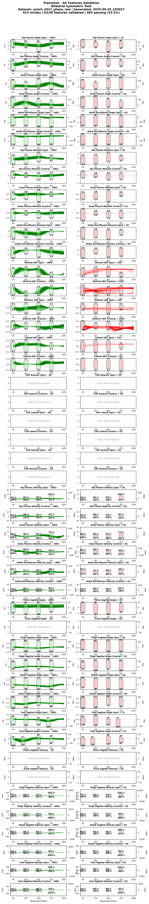

# Validation Report — Umich 2021 Raw

## Status Summary

| Metric | Value |
|--------|-------|
| Stride Pass Rate | 85.3% |
| Total Strides | 14240 |
| Passing Strides | 12149 |

### Summary

**Status**: ⚠️ PARTIAL (85.3% valid)  
**Total Strides**: 14240  
**Passing Strides**: 12149  

### Task Breakdown

| Task | Pass Rate | Status |
|------|-----------|--------|
| Decline Walking | 96.6% | ✅ |
| Incline Walking | 88.5% | ⚠️ |
| Level Walking | 86.1% | ⚠️ |
| Run | 69.6% | ❌ |
| Sit To Stand | 100.0% | ✅ |
| Stair Ascent | 93.5% | ✅ |
| Stair Descent | 93.1% | ✅ |
| Stand To Sit | 100.0% | ✅ |
| Transition | 52.3% | ❌ |

_Validation ranges snapshot embedded below._

## Validation Ranges Snapshot

Download the YAML snapshot used for this validation: [Download](./um21_validation_ranges.yaml)

_Source ranges file: contributor_tools/validation_ranges/default_ranges_v3.yaml_

## Validation Plots

=== "Decline Walking"
    

=== "Incline Walking"
    

=== "Level Walking"
    

=== "Run"
    

=== "Sit To Stand"
    

=== "Stair Ascent"
    

=== "Stair Descent"
    

=== "Stand To Sit"
    

=== "Transition"
    

---

*Generated from `converted_datasets/umich_2021_phase_raw.parquet` on 2025-09-29 11:49*
