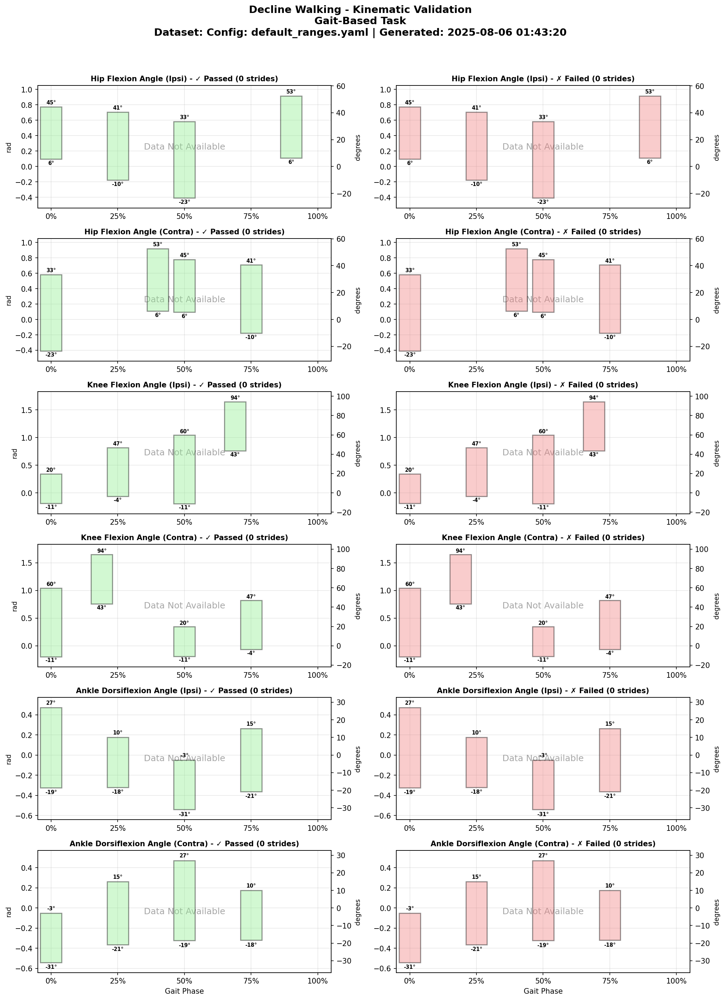
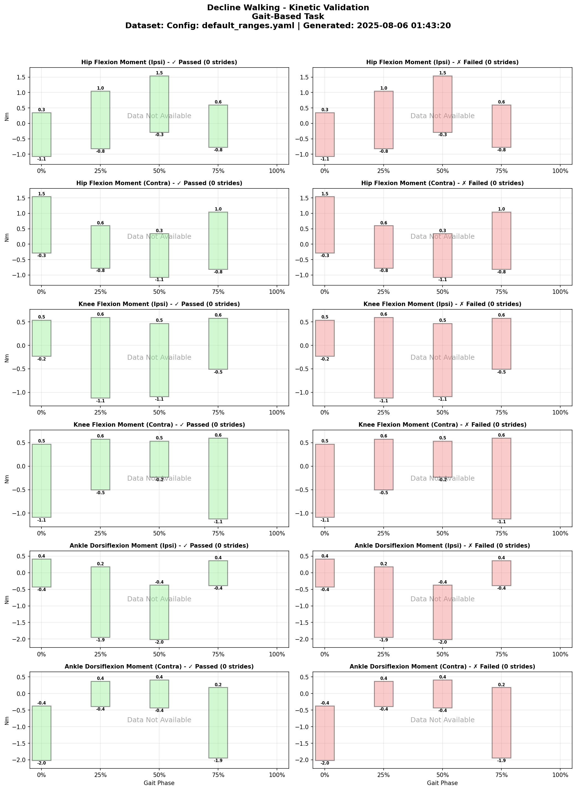
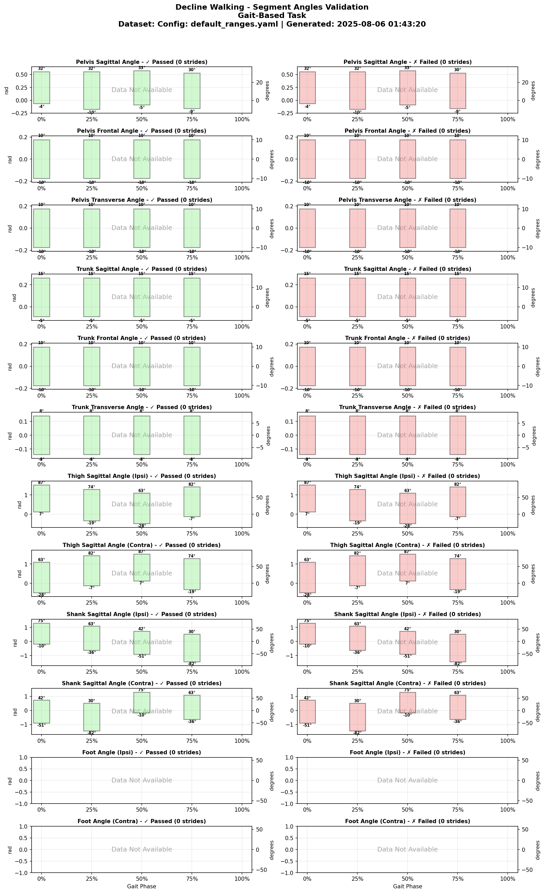
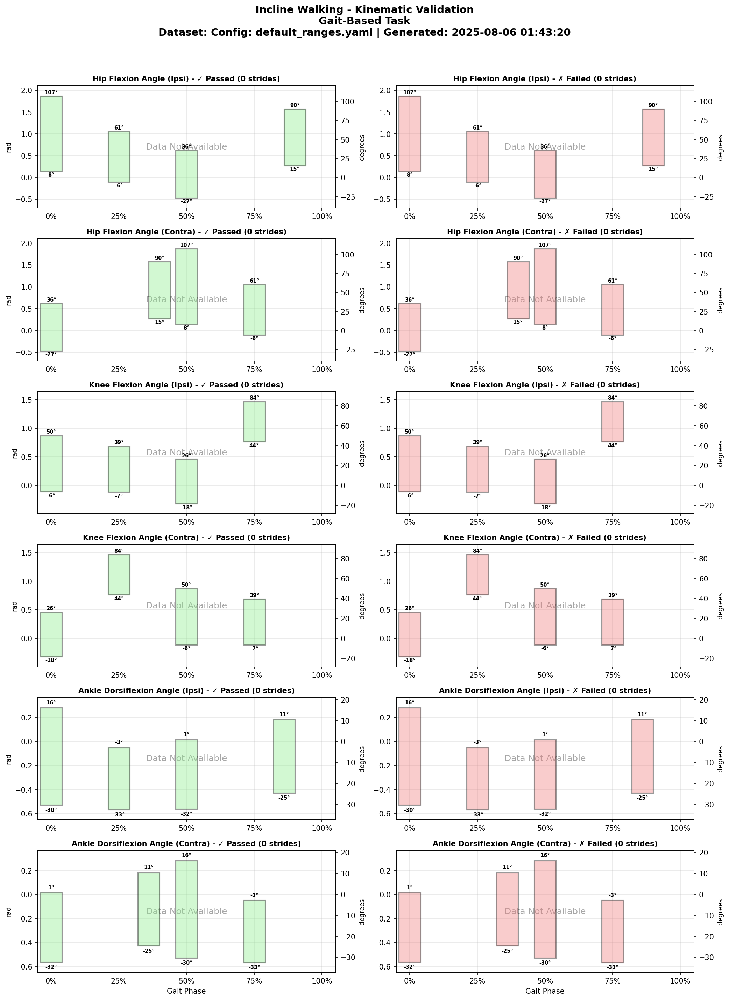
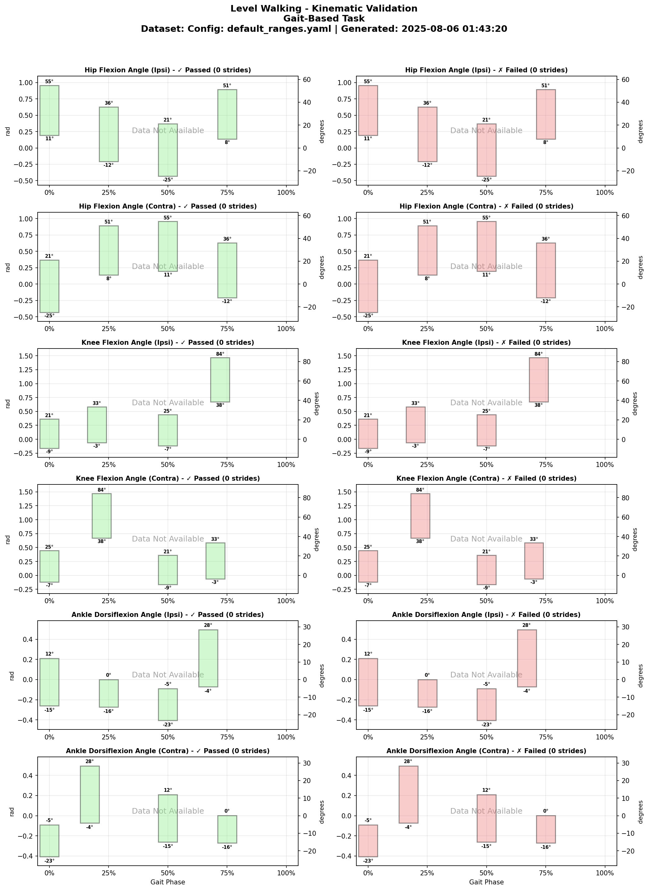
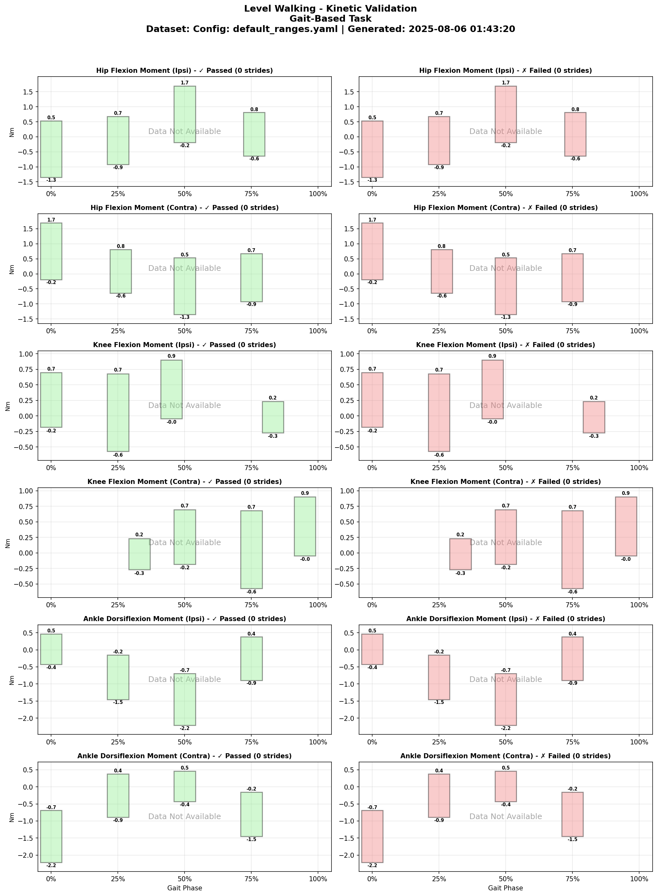
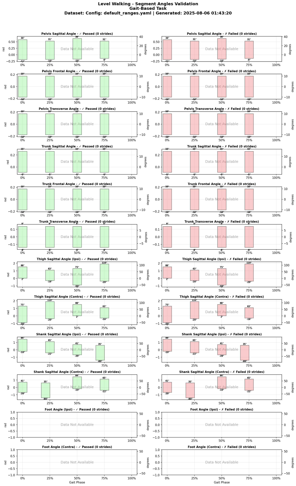

# Validation Ranges

**Biomechanically validated ranges for locomotion data quality assessment**

## Configuration Metadata

- **Config File**: `default_ranges.yaml`
- **Generated**: 2025-08-06 01:46:04
- **Description**: Interactively tuned validation ranges for all features

## Task: Decline Walking

### Forward Kinematics Visualizations

Joint angle ranges visualized at key gait phases:

| Phase 0% | Phase 50% |
|---|---|
|  |  |

### Phase-Based Visualizations

Validation ranges across the full gait cycle (0-100% phase):

#### Kinematic Variables (Joint Angles)

#### Kinetic Variables (Joint Moments)

#### Segment Angles

## Task: Incline Walking

### Forward Kinematics Visualizations

Joint angle ranges visualized at key gait phases:

| Phase 0% | Phase 50% |
|---|---|
|  |  |

### Phase-Based Visualizations

Validation ranges across the full gait cycle (0-100% phase):

#### Kinematic Variables (Joint Angles)

#### Kinetic Variables (Joint Moments)

#### Segment Angles

## Task: Level Walking

### Forward Kinematics Visualizations

Joint angle ranges visualized at key gait phases:

| Phase 0% | Phase 50% |
|---|---|
|  |  |

### Phase-Based Visualizations

Validation ranges across the full gait cycle (0-100% phase):

#### Kinematic Variables (Joint Angles)

#### Kinetic Variables (Joint Moments)

#### Segment Angles

---

*Generated from `default_ranges.yaml` on 2025-08-06 01:46:04*