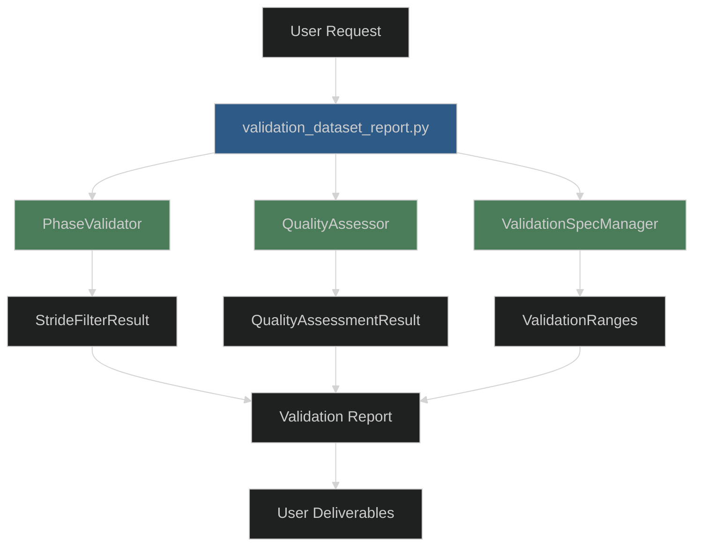

# C4 Level 4: Code Specifications

**Comprehensive code architecture overview with unified UML diagram and detailed component specifications.**

## Architecture Overview

This document provides the complete code-level architecture for the locomotion data standardization project, integrating validation components with a validation-centric design that supports all critical user requirements (F1-F6 from Document 10).

### Integration with C4 Architecture

The code architecture directly implements the container architecture from Document 12, with special focus on the **Validation Container** as the primary integration point. The main CLI tool `validation_dataset_report.py` serves as the orchestrator for all validation workflows defined in Document 06.

### Component Integration Flow



## Comprehensive UML Class Diagram

The following UML diagram shows the complete class structure integrating all components from subsections 14a (Interface Contracts), 14b (Data Structures), and 14c (CLI Specifications):

```mermaid
%%{init: {'theme': 'dark'}}%%
classDiagram
    %% Core Validation Architecture
    class PhaseValidator {
        -spec_manager: SpecificationManager
        -error_handler: ErrorHandler
        -progress_reporter: ProgressReporter
        +validate_dataset(file_path: str, generate_plots: bool, generate_gifs: bool) PhaseValidationResult
        +filter_valid_strides(data: DataFrame, available_variables: List[str]) StrideFilterResult
        +get_available_tasks(data: DataFrame) List[str]
        +analyze_standard_spec_coverage(data: DataFrame) Dict[str, Dict[str, bool]]
        +validate_batch(file_paths: List[str], parallel: bool) BatchValidationResult
        +generate_validation_report(result: PhaseValidationResult, output_path: str) ReportGenerationResult
    }
    
    class QualityAssessor {
        -spec_manager: SpecificationManager
        -error_handler: ErrorHandler
        -progress_reporter: ProgressReporter
        +assess_dataset_quality(file_path: str, generate_comparisons: bool) QualityAssessmentResult
        +calculate_coverage_statistics(data: DataFrame) CoverageStats
        +identify_outliers(data: DataFrame, method: str) OutlierAnalysis
        +generate_population_comparison(data: DataFrame) PopulationComparisonResult
    }
    
    class ValidationSpecManager {
        -config_manager: ConfigurationManager
        -error_handler: ErrorHandler
        +get_validation_ranges(task: str, phase: int, variable: str) ValidationRanges
        +update_validation_ranges(task: str, variable: str, ranges: Dict, rationale: str) UpdateResult
        +load_specifications(spec_file: str) SpecificationLoadResult
        +export_specifications(output_path: str, format: str) ExportResult
        +preview_range_changes(proposed_changes: Dict, test_datasets: List[str]) ChangePreview
        +validate_specification_integrity() IntegrityReport
    }
    
    class AutomatedFineTuner {
        -spec_manager: ValidationSpecManager
        -error_handler: ErrorHandler
        +auto_tune_ranges(datasets: List[str], method: str, generate_gifs: bool) TuningResult
        +calculate_optimal_ranges(data: DataFrame, method: str, task: str, variable: str) OptimalRanges
        +compare_tuning_methods(data: DataFrame, methods: List[str]) MethodComparisonResult
        +validate_proposed_ranges(proposed_ranges: Dict, test_datasets: List[str]) RangeValidationResult
    }
    
    class DatasetComparator {
        -spec_manager: SpecificationManager
        -error_handler: ErrorHandler
        +compare_datasets(file_paths: List[str], output_dir: str) ComparisonResult
        +statistical_comparison(datasets: List[DataFrame], dataset_names: List[str]) StatisticalComparisonResult
        +generate_comparison_plots(datasets: List[DataFrame], dataset_names: List[str], output_dir: str) ComparisonPlotResult
        +assess_compatibility(datasets: List[DataFrame], dataset_names: List[str]) CompatibilityAssessment
    }
    
    %% Core Data Structures
    class PhaseValidationResult {
        +file_path: str
        +validation_passed: bool
        +stride_statistics: StrideStatistics
        +coverage_analysis: CoverageAnalysis
        +validation_report_path: str
        +plot_paths: List[str]
        +errors: List[ValidationError]
        +warnings: List[ValidationError]
        +processing_time: float
        +validation_timestamp: datetime
        +metadata: Dict[str, Any]
        +quality_metrics: QualityMetrics
        +validate_completeness() CompletionCheck
        +export_summary(format: str) str
    }
    
    class StrideFilterResult {
        +filtered_data: DataFrame
        +total_strides: int
        +valid_strides: int
        +invalid_strides: int
        +pass_rate: float
        +rejection_reasons: List[StrideRejection]
        +coverage_info: CoverageInfo
        +task_specific_pass_rates: Dict[str, float]
        +variable_specific_pass_rates: Dict[str, float]
        +get_rejection_summary() Dict[str, Any]
        +export_filtered_dataset(output_path: str) str
    }
    
    class QualityAssessmentResult {
        +file_path: str
        +coverage_stats: CoverageStats
        +outlier_analysis: OutlierAnalysis
        +plausibility_scores: PlausibilityScores
        +population_comparison: PopulationComparison
        +quality_metrics: QualityMetrics
        +report_path: str
    }
    
    class ValidationRanges {
        +task: str
        +phase: int
        +variable_ranges: Dict[str, VariableRange]
        +metadata: RangeMetadata
    }
    
    class TuningResult {
        +method_used: str
        +datasets_analyzed: List[str]
        +range_changes: Dict[str, RangeChange]
        +impact_analysis: ImpactAnalysis
        +tuning_report_path: str
        +recommended_for_adoption: bool
    }
    
    %% Supporting Infrastructure
    class ConfigurationManager {
        +get_config(key: str, default: Any) Any
        +update_config(key: str, value: Any) void
        +load_from_file(config_path: str) void
        +validate_configuration() List[str]
    }
    
    class ErrorHandler {
        +handle_error(error: LocomotionToolError, context: str) ErrorResponse
        +create_error_report(errors: List[Exception]) ErrorReport
        +log_with_context(level: str, message: str, context: Dict) void
    }
    
    class DataLoader {
        +load_parquet(file_path: str, validate_structure: bool) DataFrame
        +save_parquet(data: DataFrame, file_path: str, validate_before_save: bool) void
        +validate_file_access(file_path: str, operation: str) AccessResult
        +get_file_metadata(file_path: str) FileMetadata
    }
    
    class ProgressReporter {
        +start_operation(operation: str, total_steps: int, estimated_time: float) void
        +update_progress(step: int, message: str, details: Dict) void
        +complete_operation(success: bool, summary: str, execution_time: float) void
    }
    
    %% CLI Entry Points
    class ValidationDatasetReportCLI {
        +main() int
        +parse_arguments() ArgNamespace
        +execute_validation(args: ArgNamespace) PhaseValidationResult
        +generate_outputs(result: PhaseValidationResult, args: ArgNamespace) void
    }
    
    class ValidationCompareCLI {
        +main() int
        +compare_multiple_datasets(file_paths: List[str]) ComparisonResult
    }
    
    class ValidationAutoTuneCLI {
        +main() int
        +optimize_ranges(datasets: List[str], method: str) TuningResult
    }
    
    class ValidationManualTuneCLI {
        +main() int
        +interactive_editing() UpdateResult
    }
    
    %% Composition Relationships
    PhaseValidator *-- SpecificationManager : uses
    PhaseValidator *-- ErrorHandler : uses
    PhaseValidator *-- ProgressReporter : uses
    QualityAssessor *-- SpecificationManager : uses
    QualityAssessor *-- ErrorHandler : uses
    ValidationSpecManager *-- ConfigurationManager : uses
    ValidationSpecManager *-- ErrorHandler : uses
    AutomatedFineTuner *-- ValidationSpecManager : uses
    DatasetComparator *-- SpecificationManager : uses
    
    %% Return Type Dependencies
    PhaseValidator ..> PhaseValidationResult : returns
    PhaseValidator ..> StrideFilterResult : returns
    QualityAssessor ..> QualityAssessmentResult : returns
    ValidationSpecManager ..> ValidationRanges : returns
    ValidationSpecManager ..> UpdateResult : returns
    AutomatedFineTuner ..> TuningResult : returns
    DatasetComparator ..> ComparisonResult : returns
    
    %% CLI Integration
    ValidationDatasetReportCLI --> PhaseValidator : orchestrates
    ValidationDatasetReportCLI --> QualityAssessor : orchestrates
    ValidationDatasetReportCLI --> ValidationSpecManager : orchestrates
    ValidationCompareCLI --> DatasetComparator : uses
    ValidationAutoTuneCLI --> AutomatedFineTuner : uses
    ValidationManualTuneCLI --> ValidationSpecManager : uses
    
    %% Data Flow Dependencies
    PhaseValidationResult *-- StrideStatistics : contains
    PhaseValidationResult *-- CoverageAnalysis : contains
    PhaseValidationResult *-- QualityMetrics : contains
    StrideFilterResult *-- CoverageInfo : contains
    QualityAssessmentResult *-- CoverageStats : contains
    QualityAssessmentResult *-- OutlierAnalysis : contains
    QualityAssessmentResult *-- PlausibilityScores : contains
    ValidationRanges *-- VariableRange : contains
    ValidationRanges *-- RangeMetadata : contains
    TuningResult *-- RangeChange : contains
    TuningResult *-- ImpactAnalysis : contains
```



## Document Navigation Guide

This document serves as the unified entry point for detailed code specifications split across three focused subsections:

### [14a - Interface Contracts](./14a_interface_contracts.md)
**Focus:** Method signatures and behavioral contracts with requirements traceability

**Key Content:**
- Complete method signatures for all validation components
- Behavioral contracts with MUST/MUST NOT requirements
- Error handling patterns and exception specifications
- Integration with User Stories (C02, V01-V05, A01-A02)
- Requirements mapping to Document 10 (F1-F6)

**Developer Use:** Start here for understanding component interfaces and integration requirements.

### [14b - Data Structures](./14b_data_structures.md)
**Focus:** Result classes and type definitions for component communication

**Key Content:**
- Complete data structure definitions for all result types
- Validation completeness criteria and verification methods
- Cross-reference mapping to interface contracts
- Error types and processing metadata structures
- Export capabilities and traceability features

**Developer Use:** Reference for implementing return types and data handling.

### [14c - CLI Specifications](./14c_cli_specifications.md)
**Focus:** Command-line interface patterns and canonical tool names

**Key Content:**
- Complete CLI tool specifications with argument patterns
- Canonical tool name mapping (master reference)
- Interface standards compliance (exit codes, error formats)
- Configuration management and file naming conventions
- Tool priority classification and usage patterns

**Developer Use:** Essential for CLI implementation and ensuring consistent user experience.

## Primary Integration Point: validation_dataset_report.py

The **validation_dataset_report.py** CLI tool represents the primary integration point that demonstrates how all components work together:

### Component Orchestration
```python
# Primary validation workflow integration
def main():
    # Initialize standardized dependencies (Interface Standards)
    config_manager = ConfigurationManager("validation_dataset_report")
    error_handler = ErrorHandler("validation_dataset_report", verbose=args.verbose)
    progress_reporter = ProgressReporter(verbose=args.verbose, quiet=args.quiet)
    
    # Initialize validation components (Interface Contracts)
    spec_manager = ValidationSpecManager(config_manager, error_handler, progress_reporter)
    quality_assessor = QualityAssessor(spec_manager, error_handler, progress_reporter)
    phase_validator = PhaseValidator(spec_manager, error_handler, progress_reporter)
    
    # Execute comprehensive validation (Requirements C02)
    result = phase_validator.validate_dataset(
        file_path=args.dataset_path,
        generate_plots=True,
        generate_gifs=args.generate_gifs,
        output_dir=args.output_dir
    )
    
    # Generate comprehensive report (Requirements C02)
    report_path = phase_validator.generate_validation_report(result, output_path)
    
    return EXIT_SUCCESS
```

### Workflow Sequence Integration
This integration implements the validation workflows from Document 06:

**Sequence 1 (Dataset Conversion):** PhaseValidator → QualityAssessor  
**Sequence 2A (Manual Validation):** ValidationSpecManager → PhaseValidator  
**Sequence 2B (Automatic Validation):** AutomatedFineTuner → ValidationSpecManager  
**Sequence 3 (Quality Assessment):** PhaseValidator → QualityAssessor

## Requirements Traceability Summary

The code architecture satisfies all functional requirements from Document 10:

**F1 (Dataset Validation Infrastructure):** Implemented by PhaseValidator, QualityAssessor, ValidationSpecManager  
**F2 (Validation Specification Management):** Implemented by ValidationSpecManager, AutomatedFineTuner  
**F3 (Quality Assessment):** Implemented by QualityAssessor with biomechanical context  
**F4 (Phase-Indexed Dataset Generation):** Supported by TimeValidator (legacy conversion)  
**F5 (Dataset Comparison):** Implemented by DatasetComparator  
**F6 (Administrative Tools):** Implemented by BenchmarkCreator, DatasetPublisher

## Architecture Principles

### Validation-Centric Design
- All components integrate through validation specifications and quality metrics
- Stride-level filtering provides granular data quality control
- Biomechanical context maintained throughout validation pipeline

### Interface Standards Compliance
- Standardized error handling with LocomotionToolError hierarchy
- Consistent CLI patterns (--generate-gifs, --verbose, --quiet flags)
- Structured configuration management with YAML format
- Uniform progress reporting across all tools

### Dependency Injection Architecture
- All components receive dependencies through constructor injection
- ErrorHandler and ProgressReporter provide consistent user experience
- ConfigurationManager enables flexible specification management
- Supporting infrastructure abstracts file I/O and error handling

### Data Flow Integration
- PhaseValidationResult contains complete validation context
- StrideFilterResult provides granular filtering decisions
- QualityAssessmentResult integrates population comparisons
- All result types include traceability and export capabilities

## Split Documentation Structure

The code architecture is organized into three focused documents that provide different perspectives on the same integrated system:

1. **[14a - Interface Contracts](./14a_interface_contracts.md)** - Start here for component interfaces and behavioral requirements
2. **[14b - Data Structures](./14b_data_structures.md)** - Reference for implementing data types and results  
3. **[14c - CLI Specifications](./14c_cli_specifications.md)** - Essential for CLI implementation and tool naming

### Development Workflow

1. **Design Phase**: Review UML diagram and interface contracts (14a)
2. **Implementation Phase**: Implement components using data structures (14b) 
3. **Integration Phase**: Build CLI tools using specifications (14c)
4. **Testing Phase**: Validate against requirements traceability matrix

## Summary of Enhancements

**Document 14 Enhanced with:**

1. **Comprehensive UML Class Diagram**: Shows complete class structure with relationships, method signatures, and data flow dependencies using Mermaid dark theme
2. **Architecture Overview**: Explains validation-centric design with primary integration point (`validation_dataset_report.py`)
3. **Document Navigation Guide**: Clear guidance for developers on how to use the split document structure
4. **Requirements Traceability**: Direct mapping from code components to functional requirements (F1-F6)
5. **Integration Examples**: Code samples showing component orchestration and workflow sequence implementation
6. **Architecture Principles**: Design principles guiding the validation-centric architecture

**Key Integration Points:**
- **Primary Tool**: `validation_dataset_report.py` orchestrates PhaseValidator, QualityAssessor, and ValidationSpecManager
- **Workflow Support**: Direct implementation of sequences from Document 06
- **Standards Compliance**: Interface Standards (Document 09) patterns throughout
- **Container Architecture**: Implements Validation Container from Document 12 as central integration hub

**Developer Benefits:**
- **Unified View**: Single diagram showing all components and relationships
- **Clear Navigation**: Guidance on which document to use for different development tasks
- **Requirements Mapping**: Traceability from user stories to implementation components
- **Integration Patterns**: Clear examples of how components work together

The enhanced Document 14 now provides a comprehensive overview that unifies the split architecture while maintaining the detailed specifications in focused subsections, making the validation system architecture easy to understand and implement.