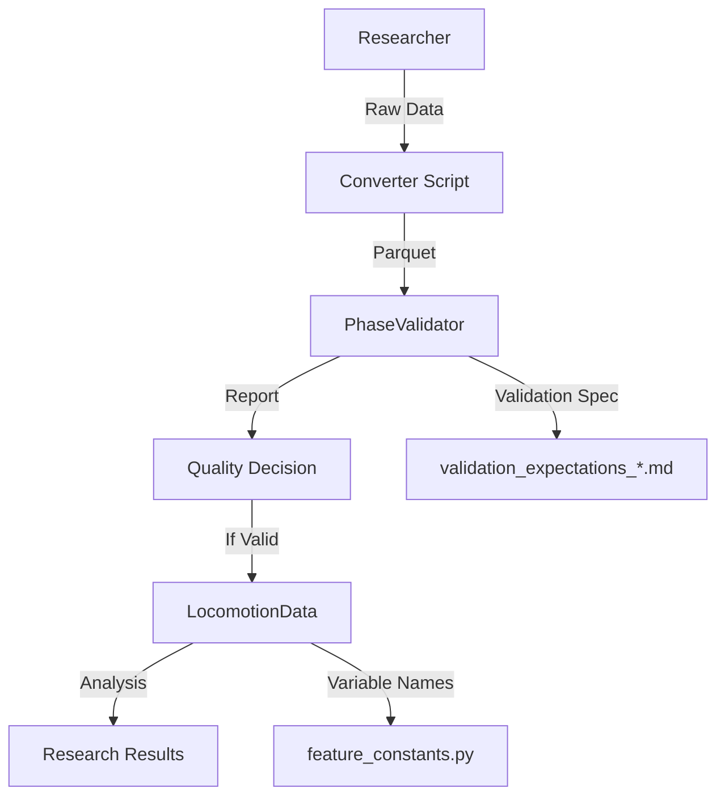

# System Architecture

A practical overview of how the locomotion data system is organized.

## Data Flow Overview


## Directory Structure

```
locomotion-data-standardization/
├── lib/                      # Core libraries
│   ├── core/                 # Data analysis (LocomotionData class)
│   └── validation/           # Quality checks
├── contributor_scripts/      # Dataset converters
│   ├── Gtech_2023/          # Georgia Tech converter
│   ├── Umich_2021/          # UMich converter
│   └── AddBiomechanics/     # OpenSim converter
├── tests/                    # Test suite
├── docs/                     # Documentation
└── converted_datasets/       # Output data (gitignored)
```

## Core Components

### 1. Data Format (Parquet Files)

All data is stored in Apache Parquet format with this structure:

```python
# Phase-indexed data: (n_cycles, 150, n_features)
# - n_cycles: Number of gait cycles
# - 150: Points per gait cycle (0-100% normalized)
# - n_features: Biomechanical variables

# Required columns:
- 'subject_id': Subject identifier
- 'task': Task name (e.g., 'level_walking')
- 'step_id': Unique step identifier
- Variables: 'knee_flexion_angle_ipsi_rad', etc.
```

### 2. LocomotionData Class (`lib/core/locomotion_analysis.py`)

The main interface for working with data:

```python
from lib.core.locomotion_analysis import LocomotionData

# Load data
data = LocomotionData('dataset.parquet')

# Access as 3D array (efficient operations)
knee_angles = data.data_matrix[:, :, data.variable_names.index('knee_flexion_angle_ipsi_rad')]

# Filter by task
walking_data = data.get_task_data('level_walking')
```

### 3. Validation System (`lib/validation/`)

Ensures data quality through biomechanical checks:

```python
from lib.validation.dataset_validator_phase import PhaseValidator

validator = PhaseValidator()
results = validator.validate('dataset.parquet')
# Checks:
# - Sign conventions (flexion/extension directions)
# - Range limits (realistic human values)
# - Cyclic consistency (start ≈ end of cycle)
```

### 4. Feature Constants (`lib/core/feature_constants.py`)

Single source of truth for variable names:

```python
# Standard naming convention:
# <joint>_<motion>_<measurement>_<side>_<unit>

STANDARD_VARIABLES = [
    'knee_flexion_angle_ipsi_rad',      # Knee angle, same side
    'hip_moment_contra_Nm',             # Hip moment, opposite side
    'ankle_power_ipsi_W',               # Ankle power, same side
    # ... 50+ variables
]
```

## Key Design Decisions

### Why Parquet?
- **Efficient**: Columnar storage, fast reads
- **Portable**: Works with Python, MATLAB, R
- **Compressed**: 10x smaller than CSV
- **Schema**: Self-documenting structure

### Why 150 Points Per Cycle?
- **Standard**: Common in biomechanics literature
- **Sufficient**: Captures gait dynamics
- **Efficient**: Consistent array size for analysis
- **Comparable**: Enables cross-subject comparison

### Why This Naming Convention?
- **Unambiguous**: Every variable has one name
- **Searchable**: Easy to find related variables
- **Complete**: Includes all necessary information
- **Consistent**: Same pattern everywhere

## Component Interactions



## Adding New Components

### New Converter
1. Create folder in `contributor_scripts/`
2. Follow existing patterns (see GTech_2023)
3. Output standard parquet format
4. Include README with data source info

### New Validation Check
1. Add to `PhaseValidator` class
2. Update validation expectations markdown
3. Add tests in `tests/`
4. Document the biomechanical reasoning

### New Analysis Method
1. Add to `LocomotionData` class or create new module
2. Follow numpy/scipy patterns for efficiency
3. Include docstring with examples
4. Add unit tests

## Performance Considerations

- **Memory**: LocomotionData uses 3D arrays (100x faster than pandas)
- **Disk**: Parquet files are compressed (~100MB per dataset)
- **CPU**: Validation is the slowest part (~30s per dataset)

## For Deeper Dive

- [C4 Context Diagram](architecture/c4_context.md) - System boundaries
- [C4 Container Diagram](architecture/c4_container.md) - Technical components
- [C4 Component Diagram](architecture/c4_component.md) - Detailed design

## Next: [Common Maintenance Tasks](tasks.md)