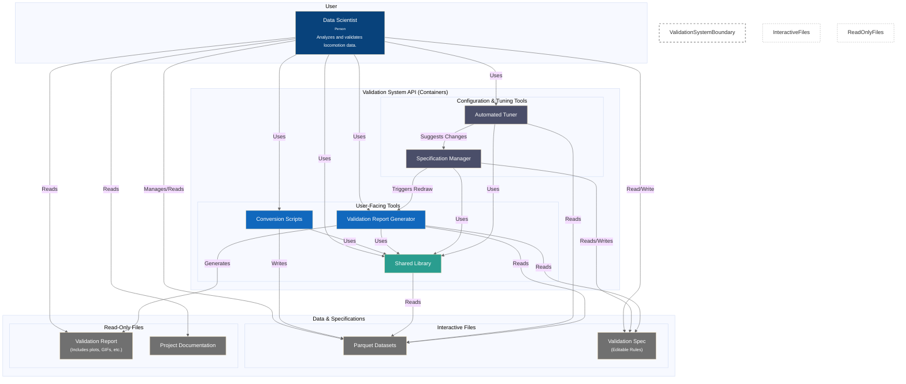

# C4 Container Diagram - Current Implementation

**Current Phase 1 architecture focusing on dataset contributors and validation specialists (10% of user population).**

---



---

## Key Components

### **User-Facing Tools**
- **Conversion Scripts**: Convert raw locomotion data (MATLAB, CSV, B3D) to standardized parquet format
- **Validation Report Generator (validation_dataset_report.py)**: **PRIMARY CONTAINER** - Create comprehensive validation reports with plots and quality metrics
- **Shared Library**: Core LocomotionData library for data loading and manipulation

### **Configuration & Tuning Tools**
- **Specification Manager**: Manage validation rules and biomechanical ranges
- **Automated Tuner**: Optimize validation ranges based on dataset statistics

### **Data Storage**
- **Parquet Datasets**: Quality-assured locomotion datasets in standardized format
- **Validation Spec**: Editable biomechanical validation rules and ranges
- **Validation Report**: Generated quality assessment reports with plots and recommendations
- **Project Documentation**: User guides, tutorials, and technical specifications

---

## Current Implementation Focus

**Target Users**: Dataset contributors, validation specialists, and system administrators (10% of total user population)

**Primary Goals**:
1. **Sign Convention Adherence** - Verify biomechanical data follows standard conventions
2. **Outlier Detection** - Identify strides with values outside acceptable ranges  
3. **Phase Segmentation Validation** - Ensure exactly 150 points per gait cycle

**Success Criteria**: External collaborators can successfully contribute validated datasets that meet quality standards for research use.

---

## Workflow Integration

**validation_dataset_report.py serves as the central validation hub** for all contributor workflows:

### **Container Workflow Mapping**
1. **Dataset Conversion (Sequence 1)**: Conversion Scripts → conversion_generate_phase_dataset.py → **validation_dataset_report.py**
2. **Manual Validation Tuning (Sequence 2A)**: Specification Manager → **validation_dataset_report.py** 
3. **Statistical Validation Tuning (Sequence 2B)**: Automated Tuner → **validation_dataset_report.py**
4. **Quality Assessment (Sequence 3)**: **validation_dataset_report.py** as primary container

### **Validation Data Flow**
```
Raw Data → Conversion Scripts → Parquet Files → validation_dataset_report.py → Quality Reports
Specification Updates → SpecificationManager → validation_dataset_report.py → Updated Validation
```

### **Container Dependencies**
- **All workflows converge** on validation_dataset_report.py for quality assessment
- **Shared Library** provides common data loading and manipulation across all containers
- **Validation specifications** drive the validation logic in the primary container
- **Quality reports** inform both conversion decisions and specification updates