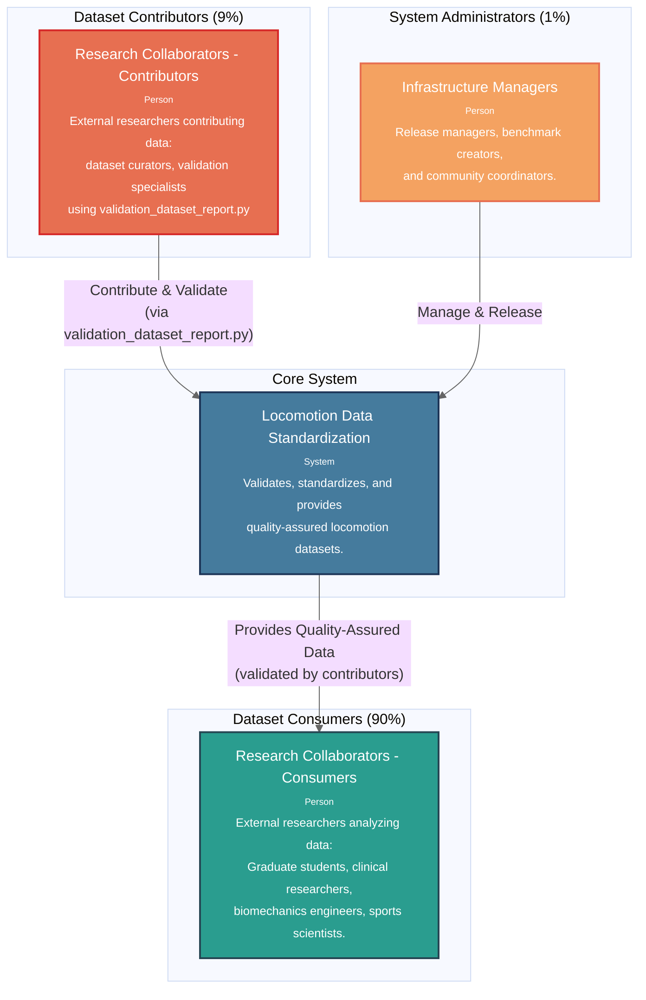
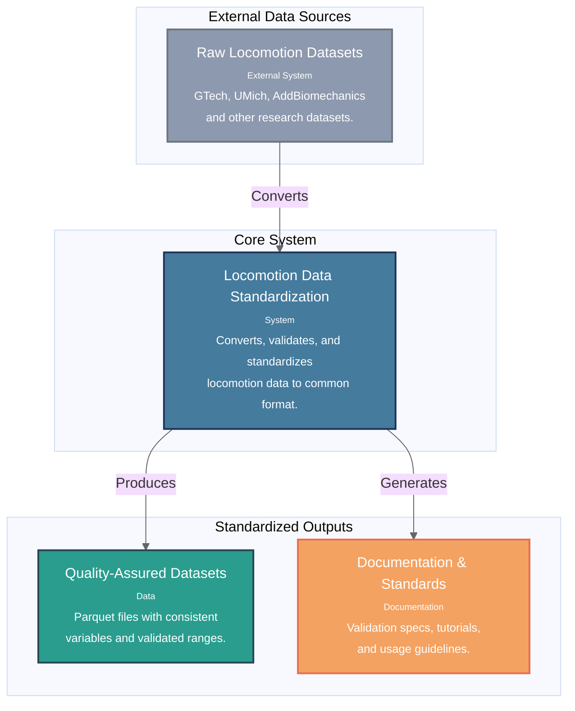
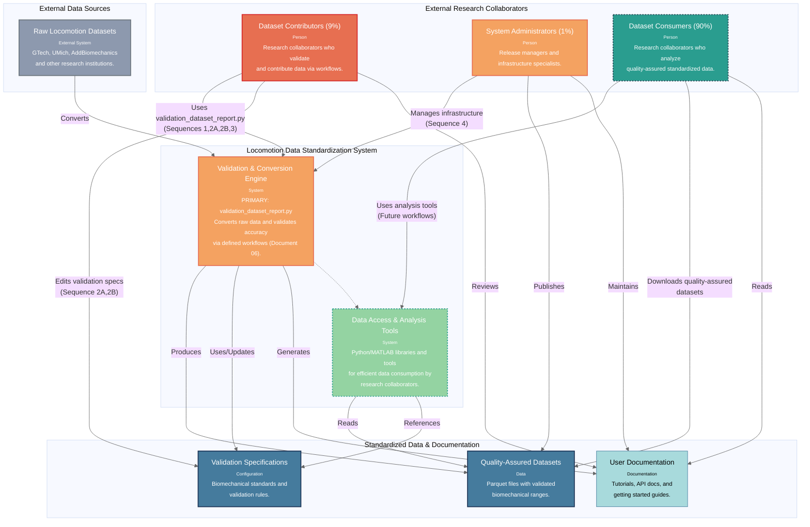

# C4 System Context Diagrams

**Architecture overview showing external users, system boundaries, and key interaction patterns.**

*Navigation: [← Requirements (10)](10_requirements.md) • [User Workflows (06)](06_sequence_workflows.md) • [Container Architecture (12) →](12_c4_container.md) • [Component Architecture (13) →](13_c4_component.md)*

## Architecture Context

This document translates the functional requirements from [Document 10](10_requirements.md) into system context and user interaction patterns. The context architecture directly informs the container design in [Document 12](12_c4_container.md) and component architecture in [Document 13](13_c4_component.md).

**Requirements Implementation**: All context diagrams implement the user workflows from [Document 06](06_sequence_workflows.md) and satisfy the functional requirements F1-F6 from [Document 10](10_requirements.md).

## Requirements Traceability

### Requirements Traceability (from [Document 10](10_requirements.md))

**F1 - Dataset Validation Infrastructure** → Dataset Contributor Workflow (9% users):
- **Primary Tool**: `validation_dataset_report.py` serves [Workflow Sequences 1, 2A, 2B, 3](06_sequence_workflows.md)
- **Context Role**: External research collaborators contribute datasets via comprehensive validation
- **Quality Gate**: Ensures dataset quality for 90% consumer population

**F2 - Validation Specification Management** → Validation Specialist Workflow:
- **Tools**: `validation_manual_tune_spec.py`, `validation_auto_tune_spec.py` from [Sequences 2A, 2B](06_sequence_workflows.md)
- **Context Role**: Expert biomechanics reviewers maintain quality standards
- **Integration**: Direct integration with F1 through ValidationSpecManager

**F3 - Dataset Conversion Scaffolding** → Dataset Contributor Workflow:
- **Tools**: `conversion_generate_phase_dataset.py` from [Sequence 1](06_sequence_workflows.md)
- **Context Role**: Enables dataset creation for validation workflows
- **Supporting Function**: Feeds into F1 primary validation infrastructure

**F6 - Administrative Tools** → System Administrator Workflow (1% users):
- **Future Tools**: Batch processing, release management from [Sequence 4](06_sequence_workflows.md)
- **Context Role**: Infrastructure management and community coordination
- **Timeline**: Phase 2-3 implementation aligned with consumer growth

### Workflow Implementation (from [Document 06](06_sequence_workflows.md))

**Sequence 1 - Dataset Conversion Development**:
- **Context Implementation**: Programmer Dataset Contributor workflow
- **Key Tools**: Conversion scaffolding → `conversion_generate_phase_dataset.py` → `validation_dataset_report.py`
- **Requirements**: Satisfies F3 (conversion scaffolding) and F4 (phase generation)

**Sequences 2A/2B - Validation Specification Management**:
- **Context Implementation**: Validation Specialist workflow
- **Key Tools**: Literature-based (`validation_manual_tune_spec.py`) and statistics-based (`validation_auto_tune_spec.py`) editing
- **Requirements**: Satisfies F2 (specification management) with staging workflow integration

**Sequence 3 - Quality Assessment**:
- **Context Implementation**: Primary Dataset Contributor validation workflow
- **Key Tool**: `validation_dataset_report.py` as cornerstone validation container
- **Requirements**: Core implementation of F1 (validation infrastructure)

**Sequence 4 - Administrative Functions**:
- **Context Implementation**: System Administrator workflow (future)
- **Key Tools**: Batch processing, benchmark creation, release management
- **Requirements**: Future implementation of F6 (administrative tools)

**Workflow Integration Pattern**: All workflows converge on `validation_dataset_report.py` as the primary quality assessment tool, implementing the quality-first architecture strategy from [Document 10](10_requirements.md).

## Role-Based Entry Points

### Dataset Contributor Workflow
*Implements F1 (Dataset Validation Infrastructure) and F3 (Conversion Scaffolding) from [Document 10](10_requirements.md)*
*Primary validation tool user (9% of system usage) serving 90% consumer population*

```mermaid
%%{init: {'theme': 'base'}}%%
graph LR
    DC["🔬 Dataset Contributor<br/><font size='-1'>Research collaborator with raw locomotion data</font>"] 
    
    DC --> CONVERT["📝 conversion_generate_phase_dataset.py<br/><font size='-1'>Convert time to phase data<br/>→ Workflow Sequence 1</font>"]
    DC --> VALIDATE["✅ validation_dataset_report.py<br/><font size='-1'>PRIMARY TOOL: Validate and assess quality<br/>→ Workflow Sequence 3</font>"]
    
    style DC fill:#e76f51,color:white
    style CONVERT fill:#1168bd,color:white
    style VALIDATE fill:#f4b942,color:white
    
    linkStyle default stroke:#666
```

### Validation Specialist Workflow  
*Implements F2 (Validation Specification Management) from [Document 10](10_requirements.md)*
*Expert biomechanics reviewer collaborating on quality standards using [Sequences 2A/2B](06_sequence_workflows.md)*

```mermaid
%%{init: {'theme': 'base'}}%%
graph LR
    VS["⚙️ Validation Specialist<br/><font size='-1'>Research collaborator managing quality standards</font>"]
    
    VS --> MANAGE["📋 validation_manual_tune_spec.py<br/><font size='-1'>Edit validation rules<br/>→ Workflow Sequence 2A</font>"]
    VS --> TUNE["🎯 validation_auto_tune_spec.py<br/><font size='-1'>Optimize validation ranges<br/>→ Workflow Sequence 2B</font>"]
    VS --> COMPARE["📈 validation_compare_datasets.py<br/><font size='-1'>Cross-dataset analysis</font>"]
    VS --> DEBUG["🔍 validation_investigate_errors.py<br/><font size='-1'>Investigate data issues</font>"]
    
    style VS fill:#e76f51,color:white
    style MANAGE fill:#1168bd,color:white
    style TUNE fill:#1168bd,color:white
    style COMPARE fill:#1168bd,color:white
    style DEBUG fill:#1168bd,color:white
    
    linkStyle default stroke:#666
```

### System Administrator Workflow
*Implements F6 (Administrative Tools - Future Phase) from [Document 10](10_requirements.md)*
*Infrastructure management using [Sequence 4](06_sequence_workflows.md) workflows*

```mermaid
%%{init: {'theme': 'base'}}%%
graph LR
    SA["👨‍💼 System Administrator<br/><font size='-1'>I manage releases and benchmarks</font>"]
    
    SA --> BENCHMARK["🏆 create_benchmarks.py<br/><font size='-1'>Create ML train/test splits</font>"]
    SA --> PUBLISH["📦 publish_datasets.py<br/><font size='-1'>Prepare public releases</font>"]
    SA --> BATCH["⚡ validation_dataset_report.py (batch)<br/><font size='-1'>Validate multiple datasets</font>"]
    
    style SA fill:#f4a261,color:white
    style BENCHMARK fill:#1168bd,color:white
    style PUBLISH fill:#1168bd,color:white
    style BATCH fill:#1168bd,color:white
    
    linkStyle default stroke:#666
```

### Dataset Consumer Workflow (Future)
*Benefits from F1-F4 quality infrastructure without requiring validation expertise*
*Primary user base: 90% research collaborators consuming quality-assured standardized data*
*Future implementation: F5 (Dataset Comparison) and consumer-focused tools*

```mermaid
%%{init: {'theme': 'base'}}%%
graph LR
    DC["🎓 Dataset Consumer<br/><font size='-1'>Research collaborator analyzing locomotion data<br/>Graduate students, clinical researchers, etc.</font>"]
    
    DC --> BROWSE["🌐 Web Portal<br/><font size='-1'>Browse available datasets<br/>Quality-assured by validation system</font>"]
    DC --> DOWNLOAD["📥 Data Repository<br/><font size='-1'>Download parquet files<br/>Standardized format guaranteed</font>"]
    DC --> PYTHON["🐍 Python Library<br/><font size='-1'>LocomotionData class<br/>→ Future workflow development</font>"]
    DC --> MATLAB["📊 MATLAB Tools<br/><font size='-1'>Native MATLAB integration<br/>→ Future workflow development</font>"]
    
    style DC fill:#2a9d8f,color:white,stroke-dasharray:3
    style BROWSE fill:#6baed6,color:white,stroke-dasharray:3
    style DOWNLOAD fill:#6baed6,color:white,stroke-dasharray:3
    style PYTHON fill:#6baed6,color:white,stroke-dasharray:3
    style MATLAB fill:#6baed6,color:white,stroke-dasharray:3
    
    linkStyle default stroke:#666,stroke-dasharray:3
```

**Legend**: 
- **Solid lines** = Current implementation focus (Contributors/Specialists/Administrators)
- **Dashed lines** = Future development (Consumers - 90% user base)
- **Yellow highlight** = Primary validation tool (validation_dataset_report.py)

**Context**: External research collaborators interact with the system through defined workflows ([Document 06](06_sequence_workflows.md)), with `validation_dataset_report.py` serving as the primary quality assessment tool implementing F1 requirements from [Document 10](10_requirements.md). This quality-first approach ensures dataset reliability for the 90% consumer population.

**Container Architecture Flow**: These context patterns directly inform the container design in [Document 12](12_c4_container.md), where each user workflow maps to specific container groups and interaction patterns.

---

## System Context Levels

*Multiple context perspectives for different stakeholder communication needs*

### Level 1A: Simple User Split

**Use Case**: Stakeholder communication and high-level system overview  
**Context**: Shows how external research collaborators engage as both contributors (9%) and consumers (90%) with validation_dataset_report.py as the primary quality gate.

---

## Level 1B: Data Flow Focus

**Use Case**: Technical understanding and data transformation explanation  
**Context**: Emphasizes the validation system's role in ensuring data quality for external research collaborators consuming standardized datasets.

---

## Level 1C: Intermediate Detail

**Use Case**: Architecture planning and detailed system understanding  
**Context**: Shows detailed interactions between external research collaborators and system components, highlighting validation_dataset_report.py as the primary tool and the connection to defined workflows in Document 06.

---

## Context Diagram Usage Guide

### **Level 1A: Simple User Split**
- **Best For**: Executive summaries, grant proposals, stakeholder presentations
- **Shows**: Clear 90/10 user population and basic system value
- **Audience**: Non-technical stakeholders, funding bodies, project sponsors

### **Level 1B: Data Flow Focus** 
- **Best For**: Technical documentation, system integration planning
- **Shows**: What the system does (data transformation) without user complexity
- **Audience**: Technical teams, system architects, data engineers

### **Level 1C: Intermediate Detail**
- **Best For**: Development planning, architecture discussions, team alignment
- **Shows**: System components, user interactions, and development priorities
- **Audience**: Development teams, product managers, technical leads

### **Development Priority Visualization**
- **Solid lines + full color**: Current development focus (contributors, validation engine)
- **Dashed lines + muted color**: Future development focus (consumers, analysis tools)
- **Quality bridge**: How validation ensures consumer confidence behind the scenes

## Strategic Approach

**Phase 1**: Build robust contributor tools (validation engine) to ensure high-quality datasets  
*Focus: External research collaborators contributing data via validation_dataset_report.py*

**Phase 2**: Develop consumer experience (analysis tools) using proven foundation  
*Focus: External research collaborators (90% user base) consuming quality-assured data*

**Quality Bridge**: The validation system ensures dataset quality behind the scenes, enabling consumer confidence without requiring validation expertise from end users.

## External User Context

**Research Collaborators** represent the primary external user base:
- **Contributors (9%)**: Researchers from institutions like GTech, UMich, AddBiomechanics who contribute datasets
- **Consumers (90%)**: Graduate students, clinical researchers, biomechanics engineers, sports scientists
- **Interaction Pattern**: Contributors use defined workflows (Document 06) with validation_dataset_report.py as the primary tool to ensure quality for consumers

**Requirements Implementation**: All external user interactions implement functional requirements F1-F6 from [Document 10](10_requirements.md) through specific workflows from [Document 06](06_sequence_workflows.md). The quality-first architecture strategy ensures contributor validation (10% users) enables consumer confidence (90% users).

**Architecture Flow**: Context → [Container (12)](12_c4_container.md) → [Component (13)](13_c4_component.md) → Implementation (14), with each level maintaining traceability to requirements and workflows.

**Primary Tool Emphasis**: `validation_dataset_report.py` appears as the central tool across all context diagrams, implementing the core validation infrastructure (F1) that enables all other system functions.