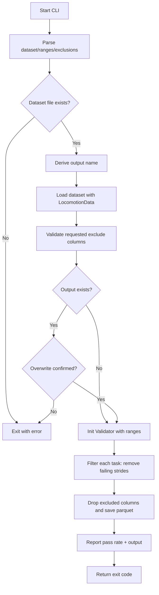
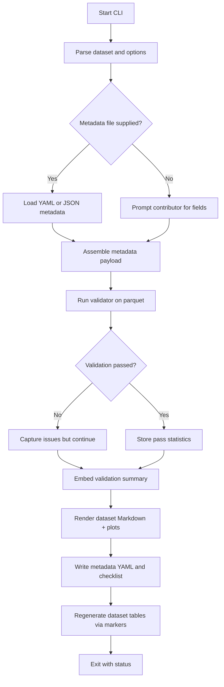
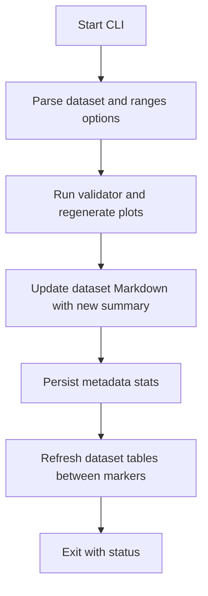
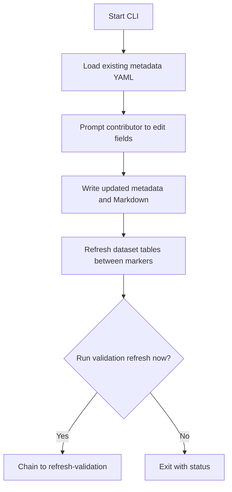
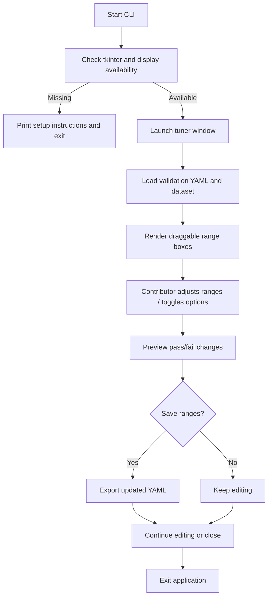
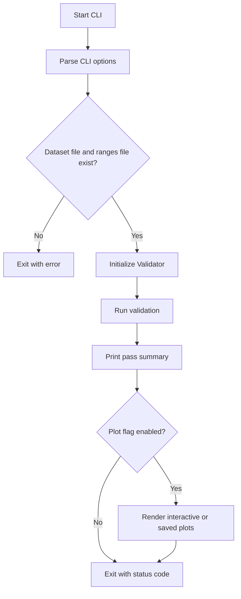

# Maintainers

Essential commands and paths for day‑to‑day maintenance.

## Do This

### Review Dataset Submissions
Contributors now submit complete packages with documentation. Your role:

1. **Review PR contents**:
   - ✅ Dataset parquet file in `converted_datasets/`
   - ✅ Documentation in `docs/datasets/`
   - ✅ Conversion script in `contributor_tools/conversion_scripts/`

2. **Check validation results**:
   - Review validation pass rates in documentation
   - Ensure ≥80% pass rate or justified exceptions
   - Check for appropriate task coverage

3. **Verify metadata**:
   - Short code is unique
   - Institution and citation provided
   - Subject count and tasks documented

4. **Merge if complete**:
   - All files present
   - Validation acceptable
   - Documentation complete

### Quick Validation Tools
- Test dataset: `python contributor_tools/quick_validation_check.py <dataset_phase.parquet>`
- Filter strides: `python contributor_tools/create_filtered_dataset.py <dataset_phase.parquet>`
- Serve docs locally: `mkdocs serve`

## Where Things Are

- Converters: `contributor_tools/conversion_scripts/`
- Outputs: `converted_datasets/`
- Validation engine: `internal/validation_engine/validator.py`
- Validation ranges: `contributor_tools/validation_ranges/`
- Python API: `user_libs/python/locomotion_data.py`

## Workflows

### Standard PR Review Flow
1. **Contributor submits PR** with dataset + documentation
2. **Review submission** - Check files, validation, metadata
3. **Request changes** if needed (missing info, low validation)  
4. **Merge when ready** - Documentation is already complete!

### Maintenance Tasks
- **Update validation ranges**: Edit YAML → have contributors re-run validation
- **Add new variables**: Update `feature_constants.py` → update converters
- **Fix documentation**: Direct edits to `docs/datasets/*.md` files
- **Archive datasets**: Move old docs to `archived/` subdirectory


## Contributor Tools at a Glance

Quick references for the contributor-facing scripts maintainers should recognize, including the unified submission workflow.

<details>
<summary>`create_filtered_dataset.py` — Filters stride data using the validation engine and writes a cleaned parquet copy.</summary>



</details>

<details>
<summary>`prepare_dataset_submission.py` — Unified contributor workflow for validation, plots, and documentation.</summary>

Generates or refreshes everything a contributor needs for a dataset page. The script derives a dataset slug from the parquet file name, stores metadata in `docs/datasets/_metadata/`, writes the Markdown page, and rebuilds the dataset tables that live between the `<!-- DATASET_TABLE_START -->` / `<!-- DATASET_TABLE_END -->` markers in `README.md`, `docs/index.md`, and `docs/datasets/index.md`. Those tables are regenerated from the metadata directory so the public landing pages always list the newest datasets with consistent links.

<details>
<summary>`add-dataset` subcommand</summary>

Primary entry point today. Collects metadata (prompts or file), runs validation, writes dataset docs, persists metadata YAML, regenerates tables, and outputs the submission checklist.



</details>

<details>
<summary>`refresh-validation` subcommand</summary>

Planned follow-up flow for when contributors need to rerun validation after adjusting converters or ranges. Would skip metadata prompts, rebuild plots, update summaries, and refresh tables using the existing metadata.



</details>

<details>
<summary>`edit-metadata` subcommand</summary>

Intended fast path for metadata-only tweaks. Loads the existing YAML, lets contributors edit fields, saves updates, and offers to chain directly into a validation refresh if data quality changed.



</details>

</details>

<details>
<summary>`interactive_validation_tuner.py` — GUI tool for hands-on validation range tuning.</summary>

Helps contributors diagnose failing variables and author custom range YAMLs. Requires tkinter/display support; useful when datasets target special populations and need bespoke envelopes before re-running `add-dataset`.



</details>

<details>
<summary>`quick_validation_check.py` — Fast validator that prints stride pass rates with optional plot rendering.</summary>



</details>


## Environment

```bash
python -m venv .venv && source .venv/bin/activate  # Windows: .venv\Scripts\activate
pip install -r requirements.txt
```
