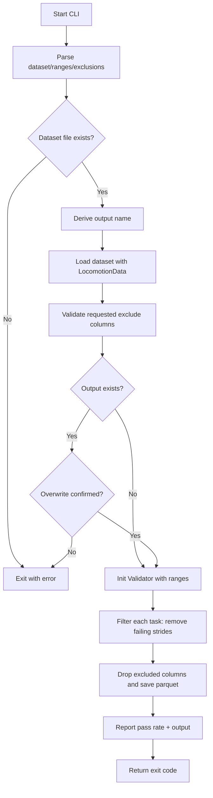
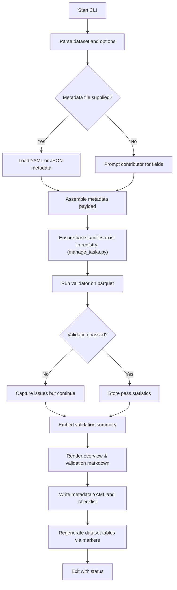
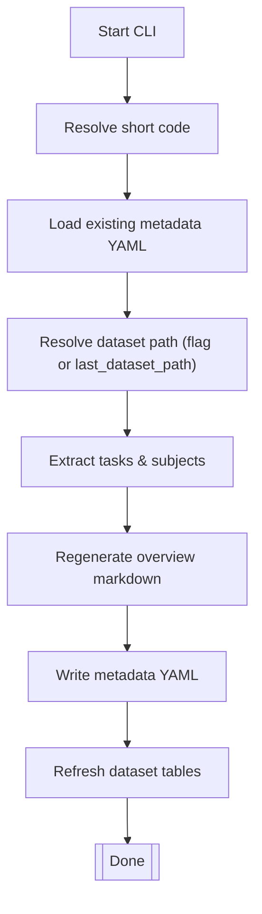
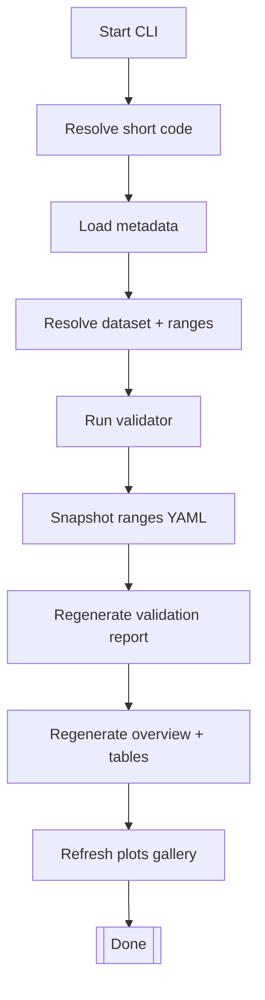
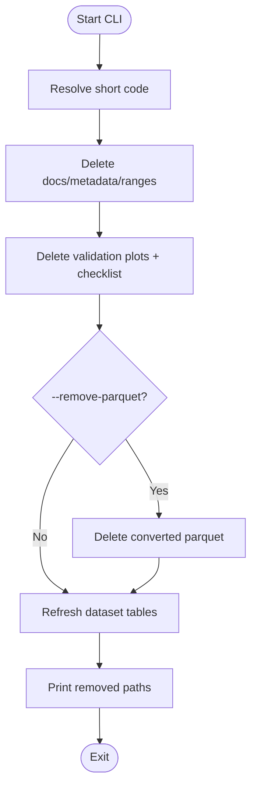
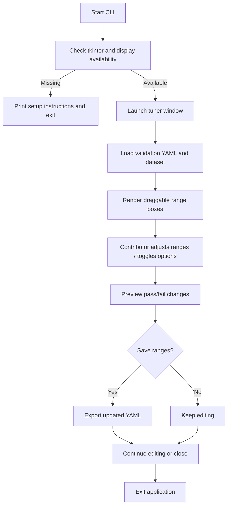
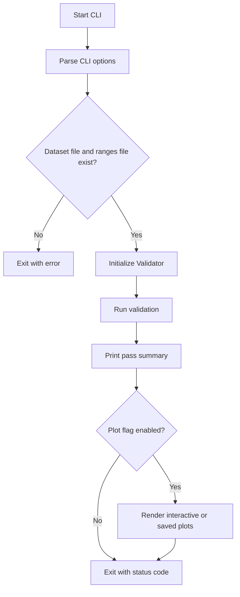
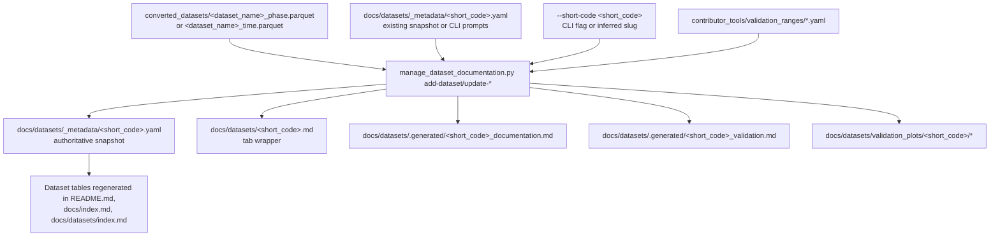

# Maintainers

Essential commands and paths for day‑to‑day maintenance.

## Do This

### Review Dataset Submissions
Contributors now submit complete packages with documentation. Your role:

1. **Review PR contents**:
   - ✅ Dataset parquet file in `converted_datasets/`
   - ✅ Documentation in `docs/datasets/`
   - ✅ Conversion script in `contributor_tools/conversion_scripts/`

2. **Check validation results**:
   - Review validation pass rates in documentation and call out large drops between raw vs. clean strides
   - Confirm contributors explain persistent violations or intentional exclusions
   - Check for appropriate task coverage

3. **Verify metadata**:
   - Short code is unique
   - Institution and citation provided
   - Subject count and tasks documented

4. **Merge if complete**:
   - All files present
   - Validation acceptable
   - Documentation complete

### Quick Validation Tools
- Test dataset: `python contributor_tools/quick_validation_check.py <dataset_phase.parquet>`
- Filter strides: `python contributor_tools/create_clean_dataset.py <dataset_phase.parquet>`
- Serve docs locally: `mkdocs serve`

## Validation Checks

### Validation Range Schema

All phase-indexed validators consume YAML files that mirror this structure:

```yaml
version: "2.0"
generated: "YYYY-MM-DD HH:MM:SS"
description: Optional free-form text
tasks:
  task_name:
    metadata: {}               # optional, reserved for future keys
    phases:
      0:                       # phase percentage as integer 0–100
        hip_flexion_angle_ipsi_rad:
          min: -0.25
          max: 1.05
        hip_flexion_angle_contra_rad:
          min: -0.30
          max: 0.95
      50:
        vertical_grf_ipsi_BW:
          min: 0.0
          max: 1.4
```

Key points:

- **Phase Keys** are integers; loaders coerce numeric strings but reject anything outside 0–100.
- **Variables** are stored exactly as used downstream (both `_ipsi` and `_contra` entries are explicit).
- **Ranges** are simple `min`/`max` floats; missing values should be omitted entirely instead of set to `null`.
- `metadata` is optional and currently unused, but preserved verbatim so future per-task flags can be added without code changes.

`ValidationConfigManager` simply deep-copies this schema—there is no automatic contralateral generation anymore. Update both limbs directly whenever ranges need to diverge.

### Phase-Indexed Data

Maintainers expect every 150-sample stride to satisfy the phase-based validator:

- **Envelope Match**: Each feature must stay inside the normative range YAML (mean ± tolerance) across the full 0–100% phase. Outliers mark stride/feature failures.
- **Event Alignment**: Heel-strike / toe-off event timestamps should align with the standard template (within ±5% phase). Large shifts imply bad segmentation or mislabeled leading limb.
- **Cycle Sanity**: Basic stats (peak knee flexion, ankle dorsiflexion timing, stride duration) are cross-checked against dataset metadata. Values outside physiological windows flag either unit errors or incorrect phase normalization.
- **Symmetry Spot-Checks**: For bilateral features, ipsi/contra differences beyond configured thresholds highlight swapped limbs or sign inversions before envelope comparisons even run.

Use the validator report (and `interactive_validation_tuner.py` when needed) to adjust ranges or request converter fixes.

### Time-Indexed Data

Episodes that remain in time space (non-cyclic tasks) run a lightweight structural suite aimed at catching systemic issues:

- **Baseline Offset Audit**: Identify quasi-static frames (e.g., first 0.5 s) and require velocities/accelerations to average ~0, vertical acceleration near 1 g. Flags zeroing and bias problems.
- **Derivative/Product Consistency**: Integrate angular velocity back to the recorded angle (after high-pass filtering) and verify `power ≈ moment × angular_velocity`. Divergence indicates sign flips or scaling errors.
- **Cross-Limb Correlation**: Normalize episode duration to [0,1] and cross-correlate ipsi vs. contra channels; the peak must appear within a small lag window. Large shifts expose segmentation offsets or swapped sides.
- **Physiologic Guardrails**: Enforce simple min/max bounds per joint, moment, and GRF so inverted channels fail quickly (e.g., knee flexion −20° to 160°, ankle moment ±3 Nm/kg).

Failing these checks should prompt maintainers to request converter fixes before accepting a time-indexed dataset.

Time-series thresholds live in `contributor_tools/validation_ranges/time_structural.yaml`. Maintainers can tune tolerances (baseline window, correlation targets, guardrail ranges) without touching code. The quick validation CLI now reports whether a dataset was validated in phase or time mode and summarises structural issues per task. Plot generation remains phase-only; time datasets surface textual diagnostics instead.

## Where Things Are

- Converters: `contributor_tools/conversion_scripts/`
- Outputs: `converted_datasets/`
- Validation engine: `internal/validation_engine/validator.py`
- Validation ranges: `contributor_tools/validation_ranges/`
- Maintainer note: all tooling (`interactive_validation_tuner.py`,
  `quick_validation_check.py`, and `manage_dataset_documentation.py`) now calls the
  shared `Validator` backend. Adjust validation rules or range loading logic in one
  place and every workflow (GUI, CLI, doc generation) stays in sync.
- Python API: `src/locohub/locomotion_data.py`

## Workflows

### Standard PR Review Flow
1. **Contributor submits PR** with dataset + documentation
2. **Review submission** - Check files, validation, metadata
3. **Request changes** if needed (missing info, low validation)  
4. **Merge when ready** - Documentation is already complete!

### Maintenance Tasks
- **Update validation ranges**: Edit YAML → have contributors re-run validation
- **Add new variables**: Update `feature_constants.py` → update converters
- **Fix documentation**: Direct edits to `docs/datasets/*.md` files
- **Archive datasets**: Move old docs to `archived/` subdirectory


### PyPI Release Checklist
1. **Bump version** in both `pyproject.toml` and `src/locohub/__init__.py`.
2. **Update changelog/notes** (e.g., `docs/maintainers/index.md` or release draft).
3. **Clean previous builds**: `rm -rf dist src/locohub.egg-info`.
4. **Build artifacts**:
   - `python -m build` (make sure `wheel` is installed; add `--no-isolation` if you already have the build dependencies locally).
5. **Verify metadata**: `python -m twine check dist/*`.
6. **Smoke test** in a fresh environment:
   ```bash
   python -m venv .venv-release
   . .venv-release/bin/activate
   pip install --upgrade pip
   pip install dist/locohub-<version>.whl
   python -c "import locohub; print(locohub.__version__)"
   deactivate
   ```
7. **TestPyPI dry run**:
   ```bash
   python -m twine upload --repository testpypi dist/*
   pip install --index-url https://test.pypi.org/simple/ locohub==<version>
   ```
8. **Publish to PyPI** once the smoke test passes: `python -m twine upload dist/*`.
9. **Tag and announce**: push the git tag, update documentation (`README.md`, release notes), and notify contributors.


## Contributor Tools at a Glance

Quick references for the contributor-facing scripts maintainers should recognize, including the unified submission workflow.

<details>
<summary>`create_clean_dataset.py` — Filters stride data using the validation engine and writes a cleaned parquet copy.</summary>



</details>

<details>
<summary>`manage_dataset_documentation.py` — Unified contributor workflow for validation, plots, and documentation.</summary>

Generates or refreshes everything a contributor needs for a dataset page. The script derives a dataset slug from the parquet file name, stores metadata in `docs/datasets/_metadata/`, writes the tab wrapper (`<slug>.md`) plus the underlying snippets (`_generated/<slug>_documentation.md` and `_generated/<slug>_validation.md`), and rebuilds the dataset tables that live between the `<!-- DATASET_TABLE_START -->` / `<!-- DATASET_TABLE_END -->` markers in `README.md`, `docs/index.md`, and `docs/datasets/index.md`. Those tables are regenerated from the metadata directory so the public landing pages always list the newest datasets with consistent links.

<details>
<summary>`add-dataset` subcommand</summary>

Primary entry point today. Collects metadata (prompts or file), runs validation, writes dataset docs, persists metadata YAML, regenerates tables, and outputs the submission checklist.

Use `python contributor_tools/manage_tasks.py` when a contributor proposes a brand-new base family. Pathology suffixes (e.g., `_stroke`, `_pd`) rely on naming convention instead—have them clone the base ranges in the interactive tuner, save a cohort-specific YAML, and remind them that validators never fall back to the able-bodied envelopes.



</details>

<details>
<summary>`update-documentation` subcommand</summary>

Fast path to refresh the overview markdown and metadata from the latest parquet without rerunning validation. Loads the stored YAML (or an override), re-extracts tasks/subjects, prompts you with the current values (press Enter to keep), rewrites `docs/datasets/<slug>.md`, and updates the global dataset tables.



**Command:**

```bash
python contributor_tools/manage_dataset_documentation.py update-documentation \
    --short-code UM21 [--dataset converted_datasets/umich_2021_phase_dirty.parquet]
```

</details>

<details>
<summary>`update-validation` subcommand</summary>

Runs validation again, snapshots the active ranges into the dataset folder, rebuilds the validation report, and refreshes plots. Also rewrites the overview page so pass-rate badges stay current.



**Command:**

```bash
python contributor_tools/manage_dataset_documentation.py update-validation \
    --short-code UM21 [--dataset converted_datasets/umich_2021_phase_dirty.parquet]
```

</details>

<details>
<summary>`remove-dataset` subcommand</summary>

Destructive cleanup. Deletes overview + validation markdown, metadata YAML, validation plots, the ranges snapshot, and the submission checklist so the dataset can be rebuilt from scratch. Optional flag also removes converted parquet files.



**Command:**

```bash
python contributor_tools/manage_dataset_documentation.py remove-dataset \
    --short-code UM21 [--remove-parquet]
```

</details>

</details>

<details>
<summary>`interactive_validation_tuner.py` — GUI tool for hands-on validation range tuning.</summary>

Helps contributors diagnose failing variables and author custom range YAMLs. Requires tkinter/display support; useful when datasets target special populations and need bespoke envelopes before re-running `add-dataset`.



</details>

<details>
<summary>`quick_validation_check.py` — Fast validator that prints stride pass rates with optional plot rendering.</summary>



</details>


## Dataset Documentation Pipeline

Maintainers never hand-edit the generated dataset pages. Everything flows from a small set of source files that the CLI assembles into the published Markdown and assets.



Key touch points:

- Dataset content comes from the parquet the CLI reads. Point `--dataset` at the clean phase file when possible; the tool falls back to `_clean`, `_raw`, or `_dirty` variants when needed.
- `docs/datasets/_metadata/<short_code>.yaml` is the single source of truth for display text, validation stats, download links, and range references. Edit this file (or pass `--metadata-file`) rather than changing the generated Markdown.
- The `_generated` Markdown files are regenerated on every run. To change wording, update the metadata values or adjust the rendering helpers inside the CLI.
- `docs/datasets/<short_code>.md` only embeds the generated snippets. If it diverges from the template it will be rewritten the next time the CLI runs.
- `update-documentation` refreshes metadata-driven text without re-running validation; `update-validation` triggers validation, snapshots ranges, and overwrites plots under `docs/datasets/validation_plots/<short_code>/`.
- Use `remove-dataset` when you need to wipe the generated files before re-adding a dataset; this leaves the parquet in place unless `--remove-parquet` is supplied.
- The `--short-code` flag feeds the `<short_code>` placeholders; when omitted, the CLI infers it from the parquet stem or existing metadata snapshot.

## Documentation Website Architecture

Everything on the public site is generated from a small collection of source folders:

```
docs/
├── datasets/
│   ├── _generated/            # Snippet bodies for docs + validation tabs
│   ├── _metadata/             # YAML snapshots driving tables & cards
│   ├── validation_plots/      # Latest validation images + index.md per dataset
│   └── <dataset>.md           # Tab wrapper embedding documentation & validation snippets
├── maintainers/               # Maintainer handbook (this page)
├── reference/                 # Data standard spec and units
├── contributing/              # Contributor step-by-step guide
└── index.md                   # Homepage (contains dataset table markers)
```

Key mechanics to remember:
- MkDocs reads `mkdocs.yml`, which pulls in `docs/` and enables the `mermaid2` plugin for diagrams.
- `manage_dataset_documentation.py add-dataset` is the authoritative writer. It:
  1. Loads or prompts for metadata and writes `docs/datasets/_metadata/<slug>.yaml`.
  2. Runs validation, storing summary text and stats in the metadata dict.
  3. Renders `docs/datasets/<slug>.md` (tab wrapper) plus `_generated/<slug>_documentation.md` and `_generated/<slug>_validation.md` (snippet bodies consumed by the wrapper tabs).
  4. Regenerates the dataset tables inside the marker pairs (`<!-- DATASET_TABLE_START -->` / `<!-- DATASET_TABLE_END -->`) in `README.md`, `docs/index.md`, and `docs/datasets/index.md`.
  5. Writes `docs/datasets/validation_plots/<slug>/` (images plus `index.md`). Only the most recent plots are kept; git history provides older versions.
- The dataset tables now expose a single documentation link (covering both tabs) alongside clean/full dataset download links.
- Running `mkdocs serve` or `mkdocs build` does not invoke regeneration—it only renders the already-generated Markdown.
- If you hand-edit generated Markdown, mirror the change in the metadata or template; the next `add-dataset` run will otherwise overwrite it.

## Environment

```bash
python -m venv .venv && source .venv/bin/activate  # Windows: .venv\Scripts\activate
pip install -r requirements.txt
```
