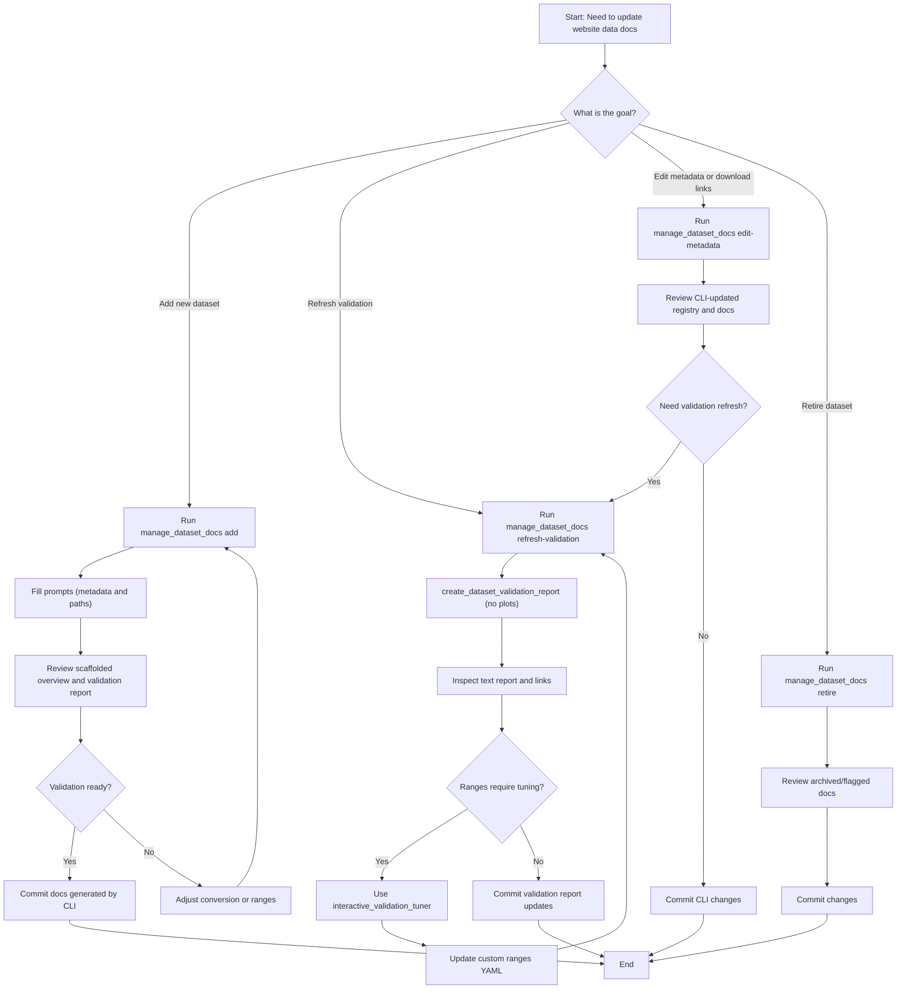

# Website Management Flow

Use this flow as a quick reference before editing dataset documentation. The CLI prompts for metadata and updates the registry automatically—no manual YAML edits required.
