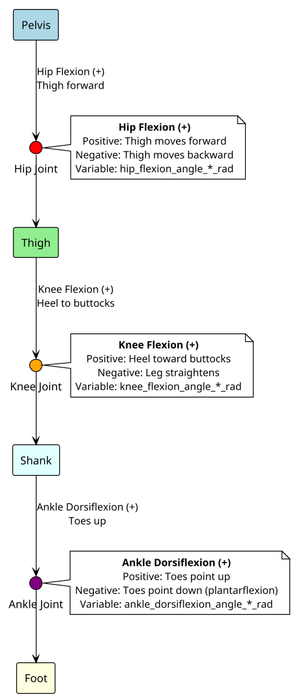
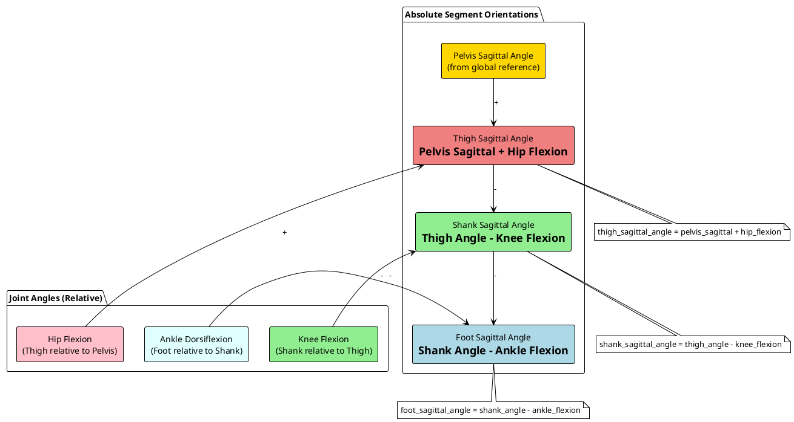
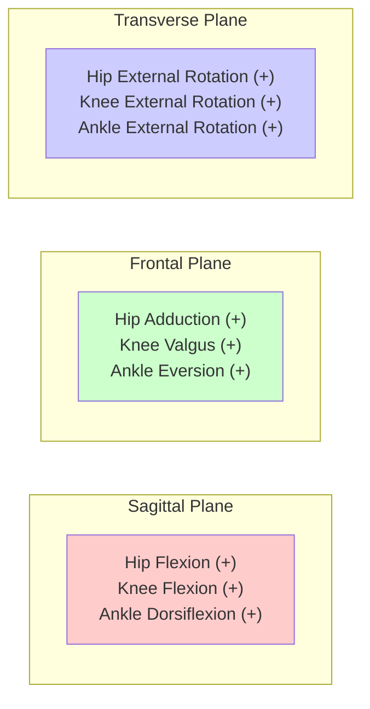
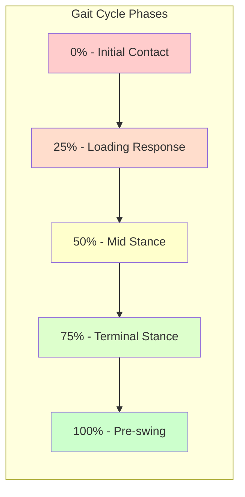

# Joint and Link Angle Conventions Diagram

This document provides visual representations of the joint and link angle conventions used in the locomotion data standardization framework.

## Coordinate System Reference

```plantuml
@startuml
!theme plain
skinparam backgroundColor white
skinparam defaultTextAlignment center

' Coordinate system
circle "Origin" as O #lightgray
O -right-> "+X\n(Anterior)" as X #red
O -up-> "+Y\n(Superior)" as Y #green  
O -down-> "+Z\n(Right)" as Z #blue

note right of X : Forward direction
note above of Y : Upward direction
note below of Z : Rightward direction

@enduml
```

**OpenSim Convention**: X = Anterior+, Y = Superior+, Z = Right+

## Sagittal Plane Joint Angles (Right Leg)



## Link/Segment Angle Relationships



## Biomechanical Sign Conventions

### Joint Angles (Sagittal Plane)

| Joint | Positive Direction | Negative Direction | Variable Name |
|-------|-------------------|-------------------|---------------|
| **Hip** | Flexion (thigh forward) | Extension (thigh back) | `hip_flexion_angle_*_rad` |
| **Knee** | Flexion (heel to buttocks) | Extension (straight leg) | `knee_flexion_angle_*_rad` |
| **Ankle** | Dorsiflexion (toes up) | Plantarflexion (toes down) | `ankle_dorsiflexion_angle_*_rad` |

### Segment Angles (Absolute Orientations)

| Segment | Plane | Description | Variable Name |
|---------|-------|-------------|---------------|
| **Pelvis** | Sagittal | Anterior/posterior tilt | `pelvis_sagittal_angle_rad` |
| **Pelvis** | Frontal | Lateral tilt (obliquity) | `pelvis_frontal_angle_rad` |
| **Pelvis** | Transverse | Axial rotation | `pelvis_transverse_angle_rad` |
| **Trunk** | Sagittal | Forward/backward lean | `trunk_sagittal_angle_rad` |
| **Trunk** | Frontal | Lateral bend | `trunk_frontal_angle_rad` |
| **Trunk** | Transverse | Axial rotation | `trunk_transverse_angle_rad` |
| **Thigh** | Sagittal | Absolute thigh orientation | `thigh_sagittal_angle_*_rad` |
| **Shank** | Sagittal | Absolute shank orientation | `shank_sagittal_angle_*_rad` |
| **Foot** | Sagittal | Foot orientation | `foot_sagittal_angle_*_rad` |

**Note**: Segment angles use anatomical plane naming convention:
- **Sagittal plane**: Flexion/extension movements (forward/backward)
- **Frontal plane**: Abduction/adduction movements (side-to-side)
- **Transverse plane**: Rotation movements (for long bones, this is axial rotation)

## Multi-Plane Angle Conventions



## Moment Sign Conventions

### Joint Moments (Net Internal Moments)

| Joint | Positive Moment | Biomechanical Meaning |
|-------|----------------|----------------------|
| **Hip** | Flexor moment | Hip flexors active |
| **Knee** | Extensor moment | Knee extensors active (typical in stance) |
| **Ankle** | Dorsiflexor moment | Dorsiflexors active |

**Note**: During walking, knee extensor moments are typically positive in stance phase to support body weight.

## Phase Relationships (Gait)



**Contralateral Offset**: Contralateral limb data is shifted by 50% of gait cycle (75 time points for 150-point cycles).

---

*These conventions align with OpenSim standards and biomechanical research practices.*