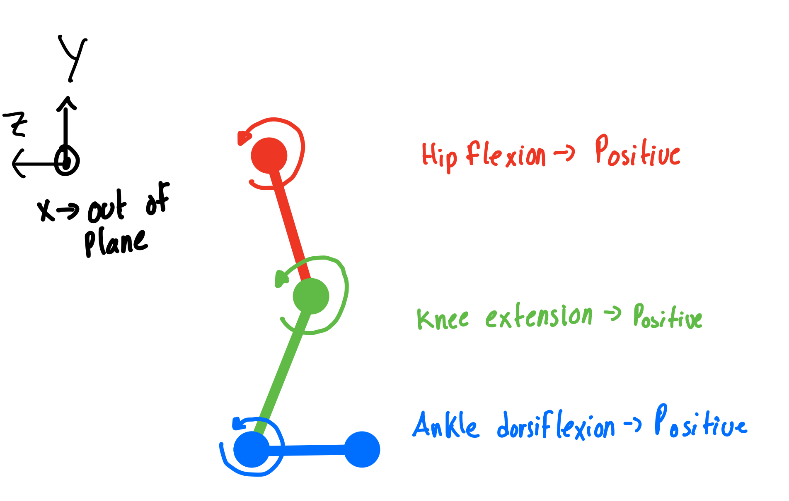
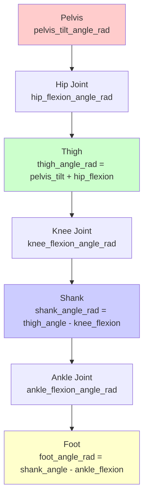

# Link and Segment Angle Conventions

This document defines the mathematical relationships between joint angles and segment angles used in the locomotion data standardization framework.

## Overview

Segment angles (also called link angles) describe the absolute orientation of body segments in space, while joint angles describe the relative rotation between adjacent segments. Understanding these relationships is crucial for biomechanical analysis and data conversion.

## Coordinate System

All angles follow the OpenSim convention:
- **X-axis**: Anterior (forward) positive
- **Y-axis**: Superior (upward) positive  
- **Z-axis**: Right positive
- **Positive rotations**: Follow right-hand rule

Reference: 

## Segment Angle Definitions

### Mathematical Relationships

Segment angles are calculated from proximal segment angles and joint angles using the following relationships:

```
pelvis_angle = absolute pelvis orientation (from motion capture)
thigh_angle = pelvis_tilt_angle + hip_flexion_angle
shank_angle = thigh_angle - knee_flexion_angle  
foot_angle = shank_angle - ankle_flexion_angle
```

### Segment Chain Diagram



## Angle Sign Conventions

### Sagittal Plane (Flexion/Extension)
- **Pelvis Tilt**: Positive = anterior tilt
- **Hip Flexion**: Positive = flexion (thigh forward)
- **Knee Flexion**: Positive = flexion (heel toward buttocks)
- **Ankle Flexion**: Positive = dorsiflexion (toes up)

### Frontal Plane (Adduction/Abduction)
- **Pelvis Obliquity**: Positive = right side up
- **Hip Adduction**: Positive = adduction (toward midline)
- **Knee Varus/Valgus**: Positive = valgus (knee inward)
- **Ankle Inversion/Eversion**: Positive = inversion (sole inward)

### Transverse Plane (Internal/External Rotation)
- **Pelvis Rotation**: Positive = right side forward
- **Hip Rotation**: Positive = external rotation
- **Knee Rotation**: Positive = external rotation
- **Ankle Rotation**: Positive = external rotation

## Available Segment Angles

### Direct Measurements (from motion capture)
- `pelvis_tilt_angle_rad` - Pelvis anterior/posterior tilt
- `pelvis_obliquity_angle_rad` - Pelvis frontal plane tilt
- `pelvis_rotation_angle_rad` - Pelvis transverse plane rotation
- `foot_angle_ipsi_rad` - Foot progression angle (ipsilateral)
- `foot_angle_contra_rad` - Foot progression angle (contralateral)

### Calculated Segments
- `trunk_flexion_angle_rad` - Trunk flexion (if available from motion capture)
- `trunk_lateral_angle_rad` - Trunk lateral flexion
- `trunk_rotation_angle_rad` - Trunk rotation
- `thigh_angle_ipsi_rad` - Thigh segment angle (calculated)
- `thigh_angle_contra_rad` - Thigh segment angle (calculated)
- `shank_angle_ipsi_rad` - Shank segment angle (calculated)
- `shank_angle_contra_rad` - Shank segment angle (calculated)

## Implementation Notes

### Calculation Order
1. Extract pelvis angles directly from motion capture data
2. Extract foot angles from foot progression data
3. Calculate thigh angles: `thigh = pelvis_tilt + hip_flexion`
4. Calculate shank angles: `shank = thigh - knee_flexion`
5. Apply ipsilateral/contralateral naming conventions
6. Apply phase shifting for gait cycle alignment

### Dataset Variations
- Some datasets may not include all segment measurements
- Trunk angles require additional markers/segments in motion capture
- Missing segments should be documented in dataset conversion scripts

### Validation Ranges
Segment angles have different physiological ranges than joint angles:
- **Segment angles**: Often larger ranges due to cumulative effects
- **Joint angles**: More constrained by anatomical limits
- Validation ranges should be dataset-specific and empirically derived

## References

1. OpenSim Documentation: Coordinate Systems and Joint Conventions
2. Winter, D.A. "Biomechanics and Motor Control of Human Movement" (4th Edition)
3. Robertson, D.G.E. et al. "Research Methods in Biomechanics" (2nd Edition)

---

*This documentation ensures consistent implementation of segment angle calculations across all dataset conversion scripts.*