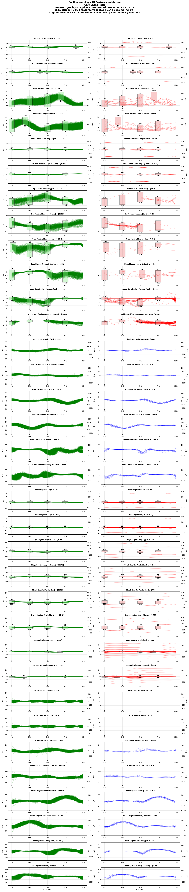
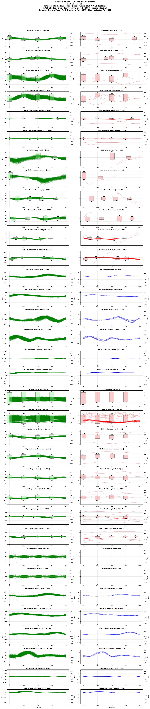
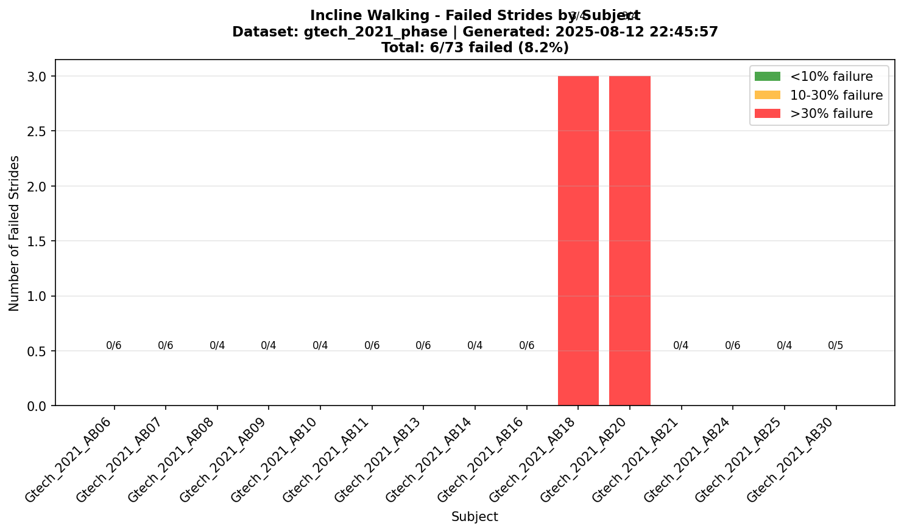
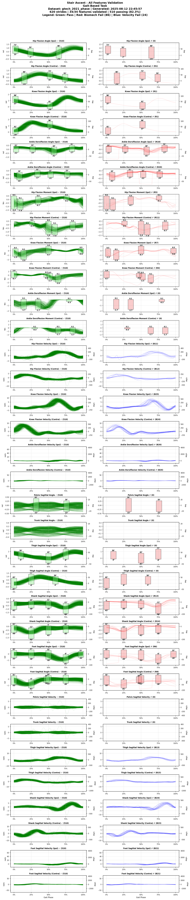
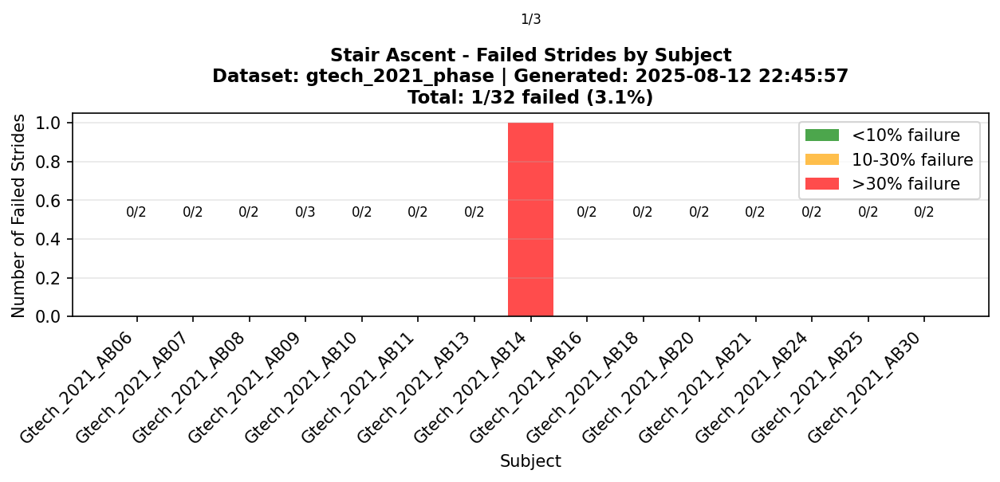

# Gtech 2021 Dataset

## **A comprehensive, open-source dataset of lower limb biomechanics in multiple conditions of stairs, ramps, and level-ground ambulation and transitions**

## Overview

**Brief Description**: Comprehensive open-source dataset of lower limb biomechanics in multiple conditions of stairs, ramps, and level-ground ambulation and transitions. Contains 3-dimensional biomechanical and wearable sensor data from 22 able-bodied adults with joint-level kinematics, moments, and powers processed using OpenSim inverse dynamics.

**Collection Year**: 2018-2019  
**Dataset Size**: ~2.5 GB (parquet format)  
**License**: Creative Commons Attribution 4.0 (CC-BY 4.0)

**Institution**: [Georgia Institute of Technology](https://www.gatech.edu/), [George W. Woodruff School of Mechanical Engineering](https://www.me.gatech.edu/) and [Institute of Robotics and Intelligent Machines](https://research.gatech.edu/robotics)

**Principal Investigators**: Jonathan Camargo, Aditya Ramanathan, Will Flanagan, [Aaron Young](https://www.me.gatech.edu/faculty/young) ([EPIC Lab](https://www.epic.gatech.edu/) - Exoskeleton and Prosthetic Intelligent Controls Lab)

## Citation Information

### Primary Citation
```
@article{CAMARGO2021110320,
  title = {A comprehensive, open-source dataset of lower limb biomechanics in multiple conditions of stairs, ramps, and level-ground ambulation and transitions},
  journal = {Journal of Biomechanics},
  volume = {119},
  pages = {110320},
  year = {2021},
  issn = {0021-9290},
  doi = {https://doi.org/10.1016/j.jbiomech.2021.110320},
  author = {Jonathan Camargo and Aditya Ramanathan and Will Flanagan and Aaron Young},
  keywords = {Locomotion biomechanics, stairs, ramps, level-ground, treadmill, wearable sensors, open dataset}
}
```

### Associated Publications
- Published online: February 20, 2021
- DOI: [https://doi.org/10.1016/j.jbiomech.2021.110320](https://doi.org/10.1016/j.jbiomech.2021.110320)
- Dataset hosted on Mendeley Data (3 parts due to size):
  - [Part 1: https://doi.org/10.17632/x78gzbp7n4.3](https://doi.org/10.17632/x78gzbp7n4.3)
  - [Part 2: https://doi.org/10.17632/gwtkr3hv7r.3](https://doi.org/10.17632/gwtkr3hv7r.3)
  - [Part 3: https://doi.org/10.17632/svzfpxr3fy.3](https://doi.org/10.17632/svzfpxr3fy.3)

### Acknowledgments
This comprehensive dataset offers a source of locomotion information for applications in locomotion recognition, developments in robotic assistive devices, and improvement of biomimetic controllers that better adapt to terrain conditions.

**Related Resources**:
- [EPIC Lab Publications](https://www.epic.gatech.edu/publications/)
- [Georgia Tech Biomechanics](https://www.bme.gatech.edu/bme/research/biomechanics-mechanobiology)
- [Journal of Biomechanics](https://www.journals.elsevier.com/journal-of-biomechanics)

## Dataset Contents

### Subjects
- **Total Subjects**: 22 (Gtech_2021_AB06 through Gtech_2021_AB29, excluding AB16)
- **Subject ID Format**: `Gtech_2021_XX##` (Dataset: Gtech 2021, Population: Able-bodied)
- **Demographics**:
  - Age Range: 19.0 - 33.0 years
  - Sex Distribution: 13 males, 9 females
  - Height Range: 1520 - 1800 mm
  - Weight Range: 52.2 - 96.2 kg
  - Mean Age: 21.6 ± 3.6 years
  - Mean Weight: 68.5 ± 11.3 kg
  - Mean Height: 1705 ± 74 mm
- **Population**: Able-bodied

### Tasks Included
| Task ID | Task Description | Duration/Cycles | Conditions | Notes |
|---------|------------------|-----------------|------------|-------|
| decline_walking | Decline Walking | Continuous | Ramp descent at 6 inclinations: 5.2°, 7.8°, 9.2°, 11°, 12.4°, 18° | Includes transitions between level and ramp |
| incline_walking | Incline Walking | Continuous | Ramp ascent at 6 inclinations: 5.2°, 7.8°, 9.2°, 11°, 12.4°, 18° | Includes transitions between level and ramp |
| level_walking | Level Walking | Continuous | 3 speeds: slow (~0.8 m/s), normal (~1.0 m/s), fast (~1.2 m/s) | Includes both clockwise and counterclockwise circuits |
| stair_ascent | Stair Ascent | Continuous | 4 step heights: 10.16 cm (4"), 12.70 cm (5"), 15.24 cm (6"), 17.78 cm (7") | Based on ADA guidelines |
| stair_descent | Stair Descent | Continuous | 4 step heights: 10.16 cm (4"), 12.70 cm (5"), 15.24 cm (6"), 17.78 cm (7") | Based on ADA guidelines |

### Data Columns (Standardized Format)
- **Variables**: 19 sagittal biomechanical features (including ipsilateral and contralateral)
  - Ipsilateral (right leg): Joint angles, moments, and segment angles
  - Contralateral (left leg): Joint angles, moments, and segment angles
- **Format**: Phase-indexed (150 points per gait cycle, aligned to right heel strike)
- **File**: `converted_datasets/gtech_2021_phase.parquet`
- **Units**: 
  - Angles: radians
  - Moments: Nm/kg (normalized by body weight)
  - Powers: W/kg (normalized by body weight)
  - Coordinate System: Right-hand rule, Z-up

## Data Collection Methods

### Motion Capture System
- **System**: Vicon Motion Capture (16 T40-S cameras)
- **Sampling Rate**: 200 Hz
- **Marker Protocol**: Modified Plug-in Gait with additional tracking markers
- **Force Plates**: Bertec split-belt instrumented treadmill (1000 Hz)

### Wearable Sensors
- **IMUs**: 7 Delsys Trigno sensors (lower limb segments)
- **EMG**: 7 channels (major lower limb muscles)
- **Goniometers**: Knee and ankle joint angle sensors
- **Sampling Rate**: 2000 Hz (EMG), 150 Hz (IMU)

### Processing Pipeline
- **Inverse Dynamics**: [OpenSim 4.0](https://opensim.stanford.edu/) with gait2392 model
- **Filtering**: 4th order Butterworth (6 Hz cutoff for kinematics, 25 Hz for kinetics)
- **Cycle Detection**: Heel strike events from force plates
- **Phase Normalization**: Cubic spline interpolation to 150 points

## Laboratory Facilities

### EPIC Lab Terrain Park
- Unique configurable terrain environment
- Multiple stair heights (4"-7" rise)
- Adjustable ramp (0-18° incline/decline)
- Level ground walking circuit
- Force plate instrumentation throughout
- Full motion capture coverage

## Contact Information
- **Dataset Curator**: [Jonathan Camargo](https://blog.jcamargo.co/), PhD Candidate (at time of publication)
- **Lab Website**: [https://www.epic.gatech.edu/](https://www.epic.gatech.edu/)
- **Lab Email**: Contact through [lab website](https://www.epic.gatech.edu/contact/)
- **Technical Support**: EPIC Lab at Georgia Tech
- **Data Access**: [https://www.epic.gatech.edu/opensource-biomechanics-camargo-et-al/](https://www.epic.gatech.edu/opensource-biomechanics-camargo-et-al/)

## Usage

```python
from user_libs.python.locomotion_data import LocomotionData

# Load the dataset
data = LocomotionData('converted_datasets/gtech_2021_phase.parquet')

# Get data for analysis
cycles_3d, features = data.get_cycles('SUB01', 'level_walking')
```

## Data Validation

<div class="validation-summary" markdown>

### 📊 Validation Status

**Validation Configuration:**
- **Ranges File**: `default_ranges.yaml`
- **SHA256**: `bbf1f9c7...` (first 8 chars)
- **Archived Copy**: [`gtech_2021_phase_2025-08-12_224557_ranges.yaml`](validation_archives/gtech_2021_phase_2025-08-12_224557_ranges.yaml)

| Metric | Value | Status |
|--------|-------|--------|
| **Overall Status** | 83.1% Valid | ⚠️ PARTIAL |
| **Phase Structure** | 150 points/cycle | ✅ Valid |
| **Tasks Validated** | 5 tasks | ✅ Complete |
| **Total Checks** | 748,080 | - |
| **Violations** | 5,291 | ⚠️ Present |

### 🔄 Velocity Consistency Validation

Validates that velocities match angles using the chain rule: `dθ/dt = (dθ/dφ) × (dφ/dt)`

| Velocity Variable | Status | Mean Error (rad/s) | Max Error (rad/s) | Strides Checked |
|-------------------|--------|-------------------|-------------------|-----------------|
| ankle dorsiflexion velocity contra (rad/s) | ❌ Fail | 0.699 | 1.262 | 25/25 |
| ankle dorsiflexion velocity ipsi (rad/s) | ❌ Fail | 0.729 | 1.128 | 25/25 |
| foot sagittal velocity contra (rad/s) | ❌ Fail | 0.936 | 1.900 | 25/25 |
| foot sagittal velocity ipsi (rad/s) | ❌ Fail | 0.924 | 1.713 | 25/25 |
| hip flexion velocity contra (rad/s) | ✅ Pass | 0.499 | 1.183 | 25/25 |
| hip flexion velocity ipsi (rad/s) | ✅ Pass | 0.495 | 1.027 | 25/25 |
| knee flexion velocity contra (rad/s) | ❌ Fail | 1.090 | 1.669 | 25/25 |
| knee flexion velocity ipsi (rad/s) | ❌ Fail | 1.151 | 1.872 | 25/25 |
| pelvis frontal velocity (rad/s) | ⚠️ N/A | - | - | Angle column pelvis_frontal_angle_rad not found |
| pelvis sagittal velocity (rad/s) | ✅ Pass | 0.204 | 0.363 | 25/25 |
| pelvis transverse velocity (rad/s) | ⚠️ N/A | - | - | Angle column pelvis_transverse_angle_rad not found |
| shank sagittal velocity contra (rad/s) | ❌ Fail | 1.008 | 1.754 | 25/25 |
| shank sagittal velocity ipsi (rad/s) | ❌ Fail | 1.077 | 1.663 | 25/25 |
| thigh sagittal velocity contra (rad/s) | ❌ Fail | 0.539 | 1.170 | 25/25 |
| thigh sagittal velocity ipsi (rad/s) | ❌ Fail | 0.564 | 1.247 | 25/25 |
| trunk frontal velocity (rad/s) | ⚠️ N/A | - | - | Angle column trunk_frontal_angle_rad not found |
| trunk sagittal velocity (rad/s) | ✅ Pass | 0.204 | 0.363 | 25/25 |
| trunk transverse velocity (rad/s) | ⚠️ N/A | - | - | Angle column trunk_transverse_angle_rad not found |

**Legend**:
- ✅ **Pass**: Mean error < 0.5 rad/s between stored and calculated velocities
- ❌ **Fail**: Mean error ≥ 0.5 rad/s (velocities inconsistent with angles)
- 🔄 **Calculated**: No stored velocities; values computed from angles
- ⚠️ **N/A**: Corresponding angle data not available

### 📈 Task-Specific Validation

#### Decline Walking

*34 sagittal features validated*

**Subject Failure Distribution:**


#### Incline Walking

*34 sagittal features validated*

**Subject Failure Distribution:**


#### Stair Ascent

*34 sagittal features validated*

**Subject Failure Distribution:**


#### Stair Descent

*34 sagittal features validated*

**Subject Failure Distribution:**


</div>

**Last Validated**: 2025-08-12 22:45:57