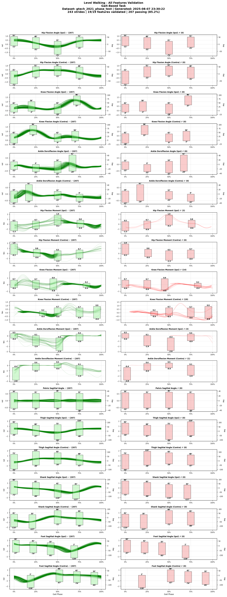

# Gtech 2021 Test Dataset

## Overview

**Brief Description**: [TODO: Add comprehensive description of dataset purpose and scope]

**Collection Year**: [TODO: Add year(s) of data collection]

**Institution**: [TODO: Add institution name and department]

**Principal Investigators**: [TODO: Add PI names and labs]

## Citation Information

### Primary Citation
```
[TODO: Add primary citation in standard format]
```

### Associated Publications
[TODO: Add related publications if any]

### Acknowledgments
[TODO: Add funding sources and acknowledgments]

## Dataset Contents

### Subjects
- **Total Subjects**: 1 (GT21T_AB01 - GT21T_AB01)
- **Subject ID Format**: `GT21T_AB##` (Dataset: Gtech 2021 Test, Population: Able-bodied)
- **Demographics**:
  - Age Range: [TODO: Add age range]
  - Sex Distribution: [TODO: Add M/F distribution]
  - Height Range: [TODO: Add height range in mm]
  - Weight Range: [TODO: Add weight range in kg]
  - Mean Age: [TODO: Add mean age]
  - Mean Weight: [TODO: Add mean weight]
  - Mean Height: [TODO: Add mean height]
- **Population**: Able-bodied

### Tasks Included
| Task ID | Task Description | Duration/Cycles | Conditions | Notes |
|---------|------------------|-----------------|------------|-------|
| decline_walking | Decline Walking | Continuous | [TODO: Add conditions] | [TODO: Add notes] |
| incline_walking | Incline Walking | Continuous | [TODO: Add conditions] | [TODO: Add notes] |
| level_walking | Level Walking | Continuous | [TODO: Add conditions] | [TODO: Add notes] |
| stair_ascent | Stair Ascent | Continuous | [TODO: Add conditions] | [TODO: Add notes] |
| stair_descent | Stair Descent | Continuous | [TODO: Add conditions] | [TODO: Add notes] |

### Data Columns (Standardized Format)
- **Variables**: 26 columns including biomechanical features
- **Format**: Phase-indexed (150 points per gait cycle)
- **File**: `converted_datasets/gtech_2021_test_phase.parquet`
- **Units**: All angles in radians, moments normalized by body weight (Nm/kg)

## Contact Information
- **Dataset Curator**: [TODO: Add curator name and title]
- **Lab Website**: [TODO: Add lab website URL]
- **Lab Email**: [TODO: Add contact email]
- **Technical Support**: [TODO: Add support contact]

## Usage

```python
from user_libs.python.locomotion_data import LocomotionData

# Load the dataset
data = LocomotionData('converted_datasets/gtech_2021_test_phase.parquet')

# Get data for analysis
cycles_3d, features = data.get_cycles('SUB01', 'level_walking')
```


## Data Validation

<div class="validation-summary" markdown>

### 📊 Validation Status

**Validation Configuration:**
- **Ranges File**: `default_ranges.yaml`
- **SHA256**: `76ab6a11...` (first 8 chars)
- **Archived Copy**: [`gtech_2021_phase_test_2025-08-07_233022_ranges.yaml`](validation_archives/gtech_2021_phase_test_2025-08-07_233022_ranges.yaml)

| Metric | Value | Status |
|--------|-------|--------|
| **Overall Status** | 99.6% Valid | ✅ PASSED |
| **Phase Structure** | 150 points/cycle | ✅ Valid |
| **Tasks Validated** | 5 tasks | ✅ Complete |
| **Total Checks** | 23,952 | - |
| **Violations** | 106 | ⚠️ Minor |

### 📈 Task-Specific Validation

#### Decline Walking

*19 sagittal features validated*

**Subject Failure Distribution:**


#### Incline Walking

*19 sagittal features validated*

#### Level Walking

*19 sagittal features validated*

**Subject Failure Distribution:**


#### Stair Ascent

*19 sagittal features validated*

**Subject Failure Distribution:**


#### Stair Descent

*19 sagittal features validated*

**Subject Failure Distribution:**


</div>

**Last Validated**: 2025-08-07 23:30:22
---
*Last Updated: August 2025*
