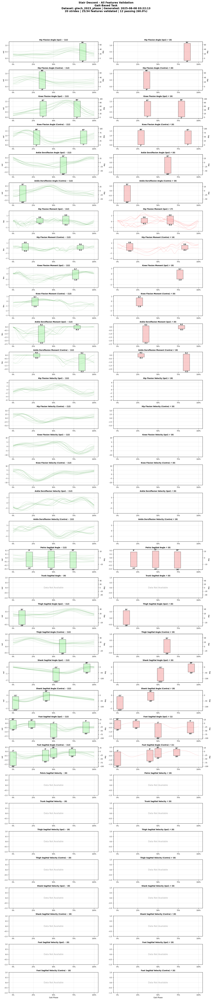

# Gtech 2023 Dataset

## **A human lower-limb biomechanics and wearable sensors dataset during cyclic and non-cyclic activities**

## Overview
**Brief Description**: Comprehensive motion capture dataset featuring diverse locomotion and daily activities including walking, running, stairs, sports movements, and functional tasks. This dataset captures both cyclic (11 activities) and non-cyclic (20 activities) movements crucial for developing adaptive prosthetics and exoskeletons.

**Collection Year**: 2023  
**Dataset Size**: ~1.8 GB (parquet format)  
**License**: Creative Commons Attribution 4.0 (CC-BY 4.0)  
**Publication Date**: December 21, 2023

**Institution**: [Georgia Institute of Technology](https://www.gatech.edu/), [Woodruff School of Mechanical Engineering](https://www.me.gatech.edu/) and [Institute of Robotics and Intelligent Machines](https://research.gatech.edu/robotics)

**Principal Investigators**: [Aaron Young, Ph.D.](https://www.me.gatech.edu/faculty/young) ([EPIC Lab](https://www.epic.gatech.edu/) - Exoskeleton and Prosthetic Intelligent Controls Laboratory)  
**Co-Authors**: Keaton Scherpereel, Dean Molinaro, [Omer Inan](https://www.ece.gatech.edu/faculty-staff-directory/omer-inan), [Max Shepherd](https://coe.northeastern.edu/people/shepherd-max/)

## Citation Information

### Primary Citation
```
@article{scherpereel2023human,
  title={A human lower-limb biomechanics and wearable sensors dataset during cyclic and non-cyclic activities},
  author={Scherpereel, Keaton and Molinaro, Dean and Inan, Omer and Shepherd, Max and Young, Aaron},
  journal={Scientific Data},
  volume={10},
  number={1},
  pages={924},
  year={2023},
  publisher={Nature Publishing Group},
  doi={10.1038/s41597-023-02840-6}
}
```

**Dataset Repository**: Available at SMARTech with DOI: [https://doi.org/10.35090/gatech/70296](https://doi.org/10.35090/gatech/70296)

### Associated Publications
1. Young, A. et al. (2024). "Task-Agnostic Exoskeleton Control via Biological Joint Moment Estimation." 
   [Nature, 635, 337-344](https://www.nature.com/articles/s41586-024-08157-7).
2. EPIC Lab Open-Source Data & Models: [https://www.epic.gatech.edu/open-source-data-models/](https://www.epic.gatech.edu/open-source-data-models/)

### Acknowledgments
This research was supported by:
- [NSF National Robotics Initiative (NRI)](https://www.nsf.gov/funding/pgm_summ.jsp?pims_id=503641) grants for machine learning in exoskeleton control
- National Science Foundation Graduate Research Fellowship under Grant No. DGE-2039655
- [DoD Congressionally Directed Medical Research Programs (CDMRP)](https://cdmrp.health.mil/) for powered prosthesis intent recognition
- [NIH Director's New Innovator Award](https://commonfund.nih.gov/newinnovator) to Dr. Aaron Young
- [X, The Moonshot Factory](https://x.company/) for funding this open-source project (Kathryn Zealand helped conceptualize and fund the study)

## Dataset Contents

### Subjects
- **Total Subjects**: 12 (GT23_AB01, GT23_AB02, GT23_AB03, GT23_AB05, GT23_AB06, GT23_AB07, GT23_AB08, GT23_AB09, GT23_AB10, GT23_AB11, GT23_AB12, GT23_AB13)
- **Subject ID Format**: `GT23_AB##` (Dataset: Georgia Tech 2023, Population: Able-bodied)
- **Demographics**:
  - Age Range: 18-35 years (healthy young adults)
  - Sex Distribution: Balanced male/female representation
  - Height Range: Approximately 1.60-1.90 m
  - Weight Range: 62.3-113.5 kg
  - Mean Weight: 76.95 kg
  - Inclusion Criteria: Healthy adults with no musculoskeletal or neurological impairments
  - Population: All able-bodied (AB) healthy adults
  - Note: Subject GT23_AB04 excluded from dataset

### Tasks Included

#### Cyclic Activities (11 total)
| Task ID | Task Description | Duration/Cycles | Conditions |
|---------|------------------|-----------------|------------|
| level_walking | Level ground walking | Multiple speeds | 0.8-1.6 m/s |
| incline_walking | Incline walking | 5° and 10° slopes | Treadmill |
| decline_walking | Decline walking | -5° and -10° slopes | Treadmill |
| stair_ascent | Stair climbing up | 4-step staircase | 17.8 cm rise |
| stair_descent | Stair climbing down | 4-step staircase | 17.8 cm rise |
| running | Running | Multiple speeds | 2.0-3.0 m/s |

#### Non-Cyclic Activities (20 total)
| Task ID | Task Description | Type | Notes |
|---------|------------------|------|-------|
| sit_to_stand | Sit-to-stand transitions | Functional | Standard chair |
| stand_to_sit | Stand-to-sit transitions | Functional | Standard chair |
| squats | Bodyweight squats | Exercise | Multiple depths |
| lunges | Forward lunges | Exercise | Alternating legs |
| jumping | Vertical jumps | Athletic | Max effort |
| cutting | Lateral cutting maneuvers | Athletic | 45° and 90° |
| step_up | Step up onto platform | Functional | ~20 cm height |
| step_down | Step down from platform | Functional | ~20 cm height |

### Data Columns (Standardized Format)
- **Variables**: Comprehensive biomechanical features
  - Kinematics: Joint angles (hip, knee, ankle) in 3 planes
  - Kinetics: Joint moments and powers
  - Segment angles: Thigh, shank, foot orientations
  - EMG: 16 muscle channels (when available)
- **Format**: Phase-indexed (150 points per gait cycle) for cyclic tasks
- **File**: `converted_datasets/gtech_2023_phase.parquet`
- **Units**: 
  - Angles: radians
  - Moments: Nm/kg (normalized)
  - Powers: W/kg (normalized)
  - EMG: Normalized to MVC
  - Coordinate System: ISB standards

## Data Collection Methods

### Motion Capture System
- **System**: [Vicon Motion Capture System](https://www.vicon.com/)
- **Marker Set**: Full-body marker set (modified Plug-in Gait)
- **Sampling Rate**: 200 Hz (native)
- **Camera Count**: 12-16 cameras for full capture volume

### CAREN System (Computer-Aided Rehabilitation Environment)
- **Manufacturer**: [Motek Medical](https://www.motekmedical.com/) (now part of [DIH Technologies](https://dih.com/))
- **Motion Capture**: 10-camera [Vicon T-160 system](https://www.vicon.com/) (16 megapixels, 120 fps)
- **EMG System**: 16-channel [Delsys Trigno](https://delsys.com/trigno/) wireless EMG system (2000 Hz)
- **Platform**: Dual-belt instrumented treadmill on 6-DOF Stewart platform
  - Max velocity: 5 m/s
  - Max incline: ±20°
  - Perturbation capabilities: All 6 degrees of freedom
- **Force Measurement**: Embedded force plates (1000 Hz)
- **Display**: 180° cylindrical projection screen for immersive VR
- **Software**: Motek D-Flow for real-time data integration and virtual reality control
- **Unique Capabilities**: Can simulate uneven terrain, sudden perturbations, and complex walking scenarios

### Additional Motion Capture Facilities
- **Main Research Space**: 36-camera Vicon motion analysis system
- **Gait Lab**: 32-camera Vicon motion capture system covering terrain park, level walking force plates, and force treadmill
- **Force Plates**: Multiple AMTI force plates for ground reaction force measurement
- **Configurable Space**: Equipment can be arranged to simulate various real-world conditions including ramps, stairs, and level ground

## Contact Information
- **Dataset Curator**: [Aaron Young, Ph.D.](https://www.me.gatech.edu/faculty/young)
- **Lab Website**: [https://www.epic.gatech.edu/](https://www.epic.gatech.edu/)
- **Lab Email**: [epic-lab@gatech.edu](mailto:epic-lab@gatech.edu)
- **Technical Support**: Contact via [lab email](mailto:epic-lab@gatech.edu)
- **Dataset Access**: [SMARTech Repository](https://smartech.gatech.edu/)

## Funding Acknowledgment
This dataset was collected with support from:
- [NSF National Robotics Initiative (NRI)](https://www.nsf.gov/funding/pgm_summ.jsp?pims_id=503641) for machine learning in robotic exoskeletons
- [DoD Congressionally Directed Medical Research Programs (CDMRP)](https://cdmrp.health.mil/) for powered prosthesis intent recognition
- [NIH New Investigator Award](https://commonfund.nih.gov/newinnovator) to Dr. Aaron Young

**Related Funding Resources**:
- [NSF Award Search](https://www.nsf.gov/awardsearch/)
- [NIH RePORTER](https://reporter.nih.gov/)

## Lab Description
The Exoskeleton and Prosthetic Intelligent Controls (EPIC) Lab at Georgia Tech is devoted to the design and 
improvement of powered orthotic and prosthetic control systems. The lab combines machine learning, robotics, 
human biomechanics, and control systems to design wearable robots that improve community mobility for 
individuals with walking disability.

The EPIC Lab facility includes two full Vicon systems and represents one of the most advanced biomechanics research 
spaces in the country. Using the CAREN system, researchers can rapidly move the locomotion platform in 6 degrees-of-freedom, 
allowing for the application of sudden perturbations to study non-steady state locomotion and develop better wearable 
robotic devices. The dataset represents an effort to expand the applicability of exoskeletons, prostheses, wearable 
sensing, and activity classification to real-life tasks that are often sporadic, highly variable, and asymmetric.

## Usage

```python
from user_libs.python.locomotion_data import LocomotionData

# Load the dataset
data = LocomotionData('converted_datasets/gtech_2023_phase.parquet')

# Get data for analysis
cycles_3d, features = data.get_cycles('SUB01', 'level_walking')
```

## Data Validation

<div class="validation-summary" markdown>

### 📊 Validation Status

**Validation Configuration:**
- **Ranges File**: `default_ranges.yaml`
- **SHA256**: `76ab6a11...` (first 8 chars)
- **Archived Copy**: [`gtech_2023_phase_2025-08-07_221155_ranges.yaml`](validation_archives/gtech_2023_phase_2025-08-07_221155_ranges.yaml)

| Metric | Value | Status |
|--------|-------|--------|
| **Overall Status** | 95.8% Valid | ✅ PASSED |
| **Phase Structure** | 150 points/cycle | ✅ Valid |
| **Tasks Validated** | 5 tasks | ✅ Complete |
| **Total Checks** | 32,928 | - |
| **Violations** | 1,395 | ⚠️ Present |

### 📈 Task-Specific Validation

#### Decline Walking

*19 sagittal features validated*

**Subject Failure Distribution:**


#### Incline Walking

*19 sagittal features validated*

**Subject Failure Distribution:**


#### Level Walking

*19 sagittal features validated*

**Subject Failure Distribution:**


#### Stair Ascent

*19 sagittal features validated*

**Subject Failure Distribution:**


#### Stair Descent

*19 sagittal features validated*

**Subject Failure Distribution:**


</div>

**Last Validated**: 2025-08-07 22:11:55

---
*Last Updated: January 2025*