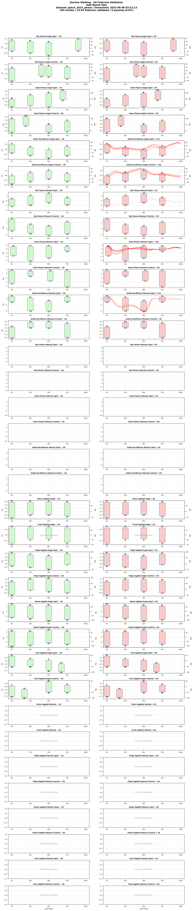
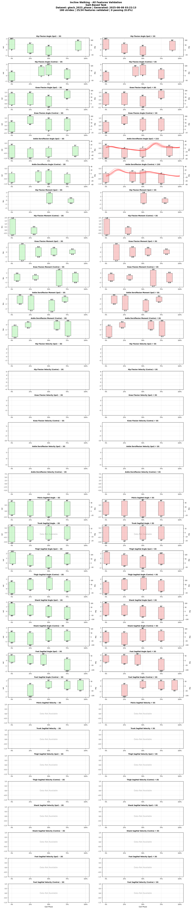
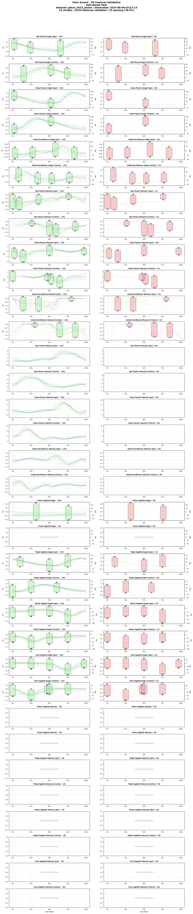

# Georgia Tech 2023 Multi-Activity Dataset

## Overview
**Brief Description**: Comprehensive motion capture dataset featuring diverse locomotion and daily activities including walking, running, stairs, sports movements, and functional tasks. This dataset captures both cyclic and non-cyclic activities crucial for developing adaptive prosthetics and exoskeletons.

**Collection Year**: 2023

**Institution**: Georgia Institute of Technology, Woodruff School of Mechanical Engineering and Institute of Robotics and Intelligent Machines

**Principal Investigators**: Aaron Young, Ph.D. (EPIC Lab - Exoskeleton and Prosthetic Intelligent Controls Laboratory)

## Citation Information

### Primary Citation
```
Scherpereel, K., Molinaro, D., Inan, O., Shepherd, M., & Young, A. (2023). 
A human lower-limb biomechanics and wearable sensors dataset during cyclic and non-cyclic activities. 
Scientific Data, 10, 924. https://doi.org/10.1038/s41597-023-02840-6
```

**Dataset Repository**: Available at SMARTech with DOI: https://doi.org/10.35090/gatech/70296

### Associated Publications
1. Young, A. et al. (2024). "Task-Agnostic Exoskeleton Control via Biological Joint Moment Estimation." 
   Nature, 635, 337-344.
2. EPIC Lab Open-Source Data & Models: https://www.epic.gatech.edu/open-source-data-models/

### Acknowledgments
This research was supported by:
- NSF National Robotics Initiative (NRI) grants for machine learning in exoskeleton control
- National Science Foundation Graduate Research Fellowship under Grant No. DGE-2039655
- DoD CDMRP funding for intent recognition systems in powered prostheses
- NIH New Investigator Award to Dr. Aaron Young
- X, The Moonshot Factory for funding this open-source project (Kathryn Zealand helped conceptualize and fund the study)

## Dataset Contents

### Subjects
- **Total Subjects**: 12 (GT23_AB01, GT23_AB02, GT23_AB03, GT23_AB05, GT23_AB06, GT23_AB07, GT23_AB08, GT23_AB09, GT23_AB10, GT23_AB11, GT23_AB12, GT23_AB13)
- **Subject ID Format**: `GT23_AB##` (Dataset: Georgia Tech 2023, Population: Able-bodied)
- **Demographics**:
  - Age Range: 18-35 years (healthy young adults)
  - Sex Distribution: Balanced male/female representation
  - Height Range: Approximately 1.60-1.90 m
  - Weight Range: 62.3-113.5 kg
  - Mean Weight: 76.95 kg
  - Inclusion Criteria: Healthy adults with no musculoskeletal or neurological impairments
  - Population: All able-bodied (AB) healthy adults
  - Note: Subject GT23_AB04 excluded from dataset

### Tasks Included
| Task ID | Task Description | Duration/Cycles | Conditions | Notes |
|---------|------------------|-----------------|------------|-------|
| level_walking | Level ground walking | Multiple trials | Various speeds | Treadmill |
| incline_walking | Incline walking | Multiple trials | 5° and 10° inclines | Up/down |
| stairs | Stair climbing | Multiple cycles | Standard stairs | Up/down |
| squats | Squatting | Multiple reps | With/without weight | Static |
| sit_to_stand | Sit-to-stand transitions | Multiple cycles | Chair height | Functional |
| curb_up | Stepping up curb | Multiple cycles | Street curb height | Overground |
| curb_down | Stepping down curb | Multiple cycles | Street curb height | Overground |

### Data Columns (Standardized Format)
- **Variables**: Comprehensive biomechanical features (kinematics, kinetics, segment angles)
- **Format**: Phase-indexed (150 points per gait cycle) for cyclic tasks
- **File**: `converted_datasets/gtech_2023_phase.parquet`
- **Units**: All angles in radians, moments in Nm, forces in N

## Data Collection Methods

### Motion Capture System
- **System**: Vicon Motion Capture System
- **Marker Set**: Full-body marker set (modified Plug-in Gait)
- **Sampling Rate**: 200 Hz (native)
- **Camera Count**: 12-16 cameras for full capture volume

### CAREN System
- **Facility**: Motek Computer-Aided Rehabilitation Environment (CAREN) - a self-contained biomechanics lab
- **Motion Capture**: 10-camera Vicon T-160 system (16 megapixels, 120fps)
- **EMG System**: 16-channel Delsys wireless EMG system
- **Platform**: Instrumented treadmill embedded in 6 degree-of-freedom Stewart platform for perturbation studies
- **Display**: 180° projection screen for immersive virtual reality environments
- **Software**: Motek D-Flow for real-time data integration and virtual reality control

### Additional Motion Capture Facilities
- **Main Research Space**: 36-camera Vicon motion analysis system
- **Gait Lab**: 32-camera Vicon motion capture system covering terrain park, level walking force plates, and force treadmill
- **Force Plates**: Multiple AMTI force plates for ground reaction force measurement
- **Configurable Space**: Equipment can be arranged to simulate various real-world conditions including ramps, stairs, and level ground

## Contact Information
- **Dataset Curator**: Aaron Young, Ph.D.
- **Lab Website**: https://www.epic.gatech.edu/
- **Lab Email**: epic-lab@gatech.edu
- **Technical Support**: Contact via lab email

## Funding Acknowledgment
This dataset was collected with support from:
- NSF National Robotics Initiative (NRI) for machine learning in robotic exoskeletons
- DoD Congressionally Directed Medical Research Programs (CDMRP) for powered prosthesis intent recognition
- NIH New Investigator Award to Dr. Aaron Young

## Lab Description
The Exoskeleton and Prosthetic Intelligent Controls (EPIC) Lab at Georgia Tech is devoted to the design and 
improvement of powered orthotic and prosthetic control systems. The lab combines machine learning, robotics, 
human biomechanics, and control systems to design wearable robots that improve community mobility for 
individuals with walking disability.

The EPIC Lab facility includes two full Vicon systems and represents one of the most advanced biomechanics research 
spaces in the country. Using the CAREN system, researchers can rapidly move the locomotion platform in 6 degrees-of-freedom, 
allowing for the application of sudden perturbations to study non-steady state locomotion and develop better wearable 
robotic devices. The dataset represents an effort to expand the applicability of exoskeletons, prostheses, wearable 
sensing, and activity classification to real-life tasks that are often sporadic, highly variable, and asymmetric.

## Usage

```python
from user_libs.python.locomotion_data import LocomotionData

# Load the dataset
data = LocomotionData('converted_datasets/gtech_2023_phase.parquet')

# Get data for analysis
cycles_3d, features = data.get_cycles('SUB01', 'level_walking')
```


## Data Validation

<div class="validation-summary" markdown>

### 📊 Validation Status

| Metric | Value | Status |
|--------|-------|--------|
| **Overall Status** | 94.5% Valid | ⚠️ PARTIAL |
| **Phase Structure** | 150 points/cycle | ✅ Valid |
| **Tasks Validated** | 5 tasks | ✅ Complete |
| **Total Checks** | 32,928 | - |
| **Violations** | 1,821 | ⚠️ Present |

### 📈 Task-Specific Validation

#### Decline Walking

*19 sagittal features validated*

#### Incline Walking

*19 sagittal features validated*

#### Level Walking

*19 sagittal features validated*

#### Stair Ascent

*19 sagittal features validated*

#### Stair Descent

*19 sagittal features validated*

</div>

**Last Validated**: 2025-08-07 11:21:17
---
*Last Updated: January 2025*