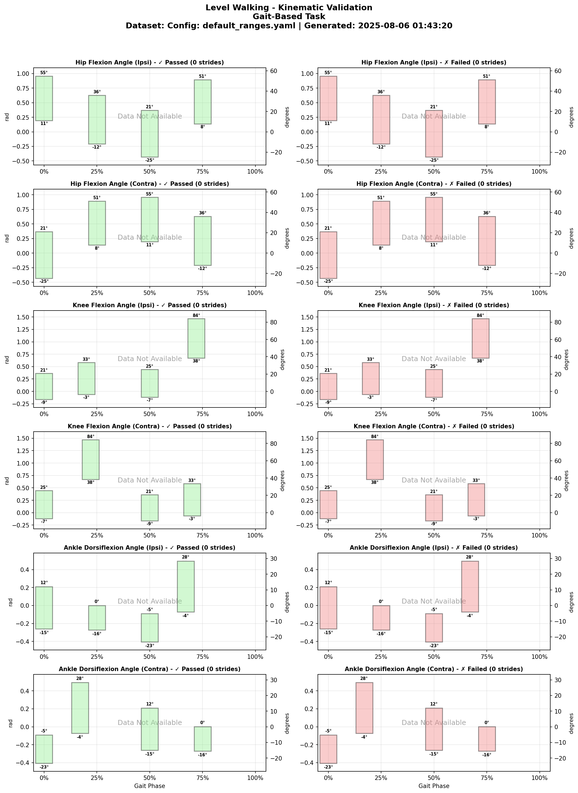
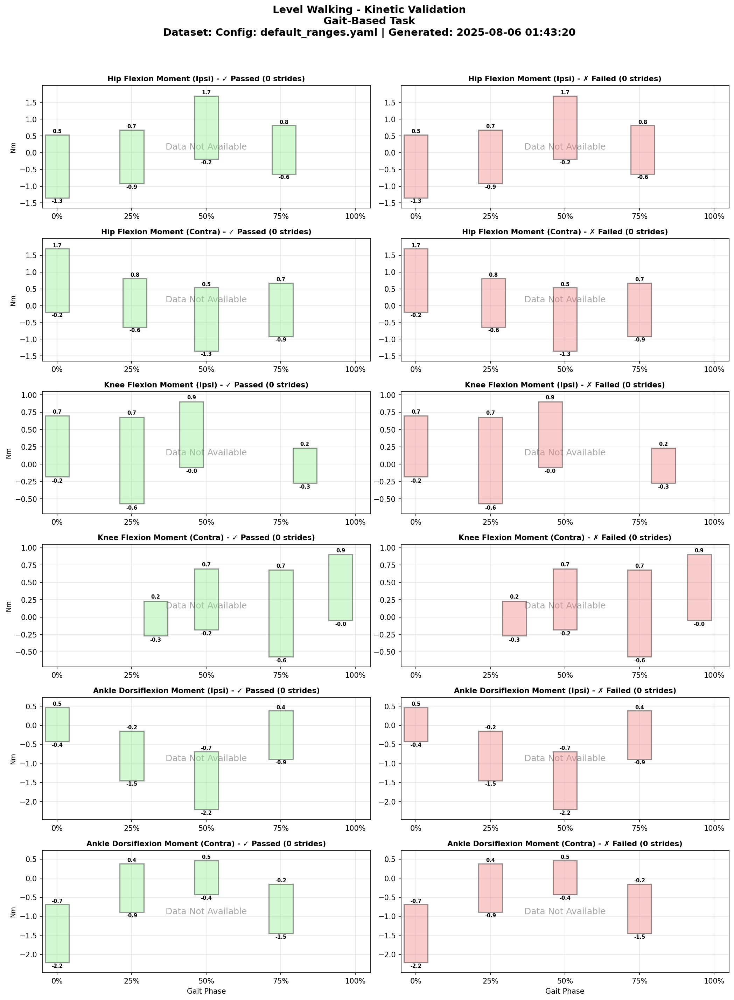
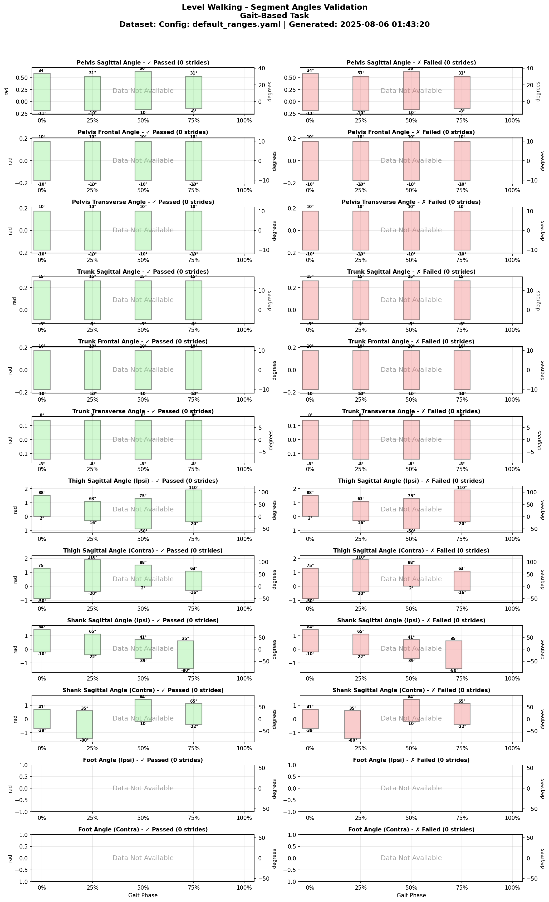
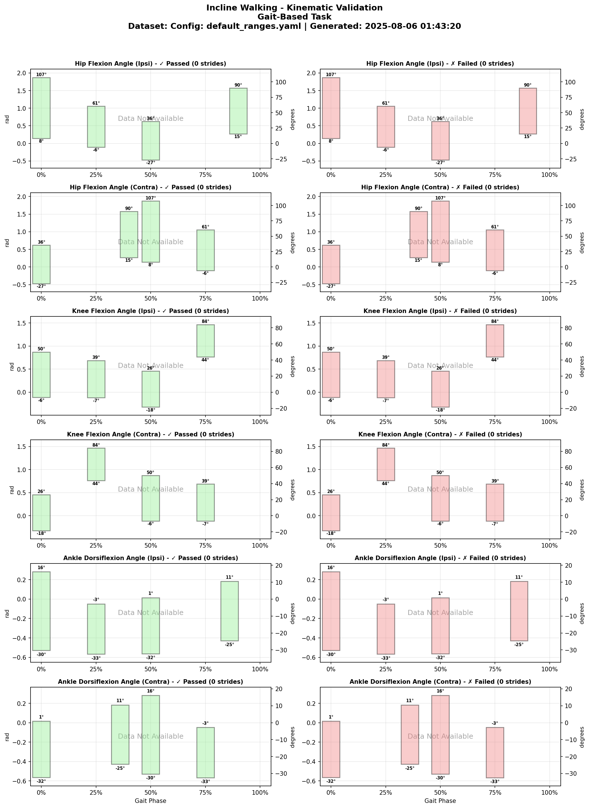
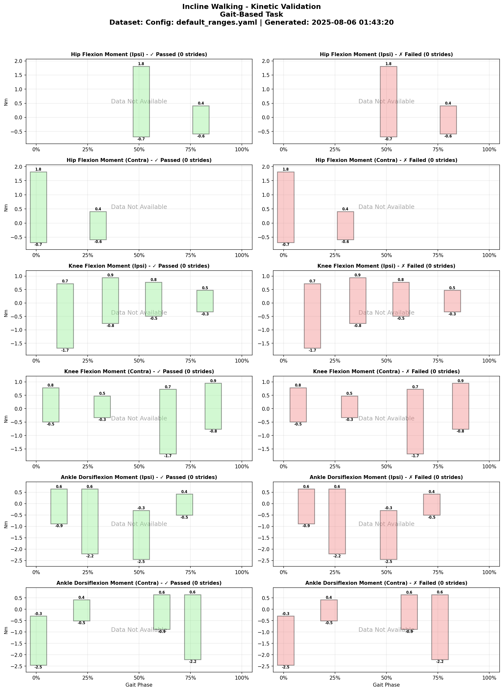
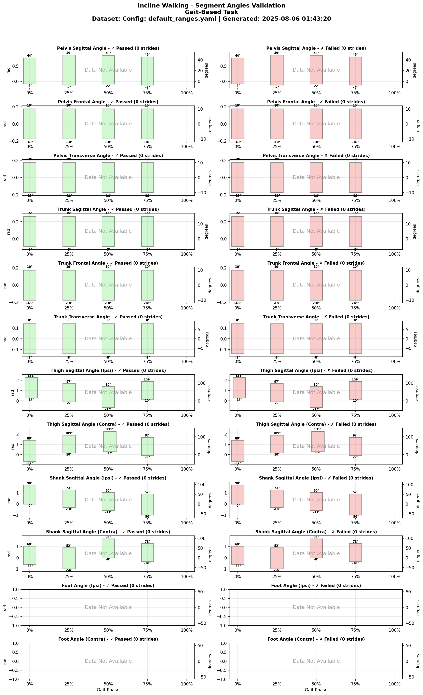
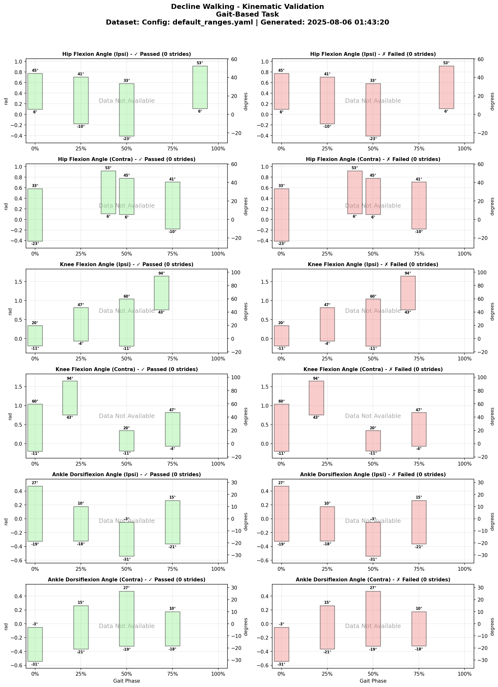
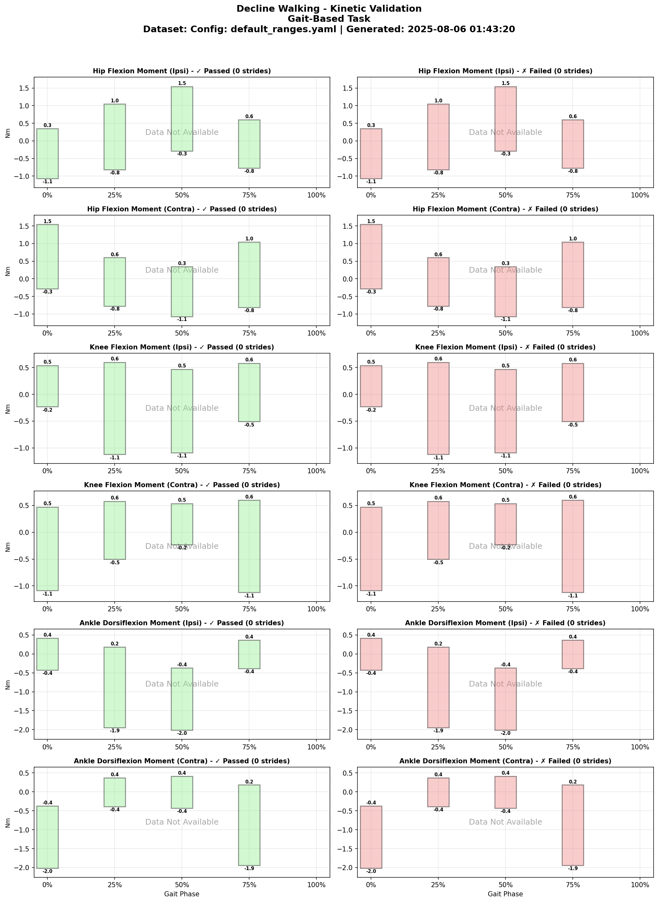
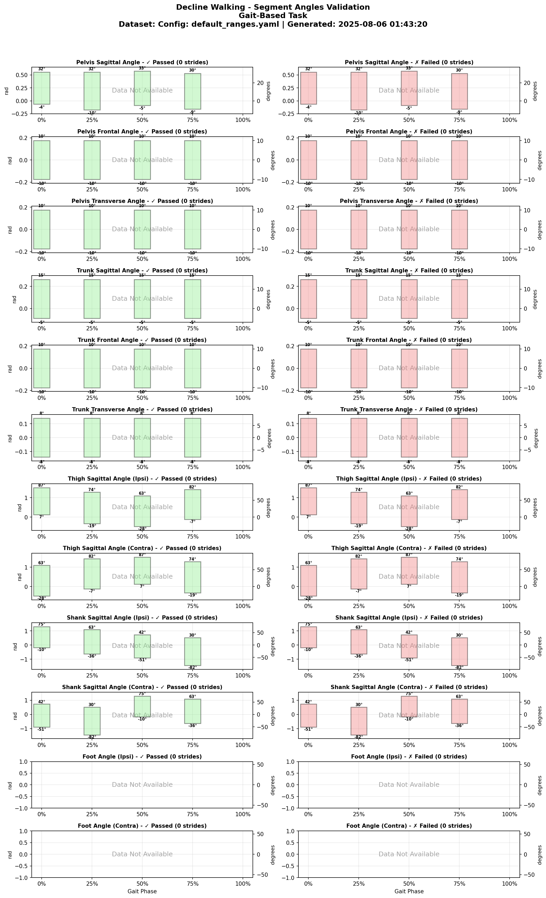

# University of Michigan 2021 Treadmill Dataset

## Overview
**Brief Description**: Comprehensive treadmill-based locomotion dataset including walking at various speeds and inclines, running, and transitions between activities.

**Collection Year**: 2018-2021

**Institution**: University of Michigan, Department of Robotics, Mechanical Engineering, and Electrical and Computer Engineering

**Principal Investigators**: Robert D. Gregg IV, Ph.D. (Locomotor Control Systems Laboratory)

## Citation Information

### Primary Citation
```
Locomotor Control Systems Laboratory. (2021). University of Michigan Treadmill Locomotion Dataset. 
University of Michigan, Ann Arbor. [Contact lab for access]
```

### Associated Publications
1. Gregg, R.D. et al. "The Effect of Walking Incline and Speed on Human Leg Kinematics, Kinetics, and EMG" 
   IEEE DataPort (2018). https://ieee-dataport.org/open-access/effect-walking-incline-and-speed-human-leg-kinematics-kinetics-and-emg
2. Related publications available at: https://scholar.google.com/citations?user=hEypYOEAAAAJ&hl=en

### Acknowledgments
This research was supported by:
- NIH Director's New Innovator Award (2013) - $2.3 million over 5 years for phase-based control research
- NIH R01 Grant (2018) - $2.2 million for investigation of agile powered prosthetic leg control
- NIH R01 Grant (2021) - $1.7 million for design and control of modular powered orthoses

## Dataset Contents

### Subjects
- **Total Subjects**: 10 (AB01-AB10)
- **Demographics**:
  - Age Range: 20-60 years
  - Sex Distribution: 5F/5M
  - Height Range: 1617-1900 mm
  - Weight Range: 53.7-87.0 kg
  - Mean Age: 30.4 years
  - Mean Weight: 74.63 kg
  - Mean Height: 1727.8 mm

### Tasks Included
| Task ID | Task Description | Duration/Cycles | Conditions | Notes |
|---------|------------------|-----------------|------------|-------|
| level_walking | Level walking | Continuous | 0° (level) | Treadmill |
| incline_walking | Incline walking | Continuous | 5° incline | Treadmill |
| decline_walking | Decline walking | Continuous | -10° decline | Treadmill |

### Data Columns (Standardized Format)
- **Variables**: 45 biomechanical features (kinematics, kinetics, segment angles)
- **Format**: Phase-indexed (150 points per gait cycle)
- **File**: `converted_datasets/umich_2021_phase.parquet`
- **Units**: All angles in radians, moments normalized by body weight (Nm/kg)

## Validation Ranges

The following plots show the expected biomechanical ranges used for data validation:

### Level Walking





### Incline Walking





### Decline Walking





## Data Validation

For detailed validation results with actual data:
- [Full Validation Report](validation_reports/umich_2021_phase_validation_report.md)

## Contact Information
- **Dataset Curator**: Robert D. Gregg IV, Ph.D.
- **Lab Website**: https://gregg.engin.umich.edu/
- **Lab Email**: locolab@umich.edu
- **Technical Support**: Contact via lab email

## Funding Acknowledgment
This dataset was collected with support from:
- NIH Director's New Innovator Award (DP2HD080349)
- NIH R01 Grant for agile powered prosthetic legs (R01HD094772)
- Burroughs Wellcome Fund Career Award at the Scientific Interface ($500,000)

## Usage

```python
from user_libs.python.locomotion_data import LocomotionData

# Load the dataset
data = LocomotionData('converted_datasets/umich_2021_phase.parquet')

# Get data for analysis
cycles_3d, features = data.get_cycles('SUB01', 'level_walking')
```

---
*Last Updated: January 2025*