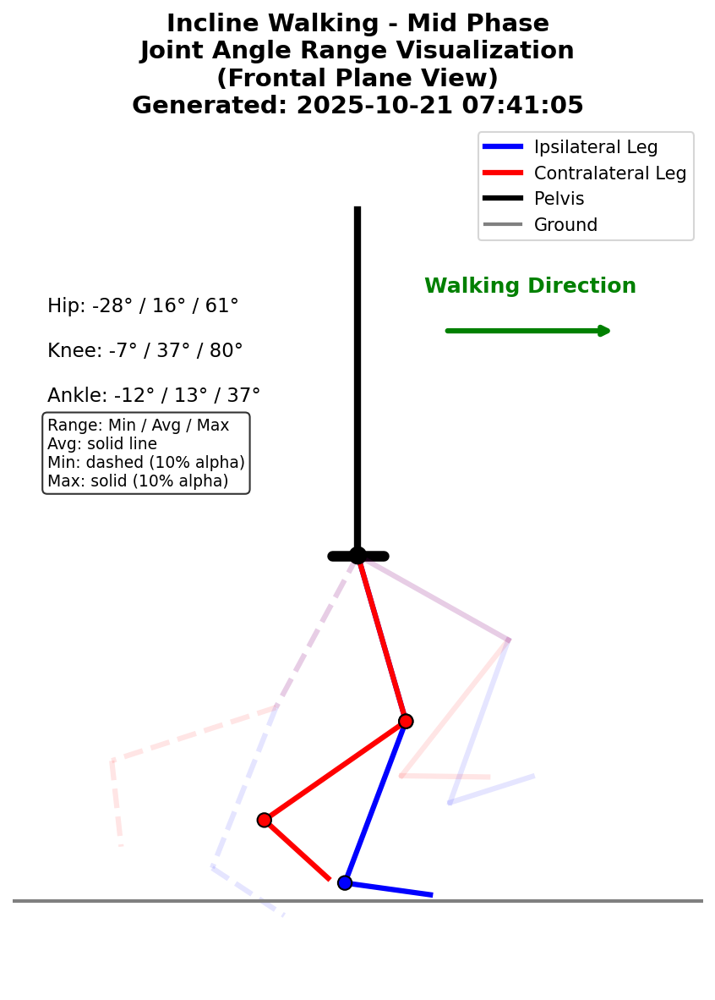
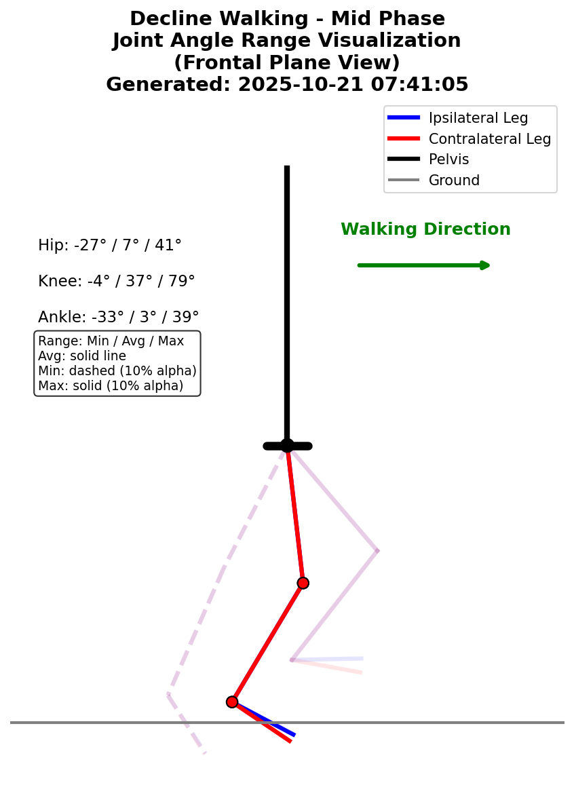

# UMich 2021 Dataset

## Overview

The University of Michigan 2021 dataset contains standardized biomechanical data from 10 healthy subjects performing various locomotion tasks.

## Dataset Details

- **Subjects**: 10 healthy adults
- **Tasks**: Level walking, incline walking, decline walking
- **Variables**: 45 biomechanical features (kinematics, kinetics, segment angles)
- **Format**: Phase-indexed (150 points per gait cycle)
- **File**: `converted_datasets/umich_2021_phase.parquet`

## Validation Ranges

The following plots show the expected biomechanical ranges used for data validation:

### Level Walking

#### Forward Kinematics
| Phase 0% | Phase 25% | Phase 50% | Phase 75% |
|---|---|---|---|
|  |  |  |  |

#### Validation Ranges by Phase


### Incline Walking

#### Forward Kinematics
| Phase 0% | Phase 25% | Phase 50% | Phase 75% |
|---|---|---|---|
|  |  |  |  |

#### Validation Ranges by Phase


### Decline Walking

#### Forward Kinematics
| Phase 0% | Phase 25% | Phase 50% | Phase 75% |
|---|---|---|---|
|  |  |  |  |

#### Validation Ranges by Phase


## Data Validation

For detailed validation results with actual data:
- [Full Validation Report](validation_reports/umich_2021_phase_validation_report.md)

## Usage

```python
from user_libs.python.locomotion_data import LocomotionData

# Load the dataset
data = LocomotionData('converted_datasets/umich_2021_phase.parquet')

# Get data for analysis
cycles_3d, features = data.get_cycles('SUB01', 'level_walking')
```
