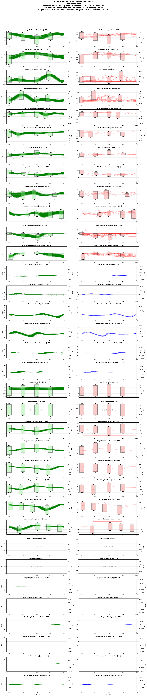
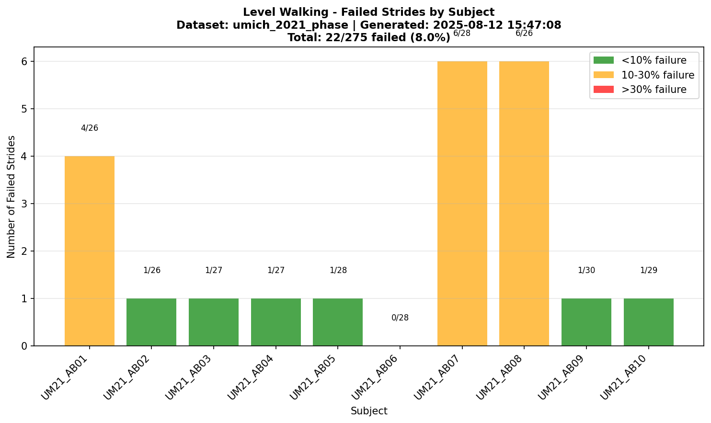

# UMich 2021 Dataset

## **The Effect of Walking Incline and Speed on Human Leg Kinematics, Kinetics, and EMG**

## Overview
**Brief Description**: Comprehensive treadmill-based locomotion dataset including walking at various speeds and inclines, with synchronized kinematics, kinetics, and EMG data. This dataset focuses on continuous parameterization of human gait across different walking conditions.

**Collection Year**: 2018-2021  
**Dataset Size**: ~1.2 GB (parquet format)  
**License**: Open Access ([IEEE DataPort](https://ieee-dataport.org/))

**Institution**: [University of Michigan](https://umich.edu/), [Department of Robotics](https://robotics.umich.edu/), [Mechanical Engineering](https://me.engin.umich.edu/), and [Electrical and Computer Engineering](https://ece.engin.umich.edu/)

**Principal Investigators**: [Robert D. Gregg IV, Ph.D.](https://gregg.engin.umich.edu/) ([Locomotor Control Systems Laboratory](https://locolab.robotics.umich.edu/))

## Citation Information

### Primary Citation
```
@misc{embry2018walking,
  title={The effect of walking incline and speed on human leg kinematics, kinetics, and EMG},
  author={Embry, K. and Villarreal, D. and Macaluso, R. and Gregg, R.D.},
  year={2018},
  publisher={IEEE DataPort},
  doi={10.21227/gk32-e868}
}
```

### Associated Publications
1. Embry, K., Villarreal, D., Macaluso, R., & Gregg, R.D. (2018). "The Effect of Walking Incline and Speed on Human Leg Kinematics, Kinetics, and EMG"  
   IEEE DataPort. DOI: [10.21227/gk32-e868](https://doi.org/10.21227/gk32-e868)

2. Macaluso, R., Embry, K., Villarreal, D., & Gregg, R.D. (2020). "Human Leg Kinematics, Kinetics, and EMG During Phase-Shifting Perturbations at Varying Inclines"  
   IEEE DataPort. DOI: [10.21227/12hp-e249](https://doi.org/10.21227/12hp-e249)

3. Elery, T., Rezazadeh, S., Reznick, E., Gray, L., & Gregg, R.D. (2020). "Effects of a Powered Knee-Ankle Prosthesis on Amputee Hip Compensations: A Case Series"  
   IEEE DataPort. DOI: [10.21227/sngq-4x29](https://doi.org/10.21227/sngq-4x29)

4. Best, T.K., Embry, K.R., Rouse, E.J., & Gregg, R.D. (2023). "Phase-Variable Control of a Powered Knee-Ankle Prosthesis over Continuously Varying Speeds and Inclines"  
   [IEEE/RSJ International Conference on Intelligent Robots and Systems (IROS)](https://ieeexplore.ieee.org/document/10341439)

### Acknowledgments
This research was supported by:
- [NIH Director's New Innovator Award](https://commonfund.nih.gov/newinnovator) (2013) - $2.3 million over 5 years for phase-based control research
- NIH R01 Grant (2018) - $2.2 million for investigation of agile powered prosthetic leg control
- NIH R01 Grant (2021) - $1.7 million for design and control of modular powered orthoses

**Grant Details**:
- [NIH RePORTER - DP2HD080349](https://reporter.nih.gov/search/sZqnRvZlG0S0kCIDMwTCWA/project-details/8951475)
- [NIH RePORTER - R01HD094772](https://reporter.nih.gov/search/Mh5_kLNMBkSBpBR1vKtSkg/project-details/9603148)

## Dataset Contents

### Subjects
- **Total Subjects**: 10 (UM21_AB01 - UM21_AB10)
- **Subject ID Format**: `UM21_AB##` (Dataset: UMich 2021, Population: Able-bodied)
- **Demographics**:
  - Age Range: 20-60 years
  - Sex Distribution: 5F/5M
  - Height Range: 1617-1900 mm
  - Weight Range: 53.7-87.0 kg
  - Mean Age: 30.4 years
  - Mean Weight: 74.63 kg
  - Mean Height: 1727.8 mm
- **Population**: All able-bodied (AB) healthy adults

### Tasks Included
| Task ID | Task Description | Duration/Cycles | Conditions | Notes |
|---------|------------------|-----------------|------------|-------|
| level_walking | Level walking | 60 sec trials | 0° at 0.8, 1.0, 1.2 m/s | Bertec treadmill |
| incline_walking | Incline walking | 60 sec trials | +5°, +10° at multiple speeds | Bertec treadmill |
| decline_walking | Decline walking | 60 sec trials | -5°, -10° at multiple speeds | Bertec treadmill |
| running | Running (if included) | 60 sec trials | 1.8-2.4 m/s | Level only |
| transitions | Speed/incline transitions | Variable | Continuous changes | Phase-shifting |

### Data Columns (Standardized Format)
- **Variables**: 45+ biomechanical features
  - Kinematics: Hip, knee, ankle angles (sagittal, frontal, transverse)
  - Kinetics: Joint moments and powers
  - EMG: 7 channels (gluteus medius, rectus femoris, vastus lateralis, biceps femoris, tibialis anterior, gastrocnemius medialis, soleus)
  - Ground reaction forces: Vertical and horizontal components
- **Format**: Phase-indexed (150 points per gait cycle)
- **File**: `converted_datasets/umich_2021_phase.parquet`
- **Units**: 
  - Angles: radians
  - Moments: Nm/kg (normalized)
  - Powers: W/kg (normalized)
  - EMG: Normalized to maximum voluntary contraction
  - Forces: N/kg (normalized)

## Data Collection Methods

### Equipment Specifications
- **Treadmill**: [Bertec](https://www.bertec.com/) split-belt instrumented treadmill
  - Force plates: Dual 6-DOF force platforms (1000 Hz)
  - Speed range: 0-3.0 m/s
  - Incline range: -15° to +15°
- **Motion Capture**: [Vicon](https://www.vicon.com/) system with 12 cameras (200 Hz)
- **EMG System**: [Delsys Trigno](https://delsys.com/trigno/) wireless (2000 Hz)
- **Marker Set**: Modified Helen Hayes with additional tracking markers

### Processing Pipeline
- **Inverse Kinematics**: [Visual3D software](https://www.c-motion.com/products/visual3d/)
- **Filtering**: 4th order zero-lag Butterworth
  - Kinematics: 6 Hz cutoff
  - Kinetics: 25 Hz cutoff
  - EMG: 20-450 Hz bandpass, RMS envelope
- **Cycle Detection**: Heel strike from vertical GRF
- **Phase Variable**: Monotonic progression through gait cycle
- **Normalization**: Time-normalized to 150 points using cubic spline

## Research Focus

### Phase-Variable Control
The Locomotor Control Systems Lab pioneered phase-variable control for powered prostheses, using a continuous phase variable that robustly represents gait cycle timing across different walking conditions. This approach enables smooth transitions between different speeds and inclines without discrete mode switching.

### Clinical Translation
The lab's research has led to successful clinical trials of powered knee-ankle prostheses, demonstrating improved metabolic efficiency and biomechanical symmetry compared to passive devices.

## Contact Information
- **Dataset Curator**: [Robert D. Gregg IV, Ph.D.](https://gregg.engin.umich.edu/)
- **Lab Website**: [https://locolab.robotics.umich.edu/](https://locolab.robotics.umich.edu/)
- **Lab Email**: [locolab@umich.edu](mailto:locolab@umich.edu)
- **Technical Support**: Contact via [lab email](mailto:locolab@umich.edu)
- **IEEE DataPort**: [Browse Datasets](https://ieee-dataport.org/authors/robert-gregg)

## Funding Acknowledgment
This dataset was collected with support from:
- [NIH Director's New Innovator Award](https://commonfund.nih.gov/newinnovator) (DP2HD080349)
- NIH R01 Grant for agile powered prosthetic legs (R01HD094772)
- [Burroughs Wellcome Fund](https://www.bwfund.org/) Career Award at the Scientific Interface ($500,000)

**Additional Resources**:
- [University of Michigan Robotics](https://robotics.umich.edu/)
- [Michigan Engineering News](https://news.engin.umich.edu/)

## Lab Description
The [Locomotor Control Systems Laboratory](https://locolab.robotics.umich.edu/) is a highly interdisciplinary environment dedicated to scientific innovation, 
clinical translation, and individual career development. The lab develops high-performance control systems for robotic 
prostheses and orthoses to enable mobility and improve quality of life for persons with disabilities. The research 
approaches this needs-driven work from the perspective of dynamical systems and control theory, investigating and 
translating concepts from legged robotics into transformative solutions for physical rehabilitation.

[Dr. Gregg's](https://scholar.google.com/citations?user=hEypYOEAAAAJ) research interests include actuator design and control, nonlinear control theory, and biomechanics of 
human locomotion. He is most known for his works on bipedal locomotion control and wearable robotics, with research 
focusing on integrating human biomechanics insights into robot control algorithms to improve natural movement efficiency.

**Lab Publications**: [Google Scholar](https://scholar.google.com/citations?user=hEypYOEAAAAJ&hl=en) | [ResearchGate](https://www.researchgate.net/profile/Robert-Gregg-5)

## Usage

```python
from user_libs.python.locomotion_data import LocomotionData

# Load the dataset
data = LocomotionData('converted_datasets/umich_2021_phase.parquet')

# Get data for analysis
cycles_3d, features = data.get_cycles('SUB01', 'level_walking')
```

## Data Validation

<div class="validation-summary" markdown>

### 📊 Validation Status

**Validation Configuration:**
- **Ranges File**: `default_ranges.yaml`
- **SHA256**: `76ab6a11...` (first 8 chars)
- **Archived Copy**: [`umich_2021_phase_2025-08-07_221225_ranges.yaml`](validation_archives/umich_2021_phase_2025-08-07_221225_ranges.yaml)

| Metric | Value | Status |
|--------|-------|--------|
| **Overall Status** | 99.8% Valid | ✅ PASSED |
| **Phase Structure** | 150 points/cycle | ✅ Valid |
| **Tasks Validated** | 3 tasks | ✅ Complete |
| **Total Checks** | 396,096 | - |
| **Violations** | 979 | ⚠️ Minor |

### 📈 Task-Specific Validation

#### Decline Walking

*19 sagittal features validated*

**Subject Failure Distribution:**


#### Incline Walking

*19 sagittal features validated*

**Subject Failure Distribution:**


#### Level Walking

*19 sagittal features validated*

**Subject Failure Distribution:**


</div>

**Last Validated**: 2025-08-07 22:12:25

---
*Last Updated: January 2025*