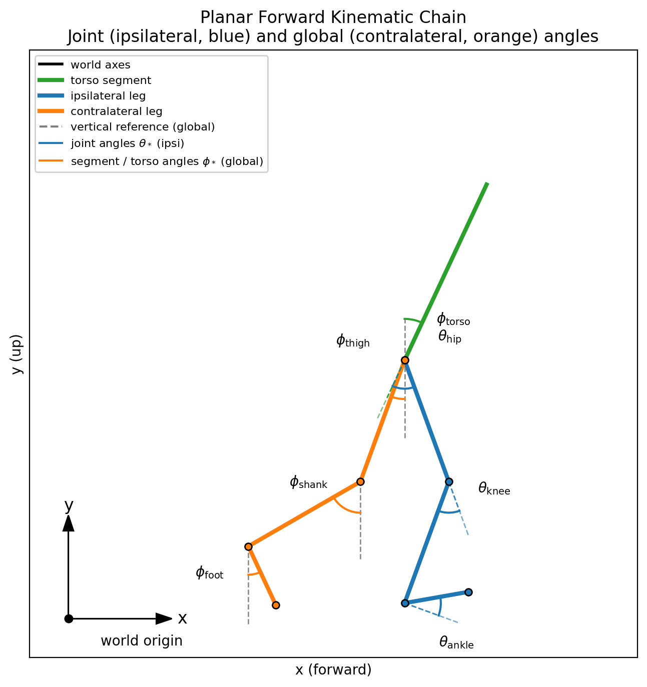

# Reference

### Planar Forward Kinematic Chain (Reference)

The planar leg model used for visualization and torque modeling follows this
forward kinematic chain and reference frame:

<!-- Generated by internal/plot_generation/generate_forward_kinematics_reference.py -->



Concise, complete description of what’s in the standardized data.

## Data Formats

| Format | File Pattern | Index | Purpose |
|-------|--------------|-------|---------|
| Phase‑Indexed | `*_phase.parquet` | 150 samples, 0–100% | Cross‑subject comparisons, averaging |
| Time‑Indexed | `*_time.parquet` | Seconds | Event detection, raw analysis |

Phase-aligned exports apply to cyclic gait data. Event-driven or non-cyclic activities should favor the time-indexed format, optionally providing per-repetition segments through the `step` column.

## Required Columns

| Column | Required | Meaning |
|--------|----------|---------|
| `subject` | Yes | Global unique ID (see Subject Naming) |
| `subject_metadata` | Optional | Demographics, key:value (e.g., `age:25,sex:M,height_m:1.75,weight_kg:70`) |
| `task` | Yes | Activity category (see Task Names) |
| `task_id` | Yes | Specific variant (see Task IDs) |
| `task_info` | Yes | Parameter string, key:value (see Task Metadata) |
| `step` | Yes | Cycle index within trial |
| `phase_ipsi` | Phase only | 0–100, phase of ipsilateral limb (heel‑strike to heel‑strike) |
| `time_s` | Time only | Seconds from trial start |

## Task Names, IDs, and Metadata

> The canonical list of task families lives in `internal/config_management/task_registry.py`.
> Update that module **and** this section whenever new tasks are introduced so that all
> tooling shares a single source of truth.

- Task names (`task`) capture the high-level motion family. Use neutral categories that apply across datasets, such as `level_walking`, `incline_walking`, `decline_walking`, `stair_ascent`, `stair_descent`, `run`, `walk_backward`, `sit_to_stand`, `stand_to_sit`, `step_up`, `step_down`, `jump`, `squats`, and the catch-all `functional_task` for non-cyclic or miscellaneous movements. Append population/pathology suffixes only when the entire recording targets that cohort. Use the convention `task_family_<pathology>` (e.g., `level_walking_stroke`, `run_pd`, `stair_descent_sci`). Keep suffix tokens lowercase snake_case (`stroke`, `pd`, `sci`, `tfa`, `tta`, etc.).
- Task IDs (`task_id`) describe the specific variant within the family, e.g., `level`, `incline_5deg`, `decline_10deg`, `stair_ascent`, `stair_descent`, `sit_to_stand_short`, `jump_vertical`. The exact vocabulary can differ by dataset, but it must remain stable inside a release.
- Task metadata (`task_info`) is a comma-separated key:value string carrying numeric parameters and variant tags. Values should prefer SI units and be machine-readable.

### Managing Task Families with the CLI

Use `python contributor_tools/manage_tasks.py` to add, delete, or list canonical task families without editing Python files by hand. Reach for the CLI when you introduce **new base families** that do not already exist in the registry. Examples:

- `python contributor_tools/manage_tasks.py list --category phase`
- `python contributor_tools/manage_tasks.py add lateral_walk --category phase --description "Side-step gait cycles" --example-id lateral --notes "Segment heel strikes the same way as level_walking."`
- `python contributor_tools/manage_tasks.py delete demo_task`

Pathology or cohort variants follow the `task_family_<pathology>` convention but do **not** require separate registry entries. Instead, create dedicated validation ranges for each suffix (e.g., `level_walking_stroke`) so tooling can read the cohort-specific tolerances. Validators never fall back to the able-bodied family values; use the interactive tuner to seed a new ranges file with the base family as an initializer before adjusting to the cohort norms.

Common task_info keys

- `speed_m_s:<float>`
- `treadmill:<true|false>`
- `incline_deg:<float>` (positive uphill, negative downhill)
- `step_height_m:<float>` (stairs)
- `step_width_m:<float>` (stairs)
- `surface:<string>` (e.g., overground, treadmill)
- `footwear:<string>` (e.g., barefoot, shoe)
- `assistance:<string>` (e.g., none, handrail)
- `transition_from:<task>` / `transition_to:<task>` (for mode switches)
- `turn_direction:<left|right|cw|ccw>` (for turning strides)
- `variant:<string>` (label specific instructions when no numeric parameter exists)

## Task Definitions

Task families fall into two groups. **Phase-friendly** tasks can be normalized to 150-sample strides when consistent events exist (and may also be exported in time if desired). **Time-indexed** tasks lack repeatable kinematic cycles or are best analyzed as continuous episodes. The tables below summarize each group; detailed notes follow.

### Phase-Friendly Families

When segmented, these tasks are normalized to 150 samples per stride with `phase_ipsi` running 0–100%. Phase output is preferred because it enables stride averaging and template validation; however, a time-indexed export is acceptable when segmentation is unavailable.

| Task | Typical behaviors | Example `task_id` values | Phase definition | Core metadata | Notes |
|------|-------------------|--------------------------|-----------------|----------------|-------|
| `level_walking` | Overground/treadmill at steady speed | `level`, `level_fast`, `level_slow` | 0% ipsilateral heel strike, 50% contralateral heel strike, 100% next ipsilateral heel strike | `speed_m_s`, `treadmill`, `surface` | Expect near-symmetric sagittal kinematics; large pelvis/trunk offsets flag coordinate issues. |
| `incline_walking` | Uphill ramps/treadmills | `incline_5deg`, `incline_10deg` | Same as level walking (HS-to-HS) | `incline_deg`, `treadmill`, `assistance` | Record grade and surface; uphill cycles show increased hip/knee flexion and trunk lean. |
| `decline_walking` | Downhill ramps/treadmills | `decline_5deg`, `decline_10deg` | Same as level walking with downhill HS events | `incline_deg` (negative), `treadmill` | Negative grades with delayed toe-off; expect larger eccentric knee moments. |
| `stair_ascent` | Ascending standard stairs | `stair_ascent`, numbered passes | 0% ipsilateral contact on current step, 100% ipsilateral contact on next step | `step_height_m`, `step_number`, `assistance` | Document geometry and handrail use; monitor hip/knee angles >90°. |
| `stair_descent` | Descending stairs | `stair_descent`, numbered passes | 0% upper-step contact, 100% lower-step contact for ipsilateral foot | `step_height_m`, `step_number`, `assistance` | Same metadata as ascent; eccentric control dominates mid-step. |
| `run` | Jogging/running with flight phases | `run_2_5_m_s`, `run_3_0_m_s` | 0% ipsilateral foot contact, 100% next ipsilateral contact including flight | `speed_m_s`, `treadmill`, `surface`, `footwear` | Two GRF peaks with flight intervals; watch pelvis rotation extremes. |
| `transition` | Gait-to-gait transitions | `walk_to_run`, `stair_to_walk`, `turn` | 0% key event of departing gait (e.g., heel strike), 100% first event of target gait | `transition_from`, `transition_to`, `gait_transition` | A single stride may cover two behaviors; store context keys and treat directions separately. |
| `sit_to_stand` / `stand_to_sit` | Chair or box transfers | `sit_to_stand`, `stand_to_sit` | 0% motion onset (velocity > 25 deg/s), 100% stable end state. GRF: sitting < 400N, standing > 600N. | `chair_height`, `armrests`, `variant` | See Sitting ↔ Standing archetype below. |
| `squat` | Loaded or bodyweight squats | `squat`, `squat_bodyweight`, `squat_25lbs` | 0% stable standing, ~50% lowest depth, 100% stable standing. | `weight_lbs`, `variant` | See Standing → Action → Standing archetype below. |
| `step_up` / `step_down` | Stair-box repetitions, curbs | `step_up`, `step_down` | Step-up: 0% initial foot contact on box, 100% full weight on box. Step-down mirrors with lower surface contact. | `height_m`, `lead_leg`, `step_number` | Treat like short stair runs; ensure cadence is repeatable before phase export. |
| `jump` | Hops, vertical/lateral jumps | `jump_vertical`, `jump_lateral`, `jump_hop` | 0% stable standing, ~50% flight phase (GRF < 50N), 100% stable standing. | `jump_type`, `variant`, `lead_leg` | See Standing → Action → Standing archetype below. |
| `weighted_walk`, `dynamic_walk`, `walk_backward` | Walking variants with perturbations | `level`, `variant:<string>` | Same as level walking (HS-to-HS) when heel strikes are present | `speed_m_s`, `treadmill`, `variant` | Prefer phase when heel strikes exist; otherwise document perturbation under `variant`. |

### Segmentation Archetypes

Phase-friendly tasks use one of three segmentation archetypes:

#### Heel Strike to Heel Strike (Gait)

Gait tasks are segmented using ipsilateral heel strikes as cycle boundaries:

```
Ipsi Heel Strike → Ipsi Stance → Ipsi Toe Off → Ipsi Swing → Ipsi Heel Strike
       0%              0-60%          ~60%         60-100%         100%
```

| Phase (%) | Event |
|-----------|-------|
| 0% | Ipsilateral heel strike (initial contact) |
| ~10% | Foot flat (loading response complete) |
| ~30% | Midstance (single-limb support) |
| ~50% | Contralateral heel strike |
| ~60% | Ipsilateral toe off (swing begins) |
| 100% | Next ipsilateral heel strike |

**Heel strike detection** uses GRF threshold crossings (typically 20-50N). When GRF is unavailable, use foot velocity minima or shank angle.

**Applies to**: `level_walking`, `incline_walking`, `decline_walking`, `stair_ascent`, `stair_descent`, `run`, `walk_backward`

#### Standing → Action → Standing

Tasks that begin and end in stable standing, with a discrete action in between. Stable standing requires GRF > 600N AND joint velocity < 25 deg/s.

**Jump** (`jump`):
```
Stable Standing → Countermovement → Takeoff → Flight → Landing → Stable Standing
       0%            ~20-40%        ~40-50%   ~50-60%   ~60-80%       100%
```

| Parameter | Value | Description |
|-----------|-------|-------------|
| FlightThreshold | 50 N | GRF below which subject is in flight |
| StandingThreshold | 600 N | GRF above which subject is standing |
| VelocityThreshold | 25 deg/s | Joint velocity below which motion is stable |

**Squat** (`squat`):
```
Stable Standing → Descent → Lowest Depth → Ascent → Stable Standing
       0%          ~25%         ~50%        ~75%        100%
```

Same detection parameters as jump, but no flight phase. Segment boundaries at stable standing states.

#### Sitting ↔ Standing Transfers

Tasks that transition between seated and standing states using GRF-based state detection combined with joint velocity thresholds.

**Sit-to-stand** (`sit_to_stand`):
```
Stable Sitting → Motion Onset → Rising → Motion Offset → Stable Standing
                      0%                                      100%
```

**Stand-to-sit** (`stand_to_sit`):
```
Stable Standing → Motion Onset → Lowering → Motion Offset → Stable Sitting
                       0%                                        100%
```

| Parameter | Value | Description |
|-----------|-------|-------------|
| SittingThreshold | 400 N | GRF below which subject is sitting |
| StandingThreshold | 600 N | GRF above which subject is standing |
| VelocityThreshold | 25 deg/s | Joint velocity threshold for motion onset/offset |

Motion onset is detected when joint velocity exceeds 25 deg/s; motion offset when it drops below.

### Time-Indexed (Non-Cyclic) Families

Export these tasks as time-indexed episodes. They lack consistent heel-strike structure, involve perturbations that break cyclic assumptions, or represent single-shot activities. If future datasets introduce segmentation for any of these behaviors, they can graduate to the phase-friendly group.

| Task | Typical behaviors | Example activities / `task_id` | Required metadata | Notes |
|------|-------------------|-----------------------------|-------------------|-------|
| `agility_drill` | Multi-directional or cadence-driven drills without steady gait cycles | `side_shuffle`, `tire_run`, `dynamic_walk_high_knees`, `turn_and_step_left` | `variant`, `direction`, `cadence_hz`, `surface` | Capture cueing or treadmill settings; use when strides vary too much for phase export. |
| `cutting` | Athletic cuts with large heading changes | `cutting_left_fast`, `cutting_right_slow` | `direction`, `approach_speed_m_s`, `turn_angle_deg`, `surface` | Keep entire maneuver in time to preserve path-dependent kinetics. |
| `free_walk_episode` | Episodic or exploratory walking sequences | `meander`, `start_stop`, `obstacle_walk` | `surface`, `segment_start_s`, `segment_end_s`, `treadmill` | Use for trials with frequent pauses/obstacles where heel-strike segmentation is unreliable. |
| `load_handling` | Asymmetric lifts, carries, or object exchanges | `lift_weight_25lbs_l_c`, `ball_toss_center` | `load_kg`, `hand`, `pickup_height`, `dropoff_height`, `direction` | Document object mass and interaction side so bias/torque effects are traceable. |
| `perturbation` | External pushes/pulls or cooperative force tasks | `push_forward`, `tug_of_war`, `twister` | `direction`, `magnitude`, `support`, `implements` | Distinguish voluntary vs. reactive responses via metadata (e.g., `initiated_by:experimenter`). |
| `balance_pose` | Static or quasi-static holds | `poses_single_leg`, `poses_wide_stance`, `squat_hold` | `variant`, `duration_s`, `support` | Useful for calibration and balance assessments; ensure durations cover full hold. |
| `functional_task` | Miscellaneous non-cyclic behaviors not covered above | `variant:<string>` | `variant`, contextual keys as needed | Use sparingly; prefer one of the specific families when possible. |

When new datasets introduce additional behaviors, extend the table with the task family, expected metadata, and note whether improved segmentation would allow promotion to the phase-friendly bucket.

## Subject Naming

Format: `<DATASET_CODE>_<POPULATION_CODE><SUBJECT_NUMBER>` → e.g., `DS23_AB05`, `DS21_TFA03`. Keep subject numbers zero-padded to two digits where possible to aid sorting.

Population codes

| Code | Population | Recommended task suffix |
|------|------------|-------------------------|
| AB | Able‑bodied | (omit) |
| TFA | Transfemoral amputee | `tfa` |
| TTA | Transtibial amputee | `tta` |
| CVA | Stroke | `stroke` or `cva` |
| PD | Parkinson’s | `pd` |
| SCI | Spinal cord injury | `sci` |
| CP | Cerebral palsy | `cp` |
| TKA | Total knee arthroplasty | `tka` |
| THA | Total hip arthroplasty | `tha` |
| MS | Multiple sclerosis | `ms` |


## Subject Metadata

Optional demographics and clinical context stored in `subject_metadata` as comma‑separated key:value pairs.

Common keys

- `age:<int>`
- `sex:<M|F|Other>`
- `height_m:<float>`
- `weight_kg:<float>`
- `leg_dominance:<left|right|unknown>`
- `impairment:<string>` (e.g., stroke, pd, sci)
- `prosthesis_type:<string>` (e.g., TFA, TTA)
- `prosthesis_side:<ipsi|contra|left|right>`
- `clinical_scores:<string>` (e.g., FuglMeyer:28)
- `notes:<string>` (short free text)

## Variables (What Columns Mean)

Naming pattern:
- Joint/segment variables: `<joint/segment>_<motion>_<measurement>_<side>_<unit>`
- GRF / CoP variables: `<signal_type>_<axis>_<side>_<unit>` (e.g., `grf_vertical_ipsi_BW`, `cop_anterior_contra_m`)

Key categories

- Kinematics (angles): `*_angle_*_rad`
- Kinetics (moments/forces): `*_moment_*_Nm_kg` (mass-normalized)
- Ground reaction forces (GRF): `*_grf_*_BW` (body-weight-normalized)
- Segment orientations: `pelvis_*_angle_rad`, `trunk_*_angle_rad`, `thigh_*_angle_*_rad`, `shank_*_angle_*_rad`, `foot_*_angle_*_rad`

Sides

- `ipsi`: limb that defines phase (`phase_ipsi` is 0% at its heel strike)
- `contra`: opposite limb (≈ 50% phase offset in level walking)

Units

- Angles in radians (`*_rad`)
- Moments are mass‑normalized (`*_Nm_kg`)
- GRFs are body‑weight‑normalized (`*_BW`)

## Column Catalog

Canonical Python lists live in `src/locohub/feature_constants.py` (`PHASE_CANONICAL_COLUMNS`, `TIME_CANONICAL_COLUMNS`, and `CANONICAL_COLUMN_GROUPS`) to keep converters, validators, and docs aligned.

Complete list of standard column names used in the conversion scripts and examples. Columns are grouped by category; sides are `ipsi` and `contra` unless noted.

- Required schema: `subject`, `subject_metadata`, `task`, `task_id`, `task_info`, `step`, `phase_ipsi` (phase‑indexed) or `time_s` (time‑indexed)
- Optional schema: `phase_contra`, `dataset`, `collection_date`, `processing_date`

Kinematics — joint angles (radians)

- `hip_flexion_angle_{ipsi,contra}_rad`
- `hip_adduction_angle_{ipsi,contra}_rad`
- `knee_flexion_angle_{ipsi,contra}_rad`
- `ankle_dorsiflexion_angle_{ipsi,contra}_rad`

Kinetics — joint moments (Nm/kg)

- `hip_flexion_moment_{ipsi,contra}_Nm_kg`
- `knee_flexion_moment_{ipsi,contra}_Nm_kg`
- `ankle_dorsiflexion_moment_{ipsi,contra}_Nm_kg`

Segment/link orientations (radians)

- Pelvis: `pelvis_sagittal_angle_rad`, `pelvis_frontal_angle_rad`, `pelvis_transverse_angle_rad`
- Trunk: `trunk_sagittal_angle_rad`, `trunk_frontal_angle_rad`, `trunk_transverse_angle_rad`
- Thigh: `thigh_sagittal_angle_{ipsi,contra}_rad`
- Shank: `shank_sagittal_angle_{ipsi,contra}_rad`
- Foot: `foot_sagittal_angle_{ipsi,contra}_rad`

Angular velocities (radians/second)

- `hip_flexion_velocity_{ipsi,contra}_rad_s`
- `knee_flexion_velocity_{ipsi,contra}_rad_s`
- `ankle_dorsiflexion_velocity_{ipsi,contra}_rad_s`

Angular accelerations (radians/second^2)

- `hip_flexion_acceleration_{ipsi,contra}_rad_s2`
- `knee_flexion_acceleration_{ipsi,contra}_rad_s2`
- `ankle_dorsiflexion_acceleration_{ipsi,contra}_rad_s2`

Ground reaction forces (BW)

- Vertical: `grf_vertical_{ipsi,contra}_BW`
- Anterior–posterior: `grf_anterior_{ipsi,contra}_BW`
- Medio–lateral: `grf_lateral_{ipsi,contra}_BW`

Center of pressure (meters)

- `cop_anterior_{ipsi,contra}_m`
- `cop_lateral_{ipsi,contra}_m`


## Coordinate & Sign Conventions

OpenSim right‑handed frames. Positive rotations follow right‑hand rule.

- Hip flexion (+): thigh forward; Knee flexion (+): heel toward buttocks
- Ankle dorsiflexion (+): toes up; Pelvis sagittal (+): anterior tilt

## Row & Phase/Time Semantics

- Each row = one sample within a step/cycle for a subject+task.
- Phase‑indexed: `phase_ipsi` runs 0→100% in each gait cycle of the ipsilateral limb (150 samples).
- Contra limb is approximately 50% offset in level walking.
- Time‑indexed: `time_s` increases monotonically; cycles delimited by gait events.

## GRF & CoP Variables

- GRF components: `grf_vertical_*`, `grf_anterior_*`, `grf_lateral_*` with suffix `_BW` or `_N`.
- Center of pressure: `cop_anterior_*_m`, `cop_lateral_*_m`, `cop_vertical_*_m` (meters), side‑specific where applicable.

## Naming Rules

- Lowercase snake_case; tokens separated by single underscores.
- Use exact unit suffix tokens: `rad`, `Nm_kg`, `BW`, `m`, `s`.
- Segment/global (no side): e.g., `pelvis_*_angle_rad`, `trunk_*_angle_rad`.
- Side tokens: `ipsi` or `contra` only.

## Optional Columns & Flags

- `phase_contra` (percent): contra limb phase, if present.
- `cycle_id`: optional alias of `step`.
- `dataset`: dataset identifier; `collection_date`, `processing_date` (ISO strings) if available.
- Quality flags (boolean): e.g., `is_reconstructed_<side>` for interpolated values.

Canonical phase column is `phase_ipsi`.


## Related

- Datasets overview: ../datasets/
- Validation ranges: ../datasets/validation_ranges.md
- Maintainers: ../maintainers/
