# Validation Ranges

**Biomechanically validated ranges for locomotion data quality assessment**

## Configuration Metadata

- **Source Config**: `validation_ranges.yaml`
- **Generated**: 2025-08-03 15:29:41
- **Source Dataset**: umich_2021_phase.parquet
- **Method**: 95th percentile
- **Description**: Consolidated validation ranges for all biomechanical features

## Feature Categories

- **Kinematic**: angles, velocities
- **Kinetic**: moments, forces

## Task: Decline Walking

### Forward Kinematics Visualizations

Joint angle ranges visualized at key gait phases:

| Phase 0% | Phase 25% | Phase 50% | Phase 75% |
|---|---|---|---|
| 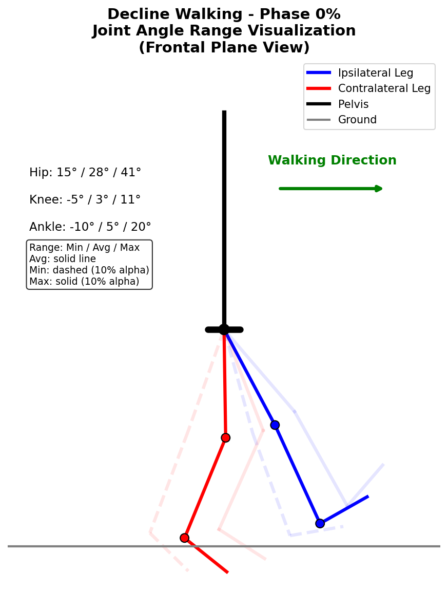 | 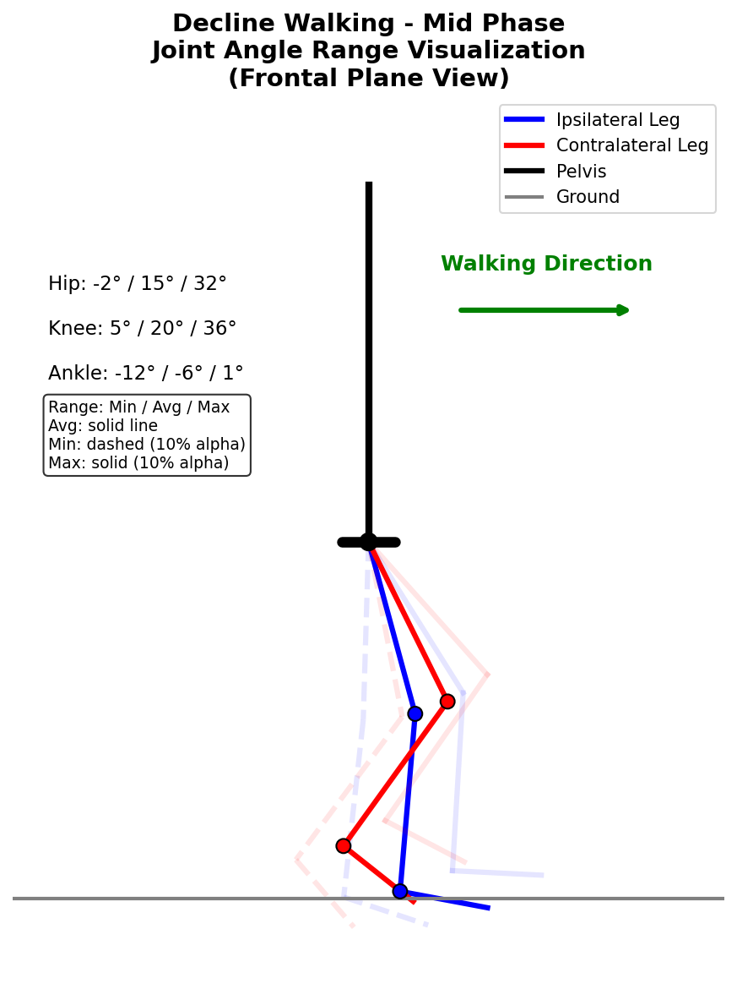 | 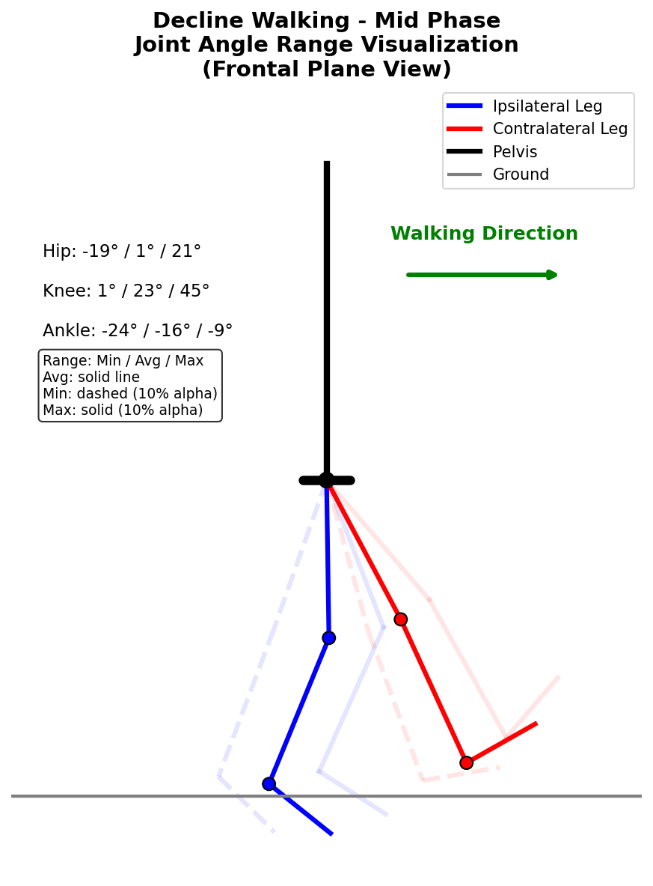 | 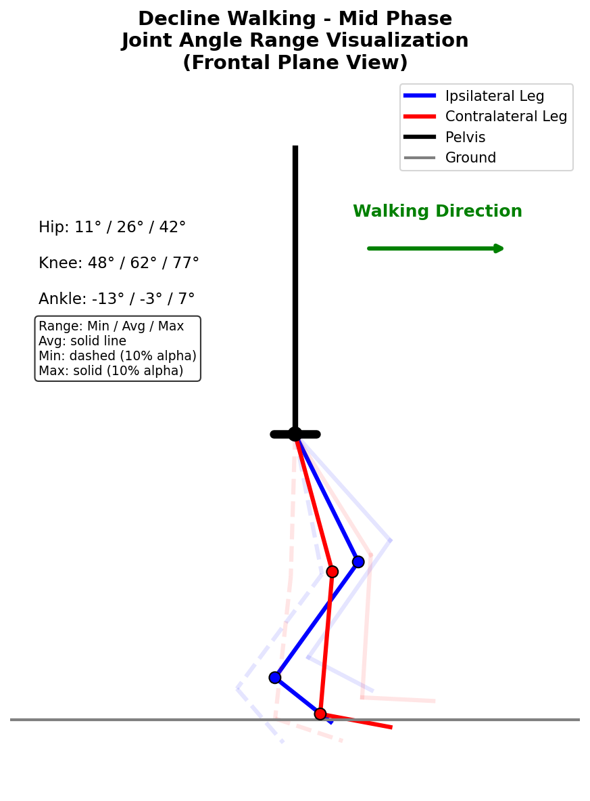 |

### Phase-Based Visualizations

Validation ranges across the full gait cycle (0-100% phase):

#### Kinematic Variables
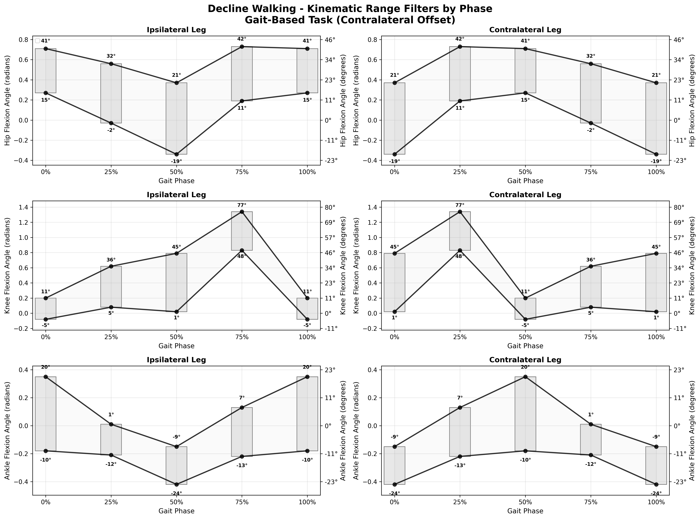

#### Kinetic Variables
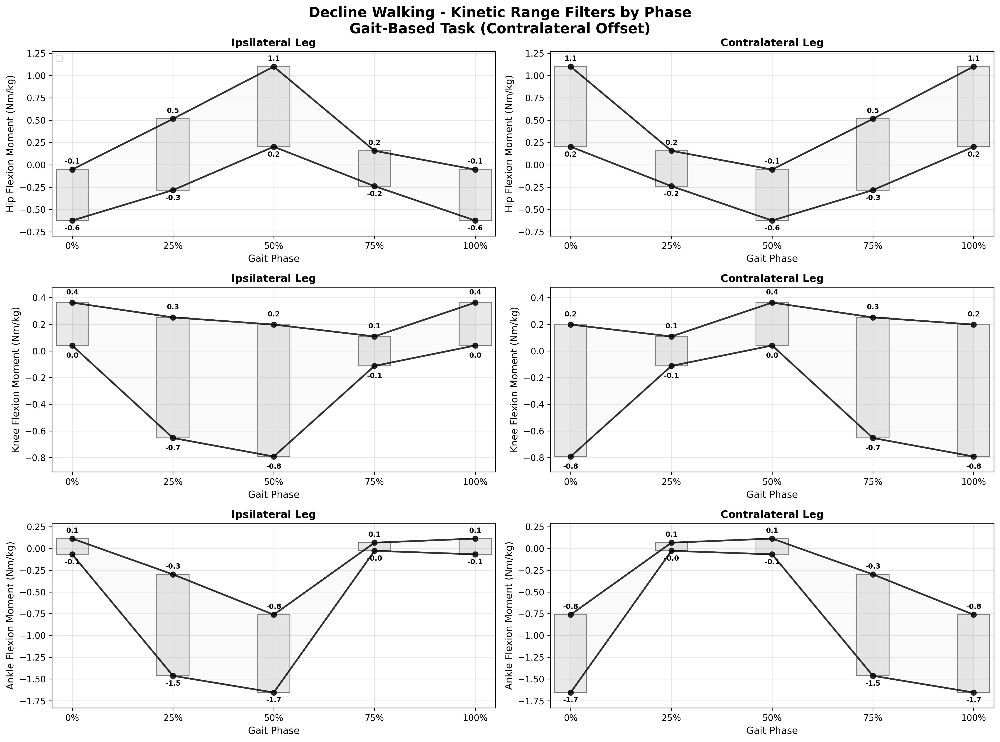

### Phase-Specific Validation Ranges

#### Kinematic Variables (rad, rad/s)
| Variable | Phase 0% | Phase 25% | Phase 50% | Phase 75% |
|---|---|---|---|---|
| `ankle_flexion_angle_ipsi_rad` | [-0.18, 0.35] | [-0.21, 0.01] | [-0.42, -0.15] | [-0.22, 0.13] |
| `hip_flexion_angle_ipsi_rad` | [0.27, 0.71] | [-0.03, 0.56] | [-0.34, 0.37] | [0.19, 0.73] |
| `knee_flexion_angle_ipsi_rad` | [-0.08, 0.20] | [0.08, 0.62] | [0.02, 0.79] | [0.83, 1.34] |

#### Kinetic Variables (Nm, N)
| Variable | Phase 0% | Phase 25% | Phase 50% | Phase 75% |
|---|---|---|---|---|
| `ankle_adduction_moment_contra_Nm` | [-0.09, 0.30] | [-0.00, 0.18] | [-0.06, 0.02] | [-0.11, 0.23] |
| `ankle_adduction_moment_ipsi_Nm` | [-0.06, 0.02] | [-0.11, 0.23] | [-0.09, 0.30] | [-0.00, 0.18] |
| `ankle_flexion_moment_contra_Nm` | [-1.66, -0.76] | [-0.03, 0.07] | [-0.07, 0.11] | [-1.46, -0.30] |
| `ankle_flexion_moment_ipsi_Nm` | [-0.07, 0.11] | [-1.46, -0.30] | [-1.66, -0.76] | [-0.03, 0.07] |
| `ankle_rotation_moment_contra_Nm` | [-0.02, 0.19] | [-0.15, 0.02] | [-0.18, 0.04] | [-0.29, 0.12] |
| `ankle_rotation_moment_ipsi_Nm` | [-0.18, 0.04] | [-0.29, 0.12] | [-0.02, 0.19] | [-0.15, 0.02] |
| `hip_adduction_moment_contra_Nm` | [0.14, 0.85] | [-0.04, 0.22] | [-0.15, 0.18] | [0.36, 0.96] |
| `hip_adduction_moment_ipsi_Nm` | [-0.15, 0.18] | [0.36, 0.96] | [0.14, 0.85] | [-0.04, 0.22] |
| `hip_flexion_moment_contra_Nm` | [0.20, 1.10] | [-0.24, 0.16] | [-0.62, -0.05] | [-0.28, 0.52] |
| `hip_flexion_moment_ipsi_Nm` | [-0.62, -0.05] | [-0.28, 0.52] | [0.20, 1.10] | [-0.24, 0.16] |
| `hip_rotation_moment_contra_Nm` | [-0.21, 0.10] | [-0.35, 0.01] | [-0.17, 0.06] | [-0.43, 0.04] |
| `hip_rotation_moment_ipsi_Nm` | [-0.17, 0.06] | [-0.43, 0.04] | [-0.21, 0.10] | [-0.35, 0.01] |
| `knee_adduction_moment_contra_Nm` | [-0.01, 0.54] | [-0.02, 0.31] | [-0.08, 0.11] | [0.06, 0.62] |
| `knee_adduction_moment_ipsi_Nm` | [-0.08, 0.11] | [0.06, 0.62] | [-0.01, 0.54] | [-0.02, 0.31] |
| `knee_flexion_moment_contra_Nm` | [-0.79, 0.20] | [-0.11, 0.11] | [0.04, 0.36] | [-0.65, 0.25] |
| `knee_flexion_moment_ipsi_Nm` | [0.04, 0.36] | [-0.65, 0.25] | [-0.79, 0.20] | [-0.11, 0.11] |
| `knee_rotation_moment_contra_Nm` | [-0.04, 0.19] | [-0.12, 0.02] | [-0.19, 0.04] | [-0.27, 0.14] |
| `knee_rotation_moment_ipsi_Nm` | [-0.19, 0.04] | [-0.27, 0.14] | [-0.04, 0.19] | [-0.12, 0.02] |

## Task: Incline Walking

### Forward Kinematics Visualizations

Joint angle ranges visualized at key gait phases:

| Phase 0% | Phase 25% | Phase 50% | Phase 75% |
|---|---|---|---|
| 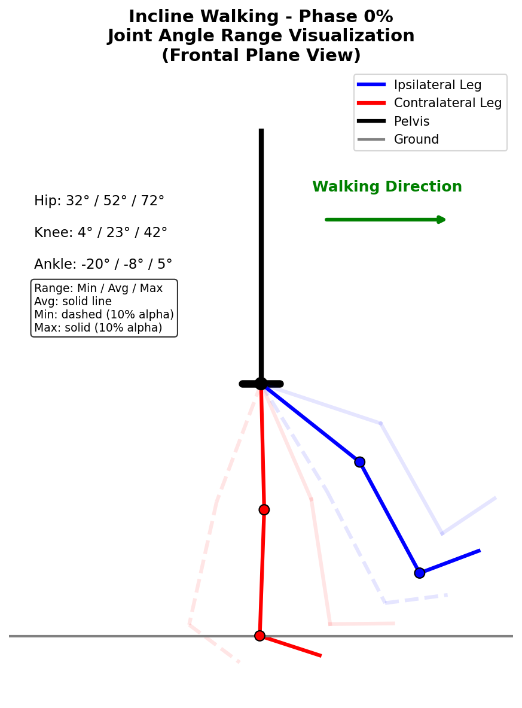 | 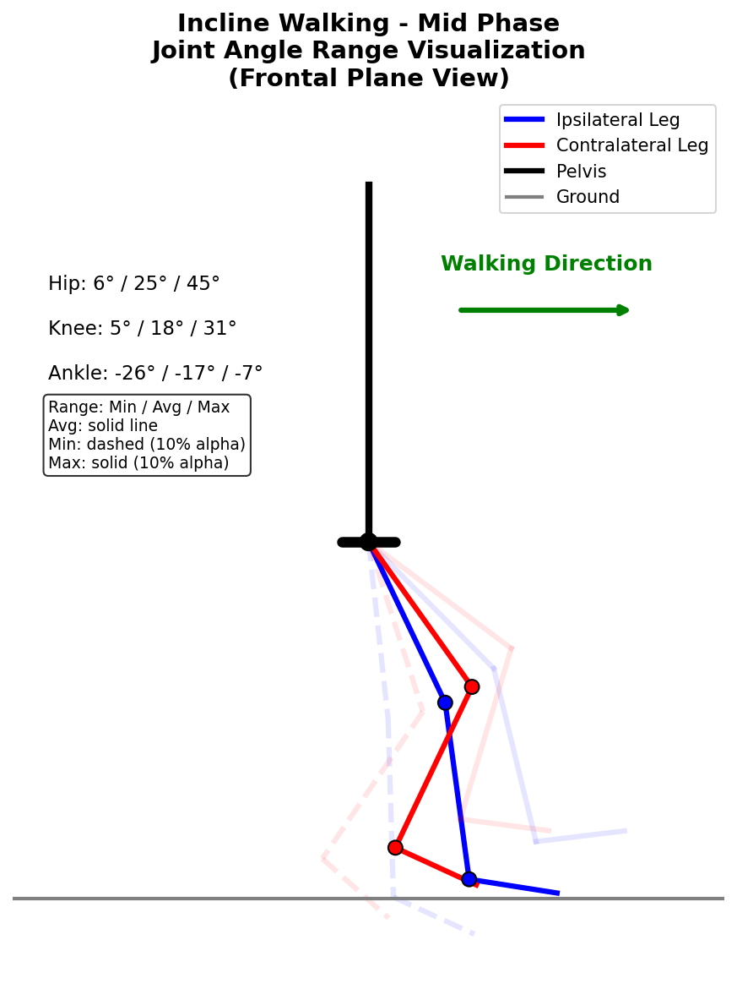 | 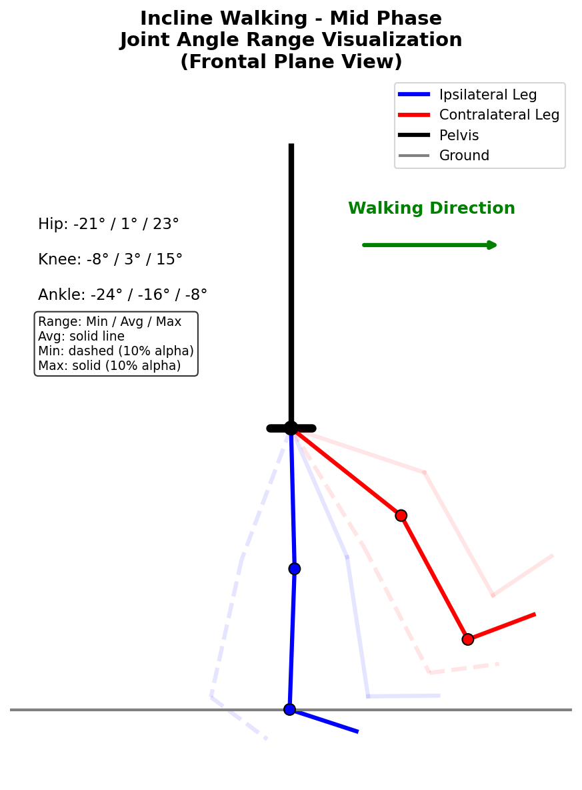 | 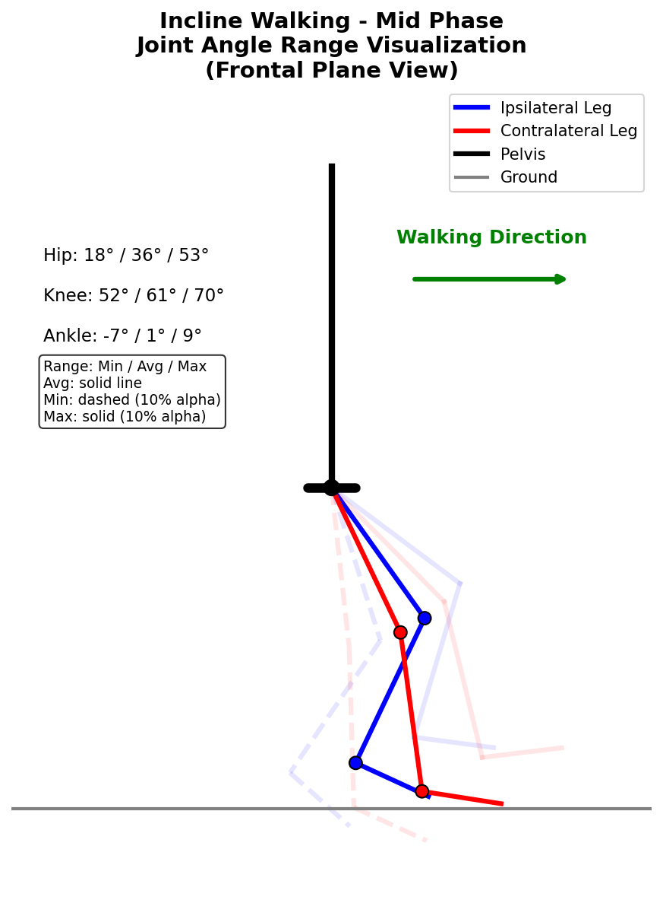 |

### Phase-Based Visualizations

Validation ranges across the full gait cycle (0-100% phase):

#### Kinematic Variables
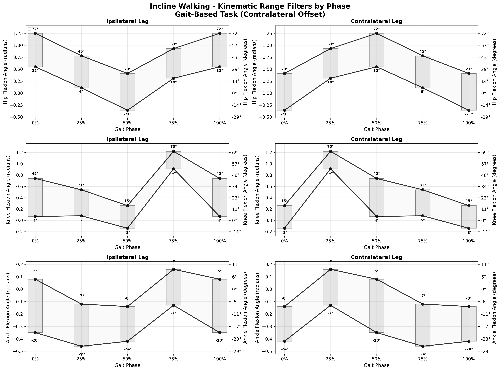

#### Kinetic Variables
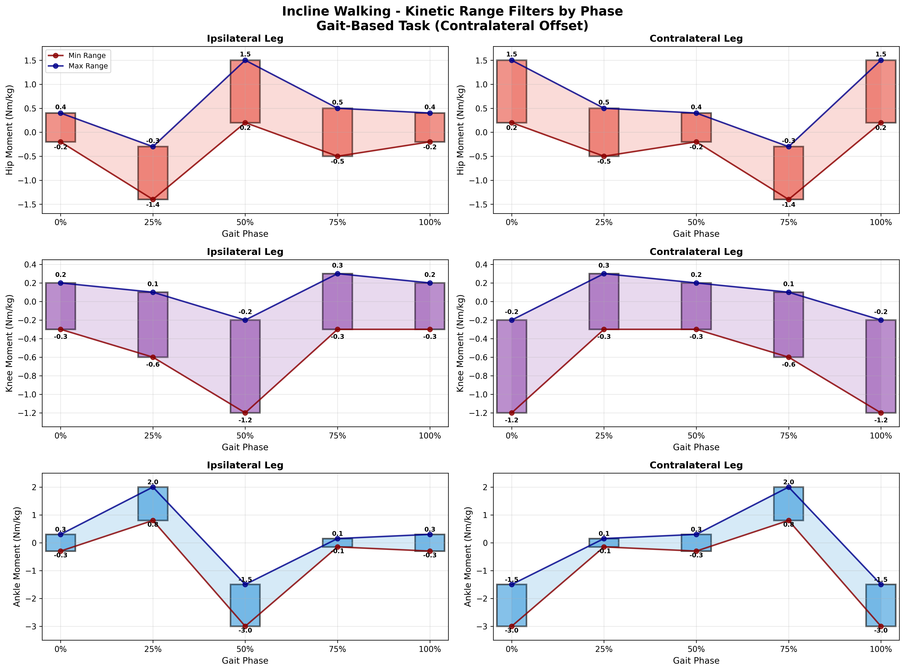

### Phase-Specific Validation Ranges

#### Kinematic Variables (rad, rad/s)
| Variable | Phase 0% | Phase 25% | Phase 50% | Phase 75% |
|---|---|---|---|---|
| `ankle_flexion_angle_ipsi_rad` | [-0.35, 0.08] | [-0.46, -0.12] | [-0.42, -0.14] | [-0.13, 0.16] |
| `hip_flexion_angle_ipsi_rad` | [0.55, 1.25] | [0.11, 0.78] | [-0.36, 0.41] | [0.31, 0.93] |
| `knee_flexion_angle_ipsi_rad` | [0.07, 0.74] | [0.08, 0.54] | [-0.14, 0.26] | [0.91, 1.22] |

#### Kinetic Variables (Nm, N)
| Variable | Phase 0% | Phase 25% | Phase 50% | Phase 75% |
|---|---|---|---|---|
| `ankle_adduction_moment_contra_Nm` | [nan, nan] | [nan, nan] | [nan, nan] | [nan, nan] |
| `ankle_adduction_moment_ipsi_Nm` | [nan, nan] | [nan, nan] | [nan, nan] | [nan, nan] |
| `ankle_flexion_moment_contra_Nm` | [nan, nan] | [nan, nan] | [nan, nan] | [nan, nan] |
| `ankle_flexion_moment_ipsi_Nm` | [nan, nan] | [nan, nan] | [nan, nan] | [nan, nan] |
| `ankle_rotation_moment_contra_Nm` | [nan, nan] | [nan, nan] | [nan, nan] | [nan, nan] |
| `ankle_rotation_moment_ipsi_Nm` | [nan, nan] | [nan, nan] | [nan, nan] | [nan, nan] |
| `hip_adduction_moment_contra_Nm` | [nan, nan] | [nan, nan] | [nan, nan] | [nan, nan] |
| `hip_adduction_moment_ipsi_Nm` | [nan, nan] | [nan, nan] | [nan, nan] | [nan, nan] |
| `hip_flexion_moment_contra_Nm` | [nan, nan] | [nan, nan] | [nan, nan] | [nan, nan] |
| `hip_flexion_moment_ipsi_Nm` | [nan, nan] | [nan, nan] | [nan, nan] | [nan, nan] |
| `hip_rotation_moment_contra_Nm` | [nan, nan] | [nan, nan] | [nan, nan] | [nan, nan] |
| `hip_rotation_moment_ipsi_Nm` | [nan, nan] | [nan, nan] | [nan, nan] | [nan, nan] |
| `knee_adduction_moment_contra_Nm` | [nan, nan] | [nan, nan] | [nan, nan] | [nan, nan] |
| `knee_adduction_moment_ipsi_Nm` | [nan, nan] | [nan, nan] | [nan, nan] | [nan, nan] |
| `knee_flexion_moment_contra_Nm` | [nan, nan] | [nan, nan] | [nan, nan] | [nan, nan] |
| `knee_flexion_moment_ipsi_Nm` | [nan, nan] | [nan, nan] | [nan, nan] | [nan, nan] |
| `knee_rotation_moment_contra_Nm` | [nan, nan] | [nan, nan] | [nan, nan] | [nan, nan] |
| `knee_rotation_moment_ipsi_Nm` | [nan, nan] | [nan, nan] | [nan, nan] | [nan, nan] |

## Task: Level Walking

### Forward Kinematics Visualizations

Joint angle ranges visualized at key gait phases:

| Phase 0% | Phase 25% | Phase 50% | Phase 75% |
|---|---|---|---|
|  | 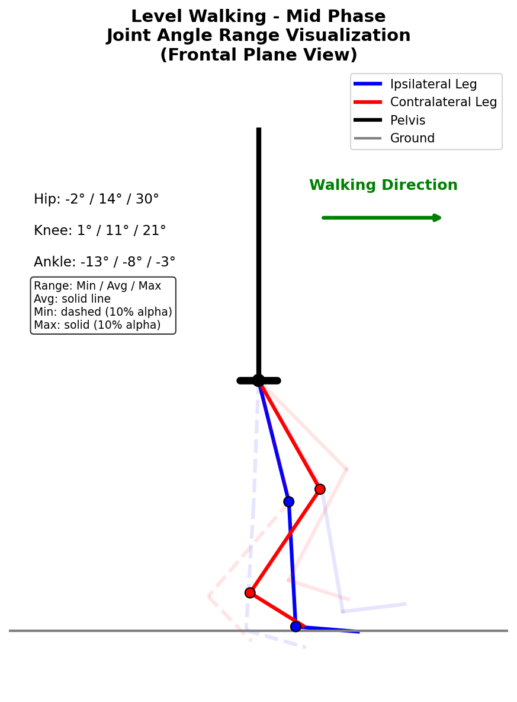 |  | 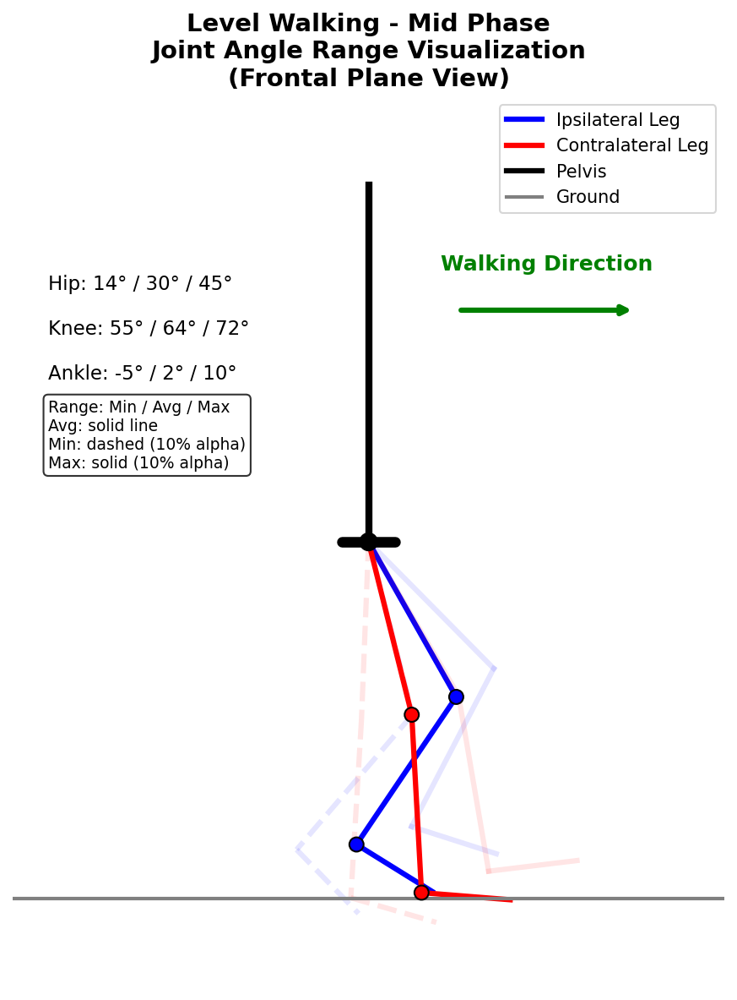 |

### Phase-Based Visualizations

Validation ranges across the full gait cycle (0-100% phase):

#### Kinematic Variables
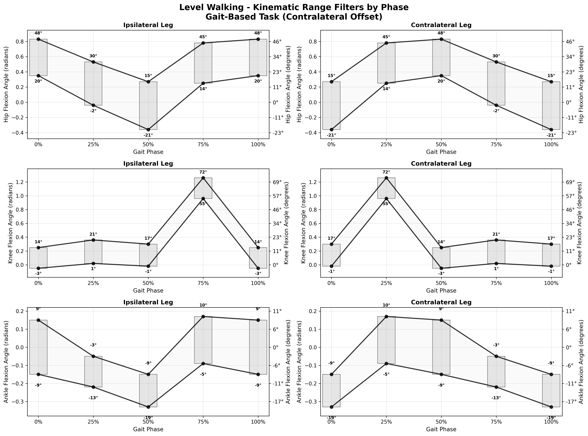

#### Kinetic Variables
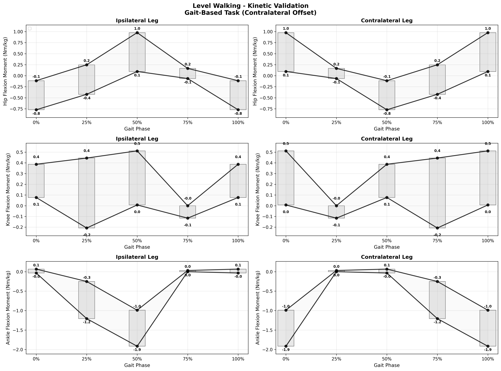

### Phase-Specific Validation Ranges

#### Kinematic Variables (rad, rad/s)
| Variable | Phase 0% | Phase 25% | Phase 50% | Phase 75% |
|---|---|---|---|---|
| `ankle_flexion_angle_ipsi_rad` | [-0.15, 0.15] | [-0.22, -0.05] | [-0.33, -0.15] | [-0.09, 0.17] |
| `hip_flexion_angle_ipsi_rad` | [0.35, 0.83] | [-0.04, 0.53] | [-0.36, 0.27] | [0.25, 0.78] |
| `knee_flexion_angle_ipsi_rad` | [-0.05, 0.25] | [0.02, 0.36] | [-0.02, 0.30] | [0.96, 1.26] |

#### Kinetic Variables (Nm, N)
| Variable | Phase 0% | Phase 25% | Phase 50% | Phase 75% |
|---|---|---|---|---|
| `ankle_adduction_moment_contra_Nm` | [-0.09, 0.26] | [-0.00, 0.00] | [-0.02, 0.06] | [-0.16, 0.19] |
| `ankle_adduction_moment_ipsi_Nm` | [-0.02, 0.06] | [-0.16, 0.19] | [-0.09, 0.26] | [-0.00, 0.00] |
| `ankle_flexion_moment_contra_Nm` | [-1.92, -0.99] | [0.00, 0.03] | [-0.03, 0.07] | [-1.21, -0.25] |
| `ankle_flexion_moment_ipsi_Nm` | [-0.03, 0.07] | [-1.21, -0.25] | [-1.92, -0.99] | [0.00, 0.03] |
| `ankle_rotation_moment_contra_Nm` | [-0.01, 0.17] | [-0.01, 0.02] | [-0.02, 0.02] | [-0.02, 0.13] |
| `ankle_rotation_moment_ipsi_Nm` | [-0.02, 0.02] | [-0.02, 0.13] | [-0.01, 0.17] | [-0.01, 0.02] |
| `hip_adduction_moment_contra_Nm` | [0.14, 0.83] | [-0.06, 0.15] | [-0.19, 0.15] | [0.32, 0.87] |
| `hip_adduction_moment_ipsi_Nm` | [-0.19, 0.15] | [0.32, 0.87] | [0.14, 0.83] | [-0.06, 0.15] |
| `hip_flexion_moment_contra_Nm` | [0.10, 0.98] | [-0.06, 0.17] | [-0.77, -0.11] | [-0.42, 0.25] |
| `hip_flexion_moment_ipsi_Nm` | [-0.77, -0.11] | [-0.42, 0.25] | [0.10, 0.98] | [-0.06, 0.17] |
| `hip_rotation_moment_contra_Nm` | [0.01, 0.15] | [-0.04, 0.01] | [-0.03, 0.05] | [-0.03, 0.09] |
| `hip_rotation_moment_ipsi_Nm` | [-0.03, 0.05] | [-0.03, 0.09] | [0.01, 0.15] | [-0.04, 0.01] |
| `knee_adduction_moment_contra_Nm` | [-0.18, 0.37] | [-0.03, 0.06] | [-0.08, 0.09] | [-0.00, 0.52] |
| `knee_adduction_moment_ipsi_Nm` | [-0.08, 0.09] | [-0.00, 0.52] | [-0.18, 0.37] | [-0.03, 0.06] |
| `knee_flexion_moment_contra_Nm` | [0.01, 0.51] | [-0.12, -0.00] | [0.08, 0.39] | [-0.21, 0.45] |
| `knee_flexion_moment_ipsi_Nm` | [0.08, 0.39] | [-0.21, 0.45] | [0.01, 0.51] | [-0.12, -0.00] |
| `knee_rotation_moment_contra_Nm` | [-0.04, 0.20] | [-0.01, 0.02] | [-0.02, 0.02] | [-0.01, 0.15] |
| `knee_rotation_moment_ipsi_Nm` | [-0.02, 0.02] | [-0.01, 0.15] | [-0.04, 0.20] | [-0.01, 0.02] |

---

*Generated from `validation_ranges.yaml` on 2025-08-03 15:54:29*