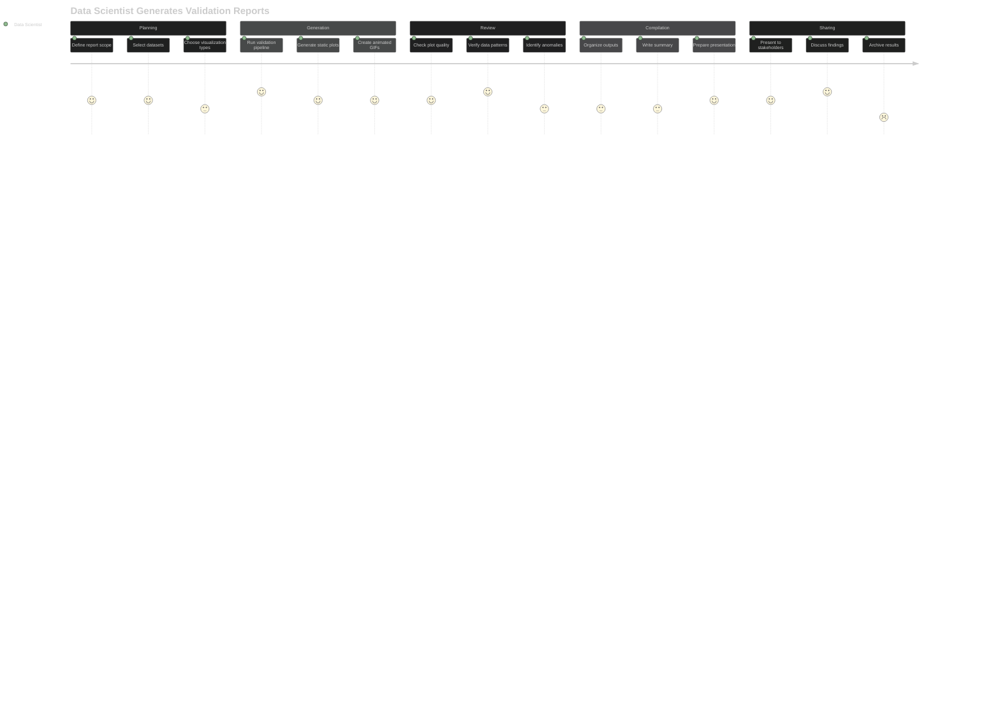

# User Journey Maps

## Dataset Consumers (90% - Future Focus)

The following journeys represent the primary users who will consume standardized datasets for research and analysis.

## Journey 1: Graduate Student Needs Gait Data for Exoskeleton Control

**Pain Points:**
- Confusing variable naming conventions across datasets
- Unclear biomechanical coordinate systems and sign conventions
- Missing documentation about data collection protocols
- Difficulty extracting phase-specific control parameters

**Emotional Journey:**
- **Discovery**: Excitement finding standardized locomotion data
- **Understanding**: Frustration with complex biomechanical conventions
- **Access**: Relief that data loads easily into existing workflow
- **Analysis**: Satisfaction with rich, clean datasets
- **Implementation**: Confidence in robust control system development

### **Journey 1 - Alternate Failure Flows**

**Failure Recovery Strategies:**
- **Discovery Issues**: Multiple search strategies, direct author contact
- **Access Problems**: Mirror sites, maintainer contact, patience with server issues
- **Format Problems**: Manual variable mapping, custom scripts, documentation reading
- **Quality Issues**: Data cleaning, subset selection, quality vs quantity tradeoffs

**Critical Success Factors for Recovery:**
- Clear error messages and troubleshooting guides
- Alternative download methods and mirror sites
- Comprehensive variable mapping documentation
- Community forums for getting help from other users

---

## Journey 2: Clinical Researcher Compares Patient Data to Healthy Norms

**Pain Points:**
- Uncertainty about appropriate healthy reference populations
- Converting patient data to match standard format
- Understanding statistical significance of deviations
- Proper attribution and citation requirements

**Emotional Journey:**
- **Project Setup**: Confidence in finding quality reference data
- **Data Preparation**: Satisfaction with easy data access
- **Patient Analysis**: Excitement discovering clear patterns
- **Interpretation**: Professional fulfillment helping patients
- **Publication**: Pride in contributing to clinical knowledge

### **Journey 2 - Alternate Failure Flows**

**Failure Recovery Strategies:**
- **Setup Issues**: Scope adjustment, composite datasets, population matching alternatives
- **Data Problems**: Multiple sources, statistical corrections, limitation documentation
- **Analysis Issues**: Format conversion tools, proxy variables, alternative statistics
- **Publication Issues**: Multiple submission strategies, conference presentations

**System Improvements Needed:**
- Better population metadata for dataset matching
- Standardized format conversion tools
- Clear documentation of data limitations
- Alternative analysis guidance for edge cases

---

## Journey 3: Biomechanics Engineer Tests Algorithm Performance

**Pain Points:**
- Finding datasets with sufficient diversity for robust testing
- Understanding data preprocessing and filtering applied
- Ensuring fair comparison across different collection protocols
- Managing large datasets efficiently

**Emotional Journey:**
- **Algorithm Design**: Creative excitement about new methods
- **Data Discovery**: Relief finding comprehensive test data
- **Implementation**: Technical satisfaction with clean data access
- **Validation**: Confidence in robust algorithm performance
- **Documentation**: Professional pride in advancing the field

### **Journey 3 - Alternate Failure Flows**

**Failure Recovery Strategies:**
- **Design Issues**: Iterative algorithm development, literature research, fundamental redesign
- **Data Access**: Chunked downloads, multi-source datasets, community collaboration
- **Implementation**: Robust preprocessing, memory optimization, error handling
- **Validation**: Failure analysis, adaptive methods, scope limitation with transparency

**System Improvements Needed:**
- Reliable bulk download methods for large datasets
- Standardized preprocessing documentation
- Performance benchmarking tools
- Community platform for sharing algorithm challenges

---

## Journey 4: Sports Scientist Analyzes Athletic Performance

**Pain Points:**
- Limited sport-specific locomotion tasks in datasets
- Uncertainty about relevance to athletic populations
- Need for real-time analysis capabilities
- Translating research findings to practical training

**Emotional Journey:**
- **Research Planning**: Enthusiasm for evidence-based training
- **Data Exploration**: Disappointment with limited sport-specific data
- **Analysis Setup**: Frustration learning biomechanical conventions
- **Performance Analysis**: Excitement discovering performance insights
- **Application**: Fulfillment improving athlete outcomes

### **Journey 4 - Alternate Failure Flows**

**Failure Recovery Strategies:**
- **Planning Issues**: Literature research, adaptation to available data, scope adjustment
- **Data Problems**: Multi-source combination, community networking, task approximation
- **Setup Issues**: Technology switching, skill development, alternative tools
- **Analysis Issues**: Alternative metrics, negative result documentation, future justification

**System Improvements Needed:**
- Sport-specific movement tasks in standardized datasets
- Cross-platform analysis tools (Python/MATLAB equivalence)
- Community network for sports biomechanics researchers
- Guidelines for adapting general data to sport-specific questions

---

## Journey 5: Undergraduate Student Learns Biomechanics

**Pain Points:**
- Overwhelming biomechanical terminology and conventions
- Steep learning curve for data analysis concepts
- Difficulty connecting data patterns to real physiology
- Limited programming experience with scientific data

**Emotional Journey:**
- **Course Assignment**: Anxiety about complex technical project
- **Learning**: Growing confidence with clear tutorials
- **Analysis**: Excitement seeing real biomechanical patterns
- **Understanding**: Satisfaction connecting theory to data
- **Mastery**: Pride in developing analytical skills

### **Journey 5 - Alternate Failure Flows**

**Failure Recovery Strategies:**
- **Assignment Issues**: Clarification seeking, peer collaboration, iterative understanding
- **Learning Problems**: Step-back approach, prerequisite skill building, simplified resources
- **Technical Issues**: Debugging persistence, community help, version management
- **Analysis Issues**: Peer comparison, expert consultation, expectation management
- **Understanding Issues**: Multi-resource learning, visual aids, mentorship

**Educational System Improvements Needed:**
- Clearer prerequisite skill documentation
- Version-controlled tutorial environments
- Built-in debugging help and common error solutions
- Visual learning resources connecting data to physiology
- Peer learning platforms and study group facilitation

---

## Cross-Journey Insights

### **Primary User Needs (90% of users)**
1. **Easy data access** - Simple download and load workflows
2. **Clear documentation** - Understand what the data represents
3. **Standard formats** - Compatible with existing analysis tools
4. **Quality assurance** - Trust in data reliability and validity
5. **Proper attribution** - Know how to cite and reference datasets

### **Common Success Factors**
1. **Standardized variable names** across all datasets
2. **Rich documentation** explaining biomechanical conventions
3. **Multiple access methods** (direct parquet, Python library, MATLAB tools)
4. **Quality metrics** visible to build user confidence
5. **Clear tutorials** for different experience levels

### **Universal Pain Points**
1. **Biomechanical complexity** - coordinate systems, sign conventions
2. **Format conversion** between different analysis tools
3. **Population matching** for appropriate comparisons
4. **Real-time constraints** for some applications
5. **Limited task diversity** for specialized applications

### **User Personas Breakdown**
- **90% Dataset Consumers**: Researchers using standardized data for analysis
  - Graduate students (exoskeleton control, gait analysis)
  - Clinical researchers (patient comparisons, diagnostics)
  - Engineers (algorithm development, validation)
  - Sports scientists (performance analysis)
  - Students (learning biomechanics)

- **9% Dataset Contributors**: Researchers adding to the standard
  - Data validation specialists
  - Dataset curators
  - Standard developers

- **1% System Administrators**: Infrastructure and project management
  - Release managers
  - Benchmark creators
  - Infrastructure maintainers
  - Community coordinators

### **Emotional Journey Patterns**
- **Discovery Phase**: Initial excitement finding quality datasets
- **Learning Curve**: Frustration with biomechanical complexity
- **Data Access**: Relief with easy loading and standard formats
- **Analysis**: Satisfaction with rich, clean data enabling insights
- **Application**: Professional fulfillment applying research to real problems

The validation system operates behind the scenes to ensure the 90% of users can trust and effectively use the datasets without needing to understand the complex validation processes.

---

## Dataset Contributors & System Administrators (10% - Current Focus)

The following journeys represent the specialists who contribute to and validate the standardization ecosystem, plus the system administrators who manage infrastructure.

## Journey 6: Data Scientist Validates a New Dataset

**Pain Points:**
- Variable name mismatches cause confusion
- Validation failures lack clear guidance
- Plot generation takes time for large datasets

**Emotional Journey:**
- **Discovery**: Cautious optimism about new data
- **Setup**: Frustration with format inconsistencies  
- **Validation**: Anxiety about potential failures
- **Visualization**: Excitement seeing data patterns
- **Decision**: Confidence in data quality assessment

### **Journey 6 - Alternate Failure Flows**

**Failure Recovery Strategies:**
- **Discovery Issues**: Documentation research, community contact, reverse engineering
- **Setup Problems**: Tool debugging, dependency management, manual mapping creation
- **Validation Issues**: Pattern analysis, systematic investigation, quality decision-making
- **Visualization Problems**: Memory optimization, coordinate system debugging, transformation

**System Improvements Needed:**
- Format detection and conversion automation
- Better error messages with specific guidance
- Memory-efficient visualization tools
- Coordinate system validation and transformation tools

---

## Journey 7: Data Scientist Tunes Validation Ranges

**Pain Points:**
- Manual range editing is tedious
- Unclear impact of range changes
- No version control for validation specs

**Emotional Journey:**
- **Investigation**: Frustration with validation failures
- **Analysis**: Hope that automation will help
- **Adjustment**: Satisfaction with data-driven ranges
- **Validation**: Relief when validation passes
- **Documentation**: Pride in improved validation system

### **Journey 7 - Alternate Failure Flows**

**Failure Recovery Strategies:**
- **Investigation Issues**: Methodological research, source contact, documentation improvement
- **Analysis Problems**: Algorithm debugging, outlier handling, robust statistics
- **Adjustment Issues**: Incremental changes, rollback procedures, subset testing
- **Validation Problems**: Impact analysis, backward compatibility, ecosystem balance

**System Improvements Needed:**
- Methodological metadata in dataset documentation
- Robust statistical methods for outlier-contaminated data
- Version control and rollback for validation specifications
- Impact analysis tools for specification changes

---

## Journey 8: Data Scientist Generates Validation Reports

**Pain Points:**
- Long generation times for comprehensive reports
- Manual organization of multiple output files
- Inconsistent plot formatting across datasets

**Emotional Journey:**
- **Planning**: Excitement about showcasing data insights
- **Generation**: Anticipation mixed with concern about processing time
- **Review**: Satisfaction with visual data quality
- **Compilation**: Mild frustration with manual organization
- **Sharing**: Pride in comprehensive validation results

### **Journey 8 - Alternate Failure Flows**

**Failure Recovery Strategies:**
- **Planning Issues**: Scope reduction, prioritization, phased approach
- **Generation Problems**: Memory optimization, chunked processing, efficient algorithms
- **Review Issues**: Artifact debugging, preprocessing investigation, quality assurance
- **Compilation Problems**: Automation scripts, narrative revision, coherence checking

**System Improvements Needed:**
- Memory-efficient processing for large datasets
- Automated report organization and file management
- Built-in quality checks for visualization artifacts
- Template systems for consistent report structure

---

## Journey 9: Data Scientist Debugs Validation Failures

**Pain Points:**
- Unclear error messages make debugging difficult
- No guidance on whether to fix data or ranges
- Time-consuming iterative process

**Emotional Journey:**
- **Detection**: Anxiety about data quality issues
- **Investigation**: Frustration with unclear diagnostics
- **Analysis**: Growing confidence as patterns emerge
- **Resolution**: Satisfaction with problem-solving
- **Verification**: Relief and confidence in data quality

### **Journey 9 - Alternate Failure Flows**

**Failure Recovery Strategies:**
- **Detection Issues**: Manual log analysis, debug mode, systematic recreation
- **Investigation Problems**: Community support, expert consultation, collaborative debugging  
- **Analysis Issues**: Literature research, expert consensus, standards clarification
- **Resolution Problems**: Iterative approaches, rollback procedures, limitation documentation

**System Improvements Needed:**
- Robust logging and error reporting systems
- Community knowledge base for common issues
- Up-to-date standards documentation with examples
- Clear escalation procedures for unsolvable problems

---

## Journey 10: System Administrator Creates ML Benchmarks for Public Release

**Pain Points:**
- Manual validation of split quality and data leakage
- Time-consuming documentation preparation 
- Ensuring benchmark scientific validity across domains
- Coordinating release timing with contributor workflows

**Emotional Journey:**
- **Planning**: Excitement about enabling ML research community
- **Benchmark Creation**: Technical satisfaction with automated tooling
- **Quality Assurance**: Anxiety about maintaining scientific standards
- **Release Preparation**: Mild frustration with documentation overhead
- **Public Release**: Pride in providing quality research infrastructure

### **Journey 10 - Alternate Failure Flows**

**Failure Recovery Strategies:**
- **Planning Issues**: Quality assessment, dataset exclusion, scope adjustment
- **Creation Problems**: Conservative algorithms, independent validation, leakage prevention
- **QA Issues**: Limitation documentation, transparency, balanced trade-offs
- **Release Problems**: Infrastructure alternatives, backup solutions, rapid deployment
- **Community Issues**: Rapid response, transparency, patch releases, confidence rebuilding

**System Improvements Needed:**
- Automated quality assessment pipelines
- Robust leakage detection algorithms
- Redundant hosting and deployment infrastructure
- Rapid response procedures for post-release issues
- Community feedback integration systems

---

## Combined Insights

### **Consumer vs Contributor vs Administrator Patterns**
- **Consumers (90%)**: Focus on data access, analysis, and application
- **Contributors (9%)**: Focus on quality assurance, validation, and system improvement
- **Administrators (1%)**: Focus on infrastructure, releases, and community management
- **Shared Need**: Clear documentation and reliable tools
- **Key Differences**: 
  - Contributors need debugging/tuning tools
  - Consumers need analysis tools
  - Administrators need automation and orchestration tools

---

## Failure Flow Analysis & System Resilience

### **Common Failure Patterns Across All User Types**

#### **Data Access Failures**
- **Consumers**: Broken links, server issues, format incompatibilities
- **Contributors**: Unknown formats, conversion failures, dependency issues
- **Administrators**: Repository deployment failures, infrastructure problems
- **Common Recovery**: Multiple sources, alternative methods, community support

#### **Quality and Standards Issues**
- **Consumers**: Data doesn't match expected patterns, missing variables
- **Contributors**: Massive validation failures, impossible statistical ranges
- **Administrators**: Quality issues prevent release, demographic imbalances
- **Common Recovery**: Scope adjustment, limitation documentation, transparency

#### **Technical Complexity Barriers**
- **Consumers**: Programming syntax errors, coordinate system confusion
- **Contributors**: Memory issues, preprocessing differences, algorithm debugging
- **Administrators**: Leakage detection, infrastructure debugging, deployment issues
- **Common Recovery**: Skill building, expert consultation, iterative improvement

#### **Documentation and Support Gaps**
- **All Users**: Unclear error messages, outdated documentation, missing examples
- **Common Recovery**: Community forums, direct contact, manual research

### **Resilience Strategies by User Type**

#### **Consumer Resilience (90%)**
- **Multi-modal Learning**: Combine tutorials, videos, peer collaboration
- **Incremental Skill Building**: Step back to prerequisites when overwhelmed
- **Community Networks**: Study groups, forums, mentor relationships
- **Alternative Approaches**: Different tools, proxy variables, scope adjustment

#### **Contributor Resilience (9%)**
- **Systematic Debugging**: Pattern analysis, root cause investigation, expert consultation
- **Iterative Development**: Gradual changes, rollback procedures, subset testing
- **Quality Trade-offs**: Balance between standards and practical limitations
- **Documentation First**: Record problems and solutions for future reference

#### **Administrator Resilience (1%)**
- **Infrastructure Redundancy**: Backup systems, alternative hosting, rapid deployment
- **Conservative Approaches**: Independent validation, leakage prevention, quality buffers
- **Rapid Response**: Quick issue detection, transparent communication, patch releases
- **Community Trust**: Transparency about limitations, proactive problem-solving

### **System-Wide Improvements Needed**

#### **Error Handling & Recovery**
1. **Better Error Messages**: Specific guidance instead of generic failures
2. **Automated Diagnostics**: Built-in debugging tools and suggestions
3. **Recovery Procedures**: Clear steps for common failure scenarios
4. **Graceful Degradation**: Partial functionality when full operation fails

#### **Community & Support Infrastructure**
1. **Knowledge Base**: Searchable repository of common issues and solutions
2. **Expert Network**: Easy access to domain specialists for complex problems
3. **Peer Support**: Facilitated collaboration between users with similar challenges
4. **Escalation Procedures**: Clear paths from self-service to expert assistance

#### **Documentation & Standards**
1. **Living Documentation**: Automatically updated with system changes
2. **Multiple Formats**: Text, video, interactive examples for different learning styles
3. **Version Control**: Clear tracking of specification changes and impacts
4. **Context-Aware Help**: Documentation tailored to specific user situations

#### **Technical Robustness**
1. **Memory Efficiency**: Scalable processing for large datasets
2. **Format Flexibility**: Robust handling of non-standard data formats
3. **Quality Automation**: Automated detection of common data issues
4. **Infrastructure Reliability**: Redundant systems and fast recovery procedures

### **Failure Prevention vs. Recovery Balance**

**Prevention Focus (Proactive)**:
- Robust input validation and format detection
- Comprehensive testing and quality assurance
- Clear documentation and user education
- Automated monitoring and alerting

**Recovery Focus (Reactive)**:
- Clear failure diagnostics and error messages
- Multiple recovery paths for each failure type
- Community support and expert escalation
- Rapid patch deployment and issue resolution

**Optimal Strategy**: Layer prevention and recovery systems, with prevention as primary defense and recovery as essential backup for complex, real-world usage patterns.

The failure flows reveal that resilient systems require both robust error prevention and comprehensive recovery mechanisms tailored to each user type's capabilities and needs. Understanding these failure patterns enables the design of more robust, user-friendly systems that gracefully handle the inevitable challenges of real-world usage.