# C4 Container Diagrams

## Current Implementation - Contributor Focus (Phase 1)

```mermaid
%%{init: {'theme': 'dark'}}%%
graph TD
    subgraph "Current Users (10%)"
        contributors["Dataset Contributors<br/><font size='-2'>Person</font><br/><font size='-1'>Convert and validate locomotion data</font>"]
        specialists["Validation Specialists<br/><font size='-2'>Person</font><br/><font size='-1'>Manage quality standards</font>"]
        admins["System Administrators<br/><font size='-2'>Person</font><br/><font size='-1'>Release and benchmark management</font>"]
    end

    subgraph "Validation & Conversion System (Current Implementation)"
        style ValidationSystem fill:#00000000,stroke:#e76f51,stroke-width:3px,stroke-dasharray:5
        
        subgraph "CLI Tools"
            direction LR
            convert_dataset["convert_dataset.py<br/><font size='-2'>Container</font><br/><font size='-1'>Convert raw data to parquet</font>"]
            validate_phase["validate_phase_data.py<br/><font size='-2'>Container</font><br/><font size='-1'>Validate phase-indexed data</font>"]
            validate_time["validate_time_data.py<br/><font size='-2'>Container</font><br/><font size='-1'>Validate time-indexed data</font>"]
        end

        subgraph "Quality Management Tools"
            direction LR
            manage_specs["manage_validation_specs.py<br/><font size='-2'>Container</font><br/><font size='-1'>Edit validation rules</font>"]
            auto_tune["auto_tune_ranges.py<br/><font size='-2'>Container</font><br/><font size='-1'>Optimize validation ranges</font>"]
            assess_quality["assess_quality.py<br/><font size='-2'>Container</font><br/><font size='-1'>Generate quality reports</font>"]
        end

        subgraph "Core Validation Engine"
            direction LR
            phase_validator["PhaseValidator<br/><font size='-2'>Container</font><br/><font size='-1'>Phase validation logic</font>"]
            spec_manager["ValidationSpecManager<br/><font size='-2'>Container</font><br/><font size='-1'>Validation rule management</font>"]
            shared_lib["LocomotionData Core<br/><font size='-2'>Container</font><br/><font size='-1'>Data loading and manipulation</font>"]
        end
    end

    subgraph "Data Storage & Configuration (Current)"
        direction LR
        subgraph "Raw Inputs"
            raw_data["Raw Datasets<br/><font size='-1'>MATLAB, CSV, B3D formats</font>"]
        end
        subgraph "Validated Outputs"
            parquet_storage["Validated Parquet<br/><font size='-1'>Quality-assured datasets</font>"]
            validation_specs["Validation Specs<br/><font size='-1'>Editable biomechanical rules</font>"]
            validation_reports["Validation Reports<br/><font size='-1'>Quality assessment outputs</font>"]
        end
    end

    %% User to CLI Relationships
    contributors -- "Uses" --> convert_dataset
    contributors -- "Uses" --> validate_phase
    contributors -- "Uses" --> validate_time
    
    specialists -- "Uses" --> manage_specs
    specialists -- "Uses" --> auto_tune
    specialists -- "Uses" --> assess_quality
    specialists -- "Edits" --> validation_specs

    admins -- "Manages" --> parquet_storage
    admins -- "Reviews" --> validation_reports

    %% CLI to Engine Relationships
    convert_dataset -- "Uses" --> shared_lib
    validate_phase -- "Uses" --> phase_validator
    validate_time -- "Uses" --> shared_lib
    manage_specs -- "Uses" --> spec_manager
    auto_tune -- "Uses" --> spec_manager
    assess_quality -- "Uses" --> phase_validator

    %% Engine Dependencies
    phase_validator -- "Uses" --> shared_lib
    phase_validator -- "Gets specs from" --> spec_manager
    spec_manager -- "Manages" --> validation_specs

    %% Data Flow
    raw_data -- "Converted by" --> convert_dataset
    convert_dataset -- "Creates" --> parquet_storage
    shared_lib -- "Reads" --> parquet_storage
    phase_validator -- "Generates" --> validation_reports

    %% Styling - Current Implementation (Solid)
    style contributors fill:#e76f51,color:white
    style specialists fill:#e76f51,color:white
    style admins fill:#f4a261,color:white
    
    style convert_dataset fill:#1168bd,color:white
    style validate_phase fill:#1168bd,color:white
    style validate_time fill:#1168bd,color:white
    style manage_specs fill:#1168bd,color:white
    style auto_tune fill:#1168bd,color:white
    style assess_quality fill:#1168bd,color:white
    
    style phase_validator fill:#2a9d8f,color:white
    style spec_manager fill:#2a9d8f,color:white
    style shared_lib fill:#2a9d8f,color:white
    
    style raw_data fill:#707070,color:white
    style parquet_storage fill:#707070,color:white
    style validation_specs fill:#707070,color:white
    style validation_reports fill:#707070,color:white
    
    linkStyle default stroke:white
```

---

## Future Contributor Architecture - Enhanced (Phase 2)

```mermaid
%%{init: {'theme': 'dark'}}%%
graph TD
    subgraph "Enhanced Contributors (10%)"
        contributors["Dataset Contributors<br/><font size='-2'>Person</font><br/><font size='-1'>Streamlined data contribution</font>"]
        specialists["Validation Specialists<br/><font size='-2'>Person</font><br/><font size='-1'>Advanced quality analytics</font>"]
        admins["System Administrators<br/><font size='-2'>Person</font><br/><font size='-1'>Automated release management</font>"]
        reviewers["Community Reviewers<br/><font size='-2'>Person</font><br/><font size='-1'>Peer validation and standards</font>"]
    end

    subgraph "Enhanced Validation Platform (Future Contributor Tools)"
        style EnhancedPlatform fill:#00000000,stroke:#f4a261,stroke-width:3px,stroke-dasharray:3
        
        subgraph "Advanced CLI Tools"
            direction LR
            batch_validate["batch_validate.py<br/><font size='-2'>Container</font><br/><font size='-1'>Multi-dataset validation</font>"]
            debug_failures["debug_validation_failures.py<br/><font size='-2'>Container</font><br/><font size='-1'>Deep failure analysis</font>"]
            compare_datasets["compare_datasets.py<br/><font size='-2'>Container</font><br/><font size='-1'>Cross-dataset comparison</font>"]
        end

        subgraph "ML & Analytics Tools"
            direction LR
            create_benchmarks["create_benchmarks.py<br/><font size='-2'>Container</font><br/><font size='-1'>ML benchmark creation</font>"]
            publish_datasets["publish_datasets.py<br/><font size='-2'>Container</font><br/><font size='-1'>Release preparation</font>"]
            analytics_dashboard["Analytics Dashboard<br/><font size='-2'>Container</font><br/><font size='-1'>Quality trend analysis</font>"]
        end

        subgraph "Community Tools"
            direction LR
            review_portal["Review Portal<br/><font size='-2'>Container</font><br/><font size='-1'>Peer review workflows</font>"]
            standards_wiki["Standards Wiki<br/><font size='-2'>Container</font><br/><font size='-1'>Community documentation</font>"]
            feedback_system["Feedback System<br/><font size='-2'>Container</font><br/><font size='-1'>User suggestions and issues</font>"]
        end
    end

    subgraph "Enhanced Data Infrastructure (Future)"
        direction LR
        subgraph "Intelligent Processing"
            auto_converter["Smart Converter<br/><font size='-1'>AI-assisted format detection</font>"]
            quality_predictor["Quality Predictor<br/><font size='-1'>ML-based quality estimation</font>"]
        end
        subgraph "Advanced Storage"
            versioned_datasets["Versioned Datasets<br/><font size='-1'>Git-like data versioning</font>"]
            ml_benchmarks["ML Benchmarks<br/><font size='-1'>Standardized train/test splits</font>"]
            community_standards["Community Standards<br/><font size='-1'>Collaboratively evolved rules</font>"]
        end
    end

    %% Enhanced User Interactions
    contributors -- "Uses" --> batch_validate
    contributors -- "Benefits from" --> auto_converter
    
    specialists -- "Uses" --> debug_failures
    specialists -- "Monitors" --> analytics_dashboard
    specialists -- "Uses" --> quality_predictor
    
    admins -- "Uses" --> create_benchmarks
    admins -- "Uses" --> publish_datasets
    admins -- "Manages" --> versioned_datasets
    
    reviewers -- "Uses" --> review_portal
    reviewers -- "Contributes to" --> standards_wiki
    reviewers -- "Provides" --> feedback_system

    %% Advanced Data Flow
    auto_converter -- "Creates" --> versioned_datasets
    create_benchmarks -- "Generates" --> ml_benchmarks
    analytics_dashboard -- "Analyzes" --> quality_predictor
    review_portal -- "Updates" --> community_standards

    %% Styling - Future Implementation (Dashed)
    style contributors fill:#f4a261,color:white,stroke-dasharray:3
    style specialists fill:#f4a261,color:white,stroke-dasharray:3
    style admins fill:#f4a261,color:white,stroke-dasharray:3
    style reviewers fill:#f4a261,color:white,stroke-dasharray:3
    
    style batch_validate fill:#6baed6,color:white,stroke-dasharray:3
    style debug_failures fill:#6baed6,color:white,stroke-dasharray:3
    style compare_datasets fill:#6baed6,color:white,stroke-dasharray:3
    style create_benchmarks fill:#6baed6,color:white,stroke-dasharray:3
    style publish_datasets fill:#6baed6,color:white,stroke-dasharray:3
    style analytics_dashboard fill:#6baed6,color:white,stroke-dasharray:3
    style review_portal fill:#6baed6,color:white,stroke-dasharray:3
    style standards_wiki fill:#6baed6,color:white,stroke-dasharray:3
    style feedback_system fill:#6baed6,color:white,stroke-dasharray:3
    
    style auto_converter fill:#96c93d,color:white,stroke-dasharray:3
    style quality_predictor fill:#96c93d,color:white,stroke-dasharray:3
    style versioned_datasets fill:#8d99ae,color:white,stroke-dasharray:3
    style ml_benchmarks fill:#8d99ae,color:white,stroke-dasharray:3
    style community_standards fill:#8d99ae,color:white,stroke-dasharray:3
    
    linkStyle default stroke:white,stroke-dasharray:3
```

---

## Future Consumer Architecture (90% User Population)

```mermaid
%%{init: {'theme': 'dark'}}%%
graph TD
    subgraph "Dataset Consumers (90% User Population)"
        GRAD["Graduate Students (30%)<br/><font size='-2'>Person</font><br/><font size='-1'>Exoskeleton control, gait analysis research</font>"]
        CLIN["Clinical Researchers (25%)<br/><font size='-2'>Person</font><br/><font size='-1'>Patient comparisons, diagnostic studies</font>"]
        ENG["Biomechanics Engineers (20%)<br/><font size='-2'>Person</font><br/><font size='-1'>Algorithm development and validation</font>"]
        SPORT["Sports Scientists (10%)<br/><font size='-2'>Person</font><br/><font size='-1'>Athletic performance analysis</font>"]
        STUD["Students (5%)<br/><font size='-2'>Person</font><br/><font size='-1'>Learning biomechanics and gait analysis</font>"]
    end

    subgraph "Consumer Access Interfaces"
        style ConsumerInterfaces fill:#00000000,stroke:#2a9d8f,stroke-width:3px,stroke-dasharray:5
        
        subgraph "Direct Data Access"
            data_repo["Data Repository<br/><font size='-2'>Container</font><br/><font size='-1'>Fast parquet file downloads</font>"]
            web_portal["Web Portal<br/><font size='-2'>Container</font><br/><font size='-1'>Dataset discovery and browsing</font>"]
            dataset_api["Dataset API<br/><font size='-2'>Container</font><br/><font size='-1'>Programmatic data access</font>"]
        end
        
        subgraph "Programming Libraries"
            python_lib["Python LocomotionData<br/><font size='-2'>Container</font><br/><font size='-1'>Analysis and visualization tools</font>"]
            matlab_tools["MATLAB Tools<br/><font size='-2'>Container</font><br/><font size='-1'>Native MATLAB integration</font>"]
            r_package["R Package<br/><font size='-2'>Container</font><br/><font size='-1'>Statistical analysis tools</font>"]
        end
        
        subgraph "Documentation & Learning"
            tutorials["Interactive Tutorials<br/><font size='-2'>Container</font><br/><font size='-1'>Step-by-step learning guides</font>"]
            api_docs["API Documentation<br/><font size='-2'>Container</font><br/><font size='-1'>Library reference and examples</font>"]
            biomech_guide["Biomechanics Guide<br/><font size='-2'>Container</font><br/><font size='-1'>Conventions and theory explanations</font>"]
        end
    end

    subgraph "Core Infrastructure"
        locomotion_core["LocomotionData Core<br/><font size='-2'>Container</font><br/><font size='-1'>Data loading and manipulation engine</font>"]
        feature_lib["FeatureConstants<br/><font size='-2'>Container</font><br/><font size='-1'>Variable definitions and mappings</font>"]
    end

    subgraph "Consumer Data & Documentation"
        direction LR
        subgraph "Research Datasets"
            parquet_data["Parquet Datasets<br/><font size='-1'>Quality-validated biomechanical data</font>"]
            ml_benchmarks["ML Benchmarks<br/><font size='-1'>Standardized train/test splits</font>"]
            metadata["Dataset Metadata<br/><font size='-1'>Population and collection info</font>"]
        end
        
        subgraph "User Documentation"
            user_guides["User Guides<br/><font size='-1'>Getting started and workflows</font>"]
            code_examples["Code Examples<br/><font size='-1'>Real-world usage patterns</font>"]
            quality_summaries["Quality Summaries<br/><font size='-1'>Dataset validation overviews</font>"]
        end
    end

    %% User to Interface Relationships
    GRAD -- "Downloads directly" --> data_repo
    GRAD -- "Programs with" --> python_lib
    GRAD -- "Learns from" --> tutorials
    
    CLIN -- "Browses and downloads" --> web_portal
    CLIN -- "Analyzes with" --> matlab_tools
    CLIN -- "References" --> api_docs
    
    ENG -- "API access" --> dataset_api
    ENG -- "Develops with" --> python_lib
    ENG -- "Benchmarks with" --> ml_benchmarks
    
    SPORT -- "Downloads directly" --> data_repo
    SPORT -- "Analyzes with" --> matlab_tools
    SPORT -- "Studies" --> biomech_guide
    
    STUD -- "Explores via" --> web_portal
    STUD -- "Learns with" --> r_package
    STUD -- "Follows" --> tutorials

    %% Interface to Data Relationships
    data_repo -- "Serves" --> parquet_data
    web_portal -- "Displays" --> metadata
    web_portal -- "Provides" --> parquet_data
    dataset_api -- "Exposes" --> parquet_data
    
    tutorials -- "References" --> user_guides
    api_docs -- "Documents" --> code_examples
    biomech_guide -- "Explains" --> quality_summaries

    %% Library to Core Relationships
    python_lib -- "Built on" --> locomotion_core
    matlab_tools -- "Uses" --> locomotion_core
    r_package -- "Interfaces with" --> locomotion_core
    
    %% Core Data Access
    locomotion_core -- "References" --> feature_lib
    locomotion_core -- "Loads" --> parquet_data

    %% Styling
    %% Consumer Users
    style GRAD fill:#2a9d8f,stroke:#168f70,stroke-width:2px,color:#ffffff
    style CLIN fill:#2a9d8f,stroke:#168f70,stroke-width:2px,color:#ffffff
    style ENG fill:#2a9d8f,stroke:#168f70,stroke-width:2px,color:#ffffff
    style SPORT fill:#2a9d8f,stroke:#168f70,stroke-width:2px,color:#ffffff
    style STUD fill:#2a9d8f,stroke:#168f70,stroke-width:2px,color:#ffffff

    %% Consumer Interfaces
    style data_repo fill:#2a9d8f,color:white
    style web_portal fill:#2a9d8f,color:white
    style dataset_api fill:#2a9d8f,color:white
    style python_lib fill:#438dd5,color:white
    style matlab_tools fill:#438dd5,color:white
    style r_package fill:#438dd5,color:white
    style tutorials fill:#6baed6,color:white
    style api_docs fill:#6baed6,color:white
    style biomech_guide fill:#6baed6,color:white

    %% Core Infrastructure
    style locomotion_core fill:#96c93d,color:white
    style feature_lib fill:#96c93d,color:white

    %% Data Storage
    style parquet_data fill:#707070,color:white
    style ml_benchmarks fill:#707070,color:white
    style metadata fill:#707070,color:white
    style user_guides fill:#707070,color:white
    style code_examples fill:#707070,color:white
    style quality_summaries fill:#707070,color:white
    
    linkStyle default stroke:white
```

---

## Future Contributor Architecture (10% User Population)

```mermaid
%%{init: {'theme': 'dark'}}%%
graph TD
    subgraph "Contributors"
        DC["Dataset Curators (5%)<br/><font size='-2'>Person</font><br/><font size='-1'>Convert and validate new datasets</font>"]
        VS["Validation Specialists (4%)<br/><font size='-2'>Person</font><br/><font size='-1'>Quality assurance and standards</font>"]
        SA["System Administrators (1%)<br/><font size='-2'>Person</font><br/><font size='-1'>Releases and benchmarks</font>"]
    end

    subgraph "CLI Entry Points (validation/)"
        style CLIEntryPoints fill:#00000000,stroke:#e76f51,stroke-width:3px,stroke-dasharray:5
        
        subgraph "Data Conversion & Validation"
            convert_dataset["convert_dataset.py<br/><font size='-2'>CLI Container</font><br/><font size='-1'>Convert raw data to parquet format</font>"]
            validate_phase["validate_phase_data.py<br/><font size='-2'>CLI Container</font><br/><font size='-1'>Validate phase-indexed datasets</font>"]
            validate_time["validate_time_data.py<br/><font size='-2'>CLI Container</font><br/><font size='-1'>Validate time-indexed datasets</font>"]
        end

        subgraph "Quality Assurance"
            manage_specs["manage_validation_specs.py<br/><font size='-2'>CLI Container</font><br/><font size='-1'>Edit validation rules interactively</font>"]
            auto_tune["auto_tune_ranges.py<br/><font size='-2'>CLI Container</font><br/><font size='-1'>Optimize validation ranges statistically</font>"]
            compare_datasets["compare_datasets.py<br/><font size='-2'>CLI Container</font><br/><font size='-1'>Cross-dataset analysis and comparison</font>"]
        end

        subgraph "Release Management"
            create_benchmarks["create_benchmarks.py<br/><font size='-2'>CLI Container</font><br/><font size='-1'>Create ML train/test splits</font>"]
            publish_datasets["publish_datasets.py<br/><font size='-2'>CLI Container</font><br/><font size='-1'>Prepare datasets for public release</font>"]
        end
    end

    subgraph "Validation Engines (lib/validation/)"
        style ValidationEngines fill:#00000000,stroke:#6baed6,stroke-width:2px,stroke-dasharray:3
        
        subgraph "Core Validation"
            phase_validator["PhaseValidator<br/><font size='-2'>Container</font><br/><font size='-1'>Phase validation logic and reporting</font>"]
            time_validator["TimeValidator<br/><font size='-2'>Container</font><br/><font size='-1'>Time validation logic and reporting</font>"]
            spec_manager["SpecificationManager<br/><font size='-2'>Container</font><br/><font size='-1'>Validation rule management</font>"]
        end

        subgraph "Analysis & Visualization"
            plot_engine["PlotEngine<br/><font size='-2'>Container</font><br/><font size='-1'>Visualization generation engine</font>"]
            benchmark_engine["BenchmarkEngine<br/><font size='-2'>Container</font><br/><font size='-1'>ML benchmark creation engine</font>"]
        end
    end

    subgraph "Core Infrastructure (lib/core/)"
        locomotion_core["LocomotionData Core<br/><font size='-2'>Container</font><br/><font size='-1'>Data loading and manipulation engine</font>"]
        feature_constants["FeatureConstants<br/><font size='-2'>Container</font><br/><font size='-1'>Variable definitions and mappings</font>"]
    end

    subgraph "Data Storage & Configuration"
        direction LR
        subgraph "Input/Output Data"
            raw_datasets["Raw Datasets<br/><font size='-1'>MAT, CSV, B3D formats</font>"]
            parquet_datasets["Validated Parquet<br/><font size='-1'>Quality-assured datasets</font>"]
            benchmark_datasets["ML Benchmarks<br/><font size='-1'>Train/test splits</font>"]
        end
        
        subgraph "Configuration & Reports"
            validation_specs["Validation Specs<br/><font size='-1'>Rules and ranges (includes plots)</font>"]
            validation_reports["Dataset Validation Reports<br/><font size='-1'>Phase and time results (includes plots)</font>"]
        end
    end

    %% User to CLI Relationships
    DC -- "Uses" --> convert_dataset
    DC -- "Uses" --> validate_phase
    DC -- "Uses" --> validate_time

    VS -- "Uses" --> manage_specs
    VS -- "Uses" --> auto_tune
    VS -- "Uses" --> compare_datasets
    VS -- "Directly edits" --> validation_specs

    SA -- "Uses" --> create_benchmarks
    SA -- "Uses" --> publish_datasets

    %% CLI to Engine Relationships
    convert_dataset -- "Uses" --> locomotion_core
    validate_phase -- "Uses" --> phase_validator
    validate_time -- "Uses" --> time_validator
    manage_specs -- "Uses" --> spec_manager
    auto_tune -- "Uses" --> spec_manager
    auto_tune -- "Uses" --> locomotion_core
    compare_datasets -- "Uses" --> locomotion_core
    compare_datasets -- "Uses" --> plot_engine
    create_benchmarks -- "Uses" --> benchmark_engine
    publish_datasets -- "Uses" --> benchmark_datasets

    %% Engine Dependencies - Clean Data Flow
    phase_validator -- "Uses" --> locomotion_core
    time_validator -- "Uses" --> locomotion_core
    plot_engine -- "Uses" --> locomotion_core
    benchmark_engine -- "Uses" --> locomotion_core
    
    %% Specification Access
    phase_validator -- "Gets specs from" --> spec_manager
    time_validator -- "Gets specs from" --> spec_manager
    plot_engine -- "Gets specs from" --> spec_manager
    
    spec_manager -- "Manages" --> validation_specs
    spec_manager -- "Triggers redraw" --> plot_engine

    %% Core Infrastructure
    locomotion_core -- "Loads" --> parquet_datasets
    locomotion_core -- "References" --> feature_constants

    %% Data Flow
    convert_dataset -- "Reads" --> raw_datasets
    convert_dataset -- "Creates" --> parquet_datasets
    
    %% Output Generation by Engines
    phase_validator -- "Generates" --> validation_reports
    time_validator -- "Generates" --> validation_reports
    phase_validator -- "Uses for reports" --> plot_engine
    time_validator -- "Uses for reports" --> plot_engine
    benchmark_engine -- "Creates" --> benchmark_datasets

    %% Styling
    %% Users
    style DC fill:#e76f51,stroke:#d62828,stroke-width:2px,color:#ffffff
    style VS fill:#e76f51,stroke:#d62828,stroke-width:2px,color:#ffffff
    style SA fill:#f4a261,stroke:#e76f51,stroke-width:2px,color:#ffffff
    
    %% CLI Entry Points
    style convert_dataset fill:#e76f51,color:white
    style validate_phase fill:#e76f51,color:white
    style validate_time fill:#e76f51,color:white
    style manage_specs fill:#e76f51,color:white
    style auto_tune fill:#e76f51,color:white
    style compare_datasets fill:#e76f51,color:white
    style create_benchmarks fill:#e76f51,color:white
    style publish_datasets fill:#e76f51,color:white
    
    %% Validation Engines
    style phase_validator fill:#6baed6,color:white
    style time_validator fill:#6baed6,color:white
    style spec_manager fill:#6baed6,color:white
    style plot_engine fill:#96c93d,color:white
    style benchmark_engine fill:#96c93d,color:white
    
    %% Core Infrastructure
    style locomotion_core fill:#438dd5,color:white
    style feature_constants fill:#438dd5,color:white

    %% Data Storage
    style raw_datasets fill:#707070,color:white
    style parquet_datasets fill:#707070,color:white
    style benchmark_datasets fill:#707070,color:white
    style validation_specs fill:#707070,color:white
    style validation_reports fill:#707070,color:white
    
    linkStyle default stroke:white
```

## Three-Phase Development Strategy

### **Phase 1: Foundation - Current Implementation (2025)**
**Goal**: Establish robust validation infrastructure for quality-assured datasets

**Current Contributor Architecture (10%)**:
- **CLI Tools**: Basic conversion, validation, and quality assessment
- **Core Engine**: PhaseValidator, ValidationSpecManager, LocomotionData Core
- **Focus**: Manual workflows for dataset validation and quality control
- **Success Criteria**: External collaborators can successfully contribute validated datasets

### **Phase 2: Enhancement - Future Contributor Tools (2025-2026)**
**Goal**: Advanced contributor workflows with community features

**Enhanced Contributor Architecture (10%)**:
- **Advanced Tools**: Batch processing, deep debugging, ML benchmarks
- **Community Features**: Peer review workflows, collaborative standards
- **AI-Assisted**: Smart format detection, quality prediction
- **Focus**: Streamlined contribution workflows and community governance
- **Success Criteria**: Self-sustaining contributor community with automated workflows

### **Phase 3: Scale - Consumer Architecture (2026-2027)**
**Goal**: Accessible research tools for the broader community

**Consumer Architecture (90%)**:
- **Simple Interfaces**: Web portal, data repository, API access
- **Multi-Platform Libraries**: Python, MATLAB, R integration
- **Educational Resources**: Tutorials, documentation, learning paths
- **Focus**: Researcher productivity and biomechanical analysis workflows
- **Success Criteria**: Widespread adoption for routine locomotion data analysis

---

## Key Strategic Insights

### **1. Quality-First Foundation**
- **Phase 1 builds quality infrastructure** that enables consumer confidence
- **10% contributor effort enables 90% consumer success** through rigorous validation
- **Data quality is non-negotiable** - better to serve fewer high-quality datasets than many questionable ones

### **2. Progressive Complexity**
- **Current**: Manual validation with basic CLI tools
- **Enhanced**: Automated workflows with community governance  
- **Consumer**: Simple interfaces hiding validation complexity

### **3. Community Evolution**
- **Phase 1**: Small expert community establishing standards
- **Phase 2**: Growing contributor community with peer review
- **Phase 3**: Large research community with diverse analysis needs

### **4. Technology Maturation**
- **Phase 1**: Proven validation logic and quality standards
- **Phase 2**: AI-assisted tools and automated workflows
- **Phase 3**: Optimized libraries and user-friendly interfaces

### **5. Validation as Competitive Advantage**
- **Other platforms**: Focus on data quantity or ease of use
- **Our approach**: Uncompromising quality validation creates trusted brand
- **Market differentiation**: "The only locomotion data you can trust for publication"

---

## Architecture Benefits

### **Clear User Population Separation**
- **Contributors (10%)**: Technical specialists focused on data quality
- **Consumers (90%)**: Researchers focused on analysis and discovery
- **Different tools for different goals**: Quality assurance vs research productivity

### **Phased Implementation Benefits**
- **Risk Reduction**: Validate approach with small expert community before scaling
- **Resource Efficiency**: Build quality foundation once, serve many consumers
- **Clear Success Metrics**: Phase-specific goals enable focused development

### **Sustainable Growth Model**
- **Phase 1**: Establish validation credibility
- **Phase 2**: Build contributor community sustainability  
- **Phase 3**: Enable widespread research adoption

This three-phase approach ensures that quality validation infrastructure matures before widespread adoption, creating a sustainable foundation for long-term success in the biomechanics research community. 