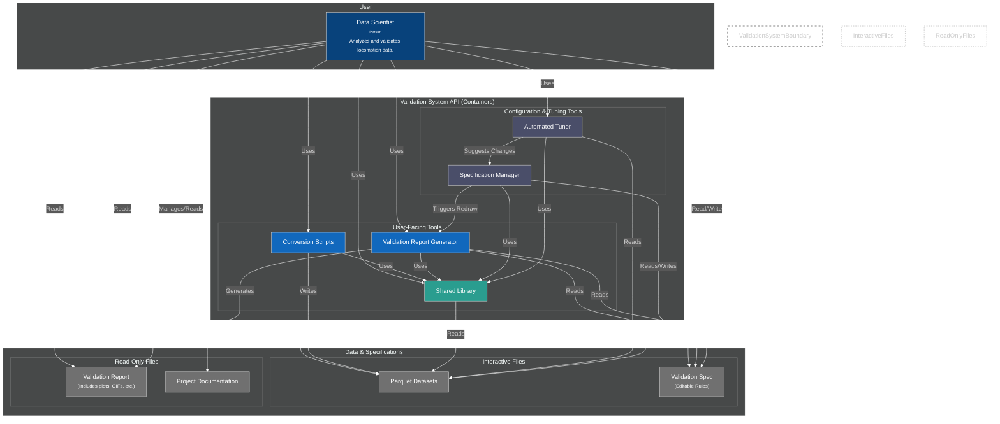

# C4 Container Diagram

---

## Future Consumer Architecture (90% User Population)

```mermaid
%%{init: {'theme': 'dark'}}%%
graph TD
    subgraph "Dataset Consumers (90% User Population)"
        GRAD["Graduate Students (30%)<br/><font size='-2'>Person</font><br/><font size='-1'>Exoskeleton control, gait analysis research</font>"]
        CLIN["Clinical Researchers (25%)<br/><font size='-2'>Person</font><br/><font size='-1'>Patient comparisons, diagnostic studies</font>"]
        ENG["Biomechanics Engineers (20%)<br/><font size='-2'>Person</font><br/><font size='-1'>Algorithm development and validation</font>"]
        SPORT["Sports Scientists (10%)<br/><font size='-2'>Person</font><br/><font size='-1'>Athletic performance analysis</font>"]
        STUD["Students (5%)<br/><font size='-2'>Person</font><br/><font size='-1'>Learning biomechanics and gait analysis</font>"]
    end

    subgraph "Consumer Access Interfaces"
        style ConsumerInterfaces fill:#00000000,stroke:#2a9d8f,stroke-width:3px,stroke-dasharray:5
        
        subgraph "Direct Data Access"
            data_repo["Data Repository<br/><font size='-2'>Container</font><br/><font size='-1'>Fast parquet file downloads</font>"]
            web_portal["Web Portal<br/><font size='-2'>Container</font><br/><font size='-1'>Dataset discovery and browsing</font>"]
            dataset_api["Dataset API<br/><font size='-2'>Container</font><br/><font size='-1'>Programmatic data access</font>"]
        end
        
        subgraph "Programming Libraries"
            python_lib["Python LocomotionData<br/><font size='-2'>Container</font><br/><font size='-1'>Analysis and visualization tools</font>"]
            matlab_tools["MATLAB Tools<br/><font size='-2'>Container</font><br/><font size='-1'>Native MATLAB integration</font>"]
            r_package["R Package<br/><font size='-2'>Container</font><br/><font size='-1'>Statistical analysis tools</font>"]
        end
        
        subgraph "Documentation & Learning"
            tutorials["Interactive Tutorials<br/><font size='-2'>Container</font><br/><font size='-1'>Step-by-step learning guides</font>"]
            api_docs["API Documentation<br/><font size='-2'>Container</font><br/><font size='-1'>Library reference and examples</font>"]
            biomech_guide["Biomechanics Guide<br/><font size='-2'>Container</font><br/><font size='-1'>Conventions and theory explanations</font>"]
        end
    end

    subgraph "Core Infrastructure"
        locomotion_core["LocomotionData Core<br/><font size='-2'>Container</font><br/><font size='-1'>Data loading and manipulation engine</font>"]
        feature_lib["FeatureConstants<br/><font size='-2'>Container</font><br/><font size='-1'>Variable definitions and mappings</font>"]
    end

    subgraph "Consumer Data & Documentation"
        direction LR
        subgraph "Research Datasets"
            parquet_data["Parquet Datasets<br/><font size='-1'>Quality-validated biomechanical data</font>"]
            ml_benchmarks["ML Benchmarks<br/><font size='-1'>Standardized train/test splits</font>"]
            metadata["Dataset Metadata<br/><font size='-1'>Population and collection info</font>"]
        end
        
        subgraph "User Documentation"
            user_guides["User Guides<br/><font size='-1'>Getting started and workflows</font>"]
            code_examples["Code Examples<br/><font size='-1'>Real-world usage patterns</font>"]
            quality_summaries["Quality Summaries<br/><font size='-1'>Dataset validation overviews</font>"]
        end
    end

    %% User to Interface Relationships
    GRAD -- "Downloads directly" --> data_repo
    GRAD -- "Programs with" --> python_lib
    GRAD -- "Learns from" --> tutorials
    
    CLIN -- "Browses and downloads" --> web_portal
    CLIN -- "Analyzes with" --> matlab_tools
    CLIN -- "References" --> api_docs
    
    ENG -- "API access" --> dataset_api
    ENG -- "Develops with" --> python_lib
    ENG -- "Benchmarks with" --> ml_benchmarks
    
    SPORT -- "Downloads directly" --> data_repo
    SPORT -- "Analyzes with" --> matlab_tools
    SPORT -- "Studies" --> biomech_guide
    
    STUD -- "Explores via" --> web_portal
    STUD -- "Learns with" --> r_package
    STUD -- "Follows" --> tutorials

    %% Interface to Data Relationships
    data_repo -- "Serves" --> parquet_data
    web_portal -- "Displays" --> metadata
    web_portal -- "Provides" --> parquet_data
    dataset_api -- "Exposes" --> parquet_data
    
    tutorials -- "References" --> user_guides
    api_docs -- "Documents" --> code_examples
    biomech_guide -- "Explains" --> quality_summaries

    %% Library to Core Relationships
    python_lib -- "Built on" --> locomotion_core
    matlab_tools -- "Uses" --> locomotion_core
    r_package -- "Interfaces with" --> locomotion_core
    
    %% Core Data Access
    locomotion_core -- "References" --> feature_lib
    locomotion_core -- "Loads" --> parquet_data

    %% Styling
    %% Consumer Users
    style GRAD fill:#2a9d8f,stroke:#168f70,stroke-width:2px,color:#ffffff
    style CLIN fill:#2a9d8f,stroke:#168f70,stroke-width:2px,color:#ffffff
    style ENG fill:#2a9d8f,stroke:#168f70,stroke-width:2px,color:#ffffff
    style SPORT fill:#2a9d8f,stroke:#168f70,stroke-width:2px,color:#ffffff
    style STUD fill:#2a9d8f,stroke:#168f70,stroke-width:2px,color:#ffffff

    %% Consumer Interfaces
    style data_repo fill:#2a9d8f,color:white
    style web_portal fill:#2a9d8f,color:white
    style dataset_api fill:#2a9d8f,color:white
    style python_lib fill:#438dd5,color:white
    style matlab_tools fill:#438dd5,color:white
    style r_package fill:#438dd5,color:white
    style tutorials fill:#6baed6,color:white
    style api_docs fill:#6baed6,color:white
    style biomech_guide fill:#6baed6,color:white

    %% Core Infrastructure
    style locomotion_core fill:#96c93d,color:white
    style feature_lib fill:#96c93d,color:white

    %% Data Storage
    style parquet_data fill:#707070,color:white
    style ml_benchmarks fill:#707070,color:white
    style metadata fill:#707070,color:white
    style user_guides fill:#707070,color:white
    style code_examples fill:#707070,color:white
    style quality_summaries fill:#707070,color:white
    
    linkStyle default stroke:white
```

---

## Future Contributor Architecture (10% User Population)

```mermaid
%%{init: {'theme': 'dark'}}%%
graph TD
    subgraph "Dataset Contributors (10% User Population)"
        DC["Dataset Curators (5%)<br/><font size='-2'>Person</font><br/><font size='-1'>Convert and validate new datasets</font>"]
        VS["Validation Specialists (4%)<br/><font size='-2'>Person</font><br/><font size='-1'>Quality assurance and standards</font>"]
        SA["System Administrators (1%)<br/><font size='-2'>Person</font><br/><font size='-1'>Releases and benchmarks</font>"]
    end

    subgraph "Contributor CLI Tools"
        style ContributorTools fill:#00000000,stroke:#e76f51,stroke-width:3px,stroke-dasharray:5
        
        subgraph "Data Conversion & Validation"
            convert_tool["convert_dataset.py<br/><font size='-2'>CLI Container</font><br/><font size='-1'>Convert raw data to parquet</font>"]
            validate_phase["validate_phase_data.py<br/><font size='-2'>CLI Container</font><br/><font size='-1'>Validate phase-indexed data</font>"]
            validate_time["validate_time_data.py<br/><font size='-2'>CLI Container</font><br/><font size='-1'>Validate time-indexed data</font>"]
        end

        subgraph "Quality Assurance"
            specs_tool["manage_validation_specs.py<br/><font size='-2'>CLI Container</font><br/><font size='-1'>Edit validation rules</font>"]
            tune_tool["auto_tune_ranges.py<br/><font size='-2'>CLI Container</font><br/><font size='-1'>Optimize validation ranges</font>"]
            compare_tool["compare_datasets.py<br/><font size='-2'>CLI Container</font><br/><font size='-1'>Cross-dataset analysis</font>"]
        end

        subgraph "Release Management"
            benchmark_tool["create_benchmarks.py<br/><font size='-2'>CLI Container</font><br/><font size='-1'>Create ML benchmarks</font>"]
            publish_tool["publish_datasets.py<br/><font size='-2'>CLI Container</font><br/><font size='-1'>Prepare public releases</font>"]
            plots_tool["generate_validation_plots.py<br/><font size='-2'>CLI Container</font><br/><font size='-1'>Create validation visualizations</font>"]
        end
    end

    subgraph "Validation Infrastructure"
        style ValidationInfra fill:#00000000,stroke:#aaa,stroke-width:1px,stroke-dasharray:3
        
        subgraph "Core Engines"
            locomotion_core["LocomotionData Core<br/><font size='-2'>Container</font><br/><font size='-1'>Data loading and manipulation</font>"]
            phase_validator["PhaseValidator<br/><font size='-2'>Container</font><br/><font size='-1'>Phase validation engine</font>"]
            time_validator["TimeValidator<br/><font size='-2'>Container</font><br/><font size='-1'>Time validation engine</font>"]
        end

        subgraph "Support Systems"
            spec_manager["SpecificationManager<br/><font size='-2'>Container</font><br/><font size='-1'>Validation rule management</font>"]
            benchmark_engine["BenchmarkCreator<br/><font size='-2'>Container</font><br/><font size='-1'>ML benchmark engine</font>"]
            plot_engine["PlotEngine<br/><font size='-2'>Container</font><br/><font size='-1'>Visualization generator</font>"]
        end
    end

    subgraph "Internal Data & Configuration"
        direction LR
        subgraph "Input/Output Data"
            raw_data["Raw Datasets<br/><font size='-1'>Input formats (MAT, CSV, B3D)</font>"]
            parquet_output["Validated Parquet<br/><font size='-1'>Quality-assured outputs</font>"]
            benchmark_output["ML Benchmarks<br/><font size='-1'>Train/test splits</font>"]
        end
        
        subgraph "Configuration & Reports"
            validation_specs["Validation Specs<br/><font size='-1'>Rules and acceptable ranges</font>"]
            dataset_validation_reports["Dataset Validation Reports<br/><font size='-1'>Phase and time validation results</font>"]
            plots_output["Validation Plots<br/><font size='-1'>Visual verification outputs</font>"]
        end
    end

    %% User to CLI Tool Relationships
    DC -- "Uses" --> convert_tool
    DC -- "Uses" --> validate_phase
    DC -- "Uses" --> validate_time
    DC -- "Uses" --> plots_tool

    VS -- "Uses" --> specs_tool
    VS -- "Uses" --> tune_tool
    VS -- "Uses" --> compare_tool

    SA -- "Uses" --> benchmark_tool
    SA -- "Uses" --> publish_tool

    %% Direct user access to validation specs (manual editing)
    VS -- "Directly edits" --> validation_specs

    %% CLI Tools to Engines
    convert_tool -- "Uses" --> locomotion_core
    validate_phase -- "Uses" --> phase_validator
    validate_time -- "Uses" --> time_validator
    specs_tool -- "Uses" --> spec_manager
    tune_tool -- "Uses" --> spec_manager
    tune_tool -- "Uses" --> locomotion_core
    compare_tool -- "Uses" --> locomotion_core
    compare_tool -- "Uses" --> plot_engine
    benchmark_tool -- "Uses" --> benchmark_engine
    publish_tool -- "Uses" --> benchmark_output
    plots_tool -- "Uses" --> plot_engine

    %% Engine Dependencies - All data access through LocomotionData Core
    phase_validator -- "Uses" --> locomotion_core
    time_validator -- "Uses" --> locomotion_core
    benchmark_engine -- "Uses" --> locomotion_core
    plot_engine -- "Uses" --> locomotion_core
    plot_engine -- "Gets specs from" --> spec_manager
    
    %% Validation engines get specs through SpecificationManager (not directly)
    phase_validator -- "Gets specs from" --> spec_manager
    time_validator -- "Gets specs from" --> spec_manager
    
    %% Validation engines use PlotEngine for report generation
    phase_validator -- "Uses for reports" --> plot_engine
    time_validator -- "Uses for reports" --> plot_engine
    
    spec_manager -- "Manages" --> validation_specs
    spec_manager -- "Triggers redraw" --> plot_engine

    %% Core Data Access - Single point of data loading
    locomotion_core -- "Loads" --> parquet_output
    locomotion_core -- "References" --> feature_lib

    %% Data Flow
    convert_tool -- "Reads" --> raw_data
    convert_tool -- "Creates" --> parquet_output
    
    %% Validation specs accessed only through SpecificationManager (not directly by tools)
    
    %% All output generation done by engines (not CLI tools directly)
    phase_validator -- "Generates" --> dataset_validation_reports
    time_validator -- "Generates" --> dataset_validation_reports
    plot_engine -- "Generates" --> plots_output
    benchmark_engine -- "Creates" --> benchmark_output

    %% Styling
    %% Contributor Users
    style DC fill:#e76f51,stroke:#d62828,stroke-width:2px,color:#ffffff
    style VS fill:#e76f51,stroke:#d62828,stroke-width:2px,color:#ffffff
    style SA fill:#f4a261,stroke:#e76f51,stroke-width:2px,color:#ffffff

    %% CLI Tools
    style convert_tool fill:#e76f51,color:white
    style validate_phase fill:#e76f51,color:white
    style validate_time fill:#e76f51,color:white
    style specs_tool fill:#e76f51,color:white
    style tune_tool fill:#e76f51,color:white
    style compare_tool fill:#e76f51,color:white
    style benchmark_tool fill:#e76f51,color:white
    style publish_tool fill:#e76f51,color:white
    style plots_tool fill:#e76f51,color:white

    %% Validation Infrastructure
    style locomotion_core fill:#438dd5,color:white
    style phase_validator fill:#6baed6,color:white
    style time_validator fill:#6baed6,color:white
    style spec_manager fill:#6baed6,color:white
    style benchmark_engine fill:#96c93d,color:white
    style plot_engine fill:#96c93d,color:white

    %% Data Storage
    style raw_data fill:#707070,color:white
    style parquet_output fill:#707070,color:white
    style benchmark_output fill:#707070,color:white
    style validation_specs fill:#707070,color:white
    style dataset_validation_reports fill:#707070,color:white
    style plots_output fill:#707070,color:white
    
    linkStyle default stroke:white
```

## Key Improvements with Separated Architectures

### **1. Clear User Population Separation**

#### **Consumer Architecture (90%)** - *Research-Focused Interface*
- **Clean, Simple Interfaces**: Data repository, web portal, and API optimized for research workflows
- **Multi-Platform Libraries**: Native Python, MATLAB, and R integration for diverse research communities
- **Educational Focus**: Tutorials and documentation that connect data to biomechanical theory
- **Quality Transparency**: Visible quality metrics without exposing technical validation complexity

#### **Contributor Architecture (10%)** - *Quality Assurance Infrastructure*
- **Specialized CLI Tools**: Purpose-built tools for conversion, validation, and quality management
- **Technical Workflows**: Complex validation engines and quality assessment systems
- **Behind-the-Scenes**: Infrastructure that enables consumer confidence through rigorous quality control

### **2. Minimal Overlap, Maximum Clarity**
- **Shared Component**: Only LocomotionData Core library is used by both architectures
- **Separate Concerns**: Consumer interfaces focus on usability, contributor tools focus on quality
- **Clear Data Flow**: Contributors create validated datasets → Consumers access for research

### **3. Architecture-Specific Design Principles**

#### **Consumer Architecture Principles**
- **Fast Access**: Optimized data repository and API for quick dataset access
- **Research Enablement**: Libraries designed for common biomechanical analysis patterns
- **Learning Support**: Progressive documentation from tutorials to advanced examples
- **Platform Diversity**: Support for Python, MATLAB, R, and direct file access

#### **Contributor Architecture Principles**
- **Quality First**: Comprehensive validation and quality assessment tools
- **Technical Depth**: Advanced debugging, comparison, and optimization capabilities
- **Automation Support**: CLI tools designed for scripting and batch processing
- **Standards Management**: Tools for evolving and maintaining validation specifications

### **4. Development Benefits of Separation**
- **Independent Development**: Consumer and contributor features can be developed in parallel
- **Focused User Testing**: Separate usability testing for research vs quality assurance workflows
- **Clear Success Metrics**: Consumer adoption vs contributor efficiency can be measured independently
- **Simplified Documentation**: Role-specific documentation avoids confusion between user types

### **5. Strategic Implementation Approach**
- **Phase 1 (Current)**: Complete contributor architecture to ensure data quality foundation
- **Phase 2 (Future)**: Build consumer architecture with confidence in underlying data quality
- **Quality Foundation**: 10% contributor infrastructure enables 90% consumer success

### **6. System Integration Points**
- **Data Handoff**: Contributors produce validated parquet datasets for consumer access
- **Quality Metrics**: Consumer interfaces display quality summaries generated by contributor tools
- **Shared Core**: LocomotionData library provides consistent data handling across both architectures

This separation recognizes that consumers and contributors have fundamentally different needs and workflows. By designing separate architectures, each can be optimized for its specific user population while maintaining the essential data quality bridge between them. 