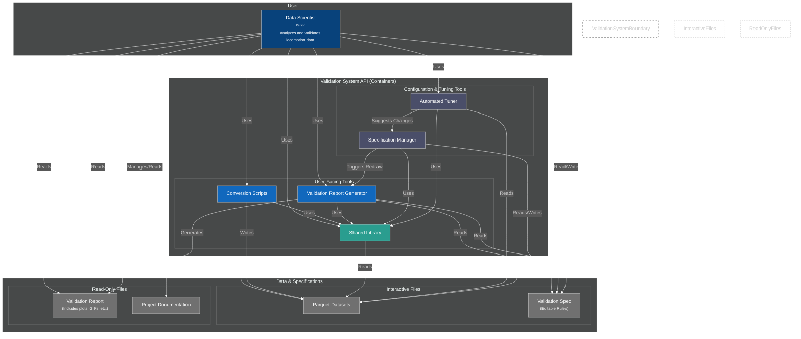

# C4 Container Diagram

---

## Future Container Architecture with Complete Entry Points

```mermaid
%%{init: {'theme': 'dark'}}%%
graph TD
    subgraph "Users"
        DC["Dataset Curators (9%)<br/><font size='-2'>Person</font><br/><font size='-1'>Convert and validate new datasets</font>"]
        VS["Validation Specialists (9%)<br/><font size='-2'>Person</font><br/><font size='-1'>Ensure quality and maintain standards</font>"]
        SA["System Administrators (1%)<br/><font size='-2'>Person</font><br/><font size='-1'>Manage releases and benchmarks</font>"]
    end

    subgraph "CLI Entry Points by User Role"
        style CLIEntryPoints fill:#00000000,stroke:#888,stroke-width:2px,stroke-dasharray:5
        
        subgraph "Curator Tools"
            convert_tool["convert_dataset.py<br/><font size='-2'>CLI Container</font><br/><font size='-1'>Convert raw data to parquet</font>"]
            validate_phase["validate_phase_data.py<br/><font size='-2'>CLI Container</font><br/><font size='-1'>Validate phase-indexed data</font>"]
            validate_time["validate_time_data.py<br/><font size='-2'>CLI Container</font><br/><font size='-1'>Validate time-indexed data</font>"]
            plots_tool["generate_validation_plots.py<br/><font size='-2'>CLI Container</font><br/><font size='-1'>Create static validation plots</font>"]
            gifs_tool["generate_validation_gifs.py<br/><font size='-2'>CLI Container</font><br/><font size='-1'>Create animated GIFs</font>"]
        end

        subgraph "Specialist Tools"
            quality_tool["assess_quality.py<br/><font size='-2'>CLI Container</font><br/><font size='-1'>Generate quality reports</font>"]
            specs_tool["manage_validation_specs.py<br/><font size='-2'>CLI Container</font><br/><font size='-1'>Edit validation rules</font>"]
            tune_tool["auto_tune_ranges.py<br/><font size='-2'>CLI Container</font><br/><font size='-1'>Optimize validation ranges</font>"]
            compare_tool["compare_datasets.py<br/><font size='-2'>CLI Container</font><br/><font size='-1'>Compare multiple datasets</font>"]
            debug_tool["investigate_errors.py<br/><font size='-2'>CLI Container</font><br/><font size='-1'>Debug validation failures</font>"]
        end

        subgraph "Admin Tools"
            benchmark_tool["create_benchmarks.py<br/><font size='-2'>CLI Container</font><br/><font size='-1'>Create ML benchmarks</font>"]
            publish_tool["publish_datasets.py<br/><font size='-2'>CLI Container</font><br/><font size='-1'>Prepare public releases</font>"]
            release_tool["manage_releases.py<br/><font size='-2'>CLI Container</font><br/><font size='-1'>Manage versions</font>"]
        end
    end

    subgraph "Supporting Library Containers"
        style SupportingLibraries fill:#00000000,stroke:#aaa,stroke-width:1px,stroke-dasharray:3
        
        subgraph "Core Libraries"
            locomotion_lib["LocomotionData Library<br/><font size='-2'>Container</font><br/><font size='-1'>Data loading and manipulation</font>"]
            feature_lib["FeatureConstants Library<br/><font size='-2'>Container</font><br/><font size='-1'>Variable definitions</font>"]
        end

        subgraph "Validation Libraries"
            phase_validator["PhaseValidator<br/><font size='-2'>Container</font><br/><font size='-1'>Phase validation engine</font>"]
            time_validator["TimeValidator<br/><font size='-2'>Container</font><br/><font size='-1'>Time validation engine</font>"]
            spec_manager["SpecificationManager<br/><font size='-2'>Container</font><br/><font size='-1'>Validation rule management</font>"]
        end

        subgraph "Analysis Libraries"
            plot_engine["PlotEngine<br/><font size='-2'>Container</font><br/><font size='-1'>Static plot generation</font>"]
            gif_engine["GifEngine<br/><font size='-2'>Container</font><br/><font size='-1'>Animated GIF generation</font>"]
            quality_engine["QualityAssessment<br/><font size='-2'>Container</font><br/><font size='-1'>Quality analysis engine</font>"]
            benchmark_engine["BenchmarkCreator<br/><font size='-2'>Container</font><br/><font size='-1'>ML benchmark engine</font>"]
        end
    end

    subgraph "Data Storage & Configuration"
        direction LR
        subgraph "Datasets"
            raw_data["Raw Datasets<br/><font size='-1'>Input formats</font>"]
            parquet_data["Parquet Datasets<br/><font size='-1'>Standardized output</font>"]
            benchmark_data["ML Benchmarks<br/><font size='-1'>Train/test splits</font>"]
        end
        
        subgraph "Configuration"
            validation_specs["Validation Specs<br/><font size='-1'>Rules and ranges</font>"]
            system_config["System Config<br/><font size='-1'>Tool settings</font>"]
        end
        
        subgraph "Outputs"
            reports["Validation Reports<br/><font size='-1'>Analysis results</font>"]
            plots["Plots & GIFs<br/><font size='-1'>Visualizations</font>"]
            releases["Public Releases<br/><font size='-1'>Published datasets</font>"]
        end
    end

    %% User to CLI Tool Relationships
    DC -- "Uses" --> convert_tool
    DC -- "Uses" --> validate_phase
    DC -- "Uses" --> validate_time
    DC -- "Uses" --> plots_tool
    DC -- "Uses" --> gifs_tool

    VS -- "Uses" --> quality_tool
    VS -- "Uses" --> specs_tool
    VS -- "Uses" --> tune_tool
    VS -- "Uses" --> compare_tool
    VS -- "Uses" --> debug_tool

    SA -- "Uses" --> benchmark_tool
    SA -- "Uses" --> publish_tool
    SA -- "Uses" --> release_tool

    %% CLI Tools to Core Libraries
    convert_tool -- "Uses" --> locomotion_lib
    validate_phase -- "Uses" --> phase_validator
    validate_time -- "Uses" --> time_validator
    plots_tool -- "Uses" --> plot_engine
    gifs_tool -- "Uses" --> gif_engine
    quality_tool -- "Uses" --> quality_engine
    specs_tool -- "Uses" --> spec_manager
    tune_tool -- "Uses" --> spec_manager
    compare_tool -- "Uses" --> locomotion_lib
    debug_tool -- "Uses" --> phase_validator
    benchmark_tool -- "Uses" --> benchmark_engine
    publish_tool -- "Uses" --> locomotion_lib
    release_tool -- "Uses" --> locomotion_lib

    %% Libraries to Core Dependencies
    phase_validator -- "Uses" --> locomotion_lib
    time_validator -- "Uses" --> locomotion_lib
    plot_engine -- "Uses" --> locomotion_lib
    gif_engine -- "Uses" --> locomotion_lib
    quality_engine -- "Uses" --> locomotion_lib
    benchmark_engine -- "Uses" --> locomotion_lib
    spec_manager -- "Uses" --> feature_lib

    %% Data Flow Relationships
    convert_tool -- "Reads" --> raw_data
    convert_tool -- "Writes" --> parquet_data
    validate_phase -- "Reads" --> parquet_data
    validate_time -- "Reads" --> parquet_data
    plots_tool -- "Reads" --> parquet_data
    gifs_tool -- "Reads" --> parquet_data
    quality_tool -- "Reads" --> parquet_data
    compare_tool -- "Reads" --> parquet_data
    benchmark_tool -- "Reads" --> parquet_data
    benchmark_tool -- "Writes" --> benchmark_data
    publish_tool -- "Reads" --> parquet_data
    publish_tool -- "Writes" --> releases

    %% Configuration Relationships
    phase_validator -- "Reads" --> validation_specs
    time_validator -- "Reads" --> validation_specs
    spec_manager -- "Reads/Writes" --> validation_specs
    tune_tool -- "Reads/Writes" --> validation_specs

    %% Output Generation
    validate_phase -- "Writes" --> reports
    validate_time -- "Writes" --> reports
    plots_tool -- "Writes" --> plots
    gifs_tool -- "Writes" --> plots
    quality_tool -- "Writes" --> reports

    %% Styling
    style DC fill:#e76f51,stroke:#d62828,stroke-width:2px,color:#ffffff
    style VS fill:#e76f51,stroke:#d62828,stroke-width:2px,color:#ffffff
    style SA fill:#f4a261,stroke:#e76f51,stroke-width:2px,color:#ffffff

    %% CLI Tools Styling
    style convert_tool fill:#438dd5,color:white
    style validate_phase fill:#438dd5,color:white
    style validate_time fill:#438dd5,color:white
    style plots_tool fill:#438dd5,color:white
    style gifs_tool fill:#438dd5,color:white
    style quality_tool fill:#438dd5,color:white
    style specs_tool fill:#438dd5,color:white
    style tune_tool fill:#438dd5,color:white
    style compare_tool fill:#438dd5,color:white
    style debug_tool fill:#438dd5,color:white
    style benchmark_tool fill:#438dd5,color:white
    style publish_tool fill:#438dd5,color:white
    style release_tool fill:#438dd5,color:white

    %% Library Styling
    style locomotion_lib fill:#2a9d8f,color:white
    style feature_lib fill:#2a9d8f,color:white
    style phase_validator fill:#6baed6,color:white
    style time_validator fill:#6baed6,color:white
    style spec_manager fill:#6baed6,color:white
    style plot_engine fill:#96c93d,color:white
    style gif_engine fill:#96c93d,color:white
    style quality_engine fill:#96c93d,color:white
    style benchmark_engine fill:#96c93d,color:white

    %% Data Storage Styling
    style raw_data fill:#707070,color:white
    style parquet_data fill:#707070,color:white
    style benchmark_data fill:#707070,color:white
    style validation_specs fill:#707070,color:white
    style system_config fill:#707070,color:white
    style reports fill:#707070,color:white
    style plots fill:#707070,color:white
    style releases fill:#707070,color:white
    
    linkStyle default stroke:white
```

## Key Improvements in Future Architecture

### **1. Complete User Role Coverage**
- **Dataset Curators (9%)**: 5 specific CLI tools for data conversion and validation
- **Validation Specialists (9%)**: 5 specific CLI tools for quality assurance and standards
- **System Administrators (1%)**: 3 specific CLI tools for releases and benchmarks

### **2. Clear Tool Organization by Priority**
- **Critical Tools**: `convert_dataset.py`, `validate_phase_data.py`, `validate_time_data.py`, `create_benchmarks.py`
- **High Priority**: Quality assessment, validation management, and comparison tools
- **Medium Priority**: Advanced visualization, debugging, and release management

### **3. Layered Architecture**
- **CLI Layer**: User-facing entry points with consistent interfaces
- **Library Layer**: Reusable engines and core functionality
- **Data Layer**: Storage, configuration, and output management

### **4. Separation of Concerns**
- **Each CLI tool** has a single, clear responsibility
- **Supporting libraries** handle complex logic and can be reused
- **Core libraries** (LocomotionData, FeatureConstants) provide foundation

### **5. Scalability & Maintainability**
- **Modular design** allows independent development of CLI tools
- **Shared libraries** prevent code duplication
- **Clear data flow** makes system behavior predictable
- **Role-based access** aligns with user needs and capabilities

This future architecture transforms the current general containers into a comprehensive, user-centric system with clear entry points for each role while maintaining clean separation of concerns and reusable components. 