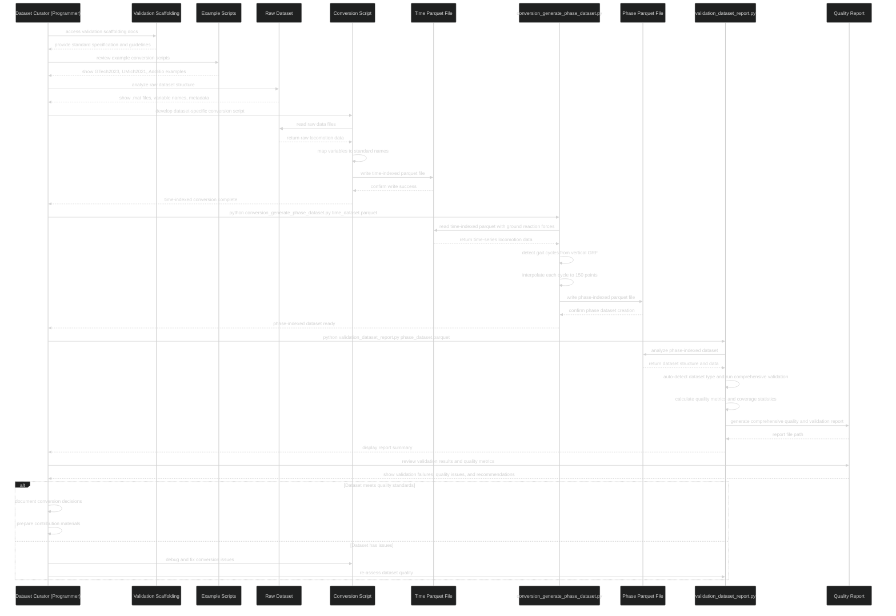
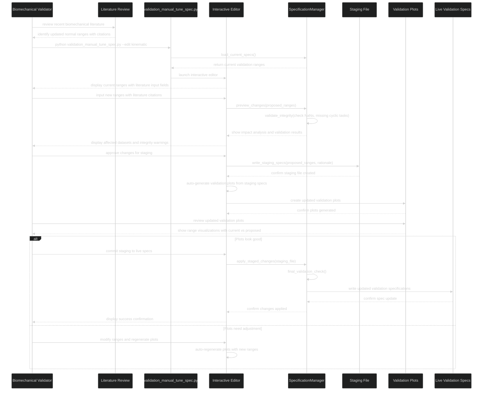
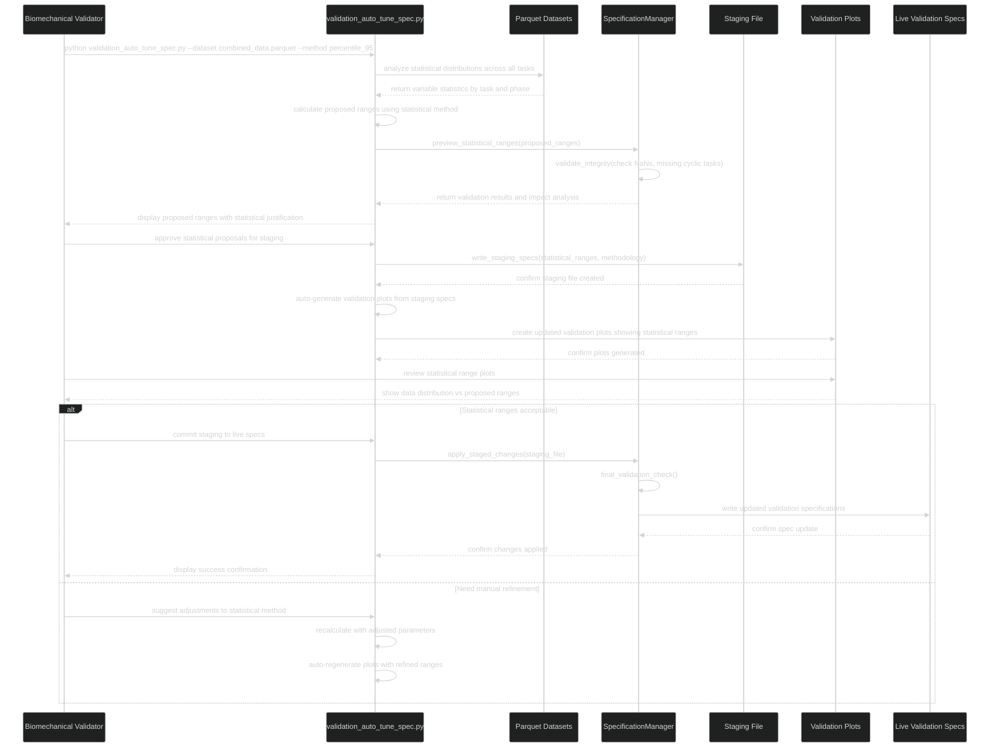
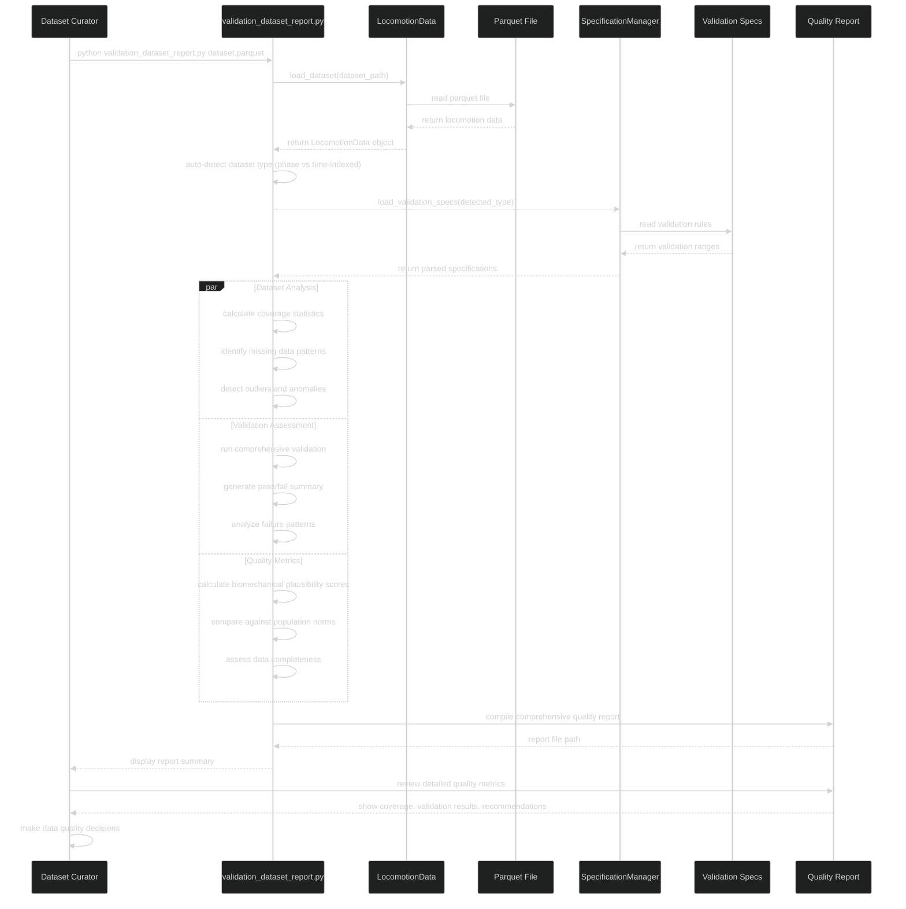
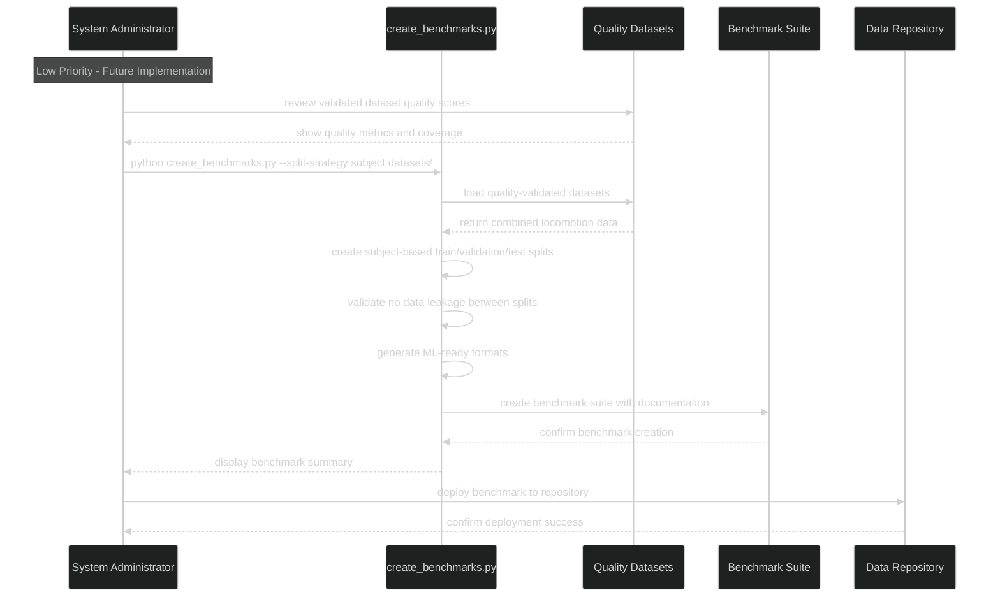

# Sequence Workflows

**Technical sequence diagrams for all user workflows.**

## Current Focus: Dataset Contributor Workflows

### Sequence 1: Dataset Curator (Programmer) Develops Conversion Script

---

### Sequence 2A: Manual Validation (Literature-Based Updates)

---

### Sequence 2B: Automatic Validation (Statistics-Based Updates)

---

### Sequence 3: Dataset Curator Generates Quality Report

---

### Sequence 4: System Administrator (Future) - ML Benchmark Creation

---

## Workflow Patterns

### Core Contributor Workflows
1. **Conversion Development**: Programmers create dataset-specific scripts using scaffolding
2. **Validation Management**: Biomechanics experts maintain and update validation ranges
3. **Quality Assessment**: Both roles use comprehensive reporting for dataset evaluation

### Key Integration Points
- **ValidationSpecificationManager**: Central validation rule management
- **PhaseValidator**: Core validation engine used by all workflows
- **Quality Reporting**: Unified assessment across all contributor activities

### Success Factors
- **Clear Scaffolding**: Examples and guidelines enable conversion script development
- **Phase Generation Tool**: `conversion_generate_phase_dataset.py` automates gait cycle detection and interpolation
- **Safe Staging Workflow**: Preview changes before committing to live validation specs
- **Automatic Validation**: SpecificationManager checks for NaNs and missing cyclic tasks
- **Integrated Visualization**: Automatic plot generation within validation workflows
- **Optional Animation**: `--generate-gifs` flag for computationally intensive animations
- **Dual Validation Approaches**: Literature-based manual and statistics-based automatic workflows
- **Interactive Editing**: No error-prone manual markdown editing
- **Comprehensive Reporting**: Quality metrics guide contribution decisions
- **Iterative Debugging**: Validation feedback enables continuous improvement

---

## Future: Consumer Workflows *(90% of users - Phase 2)*

Consumer workflows will focus on simple data access and analysis:
- Direct parquet file downloads
- Python/MATLAB library usage for common analysis patterns
- Educational tutorials for different skill levels
- Quality metrics to guide dataset selection

The validation infrastructure ensures consumer confidence without requiring technical validation knowledge.