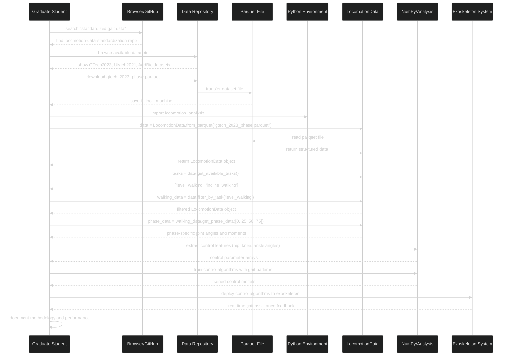
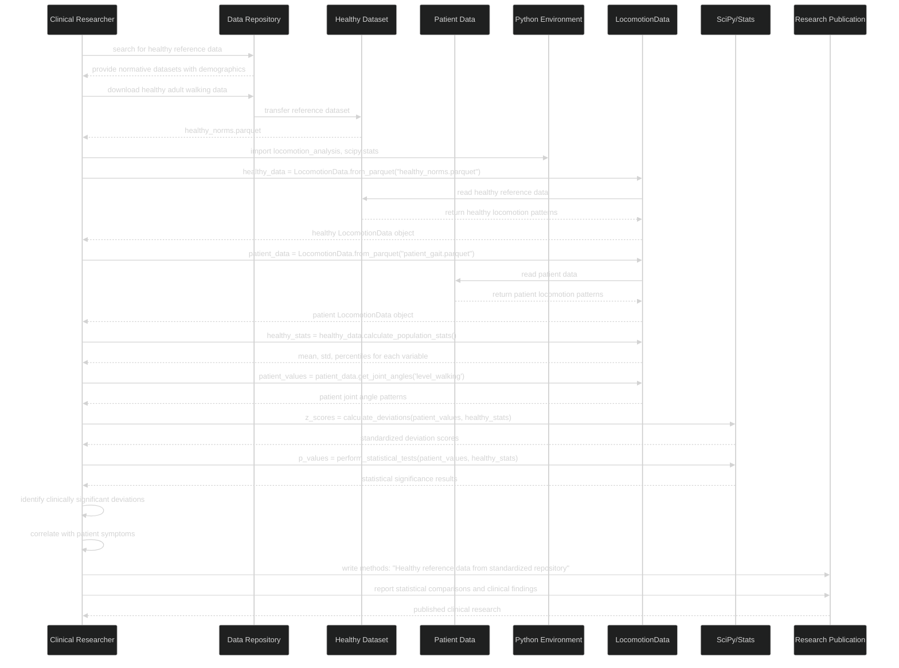
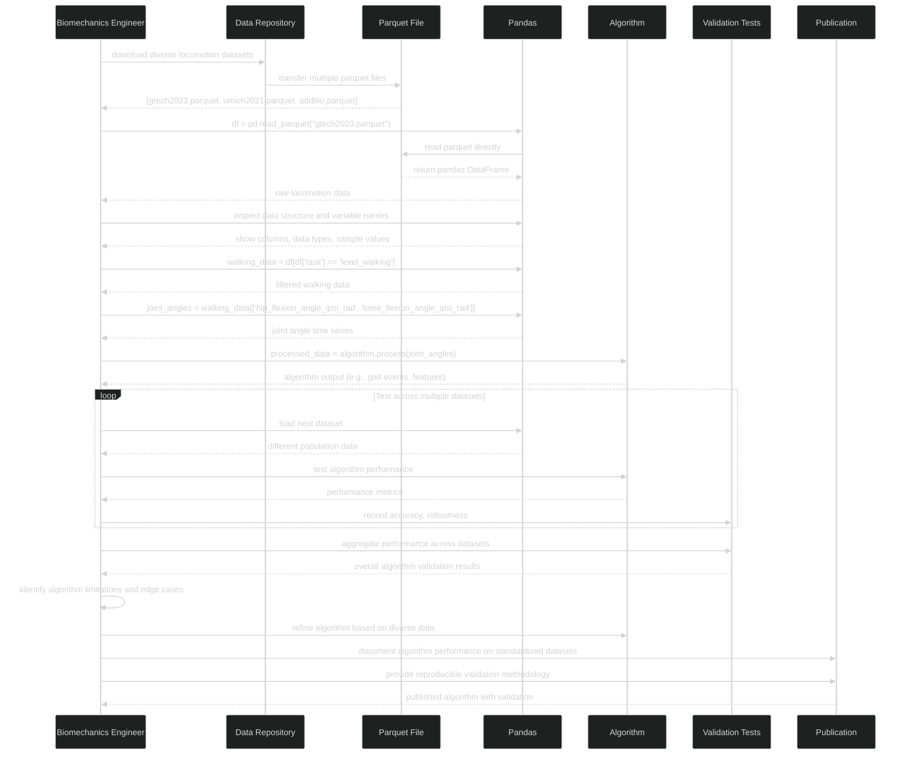
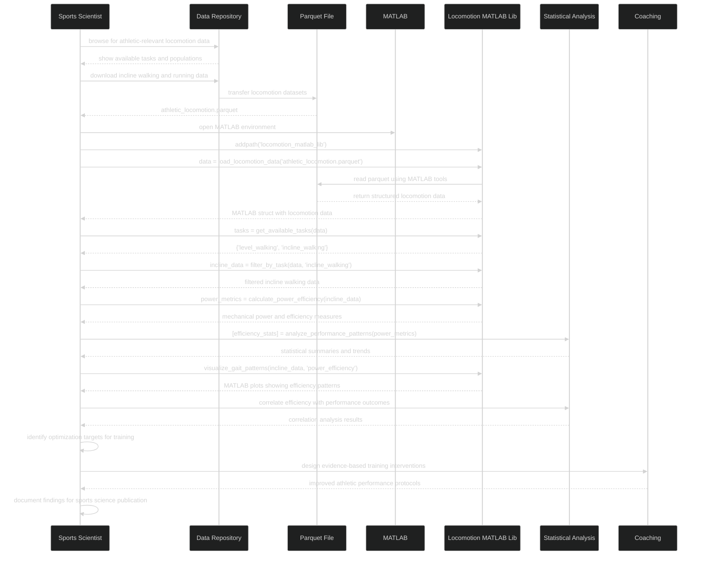
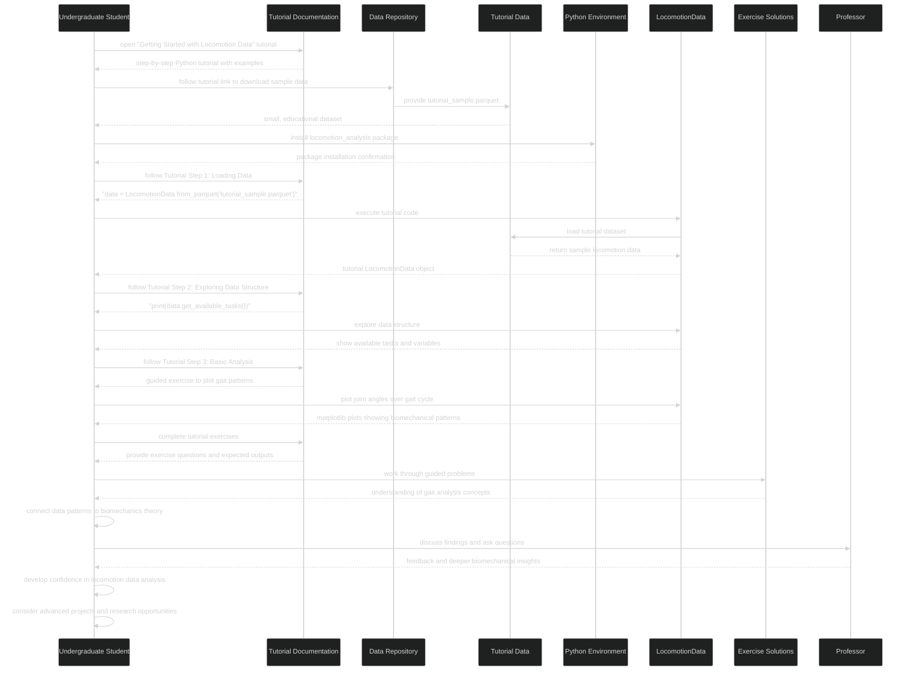
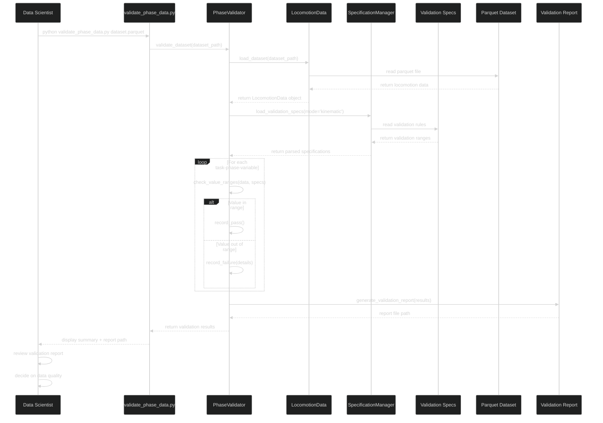
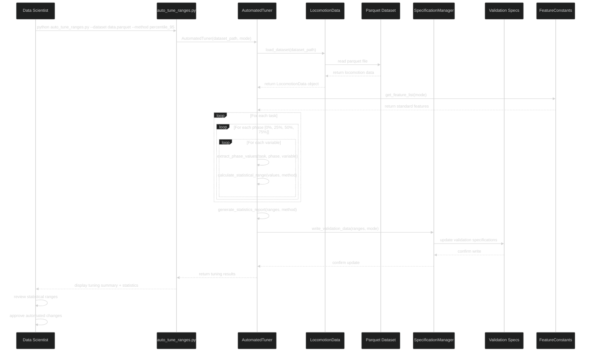
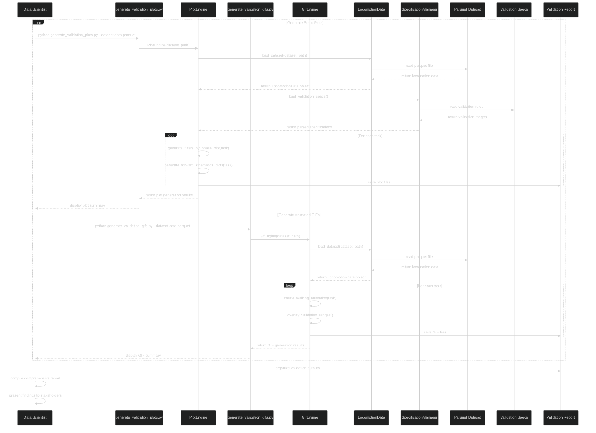
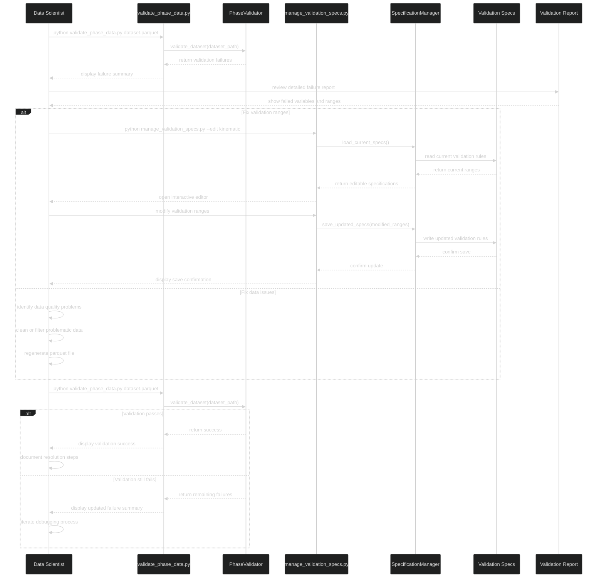
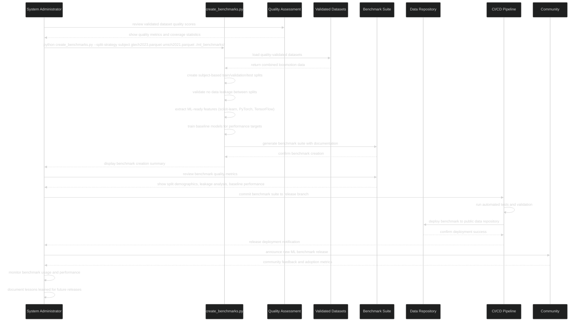

# Sequence Diagrams - Dataset Consumer Workflows

## Sequence 1: Graduate Student Loads Data for Exoskeleton Control

---

## Sequence 2: Clinical Researcher Compares Patient Data to Healthy Norms

---

## Sequence 3: Biomechanics Engineer Tests Algorithm Without Library

---

## Sequence 4: Sports Scientist Analyzes Performance with MATLAB

---

## Sequence 5: Undergraduate Student Follows Tutorial

---

## Cross-Sequence Insights

### **Primary User Interaction Patterns**

1. **Data Discovery**: Users find datasets through documentation, repositories, or tutorials
2. **Direct Access**: Most users download parquet files directly without complex setup
3. **Flexible Loading**: Users choose between library tools (Python/MATLAB) or direct pandas access
4. **Domain-Specific Analysis**: Each user group has specific analysis patterns and goals
5. **Quality Trust**: Users rely on behind-the-scenes validation without direct interaction

### **Key System Components for Consumers**

1. **Data Repository**: Central source for standardized parquet files
2. **LocomotionData Library**: Python library for common analysis patterns
3. **MATLAB Tools**: MATLAB library for MATLAB-native workflows
4. **Documentation System**: Tutorials, API docs, and getting started guides
5. **Quality Assurance**: Invisible validation system that builds user confidence

### **Consumer Success Factors**

1. **Easy Discovery**: Clear documentation and searchable dataset catalogs
2. **Multiple Access Methods**: Library tools AND direct parquet access
3. **Rich Metadata**: Demographics, collection protocols, quality metrics
4. **Standard Formats**: Consistent variable names and data structures
5. **Educational Resources**: Tutorials for different experience levels

### **Performance & Usability Considerations**

1. **Download Speed**: Efficient data repository with fast access
2. **Memory Efficiency**: Library tools handle large datasets gracefully
3. **Platform Compatibility**: Works in Python, MATLAB, R, and direct parquet readers
4. **Error Handling**: Clear error messages when data loading fails
5. **Documentation**: Always up-to-date with working code examples

### **Validation System Role**

The validation system operates **behind the scenes** to ensure:
- **Data Quality**: All published datasets meet biomechanical standards
- **Consistency**: Standardized variable names and formats across datasets
- **Trust**: Users can confidently use data without validating it themselves
- **Discoverability**: Quality metrics help users choose appropriate datasets

### **User-Centric Design Principles**

1. **90% of users consume data**: Focus on easy access and analysis tools
2. **10% of users contribute data**: Validation tools support quality assurance
3. **Multiple skill levels**: From undergraduate tutorials to advanced research
4. **Multiple domains**: Clinical, engineering, sports, academic applications
5. **Multiple tools**: Python, MATLAB, R, and direct data access

These consumer-focused sequences show how the standardized locomotion data ecosystem serves its primary users while the validation system ensures quality behind the scenes.

---

## Dataset Contributor Workflows (10% - Current Focus)

The following sequences represent the technical workflows for specialists who validate and contribute datasets.

## Sequence 6: Data Scientist Validates a New Dataset

---

## Sequence 7: Data Scientist Tunes Validation Ranges

---

## Sequence 8: Data Scientist Generates Validation Reports

---

## Sequence 9: Data Scientist Debugs Validation Failures

---

## Combined Sequence Analysis

### **Consumer vs Contributor Interaction Patterns**

**Consumer Patterns:**
1. **Simple Data Access**: Direct parquet loading or library usage
2. **Domain-Specific Analysis**: Each user group has specific workflows
3. **Quality Trust**: Users rely on behind-the-scenes validation
4. **Multiple Access Methods**: Library tools AND direct data access

**Contributor Patterns:**  
1. **Complex Validation Workflows**: Multi-step quality assurance processes
2. **Iterative Problem Solving**: Debugging and range tuning cycles
3. **Tool Integration**: Multiple specialized tools working together
4. **Quality Assurance**: Focus on ensuring data meets standards

### **Shared Integration Points**
1. **LocomotionData**: Central data access layer for both user types
2. **SpecificationManager**: Validation rules accessed by contributors, trusted by consumers  
3. **FeatureConstants**: Shared variable definitions ensure consistency
4. **Quality Bridge**: Validation system enables consumer confidence

---

## Sequence 10: System Administrator Creates ML Benchmark Release

---

The combined workflows show how all three user types contribute to the locomotion data standardization ecosystem:
- **Consumers (90%)** rely on simple, reliable data access
- **Contributors (9%)** ensure data quality through validation workflows  
- **Administrators (1%)** manage infrastructure and enable community growth

The contributor workflows ensure the quality that enables simple consumer workflows, while administrator workflows ensure the infrastructure supports both groups effectively.