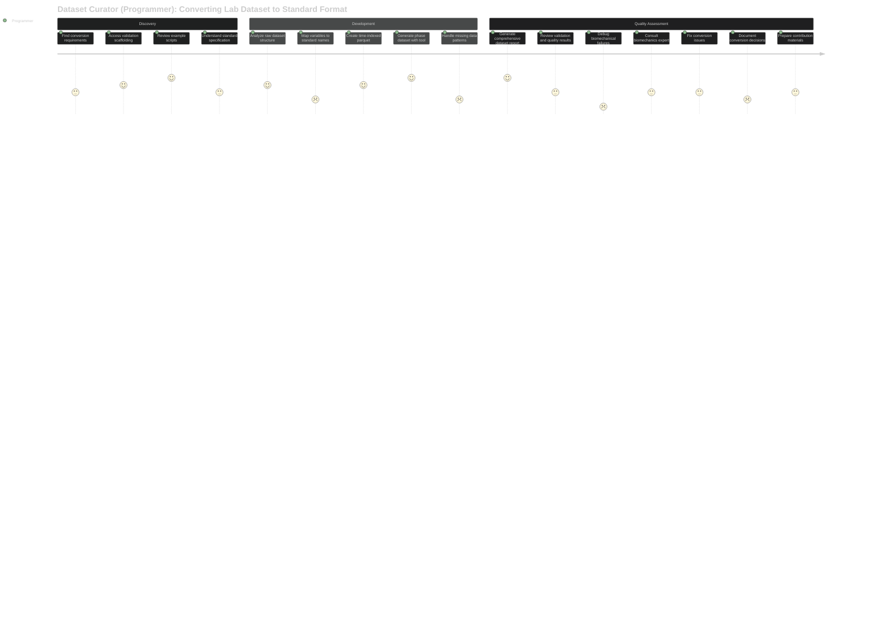
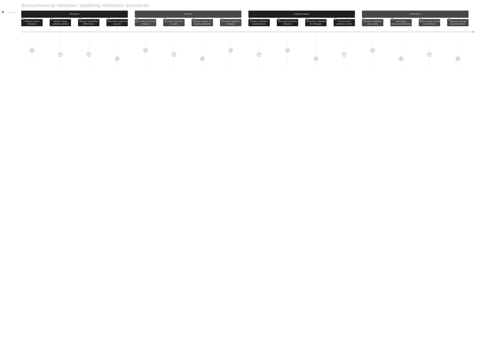
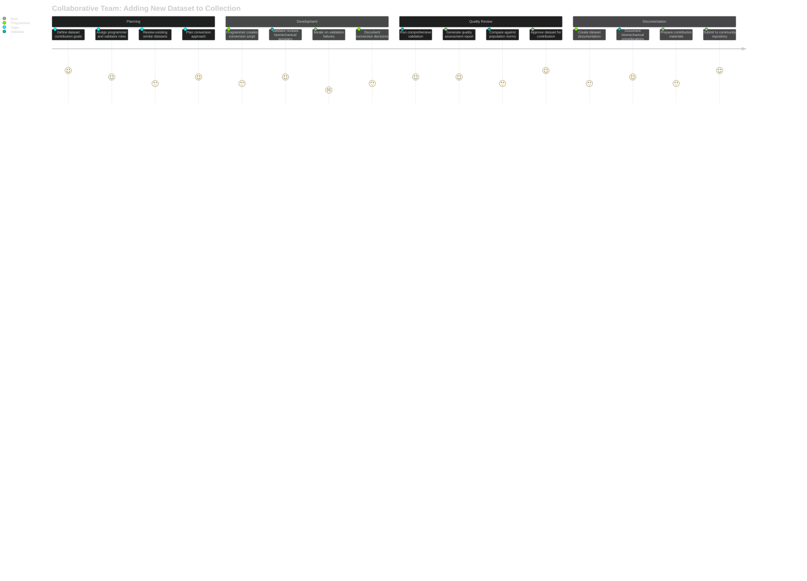
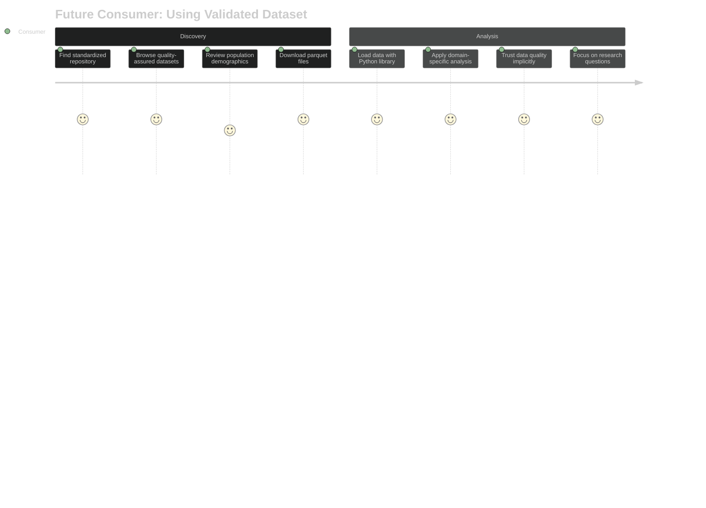

# User Journey Maps

**User workflows with emotional context and pain points.**

## Current Focus: Dataset Contributor Journeys

### Journey 1: Dataset Curator (Programmer) Converts Lab Dataset

**Pain Points:**
- Complex biomechanical conventions and coordinate systems
- Variable naming inconsistencies across source datasets
- Ensuring vertical ground reaction force data is properly formatted for phase generation
- Debugging validation failures requires domain expertise
- Time-consuming iteration between conversion and validation

**Emotional Journey:**
- **Discovery**: Confidence with clear examples and scaffolding
- **Development**: Frustration with biomechanical complexity
- **Quality Assessment**: Relief with unified validation and quality reporting
- **Resolution**: Satisfaction when comprehensive report shows dataset quality

---

### Journey 2: Dataset Curator (Biomechanical Validation) Updates Validation Ranges

**Pain Points:**
- Balancing strict standards with real-world data variability
- Explaining biomechanical rationale to programming colleagues
- Manual investigation of outliers and edge cases
- Tracking change rationale across multiple updates

**Emotional Journey:**
- **Research**: Professional satisfaction with evidence-based decisions
- **Analysis**: Analytical engagement with statistical tools
- **Implementation**: Confidence in systematic change management
- **Verification**: Responsibility for community data quality

---

### Journey 3: Collaborative Dataset Contribution

**Pain Points:**
- Communication gaps between programming and biomechanics expertise
- Iterative debugging cycle requires both skill sets
- Documentation must serve both technical and domain audiences
- Quality standards require consensus between roles

**Emotional Journey:**
- **Planning**: Excitement about contributing to community
- **Development**: Collaborative problem-solving satisfaction
- **Quality Review**: Shared responsibility for data integrity
- **Documentation**: Pride in professional contribution

---

## Future: Consumer Journey Preview *(90% of users - Phase 2)*

### Simplified Consumer Experience

**Design Goal:** Consumer confidence through behind-the-scenes validation quality.

---

## Journey Insights

### Contributor Success Factors
1. **Clear Scaffolding**: Examples and guidelines reduce development friction
2. **Automated Phase Generation**: `generate_phase_dataset.py` handles complex gait cycle detection
3. **Domain Expertise Integration**: Biomechanics knowledge accessible to programmers
4. **Iterative Feedback**: Validation tools enable continuous improvement
5. **Comprehensive Documentation**: Technical and domain perspectives both covered

### Collaboration Patterns
- **Programmer Focus**: Technical implementation, data processing, tool usage
- **Validator Focus**: Biomechanical accuracy, standard evolution, quality oversight
- **Shared Responsibility**: Dataset quality, documentation, community contribution

### Pain Point Mitigation
- **Technical Complexity**: Scaffolding and examples reduce learning curve
- **Domain Knowledge Gaps**: Validation tools provide biomechanical guidance
- **Quality Uncertainty**: Comprehensive reporting builds confidence
- **Collaboration Friction**: Clear role definitions and shared tools

### Emotional Design Principles
- **Confidence Through Examples**: Proven patterns reduce uncertainty
- **Satisfaction Through Quality**: Comprehensive tools enable thorough work
- **Pride Through Contribution**: Community impact motivates quality standards
- **Support Through Collaboration**: Shared expertise reduces individual burden