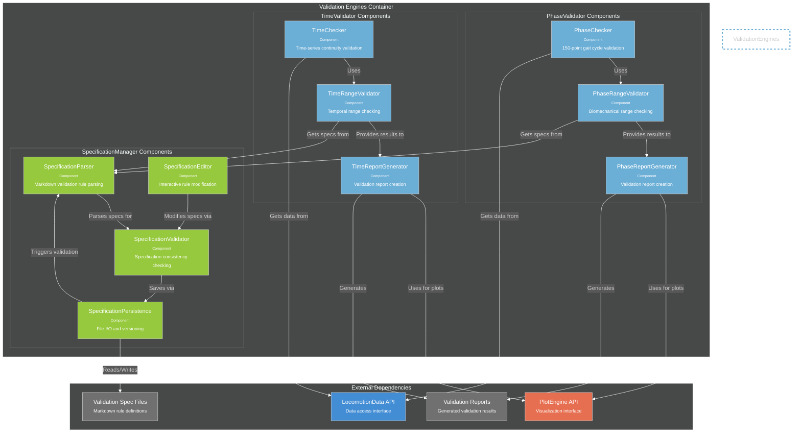

# C4 Component Diagrams - Engine Internal Architecture

**Detailed internal structure of core containers from the contributor architecture.**

---

## Core Infrastructure Components (lib/core/)

```mermaid
%%{init: {'theme': 'dark'}}%%
graph TD
    subgraph "Core Infrastructure Container"
        style CoreInfrastructure fill:#00000000,stroke:#438dd5,stroke-width:3px,stroke-dasharray:5
        
        subgraph "LocomotionData Core Components"
            data_loader["DataLoader<br/><font size='-2'>Component</font><br/><font size='-1'>Parquet file loading and memory management</font>"]
            data_validator["DataValidator<br/><font size='-2'>Component</font><br/><font size='-1'>Basic data integrity checks</font>"]
            data_transformer["DataTransformer<br/><font size='-2'>Component</font><br/><font size='-1'>Phase/time indexing, sign convention conversion, and manipulation</font>"]
            data_api["DataAPI<br/><font size='-2'>Component</font><br/><font size='-1'>Public interface for data access</font>"]
            error_handler["ErrorHandler<br/><font size='-2'>Component</font><br/><font size='-1'>Consistent error handling and user feedback</font>"]
        end
        
        subgraph "FeatureConstants Components"
            variable_registry["VariableRegistry<br/><font size='-2'>Component</font><br/><font size='-1'>Variable name mappings and definitions</font>"]
            biomech_conventions["BiomechConventions<br/><font size='-2'>Component</font><br/><font size='-1'>Sign conventions and coordinate systems</font>"]
            config_manager["ConfigurationManager<br/><font size='-2'>Component</font><br/><font size='-1'>System settings and user preferences</font>"]
        end
    end

    subgraph "External Dependencies"
        parquet_files["Parquet Files<br/><font size='-1'>Quality-assured dataset storage</font>"]
        standard_spec["Standard Specification<br/><font size='-1'>Official data format and conventions</font>"]
        spec_manager_api["SpecificationManager API<br/><font size='-1'>Validation rules and requirements</font>"]
        user_config["User Configuration<br/><font size='-1'>Settings, preferences, and system paths</font>"]
    end

    %% Internal Component Relationships
    data_api -- "Uses" --> data_loader
    data_api -- "Uses" --> data_validator
    data_api -- "Uses" --> data_transformer
    data_api -- "Uses" --> error_handler
    
    data_loader -- "Validates with" --> data_validator
    data_loader -- "Reports errors via" --> error_handler
    data_validator -- "Reports errors via" --> error_handler
    data_transformer -- "Reports errors via" --> error_handler
    
    data_transformer -- "References" --> variable_registry
    data_transformer -- "Applies" --> biomech_conventions
    data_transformer -- "Gets settings from" --> config_manager
    
    variable_registry -- "Loads from" --> standard_spec
    biomech_conventions -- "Loads from" --> standard_spec
    config_manager -- "Loads from" --> user_config
    config_manager -- "Loads defaults from" --> standard_spec

    %% External Dependencies
    data_loader -- "Reads" --> parquet_files
    data_validator -- "Gets validation rules from" --> spec_manager_api

    %% Styling
    style data_loader fill:#438dd5,color:white
    style data_validator fill:#438dd5,color:white
    style data_transformer fill:#438dd5,color:white
    style data_api fill:#438dd5,color:white
    style error_handler fill:#e76f51,color:white
    
    style variable_registry fill:#6baed6,color:white
    style biomech_conventions fill:#6baed6,color:white
    style config_manager fill:#96c93d,color:white
    
    style parquet_files fill:#707070,color:white
    style standard_spec fill:#707070,color:white
    style spec_manager_api fill:#6baed6,color:white
    style user_config fill:#707070,color:white
    
    linkStyle default stroke:white
```

**Key Components:**

- **DataAPI**: Single public interface that other engines use for all data access
- **DataLoader**: Handles parquet file reading and memory management
- **DataValidator**: Ensures data integrity (correct shapes, required columns, data types) and validates against specification requirements
- **DataTransformer**: Phase/time indexing, biomechanical sign convention conversion, filtering, and data manipulation operations
- **ErrorHandler**: Provides consistent error handling, user-friendly messages, and failure recovery guidance
- **VariableRegistry**: Maps between different variable naming conventions (tentative)
- **BiomechConventions**: Applies consistent sign conventions and coordinate systems from standard spec
- **ConfigurationManager**: Manages system settings, user preferences, and configuration hierarchy

### **Cross-Cutting Concerns**

#### **Error Handling Strategy**
- **Consistent Interface**: All core components report errors through ErrorHandler
- **Rich Context**: Errors include dataset name, operation, and specific failure details
- **User-Friendly Messages**: Technical errors translated to actionable user guidance
- **Fail Fast**: Data problems caught early in the pipeline before expensive processing

#### **Configuration Management**
- **Layered Hierarchy**: User settings override standard specification defaults
- **Runtime Access**: DataTransformer gets processing settings from ConfigurationManager
- **Centralized Control**: Single source for system behavior configuration
- **Standard Integration**: Default values come from official standard specification

---

## Validation Engines Components (lib/validation/)

**Key Components:**

### **PhaseValidator**
- **PhaseChecker**: Validates 150-point gait cycle structure and completeness
- **PhaseRangeValidator**: Checks biomechanical values against acceptable ranges
- **PhaseReportGenerator**: Creates comprehensive validation reports with embedded plots

### **TimeValidator**
- **TimeChecker**: Validates time-series continuity and sampling consistency
- **TimeRangeValidator**: Checks temporal biomechanical ranges
- **TimeReportGenerator**: Creates time-series validation reports

### **SpecificationManager**
- **SpecificationParser**: Parses markdown validation rules into usable data structures
- **SpecificationEditor**: Provides interface for interactive rule modification
- **SpecificationValidator**: Ensures rule consistency and prevents conflicts
- **SpecificationPersistence**: Handles file I/O, versioning, and change tracking

---

## Analysis & Visualization Components (lib/validation/)

```mermaid
%%{init: {'theme': 'dark'}}%%
graph TD
    subgraph "PlotEngine Container"
        style PlotEngineContainer fill:#00000000,stroke:#96c93d,stroke-width:3px,stroke-dasharray:5
        
        subgraph "Core Plotting Components"
            plot_factory["PlotFactory<br/><font size='-2'>Component</font><br/><font size='-1'>Creates appropriate plot types</font>"]
            data_plotter["DataPlotter<br/><font size='-2'>Component</font><br/><font size='-1'>Core plotting logic and rendering</font>"]
            plot_styler["PlotStyler<br/><font size='-2'>Component</font><br/><font size='-1'>Consistent styling and theming</font>"]
        end
        
        subgraph "Specialized Plot Types"
            forward_kinematic_plotter["ForwardKinematicPlotter<br/><font size='-2'>Component</font><br/><font size='-1'>Joint angle progression plots (future: + COP/GRF)</font>"]
            phase_filter_plotter["PhaseFilterPlotter<br/><font size='-2'>Component</font><br/><font size='-1'>Phase-based validation plots (kinematic + kinetic)</font>"]
            comparison_plotter["ComparisonPlotter<br/><font size='-2'>Component</font><br/><font size='-1'>Multi-dataset comparison plots</font>"]
        end
        
        subgraph "Plot Enhancement Components"
            range_overlay["RangeOverlay<br/><font size='-2'>Component</font><br/><font size='-1'>Validation range visualization</font>"]
            annotation_engine["AnnotationEngine<br/><font size='-2'>Component</font><br/><font size='-1'>Labels, legends, and metadata</font>"]
            export_manager["ExportManager<br/><font size='-2'>Component</font><br/><font size='-1'>File format handling and output</font>"]
        end
    end

    subgraph "External Dependencies & Data Sources"
        locomotion_api_viz["LocomotionData API<br/><font size='-1'>Direct data loading (when needed)</font>"]
        spec_api["SpecificationManager API<br/><font size='-1'>Validation ranges and rules</font>"]
        external_components["Other Components<br/><font size='-1'>Pre-processed data from validators/analyzers</font>"]
        plot_outputs["Plot Files<br/><font size='-1'>Generated visualization files</font>"]
    end

    %% Core Flow
    plot_factory -- "Creates" --> forward_kinematic_plotter
    plot_factory -- "Creates" --> phase_filter_plotter
    plot_factory -- "Creates" --> comparison_plotter
    
    forward_kinematic_plotter -- "Uses" --> data_plotter
    phase_filter_plotter -- "Uses" --> data_plotter
    comparison_plotter -- "Uses" --> data_plotter
    
    data_plotter -- "Applies styling via" --> plot_styler
    data_plotter -- "Adds overlays via" --> range_overlay
    data_plotter -- "Annotates via" --> annotation_engine
    data_plotter -- "Exports via" --> export_manager

    %% Three Data Flow Patterns
    %% 1. Direct data loading (standalone plotting)
    forward_kinematic_plotter -- "Loads data from" --> locomotion_api_viz
    phase_filter_plotter -- "Loads data from" --> locomotion_api_viz
    comparison_plotter -- "Loads data from" --> locomotion_api_viz
    
    %% 2. Pre-processed data input (from other components)
    external_components -- "Passes processed data to" --> forward_kinematic_plotter
    external_components -- "Passes processed data to" --> phase_filter_plotter
    external_components -- "Passes processed data to" --> comparison_plotter
    
    %% 3. Spec-only plotting (ranges without data)
    range_overlay -- "Gets ranges from" --> spec_api
    phase_filter_plotter -- "Gets validation specs from" --> spec_api
    
    export_manager -- "Creates" --> plot_outputs

    %% Styling
    %% Core Components
    style plot_factory fill:#96c93d,color:white
    style data_plotter fill:#96c93d,color:white
    style plot_styler fill:#96c93d,color:white
    
    %% Specialized Plotters
    style forward_kinematic_plotter fill:#6baed6,color:white
    style phase_filter_plotter fill:#6baed6,color:white
    style comparison_plotter fill:#6baed6,color:white
    
    %% Enhancement Components
    style range_overlay fill:#e76f51,color:white
    style annotation_engine fill:#e76f51,color:white
    style export_manager fill:#e76f51,color:white
    
    %% External Dependencies
    style locomotion_api_viz fill:#438dd5,color:white
    style spec_api fill:#6baed6,color:white
    style external_components fill:#e76f51,color:white
    style plot_outputs fill:#707070,color:white
    
    linkStyle default stroke:white
```

**Key Components:**

### **Core Plotting Infrastructure**
- **PlotFactory**: Determines appropriate plot type based on data and context
- **DataPlotter**: Core plotting logic, handles matplotlib/seaborn integration
- **PlotStyler**: Ensures consistent styling, themes, and visual standards

### **Specialized Plot Types**
- **ForwardKinematicPlotter**: Joint angle progression through gait cycle (future: + COP/GRF visualization)
- **PhaseFilterPlotter**: Phase-based validation plots for both kinematic and kinetic data with range overlays  
- **ComparisonPlotter**: Multi-dataset overlays and statistical comparisons

### **Enhancement Components**
- **RangeOverlay**: Adds validation range indicators to plots
- **AnnotationEngine**: Manages labels, legends, titles, and metadata
- **ExportManager**: Handles multiple output formats (PNG, SVG, PDF) and embedding

### **Flexible Data Flow Patterns**
PlotEngine supports three different data input patterns:

1. **Direct Data Loading**: PlotEngine → LocomotionData API
   - Standalone plotting requests (e.g., `generate_validation_plots.py`)
   - PlotEngine loads data directly when needed

2. **Pre-processed Data Input**: Other Components → PlotEngine
   - Validation engines pass processed results for embedded plots
   - Comparison tools pass analyzed data for visualization
   - Avoids redundant data loading and processing

3. **Spec-only Plotting**: SpecificationManager → PlotEngine
   - Range-only plots showing validation boundaries
   - No biomechanical data required, just specification ranges
   - Useful for documentation and standard visualization

---

## Architecture Benefits

### **Clean Separation of Concerns**
- **Core Infrastructure**: Pure data access and manipulation
- **Validation Engines**: Business logic for quality assurance
- **Visualization**: Specialized plotting with consistent output

### **Modular Design**
- Each component has single responsibility
- Components can be tested independently
- Easy to extend with new plot types or validation rules

### **Proper Abstraction Layers**
- All engines use LocomotionData API (no direct file access)
- All validation uses SpecificationManager API (centralized rule access)
- All plotting uses PlotEngine API (consistent visualization)

### **Maintainable Architecture**
- Changes to data formats only affect LocomotionData Core
- Changes to validation rules only affect SpecificationManager
- Changes to plot styling only affect PlotEngine components