# C4 Component Diagrams - Enhanced Internal Architecture

**Detailed internal structure of core containers with enhanced data flow and coverage tracking.**

---

## Core Infrastructure Components (lib/core/)

```mermaid
%%{init: {'theme': 'dark'}}%%
graph TD
    subgraph "Core Infrastructure Container"
        style CoreInfrastructure fill:#00000000,stroke:#438dd5,stroke-width:3px,stroke-dasharray:5
        
        subgraph "LocomotionData Core Components"
            data_loader["DataLoader<br/><font size='-2'>Component</font><br/><font size='-1'>Parquet file loading and memory management</font>"]
            data_validator["DataValidator<br/><font size='-2'>Component</font><br/><font size='-1'>Basic data integrity checks</font>"]
            data_transformer["DataTransformer<br/><font size='-2'>Component</font><br/><font size='-1'>Phase/time indexing, sign convention conversion, and manipulation</font>"]
            data_api["DataAPI<br/><font size='-2'>Component</font><br/><font size='-1'>Public interface for data access</font>"]
            error_handler["ErrorHandler<br/><font size='-2'>Component</font><br/><font size='-1'>Consistent error handling and user feedback</font>"]
        end
        
        subgraph "FeatureConstants Components"
            variable_registry["VariableRegistry<br/><font size='-2'>Component</font><br/><font size='-1'>Variable name mappings and definitions</font>"]
            biomech_conventions["BiomechConventions<br/><font size='-2'>Component</font><br/><font size='-1'>Sign conventions and coordinate systems</font>"]
            config_manager["ConfigurationManager<br/><font size='-2'>Component</font><br/><font size='-1'>System settings and user preferences</font>"]
        end
    end

    subgraph "External Dependencies"
        parquet_files["Parquet Files<br/><font size='-1'>Quality-assured dataset storage</font>"]
        standard_spec["Standard Specification<br/><font size='-1'>Official data format and conventions</font>"]
        spec_manager_api["SpecificationManager API<br/><font size='-1'>Validation rules and requirements</font>"]
        user_config["User Configuration<br/><font size='-1'>Settings, preferences, and system paths</font>"]
    end

    %% Internal Component Relationships
    data_api -- "Uses" --> data_loader
    data_api -- "Uses" --> data_validator
    data_api -- "Uses" --> data_transformer
    data_api -- "Uses" --> error_handler
    
    data_loader -- "Validates with" --> data_validator
    data_loader -- "Reports errors via" --> error_handler
    data_validator -- "Reports errors via" --> error_handler
    data_transformer -- "Reports errors via" --> error_handler
    
    data_transformer -- "References" --> variable_registry
    data_transformer -- "Applies" --> biomech_conventions
    data_transformer -- "Gets settings from" --> config_manager
    
    variable_registry -- "Loads from" --> standard_spec
    biomech_conventions -- "Loads from" --> standard_spec
    config_manager -- "Loads from" --> user_config
    config_manager -- "Loads defaults from" --> standard_spec

    %% External Dependencies
    data_loader -- "Reads" --> parquet_files
    data_validator -- "Gets validation rules from" --> spec_manager_api

    %% Styling
    style data_loader fill:#438dd5,color:white
    style data_validator fill:#438dd5,color:white
    style data_transformer fill:#438dd5,color:white
    style data_api fill:#438dd5,color:white
    style error_handler fill:#e76f51,color:white
    
    style variable_registry fill:#6baed6,color:white
    style biomech_conventions fill:#6baed6,color:white
    style config_manager fill:#96c93d,color:white
    
    style parquet_files fill:#707070,color:white
    style standard_spec fill:#707070,color:white
    style spec_manager_api fill:#6baed6,color:white
    style user_config fill:#707070,color:white
    
    linkStyle default stroke:white
```

---

## Enhanced Validation Engine Components (validation/)

```mermaid
%%{init: {'theme': 'dark'}}%%
graph TD
    subgraph "Validation Engine Container"
        style ValidationEngine fill:#00000000,stroke:#e76f51,stroke-width:3px,stroke-dasharray:5
        
        subgraph "PhaseValidator Components"
            task_detector["TaskDetector<br/><font size='-2'>Component</font><br/><font size='-1'>Reads tasks from data['task'] column, validates against feature_constants</font>"]
            coverage_analyzer["CoverageAnalyzer<br/><font size='-2'>Component</font><br/><font size='-1'>Analyzes standard spec coverage, identifies missing variables</font>"]
            stride_filter["StrideFilter<br/><font size='-2'>Component</font><br/><font size='-1'>Task-specific stride filtering using validation ranges</font>"]
            phase_structure_validator["PhaseStructureValidator<br/><font size='-2'>Component</font><br/><font size='-1'>Validates 150 points per cycle requirement</font>"]
            phase_report_generator["PhaseReportGenerator<br/><font size='-2'>Component</font><br/><font size='-1'>Generates markdown reports with coverage and stride filtering results</font>"]
        end
        
        subgraph "ValidationSpecManager Components ⭐"
            spec_parser["SpecificationParser<br/><font size='-2'>Component</font><br/><font size='-1'>Parses validation_expectations markdown files</font>"]
            range_provider["RangeProvider<br/><font size='-2'>Component</font><br/><font size='-1'>Provides task and phase-specific validation ranges</font>"]
            spec_editor["SpecificationEditor<br/><font size='-2'>Component</font><br/><font size='-1'>Interactive rule modification with impact preview</font>"]
            spec_persistence["SpecificationPersistence<br/><font size='-2'>Component</font><br/><font size='-1'>File I/O and versioning with backup</font>"]
        end
        
        subgraph "ValidationSpecVisualizer Components"
            plot_adapter["PlotAdapter<br/><font size='-2'>Component</font><br/><font size='-1'>Adapts plots to available variables, skips missing gracefully</font>"]
            coverage_annotator["CoverageAnnotator<br/><font size='-2'>Component</font><br/><font size='-1'>Adds coverage information to plot titles and annotations</font>"]
            validation_plotter["ValidationPlotter<br/><font size='-2'>Component</font><br/><font size='-1'>Generates forward kinematics and phase filter plots</font>"]
        end
        
        subgraph "QualityAssessor Components"
            stride_classifier["StrideClassifier<br/><font size='-2'>Component</font><br/><font size='-1'>Identifies bad strides based on validation spec violations</font>"]
            quality_scorer["QualityScorer<br/><font size='-2'>Component</font><br/><font size='-1'>Calculates stride compliance scores and quality metrics</font>"]
        end
    end

    subgraph "External Dependencies"
        locomotion_api["LocomotionData API<br/><font size='-1'>Data access interface</font>"]
        feature_constants["FeatureConstants<br/><font size='-1'>Standard task and variable definitions</font>"]
        validation_spec_files["Validation Spec Files<br/><font size='-1'>validation_expectations_kinematic.md, kinetic.md</font>"]
        validation_reports["Validation Reports<br/><font size='-1'>Generated markdown reports with coverage info</font>"]
        plot_outputs["Plot Outputs<br/><font size='-1'>Adaptive plots with coverage annotations</font>"]
    end

    %% PhaseValidator Internal Data Flow
    task_detector -- "Detected tasks" --> coverage_analyzer
    task_detector -- "Validated tasks" --> stride_filter
    coverage_analyzer -- "Coverage info" --> phase_report_generator
    coverage_analyzer -- "Available variables" --> stride_filter
    stride_filter -- "Stride filtering results" --> phase_report_generator
    phase_structure_validator -- "Structure validation" --> phase_report_generator
    
    %% ValidationSpecManager Internal Data Flow
    spec_parser -- "Parsed ranges" --> range_provider
    range_provider -- "Task/phase ranges" --> stride_filter
    range_provider -- "Validation specs" --> stride_classifier
    spec_editor -- "Modified specs" --> spec_persistence
    spec_persistence -- "Updated files" --> spec_parser
    
    %% ValidationSpecVisualizer Internal Data Flow
    plot_adapter -- "Available variables list" --> validation_plotter
    coverage_analyzer -- "Coverage info" --> coverage_annotator
    coverage_annotator -- "Annotated metadata" --> validation_plotter
    validation_plotter -- "Generated plots" --> plot_outputs
    
    %% QualityAssessor Internal Data Flow
    stride_classifier -- "Bad stride identifications" --> quality_scorer
    range_provider -- "Validation ranges" --> stride_classifier
    
    %% External Dependencies and Data Flow
    task_detector -- "Validates tasks against" --> feature_constants
    coverage_analyzer -- "Checks variables against" --> feature_constants
    spec_parser -- "Reads validation ranges from" --> validation_spec_files
    spec_persistence -- "Writes updated specs to" --> validation_spec_files
    
    %% Data Input Flow
    locomotion_api -- "Phase-indexed data with task column" --> task_detector
    locomotion_api -- "Dataset for validation" --> phase_structure_validator
    locomotion_api -- "Data for stride filtering" --> stride_filter
    locomotion_api -- "Data for plotting" --> validation_plotter
    
    %% Output Generation
    phase_report_generator -- "Generates" --> validation_reports
    validation_plotter -- "Generates" --> plot_outputs

    %% Styling - PhaseValidator (Critical)
    style task_detector fill:#e76f51,color:white
    style coverage_analyzer fill:#e76f51,color:white
    style stride_filter fill:#e76f51,color:white
    style phase_structure_validator fill:#e76f51,color:white
    style phase_report_generator fill:#e76f51,color:white
    
    %% Styling - ValidationSpecManager (Critical ⭐)
    style spec_parser fill:#96c93d,color:white
    style range_provider fill:#96c93d,color:white
    style spec_editor fill:#96c93d,color:white
    style spec_persistence fill:#96c93d,color:white
    
    %% Styling - ValidationSpecVisualizer (Critical)
    style plot_adapter fill:#f4a261,color:white
    style coverage_annotator fill:#f4a261,color:white
    style validation_plotter fill:#f4a261,color:white
    
    %% Styling - QualityAssessor (High Priority)
    style stride_classifier fill:#6baed6,color:white
    style quality_scorer fill:#6baed6,color:white
    
    %% Styling - External Dependencies
    style locomotion_api fill:#6baed6,color:white
    style feature_constants fill:#96c93d,color:white
    style validation_spec_files fill:#707070,color:white
    style validation_reports fill:#707070,color:white
    style plot_outputs fill:#707070,color:white
    
    linkStyle default stroke:white
```

**Key Components:**

**PhaseValidator Critical Components:**
- **TaskDetector**: Reads tasks from data['task'] column, validates against feature_constants known tasks, handles unknown tasks gracefully
- **CoverageAnalyzer**: Analyzes which standard specification variables are present vs missing, calculates coverage percentages
- **StrideFilter**: Performs task-specific stride filtering using validation ranges from ValidationSpecManager
- **PhaseStructureValidator**: Validates exactly 150 points per cycle requirement for phase-indexed data
- **PhaseReportGenerator**: Creates markdown reports with coverage information, stride filtering results, and actionable recommendations

**ValidationSpecManager Critical Components ⭐:**
- **SpecificationParser**: Parses validation_expectations_kinematic.md and kinetic.md files into structured data
- **RangeProvider**: Provides task and phase-specific validation ranges (0%, 25%, 50%, 75%) for stride filtering
- **SpecificationEditor**: Interactive editing with impact preview showing affected datasets
- **SpecificationPersistence**: File I/O with versioning, backup, and change tracking

**ValidationSpecVisualizer Critical Components:**
- **PlotAdapter**: Adapts plot generation to available variables, gracefully skips missing variables
- **CoverageAnnotator**: Adds coverage information to plot titles ("3/6 kinematic variables plotted")
- **ValidationPlotter**: Generates forward kinematics and phase filter plots with validation ranges

**QualityAssessor High Priority Components:**
- **StrideClassifier**: Identifies bad strides based on validation specification violations
- **QualityScorer**: Calculates stride compliance scores and quality metrics for tracking

---

## Enhanced Data Flow Patterns

### **Phase Validation Flow with Coverage Tracking**
1. **Task Detection**: TaskDetector reads data['task'] column → validates against feature_constants → identifies known vs unknown tasks
2. **Coverage Analysis**: CoverageAnalyzer checks dataset variables against standard specification → calculates coverage percentages → identifies missing variables
3. **Range Retrieval**: RangeProvider gets task and phase-specific ranges from ValidationSpecManager → filters to available variables only
4. **Stride Filtering**: StrideFilter validates each stride against task-specific ranges → keeps valid strides → marks invalid strides for deletion → provides rejection reasons
5. **Report Generation**: PhaseReportGenerator combines coverage info + stride filtering results → generates actionable recommendations → creates markdown report
6. **Adaptive Plotting**: PlotAdapter + CoverageAnnotator create plots for available variables only → annotate with coverage info → skip missing gracefully

### **ValidationSpecManager Data Flow ⭐**
1. **Specification Parsing**: SpecificationParser reads validation_expectations markdown files → structures by task/variable/phase
2. **Range Provision**: RangeProvider serves task-specific ranges (walking vs incline_walking) → phase-specific bounds (0%, 25%, 50%, 75%)
3. **Interactive Editing**: SpecificationEditor modifies ranges → previews impact on existing datasets → shows affected stride counts
4. **Change Persistence**: SpecificationPersistence saves with backup → tracks change rationale → maintains version history

### **Quality Assessment Flow**
1. **Stride Classification**: StrideClassifier identifies bad strides using validation spec violations → provides detailed rejection reasons
2. **Quality Scoring**: QualityScorer calculates stride compliance rates → generates quality metrics → tracks improvement over time

### **Flexible Visualization Flow**
1. **Variable Adaptation**: PlotAdapter determines available variables → adapts plot layouts → warns about missing variables
2. **Coverage Annotation**: CoverageAnnotator adds coverage info to plots → creates human-readable summaries ("5/8 variables plotted")
3. **Plot Generation**: ValidationPlotter creates plots for available variables only → overlays validation ranges → exports with coverage warnings

---

## Cross-Cutting Concerns

### **Error Handling Strategy**
- **Graceful Degradation**: Validation continues with partial specification coverage, warns about missing variables
- **Actionable Errors**: Error messages specify which variables are missing, what ranges are violated, how to fix issues
- **External Collaborator Focus**: Error messages clear for non-experts, avoid technical jargon
- **Partial Failure Handling**: Reports issues but continues processing (warns about unknown tasks, missing variables)

### **Coverage-Aware Processing**
- **Flexible Validation**: Only validates variables present in both dataset and specifications
- **Coverage Tracking**: Tracks standard specification coverage throughout processing pipeline
- **Adaptive Output**: Reports and plots adapt to available data rather than failing on missing variables
- **Scope Communication**: Clearly communicates validation scope ("full", "partial", "minimal") to users

### **Task-Specific Processing**
- **Task Detection**: Automatic task detection from data with validation against known task list
- **Dynamic Range Loading**: Loads appropriate validation ranges based on detected tasks
- **Mixed Task Handling**: Supports datasets with multiple tasks, validates each against appropriate ranges
- **Unknown Task Handling**: Gracefully handles unknown tasks with warnings but continues with known tasks

---

This enhanced component architecture focuses on realistic data processing scenarios where datasets may have partial standard specification coverage, unknown tasks, or missing variables. The system gracefully adapts while providing clear feedback to users about what was validated and what was skipped.