# C4 Component Diagram - Future User-Centric Architecture

```mermaid
%%{init: {'theme': 'dark'}}%%
graph TD
    subgraph "User"
        data_scientist["Data Scientist<br/><font size='-2'>Person</font><br/><font size='-1'>Analyzes and validates locomotion data.</font>"]
    end

    subgraph "Validation System Entry Points (validation/)"
        style ValidationEntryPoints fill:#00000000,stroke:#888,stroke-width:2px,stroke-dasharray:5
        
        subgraph "Data Validation Entry Points"
            validate_phase["validate_phase_data.py<br/><font size='-2'>Entry Point</font><br/><font size='-1'>CLI tool for phase-indexed validation.</font>"]
            validate_time["validate_time_data.py<br/><font size='-2'>Entry Point</font><br/><font size='-1'>CLI tool for time-indexed validation.</font>"]
        end

        subgraph "Visualization Entry Points"
            generate_plots["generate_validation_plots.py<br/><font size='-2'>Entry Point</font><br/><font size='-1'>CLI tool for static validation plots.</font>"]
            generate_gifs["generate_validation_gifs.py<br/><font size='-2'>Entry Point</font><br/><font size='-1'>CLI tool for animated validation GIFs.</font>"]
        end

        subgraph "Configuration Entry Points"
            manage_specs["manage_validation_specs.py<br/><font size='-2'>Entry Point</font><br/><font size='-1'>CLI tool for editing validation rules.</font>"]
            auto_tune["auto_tune_ranges.py<br/><font size='-2'>Entry Point</font><br/><font size='-1'>CLI tool for automated range optimization.</font>"]
        end
    end

    subgraph "Supporting Libraries (lib/validation/)"
        style SupportingLibraries fill:#00000000,stroke:#aaa,stroke-width:1px,stroke-dasharray:3
        
        subgraph "Core Validation Libraries"
            phase_validator["PhaseValidator<br/><font size='-2'>Library</font><br/><font size='-1'>Core phase validation logic.</font>"]
            time_validator["TimeValidator<br/><font size='-2'>Library</font><br/><font size='-1'>Core time validation logic.</font>"]
        end

        subgraph "Visualization Libraries"
            plot_engine["PlotEngine<br/><font size='-2'>Library</font><br/><font size='-1'>Generates kinematic/kinetic plots.</font>"]
            gif_engine["GifEngine<br/><font size='-2'>Library</font><br/><font size='-1'>Creates animated visualizations.</font>"]
        end

        subgraph "Configuration Libraries"
            spec_manager["SpecificationManager<br/><font size='-2'>Library</font><br/><font size='-1'>Manages validation rule parsing.</font>"]
            auto_tuner["AutomatedTuner<br/><font size='-2'>Library</font><br/><font size='-1'>Statistical range optimization.</font>"]
        end
    end

    subgraph "Shared Core Libraries (lib/core/)"
        locomotion_data["LocomotionData<br/><font size='-2'>Library</font><br/><font size='-1'>Core data loading and manipulation.</font>"]
        feature_constants["FeatureConstants<br/><font size='-2'>Library</font><br/><font size='-1'>Variable definitions and mappings.</font>"]
    end

    subgraph "Data & Specifications"
        parquet_storage["Parquet Datasets"]
        validation_spec["Validation Specs"]
        validation_report["Validation Reports"]
    end

    %% User to Entry Point Relationships
    data_scientist -- "Runs" --> validate_phase
    data_scientist -- "Runs" --> validate_time
    data_scientist -- "Runs" --> generate_plots
    data_scientist -- "Runs" --> generate_gifs
    data_scientist -- "Runs" --> manage_specs
    data_scientist -- "Runs" --> auto_tune

    %% Entry Point to Library Relationships
    validate_phase -- "Uses" --> phase_validator
    validate_time -- "Uses" --> time_validator
    generate_plots -- "Uses" --> plot_engine
    generate_gifs -- "Uses" --> gif_engine
    manage_specs -- "Uses" --> spec_manager
    auto_tune -- "Uses" --> auto_tuner

    %% Library to Shared Core Relationships
    phase_validator -- "Uses" --> locomotion_data
    time_validator -- "Uses" --> locomotion_data
    plot_engine -- "Uses" --> locomotion_data
    gif_engine -- "Uses" --> locomotion_data
    spec_manager -- "Uses" --> feature_constants
    auto_tuner -- "Uses" --> locomotion_data
    auto_tuner -- "Uses" --> feature_constants

    %% Library to Data Relationships
    phase_validator -- "Reads" --> parquet_storage
    time_validator -- "Reads" --> parquet_storage
    plot_engine -- "Reads" --> parquet_storage
    gif_engine -- "Reads" --> parquet_storage
    spec_manager -- "Reads/Writes" --> validation_spec
    auto_tuner -- "Reads" --> parquet_storage

    phase_validator -- "Writes" --> validation_report
    time_validator -- "Writes" --> validation_report
    plot_engine -- "Writes" --> validation_report
    gif_engine -- "Writes" --> validation_report

    %% User to Data Relationships (Direct)
    data_scientist -- "Manages" --> parquet_storage
    data_scientist -- "Edits" --> validation_spec
    data_scientist -- "Reviews" --> validation_report

    %% Styling
    style data_scientist fill:#08427b,color:white
    
    %% Entry Points (User-facing CLIs)
    style validate_phase fill:#438dd5,color:white
    style validate_time fill:#438dd5,color:white
    style generate_plots fill:#438dd5,color:white
    style generate_gifs fill:#438dd5,color:white
    style manage_specs fill:#438dd5,color:white
    style auto_tune fill:#438dd5,color:white
    
    %% Supporting Libraries (Internal)
    style phase_validator fill:#6baed6,color:white
    style time_validator fill:#6baed6,color:white
    style plot_engine fill:#6baed6,color:white
    style gif_engine fill:#6baed6,color:white
    style spec_manager fill:#6baed6,color:white
    style auto_tuner fill:#6baed6,color:white
    
    %% Shared Core Libraries
    style locomotion_data fill:#2a9d8f,color:white
    style feature_constants fill:#2a9d8f,color:white

    %% Data Storage
    style parquet_storage fill:#707070,color:white
    style validation_spec fill:#707070,color:white
    style validation_report fill:#707070,color:white
    
    linkStyle default stroke:white
```

## Key Architectural Improvements

### **Clean Entry Points (`validation/`)**
All user-facing tools become simple CLI entry points:
- `validate_phase_data.py` - Validate phase-indexed datasets
- `validate_time_data.py` - Validate time-indexed datasets  
- `generate_validation_plots.py` - Create static validation plots
- `generate_validation_gifs.py` - Create animated validation GIFs
- `manage_validation_specs.py` - Edit validation rules and ranges
- `auto_tune_ranges.py` - Automatically optimize validation ranges

### **Supporting Libraries (`lib/validation/`)**
Core validation logic moves to dedicated library modules:
- `PhaseValidator` - Phase-indexed validation engine
- `TimeValidator` - Time-indexed validation engine
- `PlotEngine` - Static plot generation (filters, forward kinematics)
- `GifEngine` - Animated GIF generation
- `SpecificationManager` - Validation rule parsing and management
- `AutomatedTuner` - Statistical range optimization

### **Shared Core (`lib/core/`)**
Common functionality available to all components:
- `LocomotionData` - Data loading and manipulation
- `FeatureConstants` - Variable definitions and mappings

### **User Benefits**
1. **Clear entry points**: Users know exactly which script to run for each task
2. **Consistent CLI interface**: All tools follow same argument patterns
3. **Modular design**: Easy to extend with new validation tools
4. **Library reuse**: Supporting libraries can be used by other projects
5. **Clean separation**: User tools vs implementation details

This architecture makes the validation system much more user-friendly while maintaining clean code organization.

