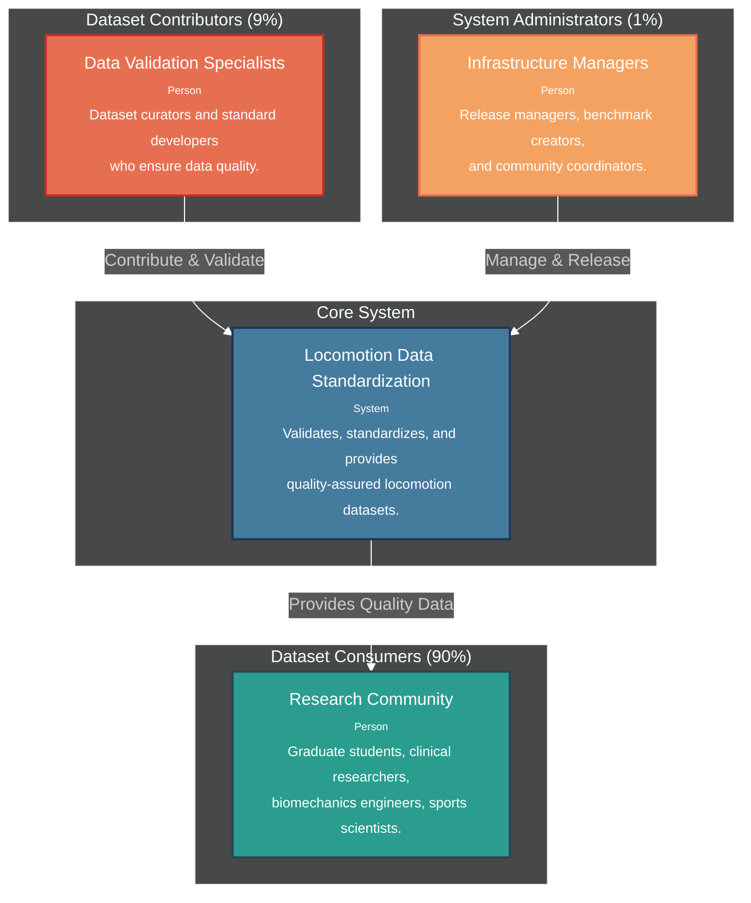
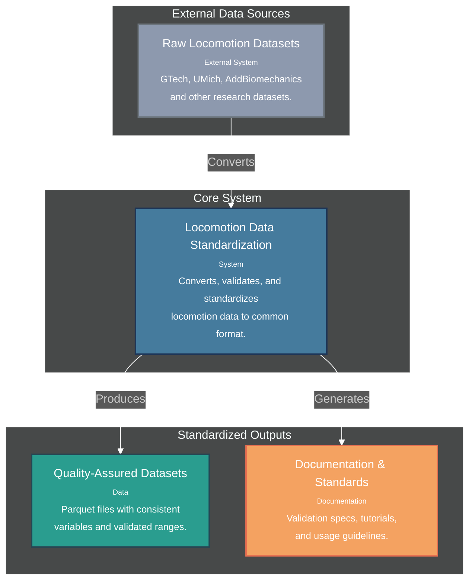
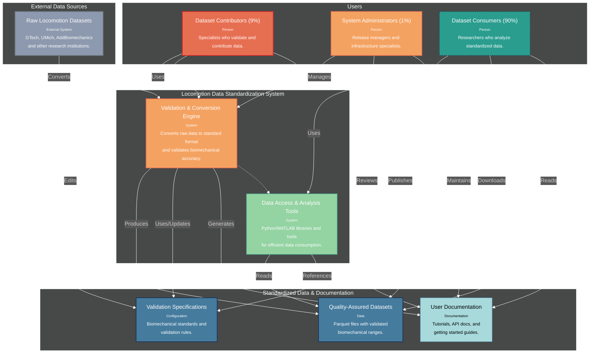

# C4 System Context Diagrams

## Role-Based Entry Points

### Dataset Contributor Workflow

```mermaid
%%{init: {'theme': 'dark'}}%%
graph LR
    DC["🔬 Dataset Contributor<br/><font size='-1'>I have raw locomotion data</font>"] 
    
    DC --> CONVERT["📝 convert_dataset.py<br/><font size='-1'>Convert raw data to parquet</font>"]
    DC --> VALIDATE["✅ validate_phase_data.py<br/><font size='-1'>Validate converted datasets</font>"]
    DC --> ASSESS["📊 assess_quality.py<br/><font size='-1'>Check data quality metrics</font>"]
    
    style DC fill:#e76f51,color:white
    style CONVERT fill:#1168bd,color:white
    style VALIDATE fill:#1168bd,color:white  
    style ASSESS fill:#1168bd,color:white
    
    linkStyle default stroke:white
```

### Validation Specialist Workflow

```mermaid
%%{init: {'theme': 'dark'}}%%
graph LR
    VS["⚙️ Validation Specialist<br/><font size='-1'>I manage data quality standards</font>"]
    
    VS --> MANAGE["📋 manage_validation_specs.py<br/><font size='-1'>Edit validation rules</font>"]
    VS --> TUNE["🎯 auto_tune_ranges.py<br/><font size='-1'>Optimize validation ranges</font>"]
    VS --> COMPARE["📈 compare_datasets.py<br/><font size='-1'>Cross-dataset analysis</font>"]
    VS --> DEBUG["🔍 debug_validation_failures.py<br/><font size='-1'>Investigate data issues</font>"]
    
    style VS fill:#e76f51,color:white
    style MANAGE fill:#1168bd,color:white
    style TUNE fill:#1168bd,color:white
    style COMPARE fill:#1168bd,color:white
    style DEBUG fill:#1168bd,color:white
    
    linkStyle default stroke:white
```

### System Administrator Workflow

```mermaid
%%{init: {'theme': 'dark'}}%%
graph LR
    SA["👨‍💼 System Administrator<br/><font size='-1'>I manage releases and benchmarks</font>"]
    
    SA --> BENCHMARK["🏆 create_benchmarks.py<br/><font size='-1'>Create ML train/test splits</font>"]
    SA --> PUBLISH["📦 publish_datasets.py<br/><font size='-1'>Prepare public releases</font>"]
    SA --> BATCH["⚡ batch_validate.py<br/><font size='-1'>Validate multiple datasets</font>"]
    
    style SA fill:#f4a261,color:white
    style BENCHMARK fill:#1168bd,color:white
    style PUBLISH fill:#1168bd,color:white
    style BATCH fill:#1168bd,color:white
    
    linkStyle default stroke:white
```

### Dataset Consumer Workflow (Future)

```mermaid
%%{init: {'theme': 'dark'}}%%
graph LR
    DC["🎓 Dataset Consumer<br/><font size='-1'>I want to analyze locomotion data</font>"]
    
    DC --> BROWSE["🌐 Web Portal<br/><font size='-1'>Browse available datasets</font>"]
    DC --> DOWNLOAD["📥 Data Repository<br/><font size='-1'>Download parquet files</font>"]
    DC --> PYTHON["🐍 Python Library<br/><font size='-1'>LocomotionData class</font>"]
    DC --> MATLAB["📊 MATLAB Tools<br/><font size='-1'>Native MATLAB integration</font>"]
    
    style DC fill:#2a9d8f,color:white,stroke-dasharray:3
    style BROWSE fill:#6baed6,color:white,stroke-dasharray:3
    style DOWNLOAD fill:#6baed6,color:white,stroke-dasharray:3
    style PYTHON fill:#6baed6,color:white,stroke-dasharray:3
    style MATLAB fill:#6baed6,color:white,stroke-dasharray:3
    
    linkStyle default stroke:white,stroke-dasharray:3
```

**Legend**: 
- **Solid lines** = Current implementation focus (Contributors/Specialists/Administrators)
- **Dashed lines** = Future development (Consumers)

---

## Level 1A: Simple User Split

**Use Case**: Stakeholder communication and high-level system overview

---

## Level 1B: Data Flow Focus

**Use Case**: Technical understanding and data transformation explanation

---

## Level 1C: Intermediate Detail

**Use Case**: Architecture planning and detailed system understanding

---

## Context Diagram Usage Guide

### **Level 1A: Simple User Split**
- **Best For**: Executive summaries, grant proposals, stakeholder presentations
- **Shows**: Clear 90/10 user population and basic system value
- **Audience**: Non-technical stakeholders, funding bodies, project sponsors

### **Level 1B: Data Flow Focus** 
- **Best For**: Technical documentation, system integration planning
- **Shows**: What the system does (data transformation) without user complexity
- **Audience**: Technical teams, system architects, data engineers

### **Level 1C: Intermediate Detail**
- **Best For**: Development planning, architecture discussions, team alignment
- **Shows**: System components, user interactions, and development priorities
- **Audience**: Development teams, product managers, technical leads

### **Development Priority Visualization**
- **Solid lines + full color**: Current development focus (contributors, validation engine)
- **Dashed lines + muted color**: Future development focus (consumers, analysis tools)
- **Quality bridge**: How validation ensures consumer confidence behind the scenes

## Strategic Approach

**Phase 1**: Build robust contributor tools (validation engine) to ensure high-quality datasets
**Phase 2**: Develop consumer experience (analysis tools) using proven foundation

The validation system ensures dataset quality behind the scenes, enabling consumer confidence without requiring validation expertise.