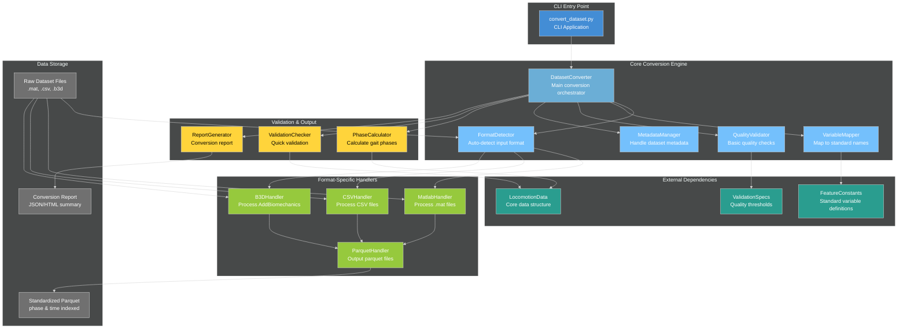
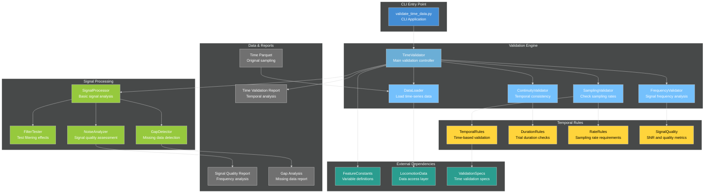

# C4 Component Detailed Diagrams - Critical Entry Points

## C4 Level 4: convert_dataset.py - Dataset Conversion Component



### **Component Responsibilities**

#### **DatasetConverter** (Main Orchestrator)
- **Interface**: `convert_dataset(input_path, output_dir, options)`
- **Responsibilities**: 
  - Coordinate conversion workflow
  - Handle error recovery and rollback
  - Progress reporting and logging
- **Key Methods**:
  - `detect_format(input_path) -> FormatType`
  - `execute_conversion(handler, options) -> ConversionResult`
  - `generate_report(results) -> Report`

#### **FormatDetector** (Input Analysis)
- **Interface**: `detect_format(file_path) -> FormatType`
- **Responsibilities**:
  - Identify input file format
  - Validate file structure
  - Extract format-specific metadata
- **Supported Formats**: MATLAB (.mat), CSV, AddBiomechanics B3D, Custom formats

#### **VariableMapper** (Standardization)
- **Interface**: `map_variables(input_vars, format_type) -> VariableMapping`
- **Responsibilities**:
  - Map source variables to standard names
  - Handle unit conversions
  - Flag unmapped variables
- **Data Source**: FeatureConstants for standard definitions

### **Input/Output Specifications**

#### **CLI Interface**
```bash
python convert_dataset.py [OPTIONS] INPUT_PATH OUTPUT_DIR

Required Arguments:
  INPUT_PATH     Path to raw dataset file or directory
  OUTPUT_DIR     Directory for standardized parquet outputs

Options:
  --format TYPE          Force specific format (matlab, csv, b3d)
  --mapping FILE         Custom variable mapping file
  --phase-method METHOD  Phase calculation method (heel_strike, statistical)
  --validation LEVEL     Validation strictness (strict, moderate, lenient)
  --report-format TYPE   Report format (json, html, both)
  --overwrite           Overwrite existing output files
```

#### **Output Structure**
```
OUTPUT_DIR/
├── {dataset_name}_time.parquet      # Time-indexed data
├── {dataset_name}_phase.parquet     # Phase-indexed data (150 points/cycle)
├── conversion_report.json           # Machine-readable results
├── conversion_report.html           # Human-readable summary
└── metadata/
    ├── variable_mapping.json        # Source to standard mapping
    ├── quality_metrics.json         # Conversion quality assessment
    └── processing_log.txt           # Detailed processing log
```

---

## C4 Level 4: validate_phase_data.py - Phase Validation Component

```mermaid
%%{init: {'theme': 'dark'}}%%
graph TD
    subgraph "CLI Entry Point"
        CLI[validate_phase_data.py<br/>CLI Application]
    end
    
    subgraph "Validation Engine"
        PV[PhaseValidator<br/>Main validation controller]
        DL[DataLoader<br/>Load phase-indexed data]
        RV[RangeValidator<br/>Check biomechanical ranges]
        SV[StructureValidator<br/>Verify data structure]
        CV[ConsistencyValidator<br/>Cross-variable checks]
    end
    
    subgraph "Validation Rules"
        SM[SpecificationManager<br/>Load validation specs]
        KR[KinematicRules<br/>Joint angle/velocity rules]
        KT[KineticRules<br/>Force/moment rules]
        PR[PhaseRules<br/>Phase-specific validations]
    end
    
    subgraph "Analysis & Reporting"
        SA[StatisticalAnalyzer<br/>Data distribution analysis]
        VR[ValidationReporter<br/>Generate reports]
        FA[FailureAnalyzer<br/>Detailed failure analysis]
        PM[PlotManager<br/>Validation visualizations]
    end
    
    subgraph "External Dependencies"
        FC[FeatureConstants<br/>Variable definitions]
        LD[LocomotionData<br/>Data access layer]
        VS[ValidationSpecs<br/>Markdown specifications]
    end
    
    subgraph "Data & Reports"
        INPUT[Phase Parquet<br/>150 points/cycle]
        REPORT[Validation Report<br/>Pass/fail details]
        PLOTS[Validation Plots<br/>Visual verification]
        STATS[Statistics Report<br/>Data distribution]
    end
    
    %% CLI to Engine
    CLI --> PV
    PV --> DL
    PV --> RV
    PV --> SV
    PV --> CV
    
    %% Validation Rules
    SM --> KR
    SM --> KT
    SM --> PR
    RV --> KR
    RV --> KT
    RV --> PR
    
    %% Analysis & Reporting
    PV --> SA
    PV --> VR
    SA --> FA
    VR --> PM
    
    %% Dependencies
    DL --> LD
    SM --> VS
    RV --> FC
    SA --> FC
    
    %% Data Flow
    INPUT --> DL
    VR --> REPORT
    PM --> PLOTS
    SA --> STATS
    
    %% Styling
    style CLI fill:#438dd5,color:white
    style PV fill:#6baed6,color:white
    style DL fill:#74c0fc,color:white
    style RV fill:#74c0fc,color:white
    style SV fill:#74c0fc,color:white
    style CV fill:#74c0fc,color:white
    style SM fill:#96c93d,color:white
    style KR fill:#96c93d,color:white
    style KT fill:#96c93d,color:white
    style PR fill:#96c93d,color:white
    style SA fill:#ffd43b,color:black
    style VR fill:#ffd43b,color:black
    style FA fill:#ffd43b,color:black
    style PM fill:#ffd43b,color:black
    style FC fill:#2a9d8f,color:white
    style LD fill:#2a9d8f,color:white
    style VS fill:#2a9d8f,color:white
    style INPUT fill:#707070,color:white
    style REPORT fill:#707070,color:white
    style PLOTS fill:#707070,color:white
    style STATS fill:#707070,color:white
```



### **Component Responsibilities**

#### **PhaseValidator** (Main Controller)
- **Interface**: `validate_dataset(dataset_path, validation_mode) -> ValidationResults`
- **Responsibilities**:
  - Orchestrate validation workflow
  - Aggregate results from all validators
  - Generate comprehensive reports
- **Key Methods**:
  - `run_structural_validation() -> StructureResults`
  - `run_range_validation() -> RangeResults`
  - `run_consistency_validation() -> ConsistencyResults`

#### **RangeValidator** (Biomechanical Validation)
- **Interface**: `validate_ranges(data, rules) -> RangeResults`
- **Responsibilities**:
  - Check values against biomechanical ranges
  - Phase-specific validation (0%, 25%, 50%, 75%)
  - Statistical outlier detection
- **Validation Types**: Min/max ranges, percentile-based, literature norms

#### **StructureValidator** (Data Format Validation)
- **Interface**: `validate_structure(data) -> StructureResults`
- **Responsibilities**:
  - Verify 150 points per gait cycle
  - Check required variables present
  - Validate data types and units
- **Checks**: Shape validation, missing data, phase continuity

### **CLI Interface & Output**

#### **Command Line Interface**
```bash
python validate_phase_data.py [OPTIONS] DATASET_PATH

Required Arguments:
  DATASET_PATH    Path to phase-indexed parquet file

Options:
  --mode TYPE           Validation mode (kinematic, kinetic, all)
  --specs-file FILE     Custom validation specifications
  --output-dir DIR      Directory for validation outputs
  --plots               Generate validation plots
  --stats               Include statistical analysis
  --fail-fast           Stop on first critical failure
  --report-format TYPE  Report format (json, html, text)
```

#### **Validation Report Structure**
```json
{
  "dataset": "gtech_2023_phase.parquet",
  "validation_timestamp": "2024-12-06T10:30:00Z",
  "overall_status": "PASS",
  "summary": {
    "total_checks": 1247,
    "passed": 1247,
    "failed": 0,
    "warnings": 3
  },
  "structure_validation": {
    "status": "PASS",
    "phase_points": 150,
    "gait_cycles": 824,
    "subjects": 12,
    "tasks": ["level_walking", "incline_walking"]
  },
  "range_validation": {
    "status": "PASS",
    "kinematic_checks": 600,
    "kinetic_checks": 647,
    "failures": []
  }
}
```

---

## C4 Level 4: validate_time_data.py - Time Validation Component



### **Component Responsibilities**

#### **TimeValidator** (Main Controller)
- **Interface**: `validate_time_series(dataset_path, analysis_mode) -> TimeResults`
- **Responsibilities**:
  - Coordinate temporal validation workflow
  - Analyze signal quality and continuity
  - Generate time-specific reports
- **Key Methods**:
  - `analyze_sampling_rates() -> SamplingResults`
  - `detect_signal_anomalies() -> QualityResults`
  - `validate_temporal_consistency() -> ConsistencyResults`

#### **SamplingValidator** (Rate & Consistency)
- **Interface**: `validate_sampling(data) -> SamplingResults`
- **Responsibilities**:
  - Verify consistent sampling rates
  - Detect sampling rate changes
  - Validate against collection protocols
- **Checks**: Rate consistency, nyquist compliance, temporal gaps

#### **SignalProcessor** (Quality Analysis)
- **Interface**: `analyze_signal_quality(data) -> SignalResults`
- **Responsibilities**:
  - Frequency domain analysis
  - Noise characterization
  - Filter response testing
- **Metrics**: SNR, frequency content, filter artifacts

---

## C4 Level 4: create_benchmarks.py - ML Benchmark Component

```mermaid
%%{init: {'theme': 'dark'}}%%
graph TD
    subgraph "CLI Entry Point"
        CLI[create_benchmarks.py<br/>CLI Application]
    end
    
    subgraph "Benchmark Engine"
        BC[BenchmarkCreator<br/>Main benchmark orchestrator]
        DS[DatasetSelector<br/>Quality-based selection]
        SS[SplitStrategy<br/>Train/val/test splitting]
        BV[BenchmarkValidator<br/>Split quality checks]
    end
    
    subgraph "Split Strategies"
        SUB[SubjectSplit<br/>Subject-based splitting]
        TEM[TemporalSplit<br/>Time-based splitting]
        STR[StratifiedSplit<br/>Balanced splitting]
        CUS[CustomSplit<br/>User-defined rules]
    end
    
    subgraph "ML Integration"
        FE[FeatureExtractor<br/>ML-ready features]
        FO[FormatExporter<br/>Framework-specific export]
        BM[BaselineModels<br/>Performance baselines]
        ME[MetricsEvaluator<br/>Benchmark metrics]
    end
    
    subgraph "Quality Assurance"
        LS[LeakageDetector<br/>Detect data leakage]
        BS[BalanceAnalyzer<br/>Split balance analysis]
        CS[CoverageStats<br/>Demographic coverage]
        VT[ValidationTester<br/>Cross-validation setup]
    end
    
    subgraph "External Dependencies"
        FC[FeatureConstants<br/>Variable definitions]
        LD[LocomotionData<br/>Data access layer]
        QM[QualityMetrics<br/>Dataset quality scores]
    end
    
    subgraph "Output Artifacts"
        TRAIN[Training Set<br/>Multiple formats]
        VAL[Validation Set<br/>Model tuning]
        TEST[Test Set<br/>Final evaluation]
        META[Benchmark Metadata<br/>Split documentation]
        BASE[Baseline Results<br/>Performance targets]
    end
    
    %% CLI to Engine
    CLI --> BC
    BC --> DS
    BC --> SS
    BC --> BV
    
    %% Split Strategies
    SS --> SUB
    SS --> TEM
    SS --> STR
    SS --> CUS
    
    %% ML Integration
    BC --> FE
    BC --> FO
    BC --> BM
    BC --> ME
    
    %% Quality Assurance
    BV --> LS
    BV --> BS
    BV --> CS
    BV --> VT
    
    %% Dependencies
    DS --> QM
    FE --> FC
    BC --> LD
    
    %% Output Generation
    SS --> TRAIN
    SS --> VAL
    SS --> TEST
    BC --> META
    BM --> BASE
    
    %% Styling
    style CLI fill:#438dd5,color:white
    style BC fill:#6baed6,color:white
    style DS fill:#74c0fc,color:white
    style SS fill:#74c0fc,color:white
    style BV fill:#74c0fc,color:white
    style SUB fill:#96c93d,color:white
    style TEM fill:#96c93d,color:white
    style STR fill:#96c93d,color:white
    style CUS fill:#96c93d,color:white
    style FE fill:#ffd43b,color:black
    style FO fill:#ffd43b,color:black
    style BM fill:#ffd43b,color:black
    style ME fill:#ffd43b,color:black
    style LS fill:#ff6b6b,color:white
    style BS fill:#ff6b6b,color:white
    style CS fill:#ff6b6b,color:white
    style VT fill:#ff6b6b,color:white
    style FC fill:#2a9d8f,color:white
    style LD fill:#2a9d8f,color:white
    style QM fill:#2a9d8f,color:white
    style TRAIN fill:#707070,color:white
    style VAL fill:#707070,color:white
    style TEST fill:#707070,color:white
    style META fill:#707070,color:white
    style BASE fill:#707070,color:white
```



### **Component Responsibilities**

#### **BenchmarkCreator** (Main Orchestrator)
- **Interface**: `create_benchmark(datasets, split_config, ml_config) -> BenchmarkSuite`
- **Responsibilities**:
  - Coordinate benchmark creation workflow
  - Ensure no data leakage between splits
  - Generate comprehensive benchmark documentation
- **Key Methods**:
  - `select_quality_datasets() -> DatasetList`
  - `apply_split_strategy() -> TrainValTest`
  - `generate_baseline_performance() -> BaselineResults`

#### **SplitStrategy** (Data Partitioning)
- **Interface**: `create_splits(data, strategy_config) -> DataSplits`
- **Responsibilities**:
  - Implement various splitting strategies
  - Ensure balanced demographic representation
  - Prevent temporal or subject leakage
- **Strategies**: Subject-based, temporal, stratified, custom rules

#### **FeatureExtractor** (ML Preparation)
- **Interface**: `extract_features(data, feature_config) -> MLFeatures`
- **Responsibilities**:
  - Convert biomechanical data to ML features
  - Handle missing data and normalization
  - Create task-specific feature sets
- **Outputs**: Scikit-learn, PyTorch, TensorFlow formats

### **CLI Interface & Benchmark Output**

#### **Command Line Interface**
```bash
python create_benchmarks.py [OPTIONS] DATASET_PATHS OUTPUT_DIR

Required Arguments:
  DATASET_PATHS   Paths to quality-validated parquet files
  OUTPUT_DIR      Directory for benchmark suite outputs

Options:
  --split-strategy TYPE     Splitting method (subject, temporal, stratified)
  --train-ratio FLOAT       Training set proportion (default: 0.7)
  --val-ratio FLOAT         Validation set proportion (default: 0.15) 
  --test-ratio FLOAT        Test set proportion (default: 0.15)
  --min-quality SCORE       Minimum dataset quality score
  --tasks LIST              Specific tasks to include
  --export-formats LIST     Output formats (sklearn, pytorch, tensorflow)
  --baseline-models LIST    Baseline models to train
  --balance-demographics    Ensure demographic balance across splits
```

#### **Benchmark Suite Structure**
```
OUTPUT_DIR/
├── train/
│   ├── locomotion_features.parquet
│   ├── sklearn_format.pkl
│   ├── pytorch_format.pt
│   └── tensorflow_format.tfrecord
├── validation/
│   └── [same format structure]
├── test/
│   └── [same format structure]
├── metadata/
│   ├── benchmark_specification.json
│   ├── split_demographics.json
│   ├── quality_metrics.json
│   └── leakage_analysis.json
├── baselines/
│   ├── linear_regression_results.json
│   ├── random_forest_results.json
│   └── neural_network_results.json
└── documentation/
    ├── README.md
    ├── usage_examples.py
    └── evaluation_protocol.md
```

---

## Interface Specifications

### **Common CLI Patterns**

All critical entry points follow consistent interface patterns:

#### **Standard Arguments**
- **Input**: Dataset path(s) or directory
- **Output**: Output directory for results
- **Configuration**: Optional config files for customization

#### **Standard Options**
- `--verbose/-v`: Detailed logging output
- `--quiet/-q`: Minimal output for automation
- `--config FILE`: Configuration file override
- `--output-format TYPE`: Report format selection
- `--help/-h`: Usage information

#### **Exit Codes**
- `0`: Success
- `1`: General error  
- `2`: Invalid arguments
- `3`: Data quality failure
- `4`: Validation failure

### **Shared Core Interfaces**

#### **LocomotionData Integration**
All components use standardized data access:
```python
class ComponentBase:
    def __init__(self, dataset_path: str):
        self.data = LocomotionData.from_parquet(dataset_path)
    
    def get_task_data(self, task: str) -> LocomotionData:
        return self.data.filter_by_task(task)
    
    def validate_data_structure(self) -> bool:
        return self.data.validate_schema()
```

#### **Progress Reporting**
Consistent progress reporting across all components:
```python
class ProgressReporter:
    def start_operation(self, operation: str, total_steps: int)
    def update_progress(self, step: int, message: str) 
    def complete_operation(self, success: bool, summary: str)
```

#### **Error Handling**
Standardized error types and handling:
```python
class ValidationError(Exception): pass
class DataFormatError(Exception): pass
class QualityError(Exception): pass
class ConfigurationError(Exception): pass
```

These detailed C4 Level 4 diagrams and specifications provide the foundation for implementing the critical entry points with clear interfaces, responsibilities, and integration patterns.