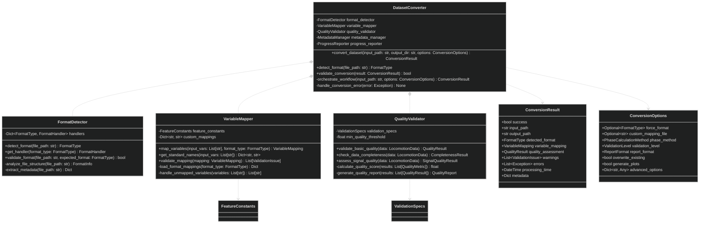
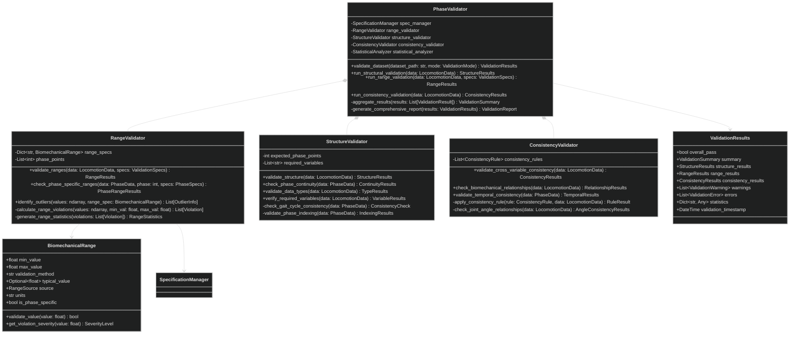
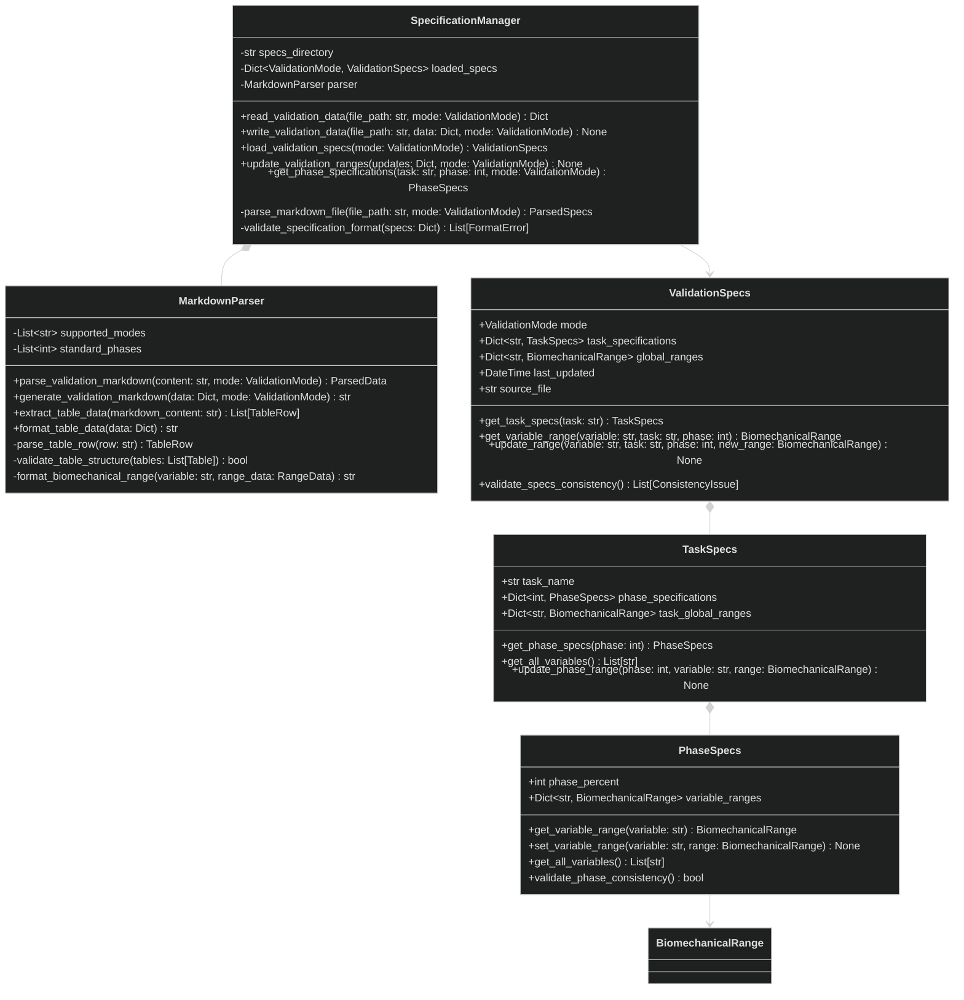
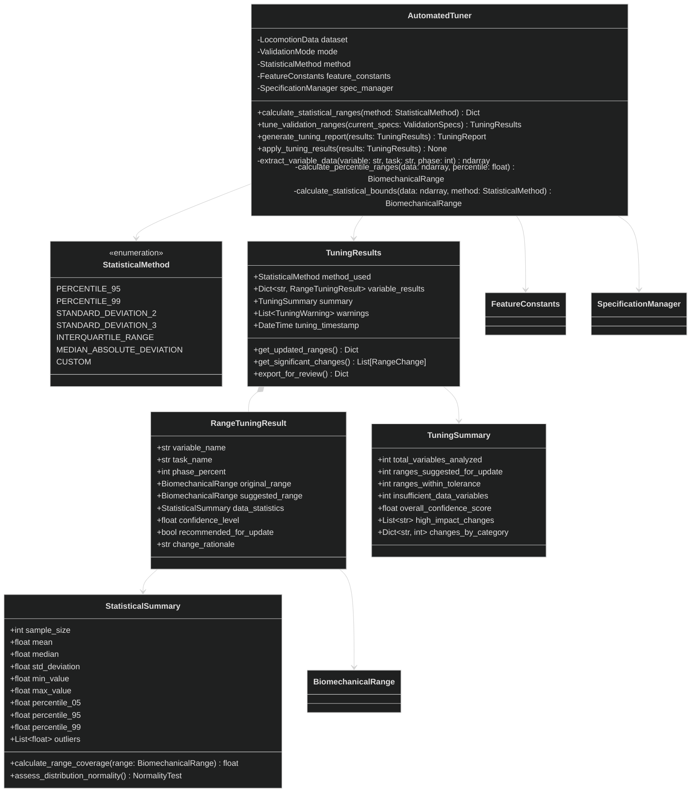
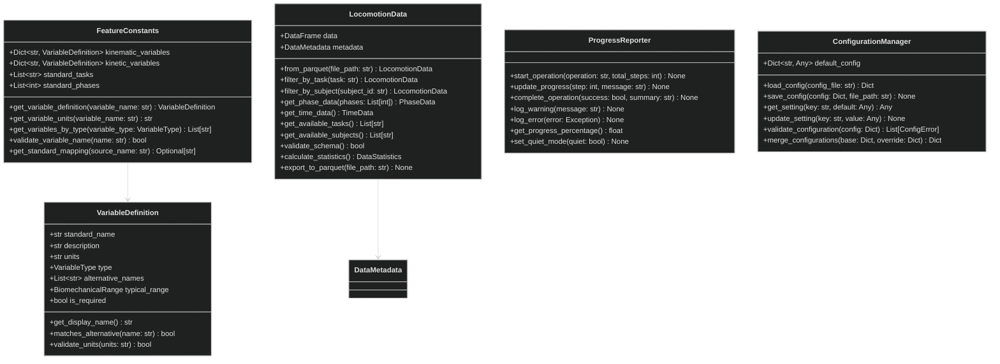
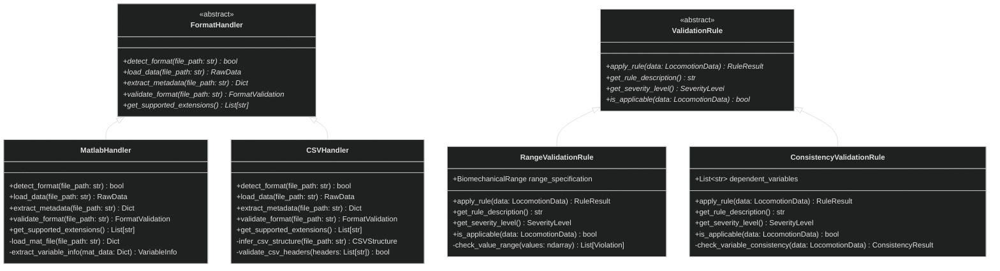

# UML Class Diagrams - Core Components

## DatasetConverter Class Structure

---

## PhaseValidator Class Structure

---

## SpecificationManager Class Structure

---

## AutomatedTuner Class Structure

---

## BenchmarkCreator Class Structure

```mermaid
%%{init: {'theme': 'dark'}}%%
classDiagram
    class BenchmarkCreator {
        -DatasetSelector dataset_selector
        -SplitStrategy split_strategy
        -FeatureExtractor feature_extractor
        -BenchmarkValidator benchmark_validator
        +create_benchmark(datasets: List[str], config: BenchmarkConfig) BenchmarkSuite
        +select_quality_datasets(datasets: List[str], min_quality: float) List[str]
        +create_data_splits(data: LocomotionData, strategy: SplitConfig) DataSplits
        +generate_ml_features(data: LocomotionData, feature_config: FeatureConfig) MLFeatures
        +validate_benchmark_quality(benchmark: BenchmarkSuite) BenchmarkValidation
        -ensure_no_data_leakage(splits: DataSplits) LeakageAnalysis
    }
    
    class SplitStrategy {
        +SplitType strategy_type
        +SplitConfig configuration
        +create_splits(data: LocomotionData, config: SplitConfig) DataSplits
        +validate_split_balance(splits: DataSplits) BalanceAnalysis
        +detect_data_leakage(splits: DataSplits) LeakageReport
        -apply_subject_split(data: LocomotionData, ratios: SplitRatios) SubjectSplits
        -apply_temporal_split(data: LocomotionData, ratios: SplitRatios) TemporalSplits
        -apply_stratified_split(data: LocomotionData, ratios: SplitRatios) StratifiedSplits
    }
    
    class FeatureExtractor {
        -FeatureConfig feature_configuration
        -List~str~ supported_ml_frameworks
        +extract_features(data: LocomotionData, config: FeatureConfig) MLFeatures
        +create_sklearn_format(features: MLFeatures) SklearnDataset
        +create_pytorch_format(features: MLFeatures) TorchDataset
        +create_tensorflow_format(features: MLFeatures) TFDataset
        +normalize_features(features: MLFeatures, method: NormalizationMethod) MLFeatures
        -handle_missing_data(features: MLFeatures, strategy: ImputationStrategy) MLFeatures
        -extract_biomechanical_features(data: LocomotionData) BiomechanicalFeatures
    }
    
    class BenchmarkValidator {
        -List~ValidationRule~ validation_rules
        +validate_benchmark_suite(benchmark: BenchmarkSuite) BenchmarkValidation
        +check_demographic_balance(splits: DataSplits) DemographicAnalysis
        +assess_split_quality(splits: DataSplits) SplitQualityReport
        +detect_data_leakage(splits: DataSplits) LeakageAnalysis
        -validate_feature_consistency(features: MLFeatures) FeatureValidation
        -check_label_distribution(splits: DataSplits) LabelDistribution
    }
    
    class BenchmarkSuite {
        +str benchmark_id
        +DataSplits data_splits
        +MLFeatures features
        +BenchmarkMetadata metadata
        +BaselineResults baseline_performance
        +BenchmarkDocumentation documentation
        +export_framework_format(framework: MLFramework) FrameworkDataset
        +get_split_statistics() SplitStatistics
        +validate_integrity() IntegrityReport
    }
    
    class DataSplits {
        +LocomotionData training_set
        +LocomotionData validation_set
        +LocomotionData test_set
        +SplitMetadata metadata
        +get_split_sizes() Dict~str, int~
        +get_demographic_distribution() DemographicStats
        +check_subject_overlap() bool
        +export_split_info() Dict
    }
    
    class MLFeatures {
        +ndarray feature_matrix
        +List~str~ feature_names
        +ndarray labels
        +List~str~ label_names
        +FeatureMetadata metadata
        +normalize(method: NormalizationMethod) MLFeatures
        +select_features(selector: FeatureSelector) MLFeatures
        +export_format(framework: MLFramework) FrameworkDataset
    }
    
    BenchmarkCreator *-- DatasetSelector
    BenchmarkCreator *-- SplitStrategy
    BenchmarkCreator *-- FeatureExtractor
    BenchmarkCreator *-- BenchmarkValidator
    BenchmarkCreator --> BenchmarkSuite
    SplitStrategy --> DataSplits
    FeatureExtractor --> MLFeatures
    BenchmarkSuite *-- DataSplits
    BenchmarkSuite *-- MLFeatures
```

---

## Shared Core Classes

---

## Interface and Abstract Base Classes

These UML class diagrams provide comprehensive specifications for implementing the core components of the locomotion data standardization system, with clear inheritance hierarchies, composition relationships, and method signatures that can drive test-driven development.