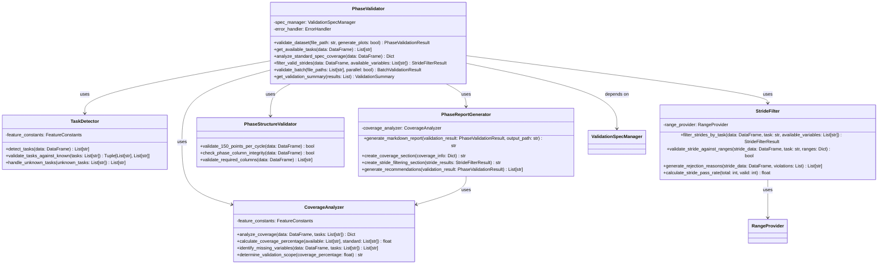
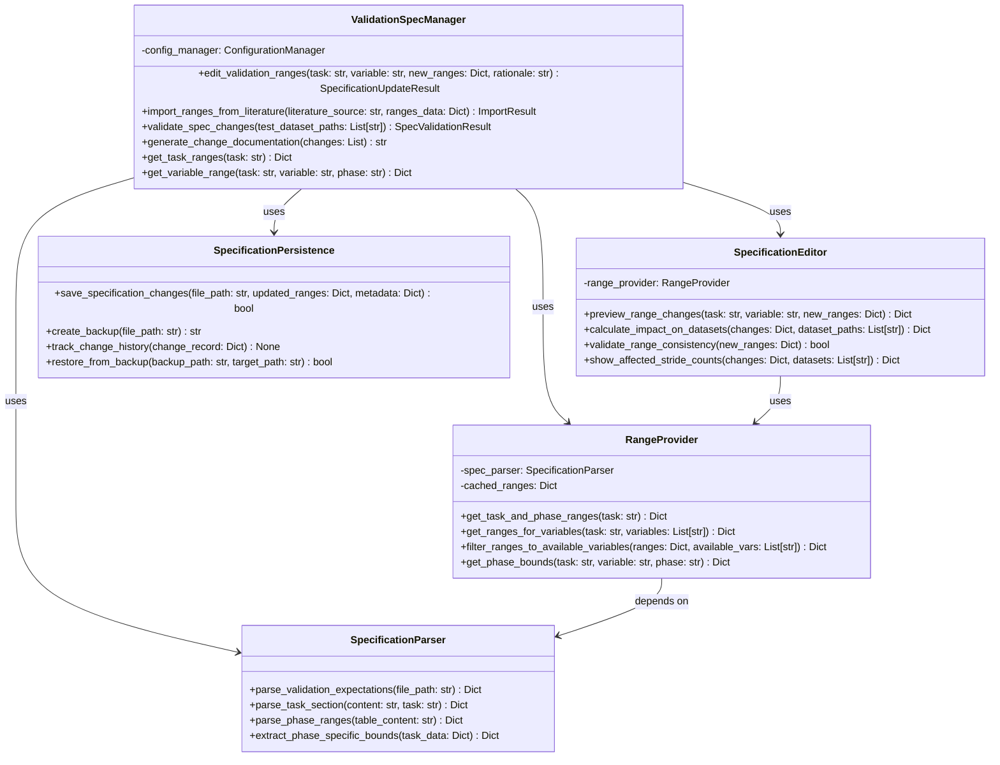
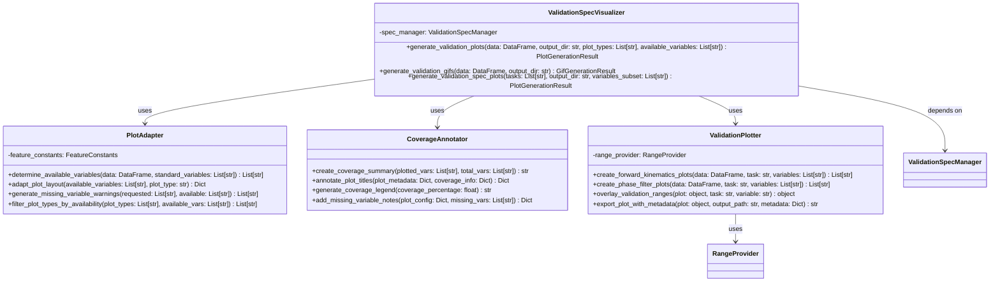
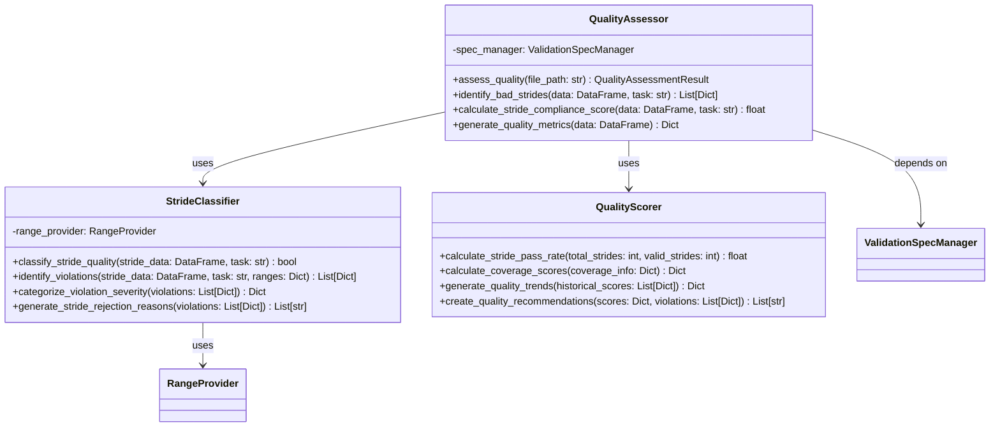
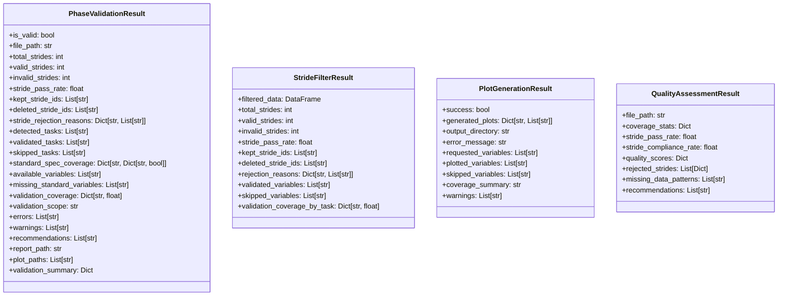
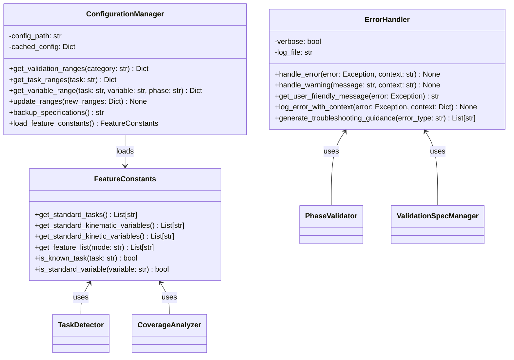

# UML Class Diagrams - Core Component Structure

**Fresh UML class diagrams reflecting the enhanced interface specifications and component architecture.**

---

## Critical Priority Components

### PhaseValidator Component Structure

---

### ValidationSpecManager Component Structure ⭐

---

### ValidationSpecVisualizer Component Structure

---

## High Priority Components

### QualityAssessor Component Structure

---

## Supporting Infrastructure Components

### Core Data Structures

---

### Configuration and Error Handling

---

## Key Architectural Patterns

### **Composition over Inheritance**
- Components are composed of smaller, focused sub-components
- Each sub-component has a single responsibility
- Dependencies are injected rather than tightly coupled

### **Strategy Pattern for Flexibility**
- `PlotAdapter` adapts behavior based on available variables
- `StrideFilter` applies different validation strategies per task
- `CoverageAnalyzer` handles different coverage scenarios

### **Observer Pattern for Reporting**
- `PhaseReportGenerator` observes validation results
- `CoverageAnnotator` observes coverage analysis
- `QualityScorer` observes stride classification results

### **Facade Pattern for Complexity**
- `PhaseValidator` provides simple interface to complex validation workflow
- `ValidationSpecManager` hides specification parsing complexity
- `ValidationSpecVisualizer` simplifies plot generation with coverage tracking

---

This UML design reflects the enhanced interface specifications with:
- **Task-specific processing** with graceful unknown task handling
- **Coverage-aware operations** that adapt to available variables
- **Stride-level filtering** with detailed rejection reasons
- **Flexible visualization** that skips missing variables gracefully
- **External collaborator focus** with clear error messages

The structure supports realistic data processing scenarios while maintaining clean separation of concerns.