```mermaid
%%{init: {'theme': 'dark'}}%%
graph TD
    subgraph "Enhanced Contributors (10%)"
        contributors["Dataset Contributors<br/><font size='-2'>Person</font><br/><font size='-1'>Streamlined data contribution</font>"]
        specialists["Validation Specialists<br/><font size='-2'>Person</font><br/><font size='-1'>Advanced quality analytics</font>"]
        admins["System Administrators<br/><font size='-2'>Person</font><br/><font size='-1'>Automated release management</font>"]
        reviewers["Community Reviewers<br/><font size='-2'>Person</font><br/><font size='-1'>Peer validation and standards</font>"]
    end

    subgraph "Enhanced Validation Platform (Future Contributor Tools)"
        style EnhancedPlatform fill:#00000000,stroke:#f4a261,stroke-width:3px,stroke-dasharray:3
        
        subgraph "Advanced CLI Tools"
            direction LR
            batch_validate["batch_validate.py<br/><font size='-2'>Container</font><br/><font size='-1'>Multi-dataset validation</font>"]
            debug_failures["debug_validation_failures.py<br/><font size='-2'>Container</font><br/><font size='-1'>Deep failure analysis</font>"]
            compare_datasets["compare_datasets.py<br/><font size='-2'>Container</font><br/><font size='-1'>Cross-dataset comparison</font>"]
        end

        subgraph "ML & Analytics Tools"
            direction LR
            create_benchmarks["create_benchmarks.py<br/><font size='-2'>Container</font><br/><font size='-1'>ML benchmark creation</font>"]
            publish_datasets["publish_datasets.py<br/><font size='-2'>Container</font><br/><font size='-1'>Release preparation</font>"]
            analytics_dashboard["Analytics Dashboard<br/><font size='-2'>Container</font><br/><font size='-1'>Quality trend analysis</font>"]
        end

        subgraph "Community Tools"
            direction LR
            review_portal["Review Portal<br/><font size='-2'>Container</font><br/><font size='-1'>Peer review workflows</font>"]
            standards_wiki["Standards Wiki<br/><font size='-2'>Container</font><br/><font size='-1'>Community documentation</font>"]
            feedback_system["Feedback System<br/><font size='-2'>Container</font><br/><font size='-1'>User suggestions and issues</font>"]
        end
    end

    subgraph "Enhanced Data Infrastructure (Future)"
        direction LR
        subgraph "Intelligent Processing"
            auto_converter["Smart Converter<br/><font size='-1'>AI-assisted format detection</font>"]
            quality_predictor["Quality Predictor<br/><font size='-1'>ML-based quality estimation</font>"]
        end
        subgraph "Advanced Storage"
            versioned_datasets["Versioned Datasets<br/><font size='-1'>Git-like data versioning</font>"]
            ml_benchmarks["ML Benchmarks<br/><font size='-1'>Standardized train/test splits</font>"]
            community_standards["Community Standards<br/><font size='-1'>Collaboratively evolved rules</font>"]
        end
    end

    %% Enhanced User Interactions
    contributors -- "Uses" --> batch_validate
    contributors -- "Benefits from" --> auto_converter
    
    specialists -- "Uses" --> debug_failures
    specialists -- "Monitors" --> analytics_dashboard
    specialists -- "Uses" --> quality_predictor
    
    admins -- "Uses" --> create_benchmarks
    admins -- "Uses" --> publish_datasets
    admins -- "Manages" --> versioned_datasets
    
    reviewers -- "Uses" --> review_portal
    reviewers -- "Contributes to" --> standards_wiki
    reviewers -- "Provides" --> feedback_system

    %% Advanced Data Flow
    auto_converter -- "Creates" --> versioned_datasets
    create_benchmarks -- "Generates" --> ml_benchmarks
    analytics_dashboard -- "Analyzes" --> quality_predictor
    review_portal -- "Updates" --> community_standards

    %% Styling - Future Implementation (Dashed)
    style contributors fill:#f4a261,color:white,stroke-dasharray:3
    style specialists fill:#f4a261,color:white,stroke-dasharray:3
    style admins fill:#f4a261,color:white,stroke-dasharray:3
    style reviewers fill:#f4a261,color:white,stroke-dasharray:3
    
    style batch_validate fill:#6baed6,color:white,stroke-dasharray:3
    style debug_failures fill:#6baed6,color:white,stroke-dasharray:3
    style compare_datasets fill:#6baed6,color:white,stroke-dasharray:3
    style create_benchmarks fill:#6baed6,color:white,stroke-dasharray:3
    style publish_datasets fill:#6baed6,color:white,stroke-dasharray:3
    style analytics_dashboard fill:#6baed6,color:white,stroke-dasharray:3
    style review_portal fill:#6baed6,color:white,stroke-dasharray:3
    style standards_wiki fill:#6baed6,color:white,stroke-dasharray:3
    style feedback_system fill:#6baed6,color:white,stroke-dasharray:3
    
    style auto_converter fill:#96c93d,color:white,stroke-dasharray:3
    style quality_predictor fill:#96c93d,color:white,stroke-dasharray:3
    style versioned_datasets fill:#8d99ae,color:white,stroke-dasharray:3
    style ml_benchmarks fill:#8d99ae,color:white,stroke-dasharray:3
    style community_standards fill:#8d99ae,color:white,stroke-dasharray:3
    
    linkStyle default stroke:white,stroke-dasharray:3
```

# C4 Container Diagram - Future Contributors

**Enhanced Phase 2 architecture for advanced contributor workflows and community features.**

---

---

## Enhanced Features (Phase 2)

### **Advanced CLI Tools**
- **batch_validate.py**: Validate multiple datasets simultaneously with parallel processing
- **debug_validation_failures.py**: Deep-dive analysis of validation failures with statistical context
- **compare_datasets.py**: Cross-dataset comparison and quality analytics

### **ML & Analytics Tools**
- **create_benchmarks.py**: Generate ML-ready train/test splits with proper subject-level separation
- **publish_datasets.py**: Automated release preparation with quality verification
- **Analytics Dashboard**: Real-time quality metrics and trend analysis

### **Community Tools**
- **Review Portal**: Peer review workflows for dataset contributions and standard updates
- **Standards Wiki**: Community-maintained documentation and best practices
- **Feedback System**: User suggestions, issue tracking, and community communication

### **Intelligent Processing**
- **Smart Converter**: AI-assisted format detection and conversion recommendations
- **Quality Predictor**: ML-based pre-validation quality estimation

### **Advanced Storage**
- **Versioned Datasets**: Git-like versioning for dataset evolution and reproducibility
- **ML Benchmarks**: Standardized benchmarks for algorithm development
- **Community Standards**: Collaboratively evolved validation rules and ranges

---

## Implementation Timeline

**Target**: 2025-2026 development phase

**Prerequisites**: Successful Phase 1 implementation with proven validation infrastructure

**Success Criteria**: Self-sustaining contributor community with automated workflows and peer governance