```mermaid
%%{init: {'theme': 'dark'}}%%
graph TD
    subgraph "Dataset Consumers (90% User Population)"
        GRAD["Graduate Students (30%)<br/><font size='-2'>Person</font><br/><font size='-1'>Exoskeleton control, gait analysis research</font>"]
        CLIN["Clinical Researchers (25%)<br/><font size='-2'>Person</font><br/><font size='-1'>Patient comparisons, diagnostic studies</font>"]
        ENG["Biomechanics Engineers (20%)<br/><font size='-2'>Person</font><br/><font size='-1'>Algorithm development and validation</font>"]
        SPORT["Sports Scientists (10%)<br/><font size='-2'>Person</font><br/><font size='-1'>Athletic performance analysis</font>"]
        STUD["Students (5%)<br/><font size='-2'>Person</font><br/><font size='-1'>Learning biomechanics and gait analysis</font>"]
    end

    subgraph "Consumer Access Interfaces"
        style ConsumerInterfaces fill:#00000000,stroke:#2a9d8f,stroke-width:3px,stroke-dasharray:5
        
        subgraph "Direct Data Access"
            data_repo["Data Repository<br/><font size='-2'>Container</font><br/><font size='-1'>Fast parquet file downloads</font>"]
            web_portal["Web Portal<br/><font size='-2'>Container</font><br/><font size='-1'>Dataset discovery and browsing</font>"]
            dataset_api["Dataset API<br/><font size='-2'>Container</font><br/><font size='-1'>Programmatic data access</font>"]
        end
        
        subgraph "Programming Libraries"
            python_lib["Python LocomotionData<br/><font size='-2'>Container</font><br/><font size='-1'>Analysis and visualization tools</font>"]
            matlab_tools["MATLAB Tools<br/><font size='-2'>Container</font><br/><font size='-1'>Native MATLAB integration</font>"]
            r_package["R Package<br/><font size='-2'>Container</font><br/><font size='-1'>Statistical analysis tools</font>"]
        end
        
        subgraph "Documentation & Learning"
            tutorials["Interactive Tutorials<br/><font size='-2'>Container</font><br/><font size='-1'>Step-by-step learning guides</font>"]
            api_docs["API Documentation<br/><font size='-2'>Container</font><br/><font size='-1'>Library reference and examples</font>"]
            biomech_guide["Biomechanics Guide<br/><font size='-2'>Container</font><br/><font size='-1'>Conventions and theory explanations</font>"]
        end
    end

    subgraph "Core Infrastructure"
        locomotion_core["LocomotionData Core<br/><font size='-2'>Container</font><br/><font size='-1'>Data loading and manipulation engine</font>"]
        feature_lib["FeatureConstants<br/><font size='-2'>Container</font><br/><font size='-1'>Variable definitions and mappings</font>"]
    end

    subgraph "Consumer Data & Documentation"
        direction LR
        subgraph "Research Datasets"
            parquet_data["Parquet Datasets<br/><font size='-1'>Quality-validated biomechanical data</font>"]
            ml_benchmarks["ML Benchmarks<br/><font size='-1'>Standardized train/test splits</font>"]
            metadata["Dataset Metadata<br/><font size='-1'>Population and collection info</font>"]
        end
        
        subgraph "User Documentation"
            user_guides["User Guides<br/><font size='-1'>Getting started and workflows</font>"]
            code_examples["Code Examples<br/><font size='-1'>Real-world usage patterns</font>"]
            quality_summaries["Quality Summaries<br/><font size='-1'>Dataset validation overviews</font>"]
        end
    end

    %% User to Interface Relationships
    GRAD -- "Downloads directly" --> data_repo
    GRAD -- "Programs with" --> python_lib
    GRAD -- "Learns from" --> tutorials
    
    CLIN -- "Browses and downloads" --> web_portal
    CLIN -- "Analyzes with" --> matlab_tools
    CLIN -- "References" --> api_docs
    
    ENG -- "API access" --> dataset_api
    ENG -- "Develops with" --> python_lib
    ENG -- "Benchmarks with" --> ml_benchmarks
    
    SPORT -- "Downloads directly" --> data_repo
    SPORT -- "Analyzes with" --> matlab_tools
    SPORT -- "Studies" --> biomech_guide
    
    STUD -- "Explores via" --> web_portal
    STUD -- "Learns with" --> r_package
    STUD -- "Follows" --> tutorials

    %% Interface to Data Relationships
    data_repo -- "Serves" --> parquet_data
    web_portal -- "Displays" --> metadata
    web_portal -- "Provides" --> parquet_data
    dataset_api -- "Exposes" --> parquet_data
    
    tutorials -- "References" --> user_guides
    api_docs -- "Documents" --> code_examples
    biomech_guide -- "Explains" --> quality_summaries

    %% Library to Core Relationships
    python_lib -- "Built on" --> locomotion_core
    matlab_tools -- "Uses" --> locomotion_core
    r_package -- "Interfaces with" --> locomotion_core
    
    %% Core Data Access
    locomotion_core -- "References" --> feature_lib
    locomotion_core -- "Loads" --> parquet_data

    %% Styling
    %% Consumer Users
    style GRAD fill:#2a9d8f,stroke:#168f70,stroke-width:2px,color:#ffffff,stroke-dasharray:3
    style CLIN fill:#2a9d8f,stroke:#168f70,stroke-width:2px,color:#ffffff,stroke-dasharray:3
    style ENG fill:#2a9d8f,stroke:#168f70,stroke-width:2px,color:#ffffff,stroke-dasharray:3
    style SPORT fill:#2a9d8f,stroke:#168f70,stroke-width:2px,color:#ffffff,stroke-dasharray:3
    style STUD fill:#2a9d8f,stroke:#168f70,stroke-width:2px,color:#ffffff,stroke-dasharray:3

    %% Consumer Interfaces
    style data_repo fill:#2a9d8f,color:white,stroke-dasharray:3
    style web_portal fill:#2a9d8f,color:white,stroke-dasharray:3
    style dataset_api fill:#2a9d8f,color:white,stroke-dasharray:3
    style python_lib fill:#438dd5,color:white,stroke-dasharray:3
    style matlab_tools fill:#438dd5,color:white,stroke-dasharray:3
    style r_package fill:#438dd5,color:white,stroke-dasharray:3
    style tutorials fill:#6baed6,color:white,stroke-dasharray:3
    style api_docs fill:#6baed6,color:white,stroke-dasharray:3
    style biomech_guide fill:#6baed6,color:white,stroke-dasharray:3

    %% Core Infrastructure
    style locomotion_core fill:#96c93d,color:white,stroke-dasharray:3
    style feature_lib fill:#96c93d,color:white,stroke-dasharray:3

    %% Data Storage
    style parquet_data fill:#707070,color:white,stroke-dasharray:3
    style ml_benchmarks fill:#707070,color:white,stroke-dasharray:3
    style metadata fill:#707070,color:white,stroke-dasharray:3
    style user_guides fill:#707070,color:white,stroke-dasharray:3
    style code_examples fill:#707070,color:white,stroke-dasharray:3
    style quality_summaries fill:#707070,color:white,stroke-dasharray:3
    
    linkStyle default stroke:white,stroke-dasharray:3
```

# C4 Container Diagram - Future Consumers

**Phase 3 architecture optimized for dataset consumers (90% of user population) with focus on research productivity.**

---

---

## Consumer-Focused Features (Phase 3)

### **Direct Data Access**
- **Data Repository**: High-performance parquet file serving with CDN distribution
- **Web Portal**: Interactive dataset discovery with filtering and preview capabilities
- **Dataset API**: RESTful API for programmatic access with authentication and rate limiting

### **Programming Libraries**
- **Python LocomotionData**: Comprehensive analysis library with pandas integration
- **MATLAB Tools**: Native MATLAB toolbox with familiar biomechanics workflows
- **R Package**: Statistical analysis package optimized for biomechanical data

### **Documentation & Learning**
- **Interactive Tutorials**: Progressive learning paths from basic to advanced analysis
- **API Documentation**: Comprehensive reference with runnable code examples
- **Biomechanics Guide**: Theory explanations connecting data to biomechanical principles

### **Research Datasets**
- **Parquet Datasets**: Quality-validated datasets ready for immediate analysis
- **ML Benchmarks**: Standardized benchmarks for algorithm development and comparison
- **Dataset Metadata**: Rich metadata including population demographics and collection protocols

### **User Documentation**
- **User Guides**: Task-oriented documentation for common research workflows
- **Code Examples**: Real-world analysis patterns and best practices
- **Quality Summaries**: Transparent reporting of dataset validation and quality metrics

---

## User-Centric Design Principles

### **Fast Access**
- Optimized data repository with global CDN for rapid downloads
- Efficient parquet format for fast loading and analysis
- Minimal authentication barriers for public datasets

### **Research Enablement**
- Libraries designed around common biomechanical analysis patterns
- Built-in visualization tools for publication-ready figures
- Seamless integration with popular research software (MATLAB, Python, R)

### **Learning Support**
- Progressive documentation from tutorials to advanced examples
- Interactive notebooks with executable code
- Theory explanations connecting data science to biomechanics

### **Platform Diversity**
- Native support for Python, MATLAB, and R ecosystems
- Direct file access for custom analysis tools
- Web-based exploration for quick data assessment

---

## Implementation Timeline

**Target**: 2026-2027 development phase

**Prerequisites**: Mature validation infrastructure and growing dataset repository

**Success Criteria**: Widespread adoption for routine locomotion data analysis across biomechanics research community