# C4 Component Architecture

**Internal structure diagrams for core containers showing implementation evolution and validation workflow support.**

*Navigation: [← Container Architecture (12)](12_c4_container.md) • [Context Architecture (11)](11_c4_context.md) • [Requirements (10)](10_requirements.md) • [User Workflows (06)](06_sequence_workflows.md) • [Interface Contracts (14) →](14a_interface_contracts.md)*

## Architecture Integration

This document details the internal component structure of the containers defined in [Document 12](12_c4_container.md). Each component group implements specific functional requirements from [Document 10](10_requirements.md) and supports the user workflows from [Document 06](06_sequence_workflows.md).

**Component-to-Implementation Flow**: The component design here informs the detailed interface contracts in [Document 14](14a_interface_contracts.md), maintaining full traceability from requirements through implementation.

## Component Evolution Tracking

### **Phase 1 Implementation Status (Current)**

**Core Infrastructure Container** - ✅ **Implemented**
- LocomotionData components in `source/lib/python/locomotion_analysis.py`
- FeatureConstants components in `source/lib/python/feature_constants.py`
- Container-to-component mapping: **Complete**

**Validation Engine Container** - 🚧 **In Progress**
- PhaseValidator components in `source/validation/dataset_validator_phase.py`
- ValidationSpecManager components: **Core implemented, Editor pending**
- Integrated Visualization components in `source/validation/filters_by_phase_plots.py`
- QualityAssessor components: **Partial implementation**
- Container-to-component mapping: **75% complete**

### **Phase 2 Planned Enhancements (2025-2026)**

**Advanced Contributors Container** - 📋 **Planned**
- ML-assisted quality prediction components
- Batch processing automation components
- Community governance workflow components
- Container-to-component mapping: **Design phase**

### **Phase 3 Consumer Tools (2026-2027)**

**Research Portal Container** - 🔮 **Future**
- Web interface components for data discovery
- Multi-platform library components (R, MATLAB extensions)
- Educational content delivery components
- Container-to-component mapping: **Conceptual**

---

## Container-to-Component Flow Relationship

**Requirements-Container-Component Traceability**:
- **F1 (Dataset Validation Infrastructure)** → **Validation Engine Container** → **Enhanced Validation Engine Components**
- **F2 (Validation Specification Management)** → **SpecificationManager Container** → **ValidationSpecManager Components**
- **F3 (Dataset Conversion Scaffolding)** → **Conversion Scripts Container** → **CLI orchestration components**
- **F4 (Phase-Indexed Dataset Generation)** → **Shared Library Container** → **Core Infrastructure Components**

**Direct Container Mapping**: Each container from [Container Architecture (12)](12_c4_container.md) maps to specific component groups below, implementing requirements from [Document 10](10_requirements.md).

### **Current Implementation (Phase 1)** - Requirements F1-F4
1. **Core Infrastructure Container** (F4) → Core Infrastructure Components + FeatureConstants Components
2. **Validation Engine Container** (F1) → Enhanced Validation Engine Components
3. **SpecificationManager Container** (F2) → ValidationSpecManager Components
4. **CLI Tools Container** (F3) → Command orchestration components (spans multiple containers)

**Primary Workflow Support**: All components designed to support `validation_dataset_report.py` as the primary tool from [Workflow Sequences 1-3](06_sequence_workflows.md).

### **Container Dependencies Flow** (Requirements Implementation)
- **CLI Tools** (F3) → **Validation Engine** (F1) → **Core Infrastructure** (F4) → **External Data**
- **Specification Flow**: **SpecificationManager** (F2) ↔ **Validation Engine** (F1)
- **Component Flow**: CLI orchestrates validation components that use core data components
- **Primary Use Case**: `validation_dataset_report.py` workflow implementing F1 requirements supported by all components
- **Workflow Integration**: Direct support for [Sequences 1-3](06_sequence_workflows.md) from [Document 06](06_sequence_workflows.md)

## Core Infrastructure Components (lib/core/)

```mermaid
%%{init: {'theme': 'dark'}}%%
graph TD
    subgraph "Core Infrastructure Container"
        style CoreInfrastructure fill:#00000000,stroke:#438dd5,stroke-width:3px,stroke-dasharray:5
        
        subgraph "LocomotionData Core Components"
            data_loader["DataLoader<br/><font size='-2'>Component</font><br/><font size='-1'>Parquet file loading and memory management</font>"]
            data_validator["DataValidator<br/><font size='-2'>Component</font><br/><font size='-1'>Basic data integrity checks</font>"]
            data_transformer["DataTransformer<br/><font size='-2'>Component</font><br/><font size='-1'>Phase/time indexing, sign convention conversion, and manipulation</font>"]
            data_api["DataAPI<br/><font size='-2'>Component</font><br/><font size='-1'>Public interface for data access</font>"]
            error_handler["ErrorHandler<br/><font size='-2'>Component</font><br/><font size='-1'>Consistent error handling and user feedback</font>"]
        end
        
        subgraph "FeatureConstants Components"
            variable_registry["VariableRegistry<br/><font size='-2'>Component</font><br/><font size='-1'>Variable name mappings and definitions</font>"]
            biomech_conventions["BiomechConventions<br/><font size='-2'>Component</font><br/><font size='-1'>Sign conventions and coordinate systems</font>"]
            config_manager["ConfigurationManager<br/><font size='-2'>Component</font><br/><font size='-1'>System settings and user preferences</font>"]
        end
    end

    subgraph "External Dependencies"
        parquet_files["Parquet Files<br/><font size='-1'>Quality-assured dataset storage</font>"]
        standard_spec["Standard Specification<br/><font size='-1'>Official data format and conventions</font>"]
        spec_manager_api["SpecificationManager API<br/><font size='-1'>Validation rules and requirements</font>"]
        user_config["User Configuration<br/><font size='-1'>Settings, preferences, and system paths</font>"]
    end

    %% Internal Component Relationships
    data_api -- "Uses" --> data_loader
    data_api -- "Uses" --> data_validator
    data_api -- "Uses" --> data_transformer
    data_api -- "Uses" --> error_handler
    
    data_loader -- "Validates with" --> data_validator
    data_loader -- "Reports errors via" --> error_handler
    data_validator -- "Reports errors via" --> error_handler
    data_transformer -- "Reports errors via" --> error_handler
    
    data_transformer -- "References" --> variable_registry
    data_transformer -- "Applies" --> biomech_conventions
    data_transformer -- "Gets settings from" --> config_manager
    
    variable_registry -- "Loads from" --> standard_spec
    biomech_conventions -- "Loads from" --> standard_spec
    config_manager -- "Loads from" --> user_config
    config_manager -- "Loads defaults from" --> standard_spec

    %% External Dependencies
    data_loader -- "Reads" --> parquet_files
    data_validator -- "Gets validation rules from" --> spec_manager_api

    %% Styling
    style data_loader fill:#438dd5,color:white
    style data_validator fill:#438dd5,color:white
    style data_transformer fill:#438dd5,color:white
    style data_api fill:#438dd5,color:white
    style error_handler fill:#e76f51,color:white
    
    style variable_registry fill:#6baed6,color:white
    style biomech_conventions fill:#6baed6,color:white
    style config_manager fill:#96c93d,color:white
    
    style parquet_files fill:#707070,color:white
    style standard_spec fill:#707070,color:white
    style spec_manager_api fill:#6baed6,color:white
    style user_config fill:#707070,color:white
    
    linkStyle default stroke:white
```

**Requirements Source**: F4 (Phase-Indexed Dataset Generation) from [Document 10](10_requirements.md)  
**Container Source**: Core Infrastructure Container from [Current Implementation](12a_c4_container_current.md)  
**Workflow Support**: Enables dataset loading and processing for [Sequence 1](06_sequence_workflows.md) and all validation workflows



---

## Enhanced Validation Engine Components (validation/)

**Requirements Source**: F1 (Dataset Validation Infrastructure) from [Document 10](10_requirements.md)  
**Container Source**: Validation Engine Container from [Current Implementation](12a_c4_container_current.md)  
**Workflow Support**: Primary implementation of [Sequences 1, 2A, 2B, 3](06_sequence_workflows.md) - all contributor workflows

### **Component Interaction Patterns for Validation Workflow**

**Requirements Implementation**: F1 (Dataset Validation Infrastructure) execution pattern  
**Primary Workflow**: `validation_dataset_report.py` implementing [Sequence 3](06_sequence_workflows.md)  
**Three Core Validation Goals**: Sign convention adherence, outlier detection, phase segmentation (150 points/cycle)

**Component Execution Flow**:
1. **Initialization**: CLI → TaskDetector → LocomotionData API (F4 data access)
2. **Analysis**: TaskDetector → CoverageAnalyzer → ValidationSpecManager (F2 integration)
3. **Validation**: CoverageAnalyzer → StrideFilter → RangeProvider (F1 core validation)
4. **Reporting**: StrideFilter → PhaseReportGenerator → ValidationPlotter (F1 reporting)
5. **Output**: PhaseReportGenerator → Validation Reports + Plot Outputs

**Workflow Integration**: Components directly support contributor workflows from [Document 06](06_sequence_workflows.md), implementing quality-first strategy from [Document 10](10_requirements.md).

**Validation Workflow Support Components**:


**Key Components Supporting validation_dataset_report.py Primary Use Case:**

### **Critical Path Components for Validation Report Generation**

**F1 VALIDATION INFRASTRUCTURE THREE CORE GOALS** (from [Document 10](10_requirements.md)):
1. **Sign Convention Adherence** - Verify biomechanical data follows standard sign conventions (F1 requirement)
2. **Outlier Detection** - Identify strides with biomechanical values outside acceptable ranges (F1 requirement)
3. **Phase Segmentation Validation** - Ensure exactly 150 points per gait cycle with proper phase indexing (F4 requirement)

**Requirements Integration**: These goals implement the core F1 validation infrastructure that enables the quality-first architecture strategy.

**Primary Use Case Flow**: `python validation_dataset_report.py dataset_name` (F1 implementation)  
**Workflow Context**: Implements [Sequence 3](06_sequence_workflows.md) - Quality Report Generation  
**Requirements Satisfaction**: Core F1 validation infrastructure with F2 specification integration

**Component Execution Order**:
1. **TaskDetector** → Identifies tasks in dataset for validation scope
2. **CoverageAnalyzer** → Determines available variables vs specification requirements
3. **RangeProvider** → Loads task-specific validation ranges from markdown specs
4. **StrideFilter** → Applies validation ranges to identify outliers (Goal 2)
5. **PhaseStructureValidator** → Validates 150-point requirement (Goal 3)
6. **ValidationPlotter** → Generates adaptive plots with coverage annotations
7. **PhaseReportGenerator** → Combines all results into actionable markdown report

**PhaseValidator Critical Components** (F1 Implementation):

**Components implementing [Sequence 3](06_sequence_workflows.md) workflow:**
- **TaskDetector**: Reads tasks from data['task'] column, validates against feature_constants known tasks, handles unknown tasks gracefully (F1 task detection)
- **CoverageAnalyzer**: Analyzes which standard specification variables are present vs missing, calculates coverage percentages (F1 coverage analysis)
- **StrideFilter**: Performs task-specific stride filtering using validation ranges from ValidationSpecManager (F1 Goal 2: Outlier Detection, F2 integration)
- **PhaseStructureValidator**: Validates exactly 150 points per cycle requirement for phase-indexed data (F4 Goal 3: Phase Segmentation)
- **PhaseReportGenerator**: Creates markdown reports with coverage information, stride filtering results, and actionable recommendations (F1 comprehensive reporting)

**Requirements Traceability**: Each component directly implements specific aspects of F1 validation infrastructure from [Document 10](10_requirements.md).

**ValidationSpecManager Critical Components ⭐** (F2 Implementation):

**Components implementing [Sequences 2A/2B](06_sequence_workflows.md) workflows:**
- **SpecificationParser**: Parses validation_expectations_kinematic.md and kinetic.md files into structured data (F2 core parsing)
- **RangeProvider**: Provides task and phase-specific validation ranges (0%, 25%, 50%, 75%) for stride filtering (F2 range management, F1 integration)
- **SpecificationEditor**: Interactive editing with impact preview showing affected datasets (F2 literature-based editing from Sequence 2A)
- **SpecificationPersistence**: File I/O with versioning, backup, and change tracking (F2 safe staging workflow)

**Requirements Integration**: F2 components directly integrate with F1 validation through RangeProvider, enabling [Sequences 2A/2B](06_sequence_workflows.md) specification management workflows.

**Integrated Visualization Critical Components** (F1 Visualization Support):

**Components supporting validation workflow visualization:**
- **PlotAdapter**: Adapts plot generation to available variables, gracefully skips missing variables (F1 adaptive visualization)
- **CoverageAnnotator**: Adds coverage information to plot titles ("3/6 kinematic variables plotted") (F1 coverage-aware reporting)
- **ValidationPlotter**: Generates forward kinematics and phase filter plots with validation ranges (F1 visual validation, F2 range integration)

**Workflow Integration**: Visualization components support all validation workflows from [Document 06](06_sequence_workflows.md), providing visual feedback for quality assessment.

**QualityAssessor High Priority Components** (F1 Quality Assessment):

**Components implementing quality metrics and assessment:**
- **StrideClassifier**: Identifies bad strides based on validation specification violations (F1 quality classification, F2 integration)
- **QualityScorer**: Calculates stride compliance scores and quality metrics for tracking (F1 comprehensive quality assessment)

**Requirements Support**: Quality assessment components implement the comprehensive quality reporting aspects of F1 from [Document 10](10_requirements.md).

## Component Interaction Patterns for Validation Workflow

### **Primary Validation Pipeline (validation_dataset_report.py)**
```
CLI Request → TaskDetector → CoverageAnalyzer → RangeProvider → StrideFilter → PhaseReportGenerator
                ↓              ↓                ↓              ↓
         LocomotionData API → Standard Spec → Validation Ranges → Quality Metrics
                ↓
         ValidationPlotter → Plot Outputs → Embedded in Report
```

### **Component Collaboration Patterns**

**Phase Validation Pipeline:**
- **Initialization**: TaskDetector ↔ LocomotionData API ↔ FeatureConstants
- **Analysis**: CoverageAnalyzer ↔ Standard Specification ↔ Variable Registry
- **Validation**: StrideFilter ↔ RangeProvider ↔ ValidationSpecManager
- **Reporting**: PhaseReportGenerator ↔ ValidationPlotter ↔ CoverageAnnotator

**Specification Management Workflow:**
- **Loading**: SpecificationParser → Validation Spec Files → RangeProvider
- **Editing**: SpecificationEditor → Impact Preview → SpecificationPersistence
- **Versioning**: SpecificationPersistence → Backup Management → Change Tracking

**Quality Assessment Integration:**
- **Classification**: StrideClassifier ↔ RangeProvider ↔ Quality Scoring
- **Metrics**: QualityScorer → Compliance Tracking → Report Integration

**Adaptive Visualization Pipeline:**
- **Discovery**: PlotAdapter → CoverageAnalyzer → Available Variables
- **Annotation**: CoverageAnnotator → Coverage Metadata → Plot Titles
- **Generation**: ValidationPlotter → Plot Outputs → Report Embedding

### **Error Handling and Graceful Degradation**

**Component-Level Error Handling:**
- **TaskDetector**: Unknown tasks → Graceful handling with warnings
- **CoverageAnalyzer**: Missing variables → Partial coverage reporting
- **PlotAdapter**: Missing data → Skip gracefully with coverage annotation
- **StrideFilter**: Insufficient data → Report limitations and proceed

**Cross-Component Error Propagation:**
- **ErrorHandler** coordinates consistent error reporting across all components
- **PhaseReportGenerator** aggregates all errors and warnings into actionable report
- **ValidationPlotter** adapts plots based on error conditions and available data

## Design Principles for Component Architecture

### **validation_dataset_report.py Support** (F1 Primary Implementation)

**Primary Use Case Optimization:** All components designed to support F1 validation infrastructure implementing [Sequence 3](06_sequence_workflows.md)
- **TaskDetector**: Optimized for rapid task identification from data['task'] column (F1 task detection)
- **CoverageAnalyzer**: Efficient standard specification comparison with clear reporting (F1 coverage analysis)
- **StrideFilter**: Streamlined outlier detection with configurable validation ranges (F1 validation, F2 integration)
- **PhaseReportGenerator**: Comprehensive markdown report generation with actionable insights (F1 reporting)

**Requirements Satisfaction**: Components collectively implement the three core validation goals and comprehensive quality assessment required by F1 from [Document 10](10_requirements.md).

### **Component Design Principles**

**Error Handling:** 
- **Graceful degradation**: Components continue operation with reduced functionality
- **Actionable errors**: Clear error messages with specific remediation steps
- **Partial failure handling**: System continues with available data and reports limitations
- **Cross-component consistency**: ErrorHandler ensures uniform error reporting patterns

**Coverage-Aware Design:**
- **Flexible validation**: Adapts to available variables vs full specification requirements
- **Coverage tracking**: Quantifies data completeness with percentage metrics
- **Adaptive output**: Plots and reports adjust based on available data coverage
- **Scope communication**: Clear reporting of what was validated vs what was skipped

**Task-Specific Intelligence:**
- **Automatic task detection**: Reads data['task'] column and validates against known tasks
- **Dynamic range loading**: Retrieves validation ranges specific to detected tasks
- **Mixed task handling**: Supports datasets with multiple locomotion tasks
- **Unknown task handling**: Graceful processing of tasks not in feature_constants

### **Component Evolution Strategy**

**Phase 1 Focus (Current)**: Core validation workflow reliability
- **Implementation Priority**: PhaseValidator → ValidationSpecManager → QualityAssessor
- **Stability Requirements**: Robust error handling, comprehensive test coverage
- **User Experience**: Clear validation reports with actionable recommendations

**Phase 2 Enhancements (Future)**: Advanced contributor workflows
- **ML Integration**: Quality prediction components for automated screening
- **Batch Processing**: Multi-dataset validation with parallel processing
- **Community Tools**: Peer review and collaborative specification editing

**Phase 3 Consumer Focus (Future)**: Research productivity tools
- **Simplified Interfaces**: Web-based validation with minimal technical knowledge
- **Multi-Platform**: R and MATLAB components for broader research community
- **Educational Integration**: Tutorial components with interactive validation examples

### **Container-Component Alignment** (Requirements Implementation)

**Strict Requirements Mapping**: Each component group directly implements functional requirements
- **Core Infrastructure Components** (F4) ↔ **Core Infrastructure Container** ↔ Phase-indexed dataset generation
- **Enhanced Validation Engine Components** (F1) ↔ **Validation Engine Container** ↔ Dataset validation infrastructure
- **ValidationSpecManager Components** (F2) ↔ **SpecificationManager Container** ↔ Validation specification management
- **Future Advanced Components** (F5-F6) ↔ **Advanced Contributors Container** ↔ Administrative and comparison tools

**Cross-Container Coordination**: CLI orchestration spans containers but respects component boundaries
- **validation_dataset_report.py**: Coordinates components across containers implementing F1 with F2/F4 integration
- **Validation workflow**: Structured component interaction patterns supporting [Sequences 1-3](06_sequence_workflows.md)
- **Error propagation**: Consistent across all container boundaries ensuring F1 quality standards

## Component Architecture Summary

**Requirements Traceability**: This component architecture provides detailed implementation guidance for the functional requirements F1-F4 from [Document 10](10_requirements.md), directly supporting the user workflows from [Document 06](06_sequence_workflows.md).

**Architecture Flow**: Context ([Document 11](11_c4_context.md)) → Container ([Document 12](12_c4_container.md)) → Component (this document) → Interface Contracts ([Document 14](14a_interface_contracts.md)), maintaining complete traceability from user needs to implementation.

**validation_dataset_report.py Focus**: All component groups collaborate to support the primary validation tool, ensuring the quality-first architecture strategy succeeds in practice.

**Implementation Readiness**: Component specifications provide sufficient detail for development teams to implement the validation infrastructure that serves 10% contributors and enables 90% consumer confidence in data quality.

