# C4 Component Architecture

**Internal structure diagrams for core containers.**

## Core Infrastructure Components (lib/core/)

```mermaid
%%{init: {'theme': 'dark'}}%%
graph TD
    subgraph "Core Infrastructure Container"
        style CoreInfrastructure fill:#00000000,stroke:#438dd5,stroke-width:3px,stroke-dasharray:5
        
        subgraph "LocomotionData Core Components"
            data_loader["DataLoader<br/><font size='-2'>Component</font><br/><font size='-1'>Parquet file loading and memory management</font>"]
            data_validator["DataValidator<br/><font size='-2'>Component</font><br/><font size='-1'>Basic data integrity checks</font>"]
            data_transformer["DataTransformer<br/><font size='-2'>Component</font><br/><font size='-1'>Phase/time indexing, sign convention conversion, and manipulation</font>"]
            data_api["DataAPI<br/><font size='-2'>Component</font><br/><font size='-1'>Public interface for data access</font>"]
            error_handler["ErrorHandler<br/><font size='-2'>Component</font><br/><font size='-1'>Consistent error handling and user feedback</font>"]
        end
        
        subgraph "FeatureConstants Components"
            variable_registry["VariableRegistry<br/><font size='-2'>Component</font><br/><font size='-1'>Variable name mappings and definitions</font>"]
            biomech_conventions["BiomechConventions<br/><font size='-2'>Component</font><br/><font size='-1'>Sign conventions and coordinate systems</font>"]
            config_manager["ConfigurationManager<br/><font size='-2'>Component</font><br/><font size='-1'>System settings and user preferences</font>"]
        end
    end

    subgraph "External Dependencies"
        parquet_files["Parquet Files<br/><font size='-1'>Quality-assured dataset storage</font>"]
        standard_spec["Standard Specification<br/><font size='-1'>Official data format and conventions</font>"]
        spec_manager_api["SpecificationManager API<br/><font size='-1'>Validation rules and requirements</font>"]
        user_config["User Configuration<br/><font size='-1'>Settings, preferences, and system paths</font>"]
    end

    %% Internal Component Relationships
    data_api -- "Uses" --> data_loader
    data_api -- "Uses" --> data_validator
    data_api -- "Uses" --> data_transformer
    data_api -- "Uses" --> error_handler
    
    data_loader -- "Validates with" --> data_validator
    data_loader -- "Reports errors via" --> error_handler
    data_validator -- "Reports errors via" --> error_handler
    data_transformer -- "Reports errors via" --> error_handler
    
    data_transformer -- "References" --> variable_registry
    data_transformer -- "Applies" --> biomech_conventions
    data_transformer -- "Gets settings from" --> config_manager
    
    variable_registry -- "Loads from" --> standard_spec
    biomech_conventions -- "Loads from" --> standard_spec
    config_manager -- "Loads from" --> user_config
    config_manager -- "Loads defaults from" --> standard_spec

    %% External Dependencies
    data_loader -- "Reads" --> parquet_files
    data_validator -- "Gets validation rules from" --> spec_manager_api

    %% Styling
    style data_loader fill:#438dd5,color:white
    style data_validator fill:#438dd5,color:white
    style data_transformer fill:#438dd5,color:white
    style data_api fill:#438dd5,color:white
    style error_handler fill:#e76f51,color:white
    
    style variable_registry fill:#6baed6,color:white
    style biomech_conventions fill:#6baed6,color:white
    style config_manager fill:#96c93d,color:white
    
    style parquet_files fill:#707070,color:white
    style standard_spec fill:#707070,color:white
    style spec_manager_api fill:#6baed6,color:white
    style user_config fill:#707070,color:white
    
    linkStyle default stroke:white
```

---

## Enhanced Validation Engine Components (validation/)

```mermaid
%%{init: {'theme': 'dark'}}%%
graph TD
    subgraph "Validation Engine Container"
        style ValidationEngine fill:#00000000,stroke:#e76f51,stroke-width:3px,stroke-dasharray:5
        
        subgraph "PhaseValidator Components"
            task_detector["TaskDetector<br/><font size='-2'>Component</font><br/><font size='-1'>Reads tasks from data['task'] column, validates against feature_constants</font>"]
            coverage_analyzer["CoverageAnalyzer<br/><font size='-2'>Component</font><br/><font size='-1'>Analyzes standard spec coverage, identifies missing variables</font>"]
            stride_filter["StrideFilter<br/><font size='-2'>Component</font><br/><font size='-1'>Task-specific stride filtering using validation ranges</font>"]
            phase_structure_validator["PhaseStructureValidator<br/><font size='-2'>Component</font><br/><font size='-1'>Validates 150 points per cycle requirement</font>"]
            phase_report_generator["PhaseReportGenerator<br/><font size='-2'>Component</font><br/><font size='-1'>Generates markdown reports with coverage and stride filtering results</font>"]
        end
        
        subgraph "ValidationSpecManager Components ⭐"
            spec_parser["SpecificationParser<br/><font size='-2'>Component</font><br/><font size='-1'>Parses validation_expectations markdown files</font>"]
            range_provider["RangeProvider<br/><font size='-2'>Component</font><br/><font size='-1'>Provides task and phase-specific validation ranges</font>"]
            spec_editor["SpecificationEditor<br/><font size='-2'>Component</font><br/><font size='-1'>Interactive rule modification with impact preview</font>"]
            spec_persistence["SpecificationPersistence<br/><font size='-2'>Component</font><br/><font size='-1'>File I/O and versioning with backup</font>"]
        end
        
        subgraph "Integrated Visualization Components"
            plot_adapter["PlotAdapter<br/><font size='-2'>Component</font><br/><font size='-1'>Adapts plots to available variables, skips missing gracefully</font>"]
            coverage_annotator["CoverageAnnotator<br/><font size='-2'>Component</font><br/><font size='-1'>Adds coverage information to plot titles and annotations</font>"]
            validation_plotter["ValidationPlotter<br/><font size='-2'>Component</font><br/><font size='-1'>Generates plots as part of validation reports</font>"]
        end
        
        subgraph "QualityAssessor Components"
            stride_classifier["StrideClassifier<br/><font size='-2'>Component</font><br/><font size='-1'>Identifies bad strides based on validation spec violations</font>"]
            quality_scorer["QualityScorer<br/><font size='-2'>Component</font><br/><font size='-1'>Calculates stride compliance scores and quality metrics</font>"]
        end
    end

    subgraph "External Dependencies"
        locomotion_api["LocomotionData API<br/><font size='-1'>Data access interface</font>"]
        feature_constants["FeatureConstants<br/><font size='-1'>Standard task and variable definitions</font>"]
        validation_spec_files["Validation Spec Files<br/><font size='-1'>validation_expectations_kinematic.md, kinetic.md</font>"]
        validation_reports["Validation Reports<br/><font size='-1'>Generated markdown reports with coverage info</font>"]
        plot_outputs["Plot Outputs<br/><font size='-1'>Adaptive plots with coverage annotations</font>"]
    end

    %% PhaseValidator Internal Data Flow
    task_detector -- "Detected tasks" --> coverage_analyzer
    task_detector -- "Validated tasks" --> stride_filter
    coverage_analyzer -- "Coverage info" --> phase_report_generator
    coverage_analyzer -- "Available variables" --> stride_filter
    stride_filter -- "Stride filtering results" --> phase_report_generator
    phase_structure_validator -- "Structure validation" --> phase_report_generator
    
    %% ValidationSpecManager Internal Data Flow
    spec_parser -- "Parsed ranges" --> range_provider
    range_provider -- "Task/phase ranges" --> stride_filter
    range_provider -- "Validation specs" --> stride_classifier
    spec_editor -- "Modified specs" --> spec_persistence
    spec_persistence -- "Updated files" --> spec_parser
    
    %% Integrated Visualization Internal Data Flow
    plot_adapter -- "Available variables list" --> validation_plotter
    coverage_analyzer -- "Coverage info" --> coverage_annotator
    coverage_annotator -- "Annotated metadata" --> validation_plotter
    validation_plotter -- "Generated plots" --> phase_report_generator
    phase_report_generator -- "Embeds plots in report" --> validation_reports
    
    %% QualityAssessor Internal Data Flow
    stride_classifier -- "Bad stride identifications" --> quality_scorer
    range_provider -- "Validation ranges" --> stride_classifier
    
    %% External Dependencies and Data Flow
    task_detector -- "Validates tasks against" --> feature_constants
    coverage_analyzer -- "Checks variables against" --> feature_constants
    spec_parser -- "Reads validation ranges from" --> validation_spec_files
    spec_persistence -- "Writes updated specs to" --> validation_spec_files
    
    %% Data Input Flow
    locomotion_api -- "Phase-indexed data with task column" --> task_detector
    locomotion_api -- "Dataset for validation" --> phase_structure_validator
    locomotion_api -- "Data for stride filtering" --> stride_filter
    locomotion_api -- "Data for plotting" --> validation_plotter
    
    %% Output Generation
    phase_report_generator -- "Generates" --> validation_reports
    validation_plotter -- "Generates" --> plot_outputs

    %% Styling - PhaseValidator (Critical)
    style task_detector fill:#e76f51,color:white
    style coverage_analyzer fill:#e76f51,color:white
    style stride_filter fill:#e76f51,color:white
    style phase_structure_validator fill:#e76f51,color:white
    style phase_report_generator fill:#e76f51,color:white
    
    %% Styling - ValidationSpecManager (Critical ⭐)
    style spec_parser fill:#96c93d,color:white
    style range_provider fill:#96c93d,color:white
    style spec_editor fill:#96c93d,color:white
    style spec_persistence fill:#96c93d,color:white
    
    %% Styling - Integrated Visualization (Part of PhaseValidator)
    style plot_adapter fill:#e76f51,color:white
    style coverage_annotator fill:#e76f51,color:white
    style validation_plotter fill:#e76f51,color:white
    
    %% Styling - QualityAssessor (High Priority)
    style stride_classifier fill:#6baed6,color:white
    style quality_scorer fill:#6baed6,color:white
    
    %% Styling - External Dependencies
    style locomotion_api fill:#6baed6,color:white
    style feature_constants fill:#96c93d,color:white
    style validation_spec_files fill:#707070,color:white
    style validation_reports fill:#707070,color:white
    style plot_outputs fill:#707070,color:white
    
    linkStyle default stroke:white
```

**Key Components:**

**PhaseValidator Critical Components:**

**VALIDATION REPORT THREE CORE GOALS:**
1. **Sign Convention Adherence** - Verify biomechanical data follows standard sign conventions
2. **Outlier Detection** - Identify strides with biomechanical values outside acceptable ranges  
3. **Phase Segmentation Validation** - Ensure exactly 150 points per gait cycle with proper phase indexing

**Components:**
- **TaskDetector**: Reads tasks from data['task'] column, validates against feature_constants known tasks, handles unknown tasks gracefully
- **CoverageAnalyzer**: Analyzes which standard specification variables are present vs missing, calculates coverage percentages
- **StrideFilter**: Performs task-specific stride filtering using validation ranges from ValidationSpecManager (Goal 2: Outlier Detection)
- **PhaseStructureValidator**: Validates exactly 150 points per cycle requirement for phase-indexed data (Goal 3: Phase Segmentation)
- **PhaseReportGenerator**: Creates markdown reports with coverage information, stride filtering results, and actionable recommendations

**ValidationSpecManager Critical Components ⭐:**
- **SpecificationParser**: Parses validation_expectations_kinematic.md and kinetic.md files into structured data
- **RangeProvider**: Provides task and phase-specific validation ranges (0%, 25%, 50%, 75%) for stride filtering
- **SpecificationEditor**: Interactive editing with impact preview showing affected datasets
- **SpecificationPersistence**: File I/O with versioning, backup, and change tracking

**ValidationSpecVisualizer Critical Components:**
- **PlotAdapter**: Adapts plot generation to available variables, gracefully skips missing variables
- **CoverageAnnotator**: Adds coverage information to plot titles ("3/6 kinematic variables plotted")
- **ValidationPlotter**: Generates forward kinematics and phase filter plots with validation ranges

**QualityAssessor High Priority Components:**
- **StrideClassifier**: Identifies bad strides based on validation specification violations
- **QualityScorer**: Calculates stride compliance scores and quality metrics for tracking

## Data Flow Patterns

**Phase Validation:** Task Detection → Coverage Analysis → Range Retrieval → Stride Filtering → Report Generation → Adaptive Plotting

**Specification Management:** Parsing → Range Provision → Interactive Editing → Change Persistence

**Quality Assessment:** Stride Classification → Quality Scoring

**Visualization:** Variable Adaptation → Coverage Annotation → Plot Generation

## Design Principles

**Error Handling:** Graceful degradation, actionable errors, partial failure handling

**Coverage-Aware:** Flexible validation, coverage tracking, adaptive output, scope communication  

**Task-Specific:** Automatic task detection, dynamic range loading, mixed task handling, unknown task handling

