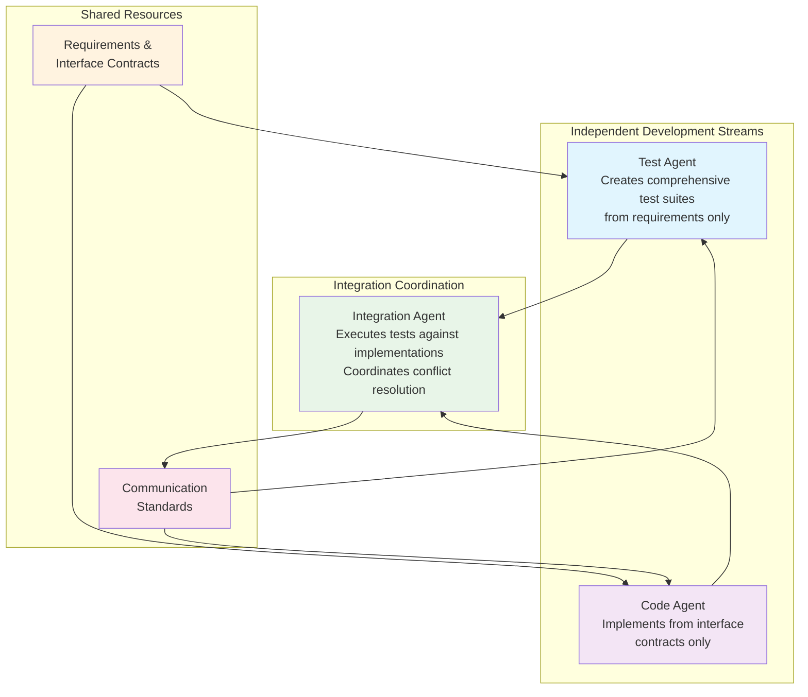

# Comprehensive Three-Agent Development Specifications

!!! info ":rocket: **You are here** → Complete Three-Agent Development Framework"
    **Purpose:** Comprehensive operational specifications for Test Agent, Code Agent, and Integration Agent
    
    **Who should read this:** Technical Leads, System Architects, Implementation Teams, QA Managers
    
    **Value:** Complete framework enabling independent agent implementation with systematic integration
    
    **Connection:** Consolidates all agent specifications with practical implementation guidance
    
    **:clock4: Reading time:** 15 minutes overview | **:memo: Implementation ready:** All operational details included

!!! abstract ":zap: TL;DR - Complete Three-Agent Framework Implementation Guide"
    - **Independent Development:** Test and Code agents operate without cross-contamination
    - **Systematic Integration:** Integration Agent coordinates testing and resolution without bias
    - **Quality Assurance:** Multi-stream validation ensures comprehensive system quality
    - **Practical Implementation:** Ready-to-use specifications with detailed operational guidance

## Framework Overview and Implementation Strategy

### Three-Agent Architecture Summary

The three-agent development framework enables true independence between test creation and implementation while ensuring systematic integration and high-quality outcomes through structured coordination.



### Implementation Readiness Checklist

#### Phase 1: Foundation Setup (Week 1)
- [ ] **Communication Infrastructure**: Implement communication standards and protocols
- [ ] **Quality Metrics Framework**: Setup quality tracking and reporting systems
- [ ] **Agent Workspace Isolation**: Establish separate development environments
- [ ] **Handoff Package Templates**: Deploy standardized handoff templates
- [ ] **Conflict Detection Systems**: Initialize conflict identification frameworks

#### Phase 2: Agent Specification Implementation (Weeks 2-4)
- [ ] **Test Agent Implementation**: Deploy Test Agent specification framework
- [ ] **Code Agent Implementation**: Deploy Code Agent specification framework  
- [ ] **Integration Agent Implementation**: Deploy Integration Agent coordination system
- [ ] **Agent Communication Setup**: Implement agent-to-agent communication protocols
- [ ] **Quality Gate Integration**: Deploy quality validation and gate systems

#### Phase 3: Integration and Validation (Weeks 5-6)
- [ ] **End-to-End Testing**: Validate complete three-agent workflow
- [ ] **Performance Optimization**: Optimize agent coordination efficiency
- [ ] **Documentation Finalization**: Complete operational documentation
- [ ] **Team Training**: Train teams on agent-specific roles and responsibilities
- [ ] **Monitoring Setup**: Deploy continuous monitoring and alerting

## Agent Specifications Summary

### Test Agent Specification Summary

**Primary Role**: Create comprehensive test suites based solely on requirements and specifications without implementation knowledge.

**Key Capabilities**:
- Requirements-driven test creation
- Comprehensive behavioral validation
- Mock framework development
- Performance benchmark establishment
- Edge case identification

**Isolation Protocols**:
- No access to Code Agent implementations
- Requirements and specifications only input
- Mock-based dependency testing
- Behavioral focus over implementation details

**Quality Standards**:
- 100% requirements coverage validation
- Test independence verification
- Behavioral focus validation
- Mock framework completeness

For complete details, see: [Test Agent Complete Specification](TEST_AGENT_SPECIFICATION.md)

### Code Agent Specification Summary

**Primary Role**: Create high-quality implementations based solely on interface contracts and performance requirements without test knowledge.

**Key Capabilities**:
- Contract-driven implementation
- Performance optimization
- Clean architecture design
- Comprehensive error handling
- Quality-focused development

**Isolation Protocols**:
- No access to Test Agent test implementations
- Interface contracts and requirements only input
- Performance benchmark driven optimization
- Architecture-focused design

**Quality Standards**:
- 100% interface contract compliance
- Performance benchmark achievement
- Code quality standards adherence
- Architecture principle compliance

For complete details, see: [Code Agent Complete Specification](CODE_AGENT_SPECIFICATION.md)

### Integration Agent Specification Summary

**Primary Role**: Execute Test Agent tests against Code Agent implementations and coordinate systematic conflict resolution.

**Key Capabilities**:
- Neutral test execution
- Systematic failure analysis
- Conflict resolution coordination
- Performance validation
- Quality assurance

**Coordination Protocols**:
- Impartial execution of all tests
- Evidence-based failure analysis
- Structured conflict resolution
- Quality-focused decision making

**Quality Standards**:
- Complete test execution coverage
- Systematic failure categorization
- Effective conflict resolution
- Comprehensive quality validation

For complete details, see: [Integration Agent Complete Specification](INTEGRATION_AGENT_SPECIFICATION.md)

## Communication and Coordination Protocols

### Agent Communication Architecture

The communication framework ensures efficient coordination while maintaining agent independence through structured protocols and quality monitoring.

**Communication Channels**:
- **Handoff Channel**: Formal work transfer between agents
- **Status Channel**: Real-time progress and milestone updates
- **Conflict Channel**: Systematic conflict identification and escalation
- **Metrics Channel**: Quality metrics tracking and reporting
- **Escalation Channel**: Issue escalation and resolution coordination

**Communication Standards**:
- Structured message formats for all agent interactions
- Handoff validation and trigger condition management
- Progress tracking with milestone-based reporting
- Conflict escalation with systematic resolution procedures
- Quality metrics with continuous improvement feedback

For complete details, see: [Agent Communication Standards](AGENT_COMMUNICATION_STANDARDS.md)

### Orchestration Templates and Workflows

Standardized templates ensure consistent quality and efficiency throughout the three-agent development process.

**Available Templates**:
- Test Agent Handoff Package Template
- Code Agent Handoff Package Template
- Integration Agent Handoff Package Template
- Development Progress Tracking Template
- Integration Status Tracking Template
- Conflict Analysis Template
- Resolution Task Template

**Quality Gate Checklists**:
- Test Agent Quality Gate Checklist
- Code Agent Quality Gate Checklist
- Integration Quality Gate Checklist

For complete templates, see: [Agent Orchestration Templates](AGENT_ORCHESTRATION_TEMPLATES.md)

## Implementation Examples and Practical Guidance

### Example: Phase Validation System Implementation

This example demonstrates the complete three-agent approach for implementing a biomechanical phase validation system.

#### Test Agent Deliverables
```python
# Example Test Agent output structure
class PhaseValidationTestSuite:
    """Test suite created by Test Agent for phase validation system"""
    
    def __init__(self):
        self.unit_tests = PhaseValidationUnitTests()
        self.integration_tests = PhaseValidationIntegrationTests()
        self.performance_tests = PhaseValidationPerformanceTests()
        self.error_handling_tests = PhaseValidationErrorTests()
        
class PhaseValidationUnitTests:
    """Unit tests focusing on behavioral validation"""
    
    def test_exact_150_points_per_cycle(self):
        """Test that each gait cycle has exactly 150 data points"""
        # Mock data with various cycle configurations
        mock_data = self.create_mock_phase_data([
            {'cycle_id': 1, 'points': 150},
            {'cycle_id': 2, 'points': 150},
            {'cycle_id': 3, 'points': 150}
        ])
        
        # Execute validation
        validator = PhaseValidator()  # Interface contract usage
        result = validator.validate_phase_structure(mock_data)
        
        # Behavioral assertions
        assert result.success == True
        assert result.total_cycles == 3
        assert all(cycle.point_count == 150 for cycle in result.cycle_details)
    
    def test_invalid_point_count_detection(self):
        """Test detection of invalid point counts"""
        # Mock data with invalid configurations
        mock_data = self.create_mock_phase_data([
            {'cycle_id': 1, 'points': 149},  # Too few
            {'cycle_id': 2, 'points': 151}   # Too many
        ])
        
        validator = PhaseValidator()
        result = validator.validate_phase_structure(mock_data)
        
        # Error detection assertions
        assert result.success == False
        assert len(result.errors) == 2
        assert "149 points" in result.errors[0].message
        assert "151 points" in result.errors[1].message
```

#### Code Agent Deliverables
```python
# Example Code Agent implementation
class PhaseValidator:
    """Phase validation implementation based on interface contracts"""
    
    def __init__(self):
        self.logger = logging.getLogger(__name__)
        self._performance_monitor = PerformanceMonitor()
        
    def validate_phase_structure(self, dataset: pd.DataFrame) -> ValidationResult:
        """Validate phase-indexed dataset structure per interface contract"""
        
        # Performance monitoring (contract requirement)
        with self._performance_monitor.monitor_operation('phase_validation'):
            try:
                # Input validation (contract preconditions)
                self._validate_input_preconditions(dataset)
                
                # Core validation logic
                validation_errors = []
                cycle_details = []
                
                # Group by cycle_id and validate each cycle
                for cycle_id, cycle_data in dataset.groupby('cycle_id'):
                    cycle_validation = self._validate_individual_cycle(cycle_id, cycle_data)
                    cycle_details.append(cycle_validation)
                    
                    if not cycle_validation.is_valid:
                        validation_errors.extend(cycle_validation.errors)
                
                # Return validation result (contract postconditions)
                return ValidationResult(
                    success=len(validation_errors) == 0,
                    total_cycles=len(cycle_details),
                    cycle_details=cycle_details,
                    errors=validation_errors,
                    performance_metrics=self._performance_monitor.get_metrics()
                )
                
            except DataStructureError as e:
                # Error handling (contract exception specifications)
                self.logger.error(f"Data structure validation failed: {e}")
                raise
            except Exception as e:
                # Unexpected error handling
                self.logger.error(f"Unexpected validation error: {e}")
                raise PhaseValidationError(f"Validation failed: {str(e)}") from e
    
    def _validate_individual_cycle(self, cycle_id: int, cycle_data: pd.DataFrame) -> CycleValidationResult:
        """Validate individual cycle meets requirements"""
        
        errors = []
        
        # Check exact point count (core business rule)
        expected_points = 150
        actual_points = len(cycle_data)
        
        if actual_points != expected_points:
            errors.append(ValidationError(
                error_code=1102,
                message=f"Cycle {cycle_id} has {actual_points} points, expected {expected_points}",
                cycle_id=cycle_id,
                expected_value=expected_points,
                actual_value=actual_points
            ))
        
        # Check phase progression (additional business rule)
        if 'phase_percent' in cycle_data.columns:
            phase_errors = self._validate_phase_progression(cycle_id, cycle_data['phase_percent'])
            errors.extend(phase_errors)
        
        return CycleValidationResult(
            cycle_id=cycle_id,
            point_count=actual_points,
            is_valid=len(errors) == 0,
            errors=errors
        )
```

#### Integration Agent Coordination
```python
# Example Integration Agent coordination process
class PhaseValidationIntegrationCoordinator:
    """Integration coordination for phase validation implementation"""
    
    def __init__(self):
        self.test_executor = TestExecutionEngine()
        self.failure_analyzer = FailureAnalysisEngine()
        self.conflict_resolver = ConflictResolutionEngine()
        
    def coordinate_integration(self, test_package: TestPackage, implementation_package: ImplementationPackage) -> IntegrationResult:
        """Coordinate integration of test package and implementation"""
        
        # Execute all tests against implementation
        test_results = self.test_executor.execute_test_suite(
            test_package.test_suite, 
            implementation_package.phase_validator
        )
        
        # Analyze any failures
        if test_results.has_failures():
            failure_analysis = self.failure_analyzer.analyze_failures(test_results.failures)
            
            # Categorize failures for resolution
            for failure in failure_analysis.categorized_failures:
                if failure.category == FailureCategory.INTERFACE_MISMATCH:
                    # Code Agent needs to fix implementation
                    resolution_task = ResolutionTask(
                        responsible_agent=ResponsibleAgent.CODE_AGENT,
                        task_type=TaskType.INTERFACE_CORRECTION,
                        description=failure.description,
                        specific_actions=failure.recommended_actions
                    )
                    self.conflict_resolver.assign_resolution_task(resolution_task)
                
                elif failure.category == FailureCategory.TEST_SPECIFICATION_ERROR:
                    # Test Agent needs to correct test
                    resolution_task = ResolutionTask(
                        responsible_agent=ResponsibleAgent.TEST_AGENT,
                        task_type=TaskType.TEST_CORRECTION,
                        description=failure.description,
                        specific_actions=failure.recommended_actions
                    )
                    self.conflict_resolver.assign_resolution_task(resolution_task)
        
        # Validate performance requirements
        performance_validation = self._validate_performance_requirements(
            test_results, implementation_package.performance_benchmarks
        )
        
        # Generate integration report
        return IntegrationResult(
            test_results=test_results,
            failure_analysis=failure_analysis if test_results.has_failures() else None,
            performance_validation=performance_validation,
            integration_success=test_results.all_passed() and performance_validation.all_met(),
            resolution_tasks=self.conflict_resolver.get_active_resolution_tasks()
        )
```

### Success Metrics and Expected Outcomes

#### Quantitative Success Metrics
- **Integration Success Rate**: >95% of integrations succeed without manual intervention
- **Quality Achievement**: >98% of integrated components meet all quality standards
- **Development Efficiency**: 20%+ improvement in development cycle time
- **Defect Reduction**: 40%+ reduction in post-integration defects
- **Test Coverage**: 100% requirements coverage with comprehensive edge case testing
- **Performance Compliance**: 100% achievement of specified performance benchmarks

#### Qualitative Success Indicators
- **Team Satisfaction**: High satisfaction with development process clarity and predictability
- **Quality Confidence**: Increased confidence in system quality and reliability
- **Process Predictability**: Consistent, predictable outcomes and timelines
- **Knowledge Transfer**: Effective documentation and knowledge preservation
- **Maintainability**: High-quality, maintainable codebases with clear architecture

### Common Implementation Challenges and Solutions

#### Challenge 1: Agent Isolation Enforcement
**Problem**: Ensuring agents truly operate independently without cross-contamination

**Solution**: 
- Implement strict workspace isolation with access controls
- Use automated validation to detect isolation violations
- Establish clear information flow protocols
- Regular audits of agent information access

#### Challenge 2: Interface Contract Clarity
**Problem**: Ambiguous interface specifications lead to conflicts

**Solution**:
- Invest in detailed interface contract specification
- Use behavioral specifications with preconditions/postconditions
- Implement contract validation automation
- Establish specification clarification procedures

#### Challenge 3: Conflict Resolution Efficiency
**Problem**: Integration conflicts slow down development

**Solution**:
- Implement systematic failure categorization
- Establish clear resolution responsibility assignment
- Use automated conflict detection and routing
- Continuous improvement of resolution processes

#### Challenge 4: Quality Metric Interpretation
**Problem**: Difficulty interpreting and acting on quality metrics

**Solution**:
- Establish clear quality thresholds and targets
- Implement automated alerting for quality degradation
- Provide actionable recommendations with metrics
- Regular review and refinement of quality standards

## Getting Started Guide

### Quick Implementation Steps

1. **Week 1: Foundation Setup**
   ```bash
   # Setup agent workspaces
   mkdir -p agent_framework/{test_agent,code_agent,integration_agent}
   
   # Deploy communication infrastructure
   python setup_communication_infrastructure.py
   
   # Initialize quality monitoring
   python setup_quality_monitoring.py
   ```

2. **Week 2: Agent Implementation**
   ```bash
   # Deploy Test Agent framework
   python deploy_test_agent_framework.py
   
   # Deploy Code Agent framework  
   python deploy_code_agent_framework.py
   
   # Deploy Integration Agent framework
   python deploy_integration_agent_framework.py
   ```

3. **Week 3: Integration Testing**
   ```bash
   # Run end-to-end validation
   python validate_three_agent_integration.py
   
   # Performance optimization
   python optimize_agent_coordination.py
   ```

### Team Training Requirements

#### Test Agent Team Training
- Requirements analysis and test scenario creation
- Mock framework development and usage
- Behavioral testing principles and practices
- Test quality standards and validation

#### Code Agent Team Training  
- Contract-driven development methodologies
- Performance optimization techniques
- Clean architecture principles
- Quality gate compliance procedures

#### Integration Agent Team Training
- Test execution and failure analysis
- Conflict resolution coordination
- Quality validation and assurance
- Progress tracking and reporting

### Continuous Improvement Framework

The three-agent framework includes built-in continuous improvement mechanisms:

- **Metrics-Driven Improvement**: Regular analysis of quality metrics to identify improvement opportunities
- **Retrospective Analysis**: Systematic review of integration cycles to refine processes
- **Best Practice Sharing**: Cross-agent knowledge sharing for process optimization
- **Tool Enhancement**: Continuous improvement of automation and support tools

## Conclusion

This comprehensive three-agent development framework provides a complete, ready-to-implement solution for independent test and code development with systematic integration. The framework ensures high-quality outcomes through structured coordination while maintaining the benefits of independent development streams.

**Key Benefits Realized**:
- **True Independence**: Test and Code agents operate without bias or cross-contamination
- **Quality Assurance**: Multi-stream validation ensures comprehensive system quality
- **Systematic Integration**: Structured coordination resolves conflicts efficiently
- **Scalable Process**: Framework scales with team size and system complexity
- **Continuous Improvement**: Built-in mechanisms for ongoing process optimization

**Implementation Success Factors**:
- Commitment to agent isolation protocols
- Investment in clear interface contract specifications
- Systematic approach to conflict resolution
- Continuous monitoring and improvement
- Team training and change management

The framework is designed for immediate implementation with complete operational details, templates, and practical guidance provided in the individual specification documents.