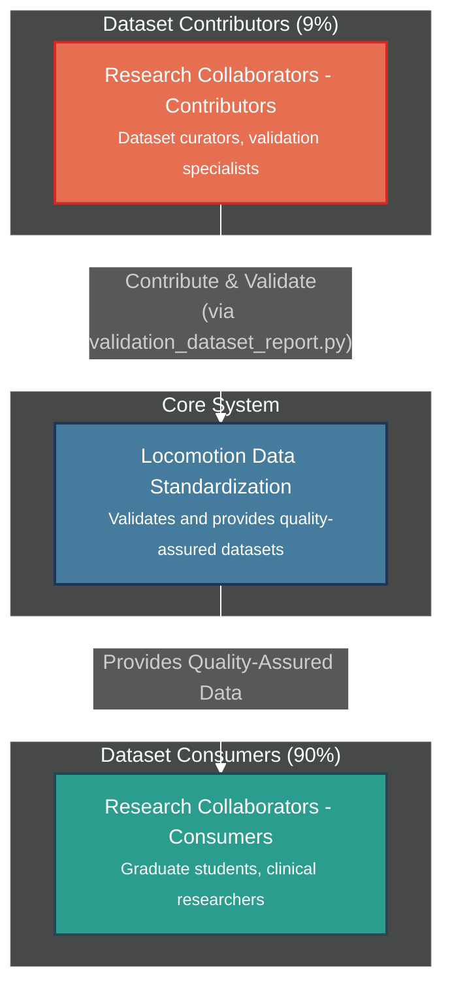

# User Guide

!!! info "🎯 **You are here** → User Research & Personas Hub"
    **Purpose:** Understand who uses the system and how they work
    
    **Who should read this:** Product managers, developers, UX designers, stakeholders
    
    **Value:** Deep user insights drive better design decisions and prioritization
    
    **Connection:** Feeds into [Requirements](02_REQUIREMENTS.md) and [Architecture](03_ARCHITECTURE.md)
    
    **:clock4: Reading time:** 15 minutes | **:busts_in_silhouette: User types:** 4 personas

!!! tip "**Quick Navigation**"
    **👥 Who are our users?** → [User Population Analysis](#user-population-analysis)
    
    **🧑‍💼 Detailed profiles?** → [User Personas](#user-personas)
    
    **🛤️ How do they work?** → [User Journey Maps](#user-journey-maps)
    
    **🔍 What did we learn?** → [Journey Insights](#journey-insights)

## 🎯 User Population Analysis

!!! abstract "**90/9/1 Split Strategy**"
    Our phased approach serves users based on their contribution to data quality:
    
    - **📊 Dataset Consumers (90%):** Graduate students, clinical researchers, biomechanics engineers, sports scientists
    - **🔧 Dataset Contributors (9%):** Dataset curators (programmers + biomechanical validation)
    - **⚙️ System Administrators (1%):** Release managers, infrastructure maintainers

!!! success "**Current Development Focus**"
    **Phase 1** targets the 9% + 1% to establish validation infrastructure before building consumer tools for the 90%.
    
    **Why?** Quality-first approach - fewer high-quality datasets preferred over many questionable ones.

## User Personas

**User Personas**: See [User Roles & Entry Points](01a_USER_ROLES.md) for complete persona descriptions and tool requirements.

**Key User Populations:**
- **Dataset Curators - Biomechanical Validation (9%)**: Domain experts ensuring data quality
- **Dataset Curators - Programmers (9%)**: Technical specialists developing conversion scripts  
- **System Administrators (1%)**: Infrastructure managers and release coordinators
- **Dataset Consumers (90%)**: Researchers analyzing quality-assured data *(Future Phase 2)*

## User Journey Maps

### Current Focus: Dataset Contributor Journeys

#### Journey 1: Dataset Curator (Programmer) Converts Lab Dataset

**Workflow:** Discovery → Development → Quality Assessment → Resolution

**Discovery Phase:**
- Find conversion requirements (satisfaction: 3/5)
- Access validation scaffolding (satisfaction: 4/5)
- Review example scripts (satisfaction: 5/5)
- Understand standard specification (satisfaction: 3/5)

**Development Phase:**
- Analyze raw dataset structure (satisfaction: 4/5)
- Map variables to standard names (satisfaction: 2/5)
- Create time-indexed parquet (satisfaction: 4/5)
- Generate phase dataset with tool (satisfaction: 5/5)
- Handle missing data patterns (satisfaction: 2/5)

**Quality Assessment Phase:**
- Generate comprehensive dataset report (satisfaction: 5/5)
- Review validation and quality results (satisfaction: 3/5)
- Debug biomechanical failures (satisfaction: 1/5)
- Consult biomechanics expert (satisfaction: 3/5)
- Fix conversion issues (satisfaction: 3/5)
- Document conversion decisions (satisfaction: 2/5)
- Prepare contribution materials (satisfaction: 3/5)

**Pain Points:**
- Complex biomechanical conventions and coordinate systems
- Variable naming inconsistencies across source datasets
- Ensuring vertical ground reaction force data is properly formatted for phase generation
- Debugging validation failures requires domain expertise
- Time-consuming iteration between conversion and validation

**Emotional Journey:**
- **Discovery**: Confidence with clear examples and scaffolding
- **Development**: Frustration with biomechanical complexity
- **Quality Assessment**: Relief with unified validation and quality reporting
- **Resolution**: Satisfaction when comprehensive report shows dataset quality

#### Journey 2: Dataset Curator (Biomechanical Validation) Updates Validation Ranges

**Workflow:** Research → Analysis → Implementation → Verification

**Research Phase:**
- Review recent literature (satisfaction: 4/5)
- Identify range updates needed (satisfaction: 3/5)
- Analyze population differences (satisfaction: 3/5)
- Document evidence sources (satisfaction: 2/5)

**Analysis Phase:**
- Run statistical range analysis (satisfaction: 4/5)
- Compare literature vs data (satisfaction: 3/5)
- Assess impact on existing datasets (satisfaction: 2/5)
- Preview validation changes (satisfaction: 4/5)

**Implementation Phase:**
- Update validation specifications (satisfaction: 3/5)
- Test against known datasets (satisfaction: 4/5)
- Document rationale for changes (satisfaction: 2/5)
- Communicate updates to team (satisfaction: 3/5)

**Verification Phase:**
- Monitor validation pass rates (satisfaction: 4/5)
- Investigate unexpected failures (satisfaction: 2/5)
- Refine ranges based on feedback (satisfaction: 3/5)
- Maintain change documentation (satisfaction: 2/5)

**Pain Points:**
- Balancing strict standards with real-world data variability
- Explaining biomechanical rationale to programming colleagues
- Manual investigation of outliers and edge cases
- Tracking change rationale across multiple updates

**Emotional Journey:**
- **Research**: Professional satisfaction with evidence-based decisions
- **Analysis**: Analytical engagement with statistical tools
- **Implementation**: Confidence in systematic change management
- **Verification**: Responsibility for community data quality

#### Journey 3: Collaborative Dataset Contribution

**Workflow:** Planning → Development → Quality Review → Documentation

**Planning Phase:**
- Define dataset contribution goals (satisfaction: 5/5)
- Assign programmer and validator roles (satisfaction: 4/5)
- Review existing similar datasets (satisfaction: 3/5)
- Plan conversion approach (satisfaction: 4/5)

**Development Phase:**
- Programmer creates conversion script (satisfaction: 3/5)
- Validator reviews biomechanical accuracy (satisfaction: 4/5)
- Iterate on validation failures (satisfaction: 2/5)
- Document conversion decisions (satisfaction: 3/5)

**Quality Review Phase:**
- Run comprehensive validation (satisfaction: 4/5)
- Generate quality assessment report (satisfaction: 4/5)
- Compare against population norms (satisfaction: 3/5)
- Approve dataset for contribution (satisfaction: 5/5)

**Documentation Phase:**
- Create dataset documentation (satisfaction: 3/5)
- Document biomechanical considerations (satisfaction: 4/5)
- Prepare contribution materials (satisfaction: 3/5)
- Submit to community repository (satisfaction: 5/5)

**Pain Points:**
- Communication gaps between programming and biomechanics expertise
- Iterative debugging cycle requires both skill sets
- Documentation must serve both technical and domain audiences
- Quality standards require consensus between roles

**Emotional Journey:**
- **Planning**: Excitement about contributing to community
- **Development**: Collaborative problem-solving satisfaction
- **Quality Review**: Shared responsibility for data integrity
- **Documentation**: Pride in professional contribution

### Future: Consumer Journey Preview *(90% of users - Phase 2)*

**Simplified Consumer Experience:**
- Discovery: Find standardized repository → Browse quality-assured datasets → Review population demographics → Download parquet files
- Analysis: Load data with Python library → Apply domain-specific analysis → Trust data quality implicitly → Focus on research questions

**Design Goal:** Consumer confidence through behind-the-scenes validation quality.

## Journey Insights

### Contributor Success Factors
1. **Clear Scaffolding**: Examples and guidelines reduce development friction
2. **Automated Phase Generation**: `generate_phase_dataset.py` handles complex gait cycle detection
3. **Domain Expertise Integration**: Biomechanics knowledge accessible to programmers
4. **Iterative Feedback**: Validation tools enable continuous improvement
5. **Comprehensive Documentation**: Technical and domain perspectives both covered

### Collaboration Patterns
- **Programmer Focus**: Technical implementation, data processing, tool usage
- **Validator Focus**: Biomechanical accuracy, standard evolution, quality oversight
- **Shared Responsibility**: Dataset quality, documentation, community contribution

### Pain Point Mitigation
- **Technical Complexity**: Scaffolding and examples reduce learning curve
- **Domain Knowledge Gaps**: Validation tools provide biomechanical guidance
- **Quality Uncertainty**: Comprehensive reporting builds confidence
- **Collaboration Friction**: Clear role definitions and shared tools

### Emotional Design Principles
- **Confidence Through Examples**: Proven patterns reduce uncertainty
- **Satisfaction Through Quality**: Comprehensive tools enable thorough work
- **Pride Through Contribution**: Community impact motivates quality standards
- **Support Through Collaboration**: Shared expertise reduces individual burden

## System Context

**Architecture overview showing external users, system boundaries, and key interaction patterns.**

The system serves external research collaborators through a quality-first approach:
- **Contributors (9%)**: Use `validation_dataset_report.py` as the primary tool to validate and contribute datasets
- **Consumers (90%)**: Benefit from quality-assured datasets without requiring validation expertise
- **Administrators (1%)**: Manage releases and ML benchmarks

### Quick Context Overview

**Detailed Documentation:**
- **[User Roles & Entry Points →](01a_USER_ROLES.md)** - Complete CLI tool catalog by user role
- **[System Context →](01b_SYSTEM_CONTEXT.md)** - Architecture diagrams and interaction patterns

## Development Strategy

**Phase 1 (Current):** Validation infrastructure for dataset contributors
- ✅ Core validation architecture (ValidationExpectationsParser, PhaseValidator)
- 🚧 Dataset quality assessment and reporting tools
- 📋 Validation specification management
- 📋 Conversion scaffolding and examples
- 📋 `conversion_generate_phase_dataset.py` - Automated time-to-phase conversion tool

**Phase 2 (Future):** Consumer tools for 90% users
- 📋 Data repository with standardized access
- 📋 Python/MATLAB analysis libraries
- 📋 Educational tutorials and documentation

**Rationale:** Establish quality datasets through robust validation before building consumer tools

---

## 📊 Section Contents

-   **📋 [User Roles & Entry Points](01a_USER_ROLES.md)**
    
    ---
    
    Complete CLI tool catalog organized by user role and priority
    
    **Key Content:** Implementation priority matrix, common usage patterns
    
    **Time:** 8 minutes
    
    **Best For:** Developers, product managers

-   **🏗️ [System Context](01b_SYSTEM_CONTEXT.md)**
    
    ---
    
    Architecture diagrams and interaction patterns
    
    **Key Content:** C4 context diagrams, user workflows
    
    **Time:** 12 minutes
    
    **Best For:** Architects, system designers

---

## 🧭 Navigation Context

!!! info "**📍 You are here:** User Research & Personas Hub"
    **⬅️ Previous:** [Overview](00_OVERVIEW.md) - Project introduction and navigation hub
    
    **➡️ Next:** [Requirements](02_REQUIREMENTS.md) - User stories and system requirements
    
    **📖 Reading time:** 15 minutes
    
    **🎯 Prerequisites:** [Overview](00_OVERVIEW.md) - Project understanding
    
    **🔄 Follow-up sections:** Requirements, Architecture design decisions

!!! tip "**Cross-References & Related Content**"
    **🔗 Direct Implementation:** [Architecture - User Context](03_ARCHITECTURE.md#user-context-and-benefits) - How these user insights shaped system design
    
    **🔗 Detailed Tools:** [User Roles & Entry Points](01a_USER_ROLES.md) - Complete CLI tool catalog by user role
    
    **🔗 System Context:** [System Context Diagrams](01b_SYSTEM_CONTEXT.md) - Technical interaction patterns
    
    **🔗 Requirements Traceability:** [Requirements](02_REQUIREMENTS.md) - User stories derived from these personas

---

!!! success "**Key Takeaways**"
    ✅ **90/9/1 Strategy:** Focus on contributors first to ensure data quality
    
    ✅ **Phase 1 Validation:** Build quality infrastructure before consumer tools
    
    ✅ **User Collaboration:** Contributors work together (programmer + domain expert)
    
    ✅ **Quality First:** Fewer high-quality datasets preferred over many questionable ones
